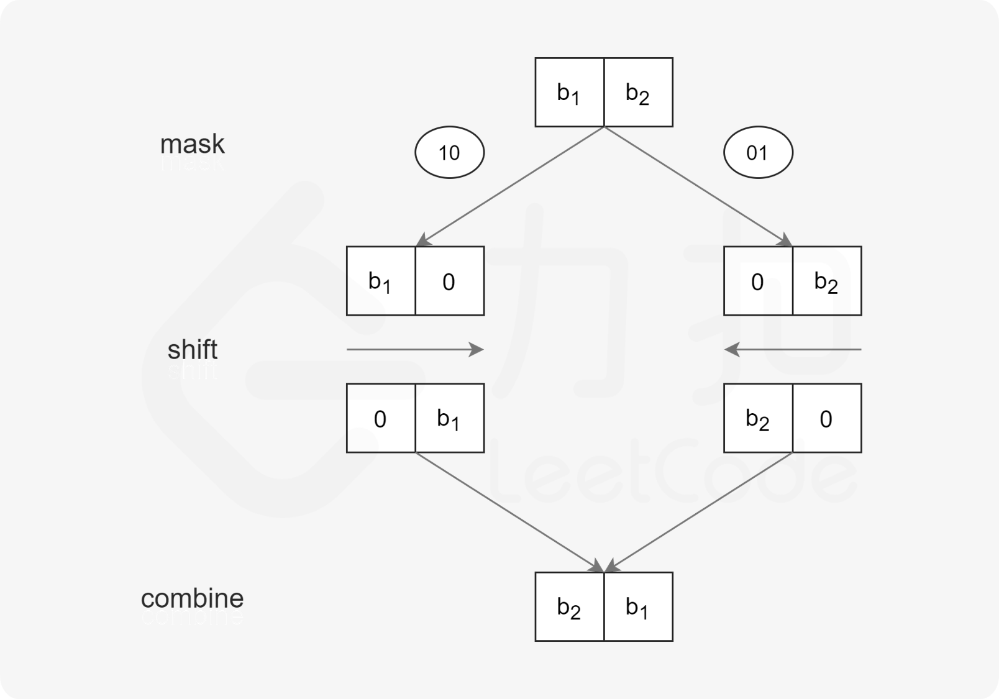

#### [方法二：位运算分治](https://leetcode.cn/problems/reverse-bits/solutions/685436/dian-dao-er-jin-zhi-wei-by-leetcode-solu-yhxz/)

**思路**

若要翻转一个二进制串，可以将其均分成左右两部分，对每部分递归执行翻转操作，然后将左半部分拼在右半部分的后面，即完成了翻转。

由于左右两部分的计算方式是相似的，利用位掩码和位移运算，我们可以自底向上地完成这一分治流程。



对于递归的最底层，我们需要交换所有奇偶位：

1.  取出所有奇数位和偶数位；
2.  将奇数位移到偶数位上，偶数位移到奇数位上。

类似地，对于倒数第二层，每两位分一组，按组号取出所有奇数组和偶数组，然后将奇数组移到偶数组上，偶数组移到奇数组上。以此类推。

需要注意的是，在某些语言（如 `Java`）中，没有无符号整数类型，因此对 $n$ 的右移操作应使用逻辑右移。

**代码**

```cpp
class Solution {
private:
    const uint32_t M1 = 0x55555555; // 01010101010101010101010101010101
    const uint32_t M2 = 0x33333333; // 00110011001100110011001100110011
    const uint32_t M4 = 0x0f0f0f0f; // 00001111000011110000111100001111
    const uint32_t M8 = 0x00ff00ff; // 00000000111111110000000011111111

public:
    uint32_t reverseBits(uint32_t n) {
        n = n >> 1 & M1 | (n & M1) << 1;
        n = n >> 2 & M2 | (n & M2) << 2;
        n = n >> 4 & M4 | (n & M4) << 4;
        n = n >> 8 & M8 | (n & M8) << 8;
        return n >> 16 | n << 16;
    }
};
```

```java
public class Solution {
    private static final int M1 = 0x55555555; // 01010101010101010101010101010101
    private static final int M2 = 0x33333333; // 00110011001100110011001100110011
    private static final int M4 = 0x0f0f0f0f; // 00001111000011110000111100001111
    private static final int M8 = 0x00ff00ff; // 00000000111111110000000011111111

    public int reverseBits(int n) {
        n = n >>> 1 & M1 | (n & M1) << 1;
        n = n >>> 2 & M2 | (n & M2) << 2;
        n = n >>> 4 & M4 | (n & M4) << 4;
        n = n >>> 8 & M8 | (n & M8) << 8;
        return n >>> 16 | n << 16;
    }
}
```

```go
const (
    m1 = 0x55555555 // 01010101010101010101010101010101
    m2 = 0x33333333 // 00110011001100110011001100110011
    m4 = 0x0f0f0f0f // 00001111000011110000111100001111
    m8 = 0x00ff00ff // 00000000111111110000000011111111
)

func reverseBits(n uint32) uint32 {
    n = n>>1&m1 | n&m1<<1
    n = n>>2&m2 | n&m2<<2
    n = n>>4&m4 | n&m4<<4
    n = n>>8&m8 | n&m8<<8
    return n>>16 | n<<16
}
```

```javascript
var reverseBits = function(n) {
    const M1 = 0x55555555; // 01010101010101010101010101010101
    const M2 = 0x33333333; // 00110011001100110011001100110011
    const M4 = 0x0f0f0f0f; // 00001111000011110000111100001111
    const M8 = 0x00ff00ff; // 00000000111111110000000011111111

    n = n >>> 1 & M1 | (n & M1) << 1;
    n = n >>> 2 & M2 | (n & M2) << 2;
    n = n >>> 4 & M4 | (n & M4) << 4;
    n = n >>> 8 & M8 | (n & M8) << 8;
    return (n >>> 16 | n << 16) >>> 0;
};
```

```c
const uint32_t M1 = 0x55555555;  // 01010101010101010101010101010101
const uint32_t M2 = 0x33333333;  // 00110011001100110011001100110011
const uint32_t M4 = 0x0f0f0f0f;  // 00001111000011110000111100001111
const uint32_t M8 = 0x00ff00ff;  // 00000000111111110000000011111111

uint32_t reverseBits(uint32_t n) {
    n = n >> 1 & M1 | (n & M1) << 1;
    n = n >> 2 & M2 | (n & M2) << 2;
    n = n >> 4 & M4 | (n & M4) << 4;
    n = n >> 8 & M8 | (n & M8) << 8;
    return n >> 16 | n << 16;
}
```

**复杂度分析**

-   时间复杂度：$O(1)$。
-   空间复杂度：$O(1)$。
