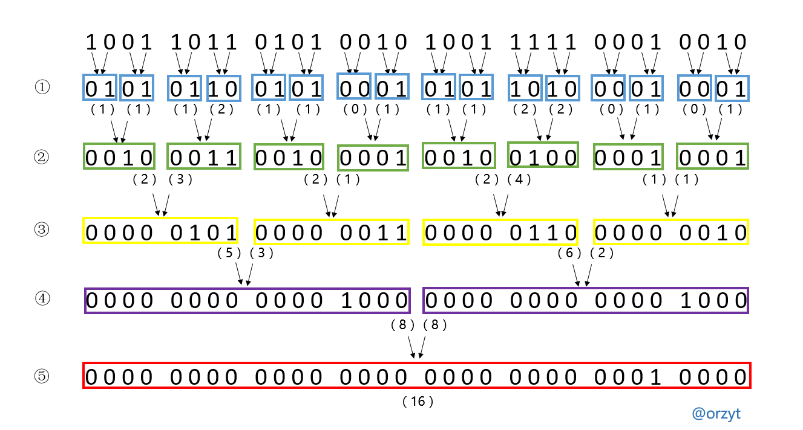
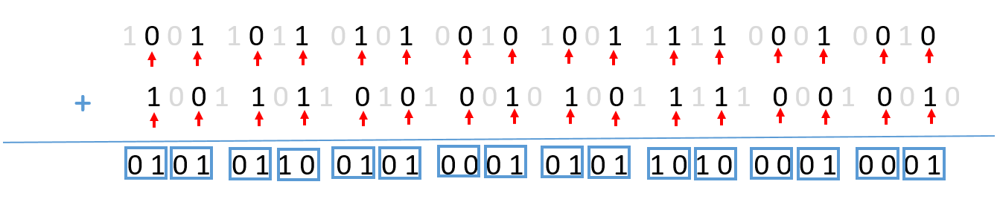
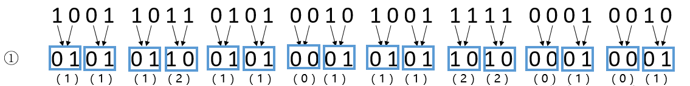
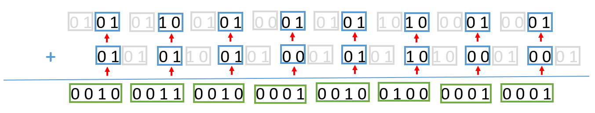
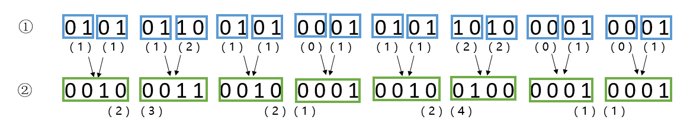
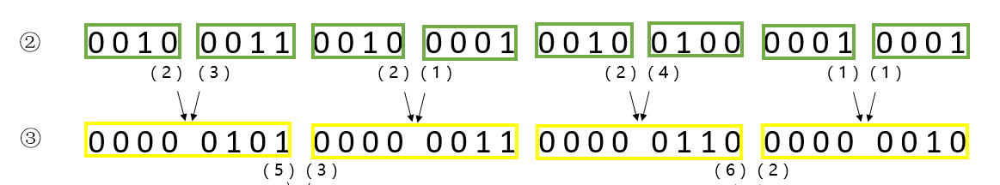
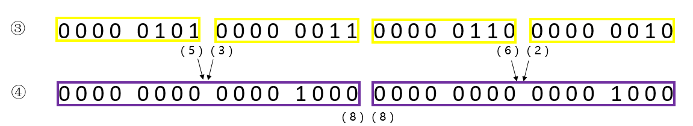
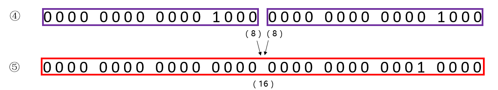

### [分治算法求解1的个数](https://leetcode.cn/problems/number-of-1-bits/solutions/142876/fen-zhi-suan-fa-qiu-jie-1de-ge-shu-by-orzyt/)

介绍一种基于「分治」的算法来统计"1"的个数。

#### 思路

假设现在我们要统计`1001 1011 0101 0010 1001 1111 $0$1 0010`中“1”的个数。



基于分治的思想，我们先统计出每`2`位有多少个1，如图中第①层所示。

将每`2`位的结果合并，统计出每`4`位有多少个1，如图中第②层所示。

再将每`4`位的结果合并，统计出每`8`位有多少个1，如图中第③层所示。

接着将每`8`位的结果合并，统计出每`16`位有多少个1，如图中第④层所示。

最后将每`16`位的结果合并，统计出每`32`位有多少个1，如图中第⑤层所示，即可得到答案。

---

好了，有了一个直观的感受后，现在考虑如何实现合并的过程。

初始的nnn为： `1001 1011 0101 0010 1001 1111 $0$1 0010`，

第①层的结果为：`0101 0110 0101 $0$1 0101 1010 $0$1 $0$1`，这该怎么得到呢?

一条语句即可搞定！

`n = (n & (0x55555555)) + ((n >> 1) & (0x55555555));`

很神奇有木有，让我们来分析一下这条语句干了什么！

---

首先，十六进制的常数`0x55555555`转化为二进制是`0101 0101 0101 0101 0101 0101 0101 0101 0101`。

那么，`n & 0x55555555`就可以提取nnn偶数位上的1：


`(n >> 1) & 0x55555555`就可以提取nnn奇数位上的1：


最后，`n = (n & (0x55555555)) + ((n >> 1) & (0x55555555))`把这两个结果相加，即可得到每两位上“1”的个数。



这就得到第①层的结果啦。



---

现在考虑怎么得到第②层的结果。

既然得到每2位的结果是通过常数`0101 0101 0101 0101 0101 0101 0101 0101`，即`0x55555555`得到的。

那么类比一下，每4位就应该是通过常数`0011 0011 0011 0011 0011 0011 0011 0011`，即`0x3333333`得到。

经过第一层，此时nnn更新为`0101 0110 0101 $0$1 0101 1010 $0$1 $0$1`。

那么，`n & 0x33333333`就等于：


`(n >> 2) & 0x33333333` （注意，现在要右移两位）就等于：


最后，`n = (n & (0x33333333)) + ((n >> 2) & (0x33333333));`相加即可得到每四位上“1”的个数。



这就得到第②层的结果啦。



---

以此类推...

合并每4位，得到每8位的结果。常数为：`0000 1111 $0$0 1111 $0$0 1111 $0$0 1111`，即`0x0F0F0F0F`。

因此有`n = (n & (0x0F0F0F0F)) + ((n >> 4) & (0x0F0F0F0F));`



---

合并每8位，得到每16位的结果。常数为：`0000 $0$0 1111 1111 $0$0 $0$0 1111 1111`，即`0x00FF00FF`。

因此有`n = (n & (0x00FF00FF)) + ((n >> 8) & (0x00FF00FF));`



---

合并每16位，得到每32位的结果。常数为：`0000 $0$0 $0$0 $0$0 1111 1111 1111 1111`，即`0x0000FFFF`。

因此有`n = (n & (0x0x0000FFFF)) + ((n >> 16) & (0x0x0000FFFF));`



最后得到 `n = 16`，即最开始所求的32位数`1001 1011 0101 0010 1001 1111 $0$1 0010`中有16个“1”。

#### 代码

```cpp
class Solution {
public:
    int hammingWeight(uint32_t n) {
        n = (n & (0x55555555)) + ((n >> 1) & (0x55555555));
        n = (n & (0x33333333)) + ((n >> 2) & (0x33333333));
        n = (n & (0x0F0F0F0F)) + ((n >> 4) & (0x0F0F0F0F));
        n = (n & (0x00FF00FF)) + ((n >> 8) & (0x00FF00FF));
        n = (n & (0x0000FFFF)) + ((n >> 16) & (0x0000FFFF));
        return n;
    }
};
```
