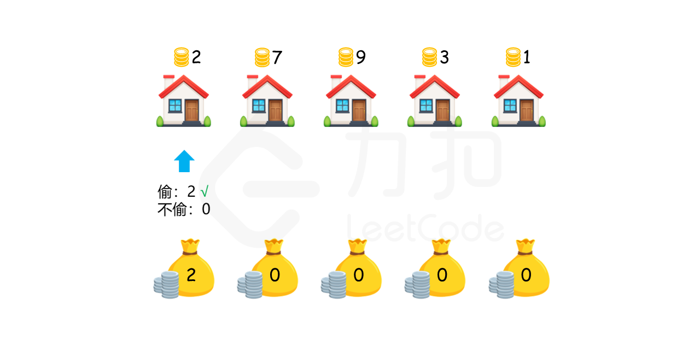
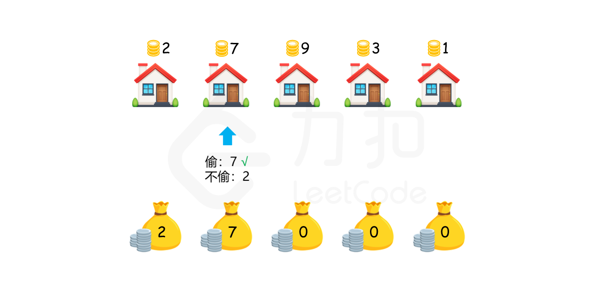
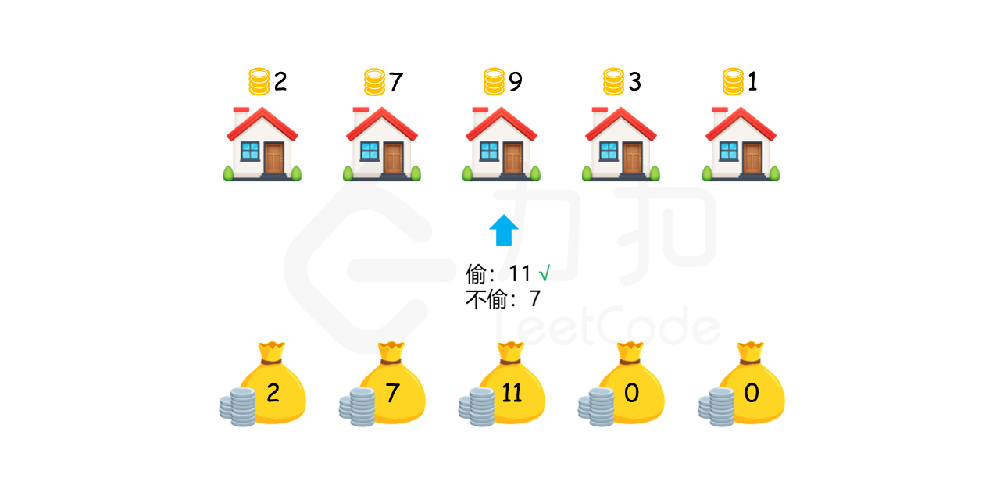
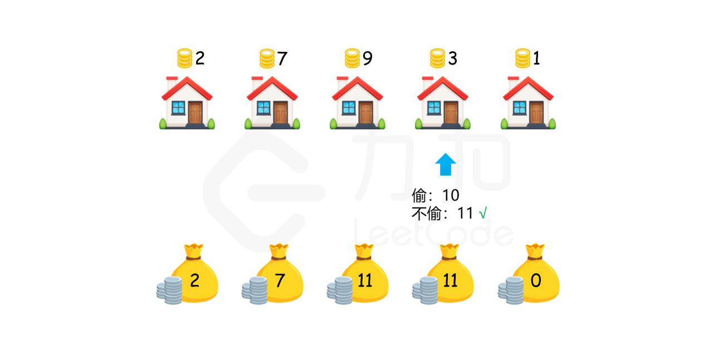
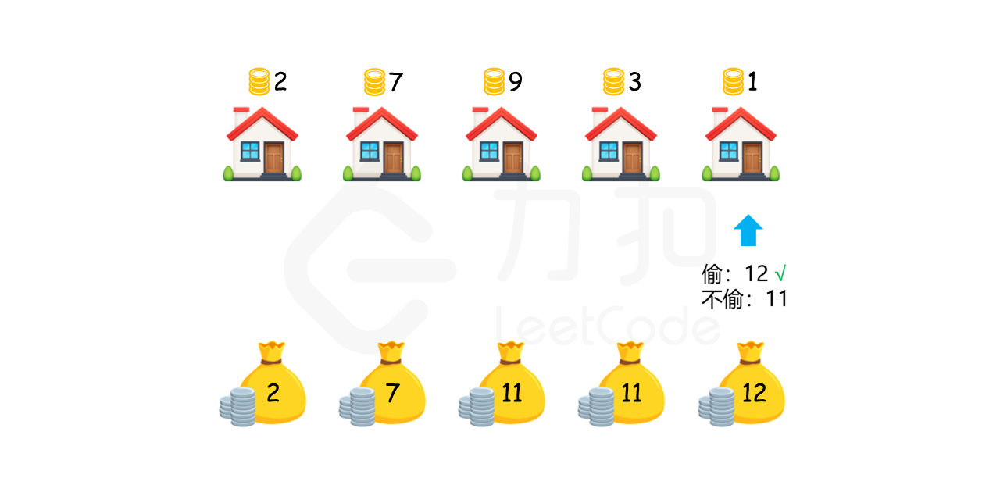
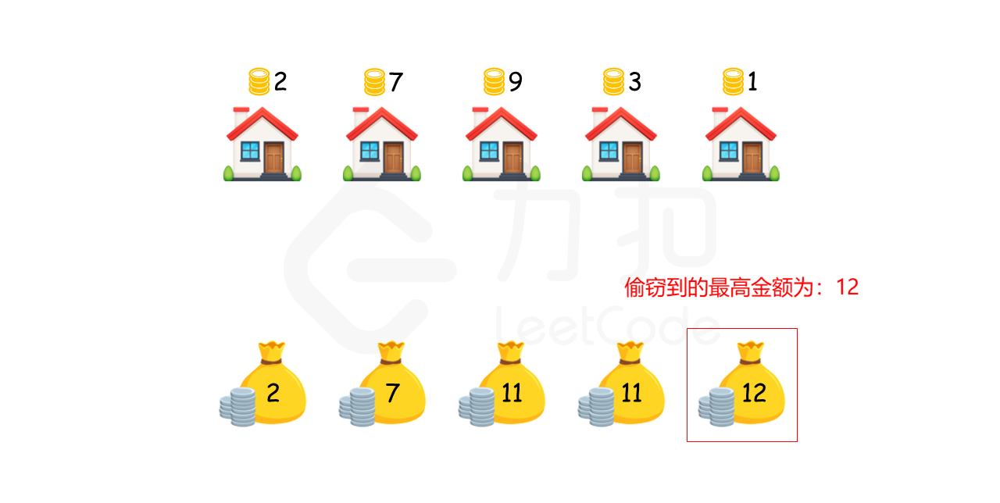

### [打家劫舍](https://leetcode.cn/problems/house-robber/solutions/263856/da-jia-jie-she-by-leetcode-solution/)

#### 方法一：动态规划

首先考虑最简单的情况。如果只有一间房屋，则偷窃该房屋，可以偷窃到最高总金额。如果只有两间房屋，则由于两间房屋相邻，不能同时偷窃，只能偷窃其中的一间房屋，因此选择其中金额较高的房屋进行偷窃，可以偷窃到最高总金额。

如果房屋数量大于两间，应该如何计算能够偷窃到的最高总金额呢？对于第 $k~(k>2)$ 间房屋，有两个选项：

1.  偷窃第 $k$ 间房屋，那么就不能偷窃第 $k-1$ 间房屋，偷窃总金额为前 $k-2$ 间房屋的最高总金额与第 $k$ 间房屋的金额之和。
2.  不偷窃第 $k$ 间房屋，偷窃总金额为前 $k-1$ 间房屋的最高总金额。

在两个选项中选择偷窃总金额较大的选项，该选项对应的偷窃总金额即为前 $k$ 间房屋能偷窃到的最高总金额。

用 $dp[i]$ 表示前 $i$ 间房屋能偷窃到的最高总金额，那么就有如下的状态转移方程：

$$dp[i] = \max(dp[i-2]+nums[i], dp[i-1])$$

边界条件为：

$$\begin{cases} dp[0] = nums[0] & 只有一间房屋，则偷窃该房屋 \\ dp[1] = \max(nums[0], nums[1]) & 只有两间房屋，选择其中金额较高的房屋进行偷窃 \end{cases}$$

最终的答案即为 $dp[n-1]$，其中 $n$ 是数组的长度。








```java
class Solution {
    public int rob(int[] nums) {
        if (nums == null || nums.length == 0) {
            return 0;
        }
        int length = nums.length;
        if (length == 1) {
            return nums[0];
        }
        int[] dp = new int[length];
        dp[0] = nums[0];
        dp[1] = Math.max(nums[0], nums[1]);
        for (int i = 2; i < length; i++) {
            dp[i] = Math.max(dp[i - 2] + nums[i], dp[i - 1]);
        }
        return dp[length - 1];
    }
}
```

```cpp
class Solution {
public:
    int rob(vector<int>& nums) {
        if (nums.empty()) {
            return 0;
        }
        int size = nums.size();
        if (size == 1) {
            return nums[0];
        }
        vector<int> dp = vector<int>(size, 0);
        dp[0] = nums[0];
        dp[1] = max(nums[0], nums[1]);
        for (int i = 2; i < size; i++) {
            dp[i] = max(dp[i - 2] + nums[i], dp[i - 1]);
        }
        return dp[size - 1];
    }
};
```

```python
class Solution:
    def rob(self, nums: List[int]) -> int:
        if not nums:
            return 0

        size = len(nums)
        if size == 1:
            return nums[0]
        
        dp = [0] * size
        dp[0] = nums[0]
        dp[1] = max(nums[0], nums[1])
        for i in range(2, size):
            dp[i] = max(dp[i - 2] + nums[i], dp[i - 1])
        
        return dp[size - 1]
```

```go
func rob(nums []int) int {
    if len(nums) == 0 {
        return 0
    }
    if len(nums) == 1 {
        return nums[0]
    }
    dp := make([]int, len(nums))
    dp[0] = nums[0]
    dp[1] = max(nums[0], nums[1])
    for i := 2; i < len(nums); i++ {
        dp[i] = max(dp[i-2] + nums[i], dp[i-1])
    }
    return dp[len(nums)-1]
}

func max(x, y int) int {
    if x > y {
        return x
    }
    return y
}
```

上述方法使用了数组存储结果。考虑到每间房屋的最高总金额只和该房屋的前两间房屋的最高总金额相关，因此可以使用滚动数组，在每个时刻只需要存储前两间房屋的最高总金额。

```java
class Solution {
    public int rob(int[] nums) {
        if (nums == null || nums.length == 0) {
            return 0;
        }
        int length = nums.length;
        if (length == 1) {
            return nums[0];
        }
        int first = nums[0], second = Math.max(nums[0], nums[1]);
        for (int i = 2; i < length; i++) {
            int temp = second;
            second = Math.max(first + nums[i], second);
            first = temp;
        }
        return second;
    }
}
```

```cpp
class Solution {
public:
    int rob(vector<int>& nums) {
        if (nums.empty()) {
            return 0;
        }
        int size = nums.size();
        if (size == 1) {
            return nums[0];
        }
        int first = nums[0], second = max(nums[0], nums[1]);
        for (int i = 2; i < size; i++) {
            int temp = second;
            second = max(first + nums[i], second);
            first = temp;
        }
        return second;
    }
};
```

```python
class Solution:
    def rob(self, nums: List[int]) -> int:
        if not nums:
            return 0

        size = len(nums)
        if size == 1:
            return nums[0]
        
        first, second = nums[0], max(nums[0], nums[1])
        for i in range(2, size):
            first, second = second, max(first + nums[i], second)
        
        return second
```

```go
func rob(nums []int) int {
    if len(nums) == 0 {
        return 0
    }
    if len(nums) == 1 {
        return nums[0]
    }
    first := nums[0]
    second := max(nums[0], nums[1])
    for i := 2; i < len(nums); i++ {
        first, second = second, max(first + nums[i], second)
    }
    return second
}

func max(x, y int) int {
    if x > y {
        return x
    }
    return y
}
```

**复杂度分析**

-   时间复杂度：$O(n)$，其中 $n$ 是数组长度。只需要对数组遍历一次。
-   空间复杂度：$O(1)$。使用滚动数组，可以只存储前两间房屋的最高总金额，而不需要存储整个数组的结果，因此空间复杂度是 $O(1)$。
