### [岛屿数量](https://leetcode.cn/problems/number-of-islands/solutions/13103/dao-yu-shu-liang-by-leetcode/?envType=problem-list-v2&envId=04xjKEs9)

#### 方法一：深度优先搜索

我们可以将二维网格看成一个无向图，竖直或水平相邻的 $1$ 之间有边相连。

为了求出岛屿的数量，我们可以扫描整个二维网格。如果一个位置为 $1$，则以其为起始节点开始进行深度优先搜索。在深度优先搜索的过程中，每个搜索到的 $1$ 都会被重新标记为 $0$。

最终岛屿的数量就是我们进行深度优先搜索的次数。

下面的动画展示了整个算法。

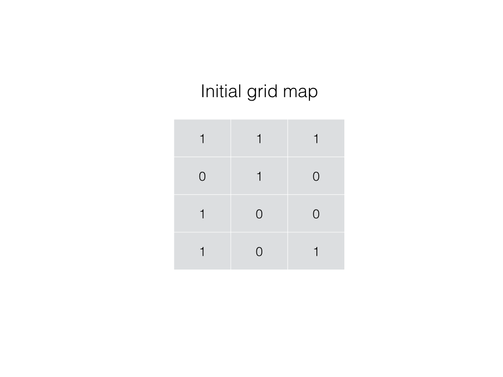
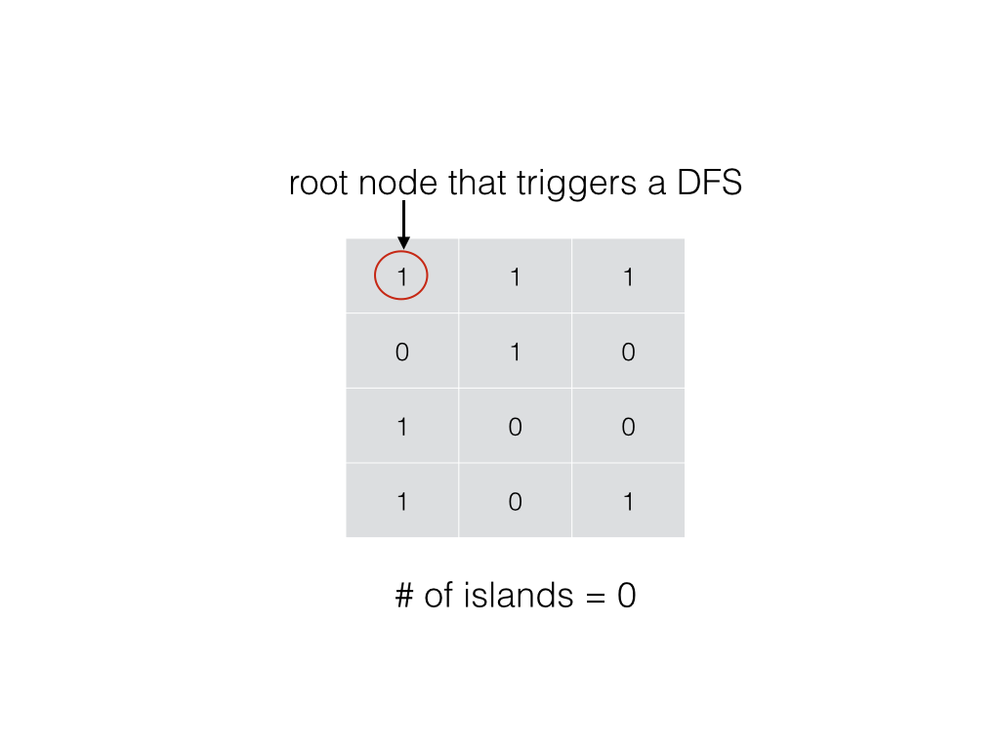
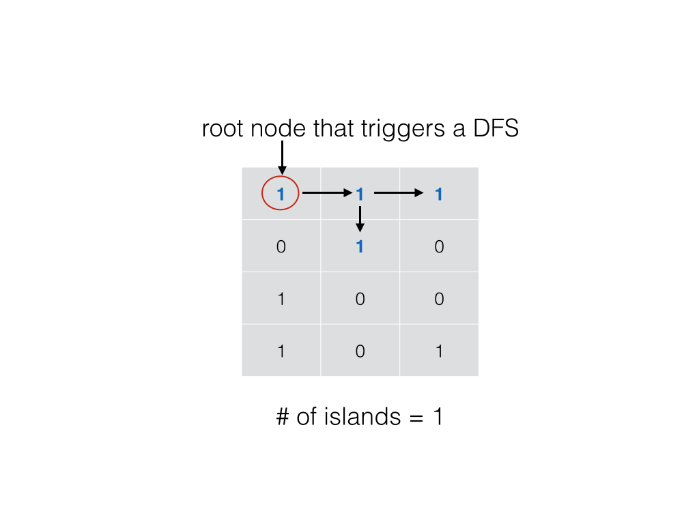
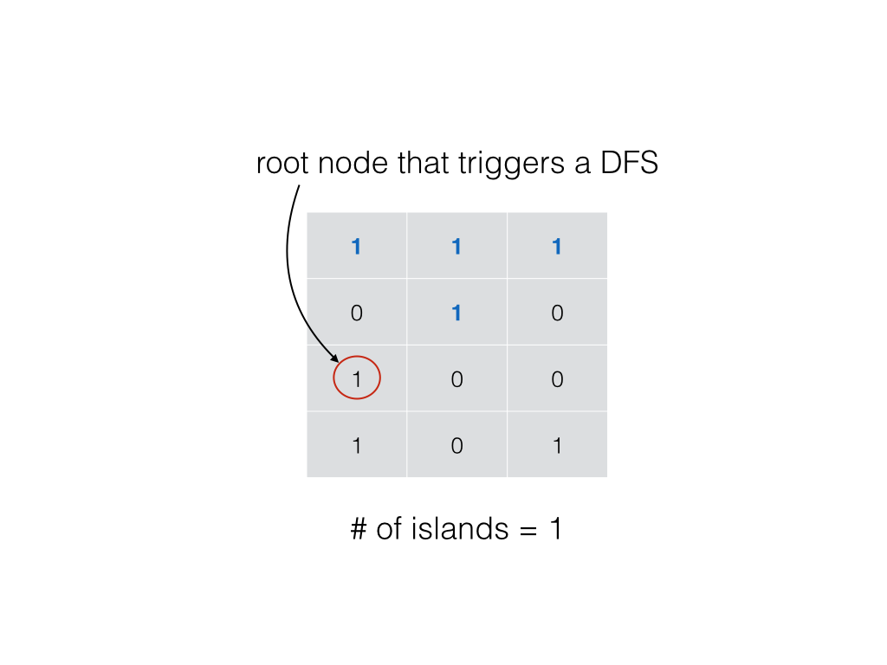
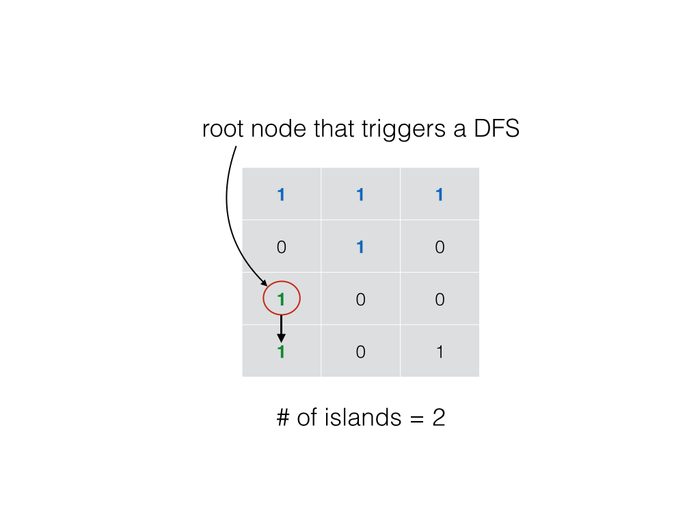

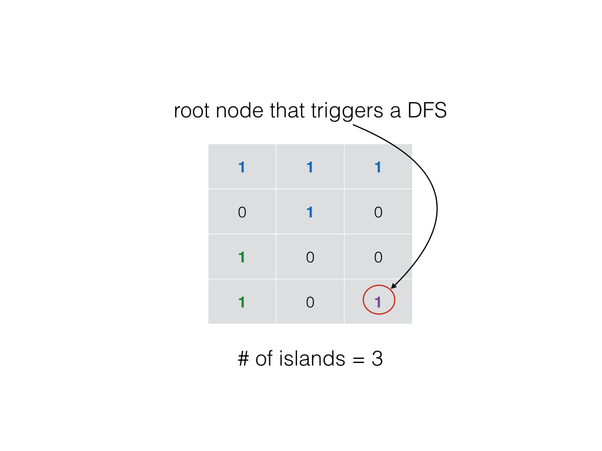
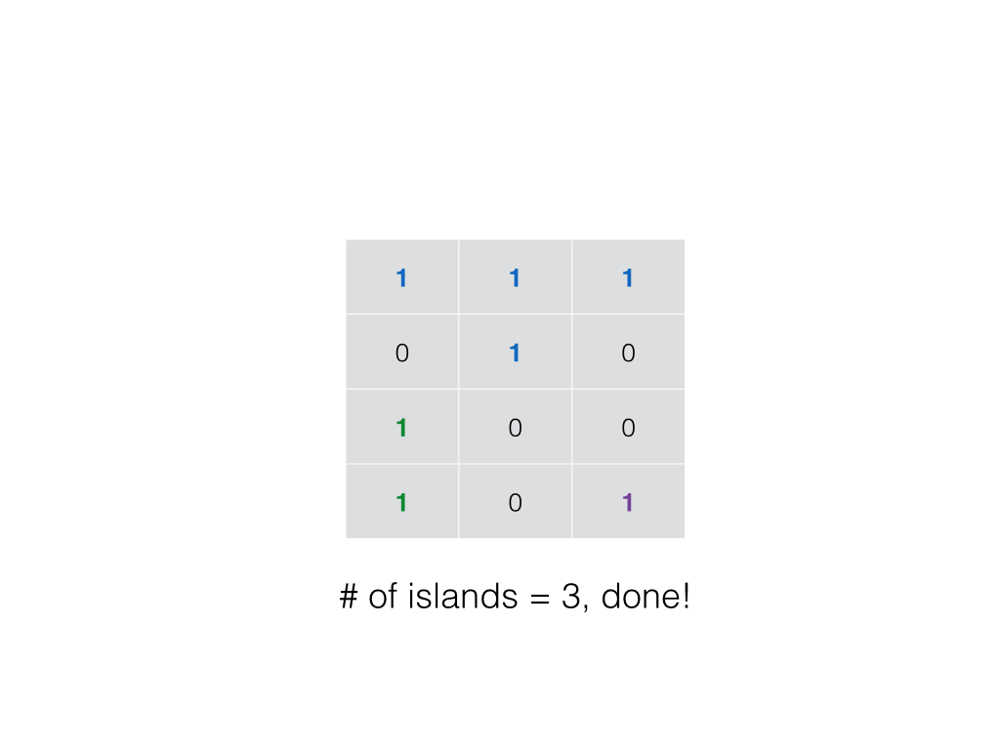

```C++
class Solution {
private:
    void dfs(vector<vector<char>>& grid, int r, int c) {
        int nr = grid.size();
        int nc = grid[0].size();

        grid[r][c] = '0';
        if (r - 1 >= 0 && grid[r-1][c] == '1') dfs(grid, r - 1, c);
        if (r + 1 < nr && grid[r+1][c] == '1') dfs(grid, r + 1, c);
        if (c - 1 >= 0 && grid[r][c-1] == '1') dfs(grid, r, c - 1);
        if (c + 1 < nc && grid[r][c+1] == '1') dfs(grid, r, c + 1);
    }

public:
    int numIslands(vector<vector<char>>& grid) {
        int nr = grid.size();
        if (!nr) return 0;
        int nc = grid[0].size();

        int num_islands = 0;
        for (int r = 0; r < nr; ++r) {
            for (int c = 0; c < nc; ++c) {
                if (grid[r][c] == '1') {
                    ++num_islands;
                    dfs(grid, r, c);
                }
            }
        }

        return num_islands;
    }
};
```

```Java
class Solution {
    void dfs(char[][] grid, int r, int c) {
        int nr = grid.length;
        int nc = grid[0].length;

        if (r < 0 || c < 0 || r >= nr || c >= nc || grid[r][c] == '0') {
            return;
        }

        grid[r][c] = '0';
        dfs(grid, r - 1, c);
        dfs(grid, r + 1, c);
        dfs(grid, r, c - 1);
        dfs(grid, r, c + 1);
    }

    public int numIslands(char[][] grid) {
        if (grid == null || grid.length == 0) {
            return 0;
        }

        int nr = grid.length;
        int nc = grid[0].length;
        int num_islands = 0;
        for (int r = 0; r < nr; ++r) {
            for (int c = 0; c < nc; ++c) {
                if (grid[r][c] == '1') {
                    ++num_islands;
                    dfs(grid, r, c);
                }
            }
        }

        return num_islands;
    }
}
```

```Python
class Solution:
    def dfs(self, grid, r, c):
        grid[r][c] = 0
        nr, nc = len(grid), len(grid[0])
        for x, y in [(r - 1, c), (r + 1, c), (r, c - 1), (r, c + 1)]:
            if 0 <= x < nr and 0 <= y < nc and grid[x][y] == "1":
                self.dfs(grid, x, y)

    def numIslands(self, grid: List[List[str]]) -> int:
        nr = len(grid)
        if nr == 0:
            return 0
        nc = len(grid[0])

        num_islands = 0
        for r in range(nr):
            for c in range(nc):
                if grid[r][c] == "1":
                    num_islands += 1
                    self.dfs(grid, r, c)
        
        return num_islands
```

**复杂度分析**

- 时间复杂度：$O(MN)$，其中 $M$ 和 $N$ 分别为行数和列数。
- 空间复杂度：$O(MN)$，在最坏情况下，整个网格均为陆地，深度优先搜索的深度达到 $MN$。

#### 方法二：广度优先搜索

同样地，我们也可以使用广度优先搜索代替深度优先搜索。

为了求出岛屿的数量，我们可以扫描整个二维网格。如果一个位置为 $1$，则将其加入队列，开始进行广度优先搜索。在广度优先搜索的过程中，每个搜索到的 $1$ 都会被重新标记为 $0$。直到队列为空，搜索结束。

最终岛屿的数量就是我们进行广度优先搜索的次数。

```C++
class Solution {
public:
    int numIslands(vector<vector<char>>& grid) {
        int nr = grid.size();
        if (!nr) return 0;
        int nc = grid[0].size();

        int num_islands = 0;
        for (int r = 0; r < nr; ++r) {
            for (int c = 0; c < nc; ++c) {
                if (grid[r][c] == '1') {
                    ++num_islands;
                    grid[r][c] = '0';
                    queue<pair<int, int>> neighbors;
                    neighbors.push({r, c});
                    while (!neighbors.empty()) {
                        auto rc = neighbors.front();
                        neighbors.pop();
                        int row = rc.first, col = rc.second;
                        if (row - 1 >= 0 && grid[row-1][col] == '1') {
                            neighbors.push({row-1, col});
                            grid[row-1][col] = '0';
                        }
                        if (row + 1 < nr && grid[row+1][col] == '1') {
                            neighbors.push({row+1, col});
                            grid[row+1][col] = '0';
                        }
                        if (col - 1 >= 0 && grid[row][col-1] == '1') {
                            neighbors.push({row, col-1});
                            grid[row][col-1] = '0';
                        }
                        if (col + 1 < nc && grid[row][col+1] == '1') {
                            neighbors.push({row, col+1});
                            grid[row][col+1] = '0';
                        }
                    }
                }
            }
        }

        return num_islands;
    }
};
```

```Java
class Solution {
    public int numIslands(char[][] grid) {
        if (grid == null || grid.length == 0) {
            return 0;
        }

        int nr = grid.length;
        int nc = grid[0].length;
        int num_islands = 0;

        for (int r = 0; r < nr; ++r) {
            for (int c = 0; c < nc; ++c) {
                if (grid[r][c] == '1') {
                    ++num_islands;
                    grid[r][c] = '0';
                    Queue<Integer> neighbors = new LinkedList<>();
                    neighbors.add(r * nc + c);
                    while (!neighbors.isEmpty()) {
                        int id = neighbors.remove();
                        int row = id / nc;
                        int col = id % nc;
                        if (row - 1 >= 0 && grid[row-1][col] == '1') {
                            neighbors.add((row-1) * nc + col);
                            grid[row-1][col] = '0';
                        }
                        if (row + 1 < nr && grid[row+1][col] == '1') {
                            neighbors.add((row+1) * nc + col);
                            grid[row+1][col] = '0';
                        }
                        if (col - 1 >= 0 && grid[row][col-1] == '1') {
                            neighbors.add(row * nc + col-1);
                            grid[row][col-1] = '0';
                        }
                        if (col + 1 < nc && grid[row][col+1] == '1') {
                            neighbors.add(row * nc + col+1);
                            grid[row][col+1] = '0';
                        }
                    }
                }
            }
        }

        return num_islands;
    }
}
```

```Python
class Solution:
    def numIslands(self, grid: List[List[str]]) -> int:
        nr = len(grid)
        if nr == 0:
            return 0
        nc = len(grid[0])

        num_islands = 0
        for r in range(nr):
            for c in range(nc):
                if grid[r][c] == "1":
                    num_islands += 1
                    grid[r][c] = "0"
                    neighbors = collections.deque([(r, c)])
                    while neighbors:
                        row, col = neighbors.popleft()
                        for x, y in [(row - 1, col), (row + 1, col), (row, col - 1), (row, col + 1)]:
                            if 0 <= x < nr and 0 <= y < nc and grid[x][y] == "1":
                                neighbors.append((x, y))
                                grid[x][y] = "0"
        
        return num_islands
```

**复杂度分析**

- 时间复杂度：$O(MN)$，其中 $M$ 和 $N$ 分别为行数和列数。
- 空间复杂度：$O(min(M,N))$，在最坏情况下，整个网格均为陆地，队列的大小可以达到 $min(M,N)$。

#### 方法三：并查集

同样地，我们也可以使用并查集代替搜索。

为了求出岛屿的数量，我们可以扫描整个二维网格。如果一个位置为 $1$，则将其与相邻四个方向上的 $1$ 在并查集中进行合并。

最终岛屿的数量就是并查集中连通分量的数目。

下面的动画展示了整个算法。


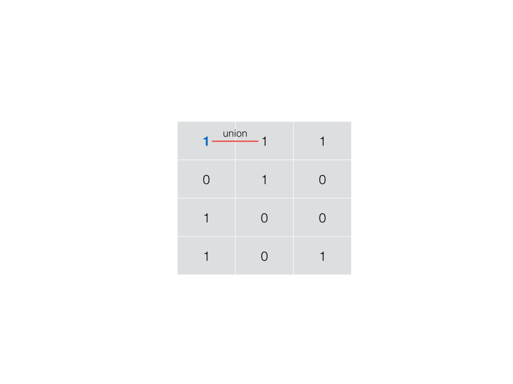
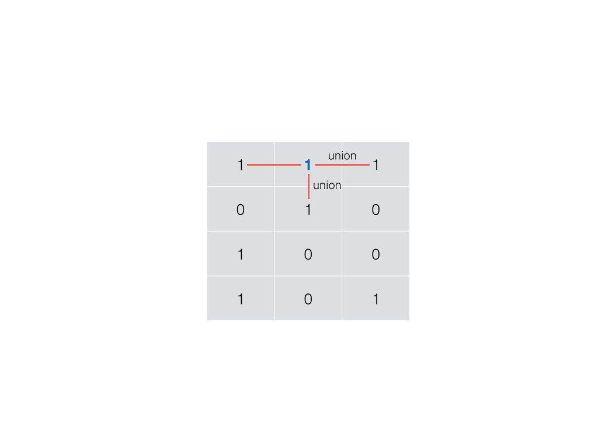
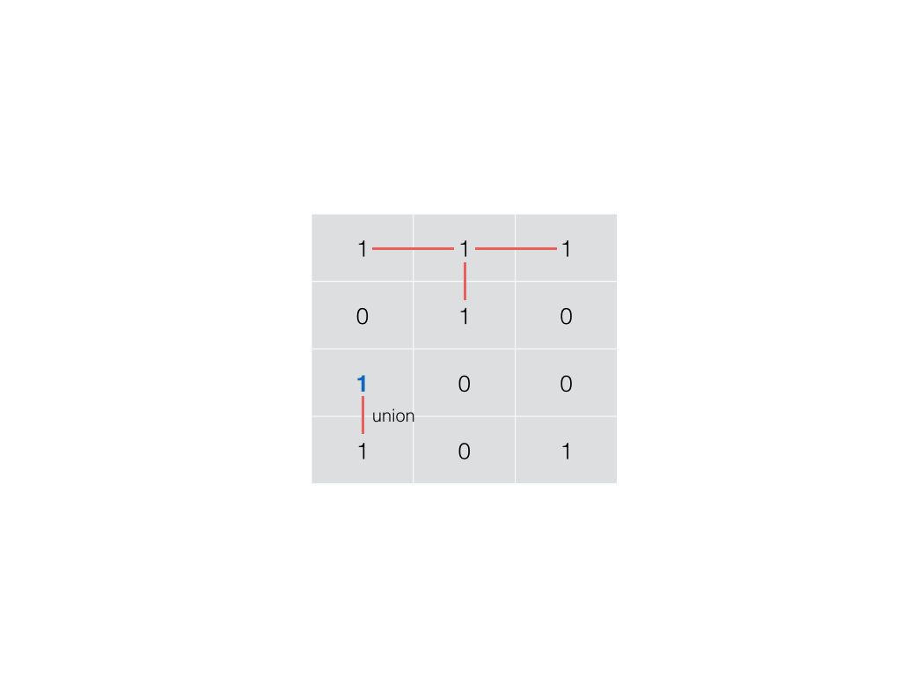
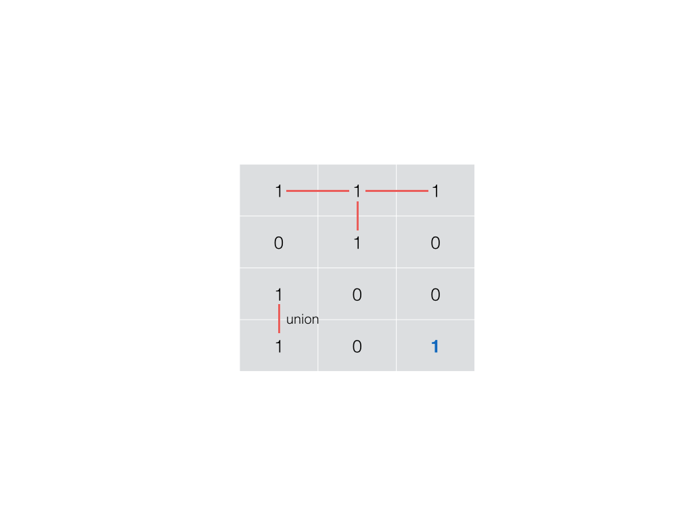
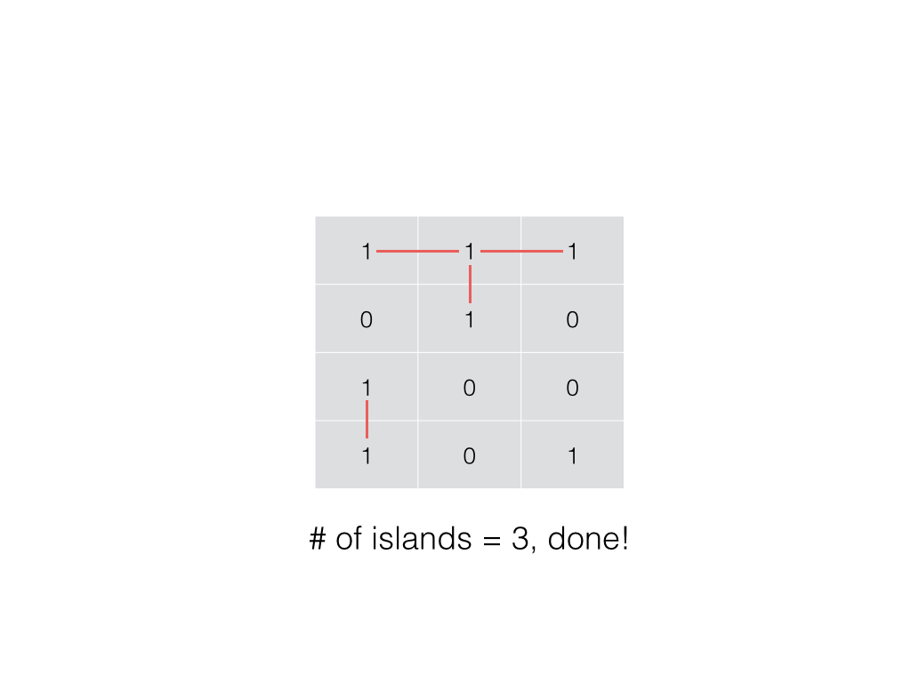

```C++
class UnionFind {
public:
    UnionFind(vector<vector<char>>& grid) {
        count = 0;
        int m = grid.size();
        int n = grid[0].size();
        for (int i = 0; i < m; ++i) {
            for (int j = 0; j < n; ++j) {
                if (grid[i][j] == '1') {
                    parent.push_back(i * n + j);
                    ++count;
                }
                else {
                    parent.push_back(-1);
                }
                rank.push_back(0);
            }
        }
    }

    int find(int i) {
        if (parent[i] != i) {
            parent[i] = find(parent[i]);
        }
        return parent[i];
    }

    void unite(int x, int y) {
        int rootx = find(x);
        int rooty = find(y);
        if (rootx != rooty) {
            if (rank[rootx] < rank[rooty]) {
                swap(rootx, rooty);
            }
            parent[rooty] = rootx;
            if (rank[rootx] == rank[rooty]) rank[rootx] += 1;
            --count;
        }
    }

    int getCount() const {
        return count;
    }

private:
    vector<int> parent;
    vector<int> rank;
    int count;
};

class Solution {
public:
    int numIslands(vector<vector<char>>& grid) {
        int nr = grid.size();
        if (!nr) return 0;
        int nc = grid[0].size();

        UnionFind uf(grid);
        int num_islands = 0;
        for (int r = 0; r < nr; ++r) {
            for (int c = 0; c < nc; ++c) {
                if (grid[r][c] == '1') {
                    grid[r][c] = '0';
                    if (r - 1 >= 0 && grid[r-1][c] == '1') uf.unite(r * nc + c, (r-1) * nc + c);
                    if (r + 1 < nr && grid[r+1][c] == '1') uf.unite(r * nc + c, (r+1) * nc + c);
                    if (c - 1 >= 0 && grid[r][c-1] == '1') uf.unite(r * nc + c, r * nc + c - 1);
                    if (c + 1 < nc && grid[r][c+1] == '1') uf.unite(r * nc + c, r * nc + c + 1);
                }
            }
        }

        return uf.getCount();
    }
};
```

```Java
class Solution {
    class UnionFind {
        int count;
        int[] parent;
        int[] rank;

        public UnionFind(char[][] grid) {
            count = 0;
            int m = grid.length;
            int n = grid[0].length;
            parent = new int[m * n];
            rank = new int[m * n];
            for (int i = 0; i < m; ++i) {
                for (int j = 0; j < n; ++j) {
                    if (grid[i][j] == '1') {
                        parent[i * n + j] = i * n + j;
                        ++count;
                    }
                    rank[i * n + j] = 0;
                }
            }
        }

        public int find(int i) {
            if (parent[i] != i) parent[i] = find(parent[i]);
            return parent[i];
        }

        public void union(int x, int y) {
            int rootx = find(x);
            int rooty = find(y);
            if (rootx != rooty) {
                if (rank[rootx] > rank[rooty]) {
                    parent[rooty] = rootx;
                } else if (rank[rootx] < rank[rooty]) {
                    parent[rootx] = rooty;
                } else {
                    parent[rooty] = rootx;
                    rank[rootx] += 1;
                }
                --count;
            }
        }

        public int getCount() {
            return count;
        }
    }

    public int numIslands(char[][] grid) {
        if (grid == null || grid.length == 0) {
            return 0;
        }

        int nr = grid.length;
        int nc = grid[0].length;
        int num_islands = 0;
        UnionFind uf = new UnionFind(grid);
        for (int r = 0; r < nr; ++r) {
            for (int c = 0; c < nc; ++c) {
                if (grid[r][c] == '1') {
                    grid[r][c] = '0';
                    if (r - 1 >= 0 && grid[r-1][c] == '1') {
                        uf.union(r * nc + c, (r-1) * nc + c);
                    }
                    if (r + 1 < nr && grid[r+1][c] == '1') {
                        uf.union(r * nc + c, (r+1) * nc + c);
                    }
                    if (c - 1 >= 0 && grid[r][c-1] == '1') {
                        uf.union(r * nc + c, r * nc + c - 1);
                    }
                    if (c + 1 < nc && grid[r][c+1] == '1') {
                        uf.union(r * nc + c, r * nc + c + 1);
                    }
                }
            }
        }

        return uf.getCount();
    }
}
```

```Python
class UnionFind:
    def __init__(self, grid):
        m, n = len(grid), len(grid[0])
        self.count = 0
        self.parent = [-1] * (m * n)
        self.rank = [0] * (m * n)
        for i in range(m):
            for j in range(n):
                if grid[i][j] == "1":
                    self.parent[i * n + j] = i * n + j
                    self.count += 1
    
    def find(self, i):
        if self.parent[i] != i:
            self.parent[i] = self.find(self.parent[i])
        return self.parent[i]
    
    def union(self, x, y):
        rootx = self.find(x)
        rooty = self.find(y)
        if rootx != rooty:
            if self.rank[rootx] < self.rank[rooty]:
                rootx, rooty = rooty, rootx
            self.parent[rooty] = rootx
            if self.rank[rootx] == self.rank[rooty]:
                self.rank[rootx] += 1
            self.count -= 1
    
    def getCount(self):
        return self.count

class Solution:
    def numIslands(self, grid: List[List[str]]) -> int:
        nr = len(grid)
        if nr == 0:
            return 0
        nc = len(grid[0])

        uf = UnionFind(grid)
        num_islands = 0
        for r in range(nr):
            for c in range(nc):
                if grid[r][c] == "1":
                    grid[r][c] = "0"
                    for x, y in [(r - 1, c), (r + 1, c), (r, c - 1), (r, c + 1)]:
                        if 0 <= x < nr and 0 <= y < nc and grid[x][y] == "1":
                            uf.union(r * nc + c, x * nc + y)
        
        return uf.getCount()
```

**复杂度分析**

- 时间复杂度：$O(MN \times \alpha (MN))$，其中 $M$ 和 $N$ 分别为行数和列数。注意当使用路径压缩（见 `find` 函数）和按秩合并（见数组 `rank`）实现并查集时，单次操作的时间复杂度为 $\alpha (MN)$，其中 $\alpha (x)$ 为反阿克曼函数，当自变量 $x$ 的值在人类可观测的范围内（宇宙中粒子的数量）时，函数 $\alpha (x)$ 的值不会超过 $5$，因此也可以看成是常数时间复杂度。
- 空间复杂度：$O(MN)$，这是并查集需要使用的空间。
