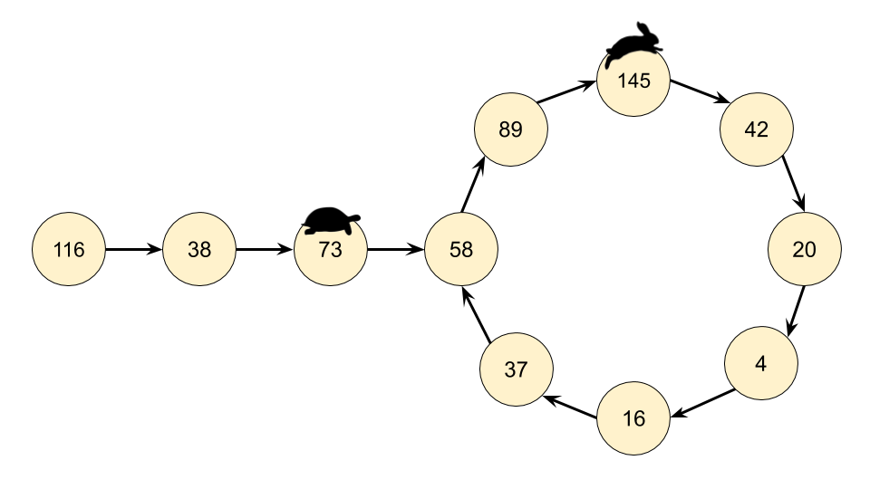

#### [方法二：快慢指针法](https://leetcode.cn/problems/happy-number/solutions/224894/kuai-le-shu-by-leetcode-solution/)

通过反复调用 `getNext(n)` 得到的链是一个隐式的链表。隐式意味着我们没有实际的链表节点和指针，但数据仍然形成链表结构。起始数字是链表的头 “节点”，链中的所有其他数字都是节点。`next` 指针是通过调用 `getNext(n)` 函数获得。

意识到我们实际有个链表，那么这个问题就可以转换为检测一个链表是否有环。因此我们在这里可以使用弗洛伊德循环查找算法。这个算法是两个奔跑选手，一个跑的快，一个跑得慢。在龟兔赛跑的寓言中，跑的慢的称为 “乌龟”，跑得快的称为 “兔子”。

不管乌龟和兔子在循环中从哪里开始，它们最终都会相遇。这是因为兔子每走一步就向乌龟靠近一个节点（在它们的移动方向上）。





**算法**

我们不是只跟踪链表中的一个值，而是跟踪两个值，称为快跑者和慢跑者。在算法的每一步中，慢速在链表中前进 1 个节点，快跑者前进 2 个节点（对 `getNext(n)` 函数的嵌套调用）。

如果 `n` 是一个快乐数，即没有循环，那么快跑者最终会比慢跑者先到达数字 1。

如果 `n` 不是一个快乐的数字，那么最终快跑者和慢跑者将在同一个数字上相遇。

```python
def isHappy(self, n: int) -> bool:  
    def get_next(number):
        total_sum = 0
        while number > 0:
            number, digit = divmod(number, 10)
            total_sum += digit ** 2
        return total_sum

    slow_runner = n
    fast_runner = get_next(n)
    while fast_runner != 1 and slow_runner != fast_runner:
        slow_runner = get_next(slow_runner)
        fast_runner = get_next(get_next(fast_runner))
    return fast_runner == 1
```

```java
class Solution {

     public int getNext(int n) {
        int totalSum = 0;
        while (n > 0) {
            int d = n % 10;
            n = n / 10;
            totalSum += d * d;
        }
        return totalSum;
    }

    public boolean isHappy(int n) {
        int slowRunner = n;
        int fastRunner = getNext(n);
        while (fastRunner != 1 && slowRunner != fastRunner) {
            slowRunner = getNext(slowRunner);
            fastRunner = getNext(getNext(fastRunner));
        }
        return fastRunner == 1;
    }
}
```

```csharp
class Solution {
    public int getNext(int n) {
        int totalSum = 0;
        while (n > 0) {
            int d = n % 10;
            n = n / 10;
            totalSum += d * d;
        }
        return totalSum;
    }

    public bool IsHappy(int n) {
        int slowRunner = n;
        int fastRunner = getNext(n);
        while (fastRunner != 1 && slowRunner != fastRunner) {
            slowRunner = getNext(slowRunner);
            fastRunner = getNext(getNext(fastRunner));
        }
        return fastRunner == 1;
    }
}
```

```go
func isHappy(n int) bool {
    slow, fast := n, step(n)
    for fast != 1 && slow != fast {
        slow = step(slow)
        fast = step(step(fast))
    }
    return fast == 1
}

func step(n int) int {
    sum := 0
    for n > 0 {
        sum += (n%10) * (n%10)
        n = n/10
    }
    return sum
}
```

**复杂度分析**

-   时间复杂度：$O(\log n)$。该分析建立在对前一种方法的分析的基础上，但是这次我们需要跟踪两个指针而不是一个指针来分析，以及在它们相遇前需要绕着这个循环走多少次。
    -   如果没有循环，那么快跑者将先到达 1，慢跑者将到达链表中的一半。我们知道最坏的情况下，成本是 $O(2 \cdot \log n) = O(\log n)$。
    -   一旦两个指针都在循环中，在每个循环中，快跑者将离慢跑者更近一步。一旦快跑者落后慢跑者一步，他们就会在下一步相遇。假设循环中有 $k$ 个数字。如果他们的起点是相隔 $k−1$ 的位置（这是他们可以开始的最远的距离），那么快跑者需要 $k−1$ 步才能到达慢跑者，这对于我们的目的来说也是不变的。因此，主操作仍然在计算起始 n 的下一个值，即 $O(\log n)$。
-   空间复杂度：$O(1)$，对于这种方法，我们不需要哈希集来检测循环。指针需要常数的额外空间。
