#### [方法二：递归](https://leetcode.cn/problems/palindrome-linked-list/solutions/457059/hui-wen-lian-biao-by-leetcode-solution/)

**思路**

为了想出使用空间复杂度为 O(1)O(1)O(1) 的算法，你可能想过使用递归来解决，但是这仍然需要 O(n)O(n)O(n) 的空间复杂度。

递归为我们提供了一种优雅的方式来方向遍历节点。

```javascript
function print_values_in_reverse(ListNode head)
    if head is NOT null
        print_values_in_reverse(head.next)
        print head.val
```

如果使用递归反向迭代节点，同时使用递归函数外的变量向前迭代，就可以判断链表是否为回文。

**算法** `currentNode` 指针是先到尾节点，由于递归的特性再从后往前进行比较。`frontPointer` 是递归函数外的指针。若 `currentNode.val != frontPointer.val` 则返回 `false`。反之，`frontPointer` 向前移动并返回 `true`。

算法的正确性在于递归处理节点的顺序是相反的（回顾上面打印的算法），而我们在函数外又记录了一个变量，因此从本质上，我们同时在正向和逆向迭代匹配。

下面的动画展示了算法的工作原理。我们定义递归函数名字为 `recursively_check`，每个节点都被赋予了标识符（如 `$1`）以便更好地解释它们。计算机在递归的过程中将使用堆栈的空间，这就是为什么递归并不是 O(1)O(1)O(1) 的空间复杂度。


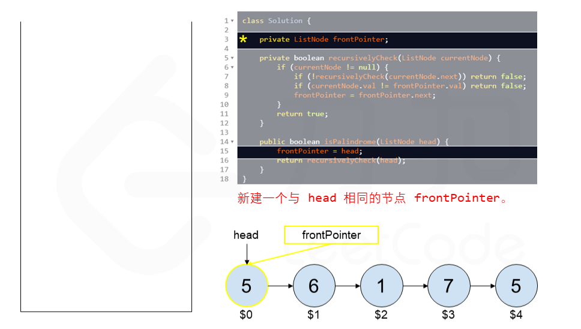
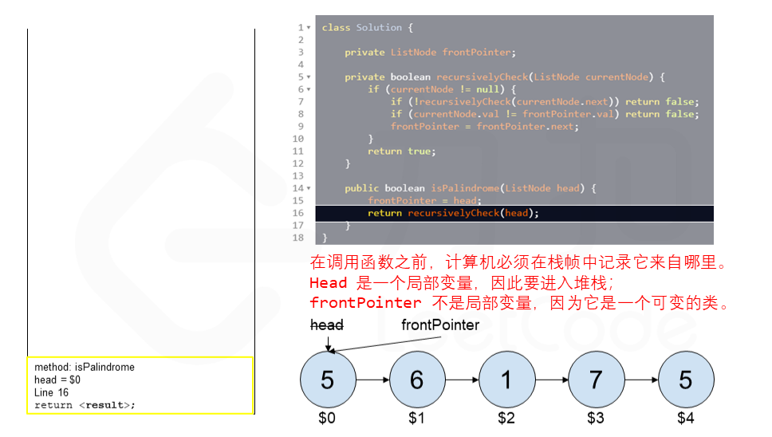
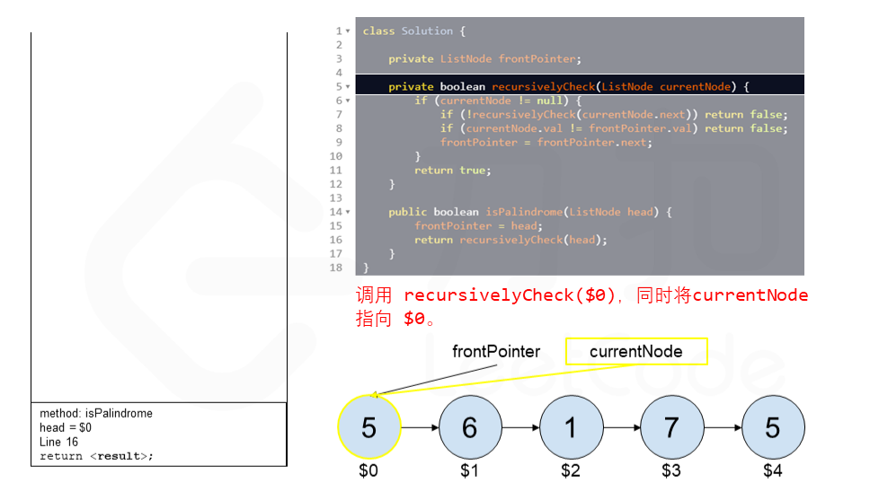
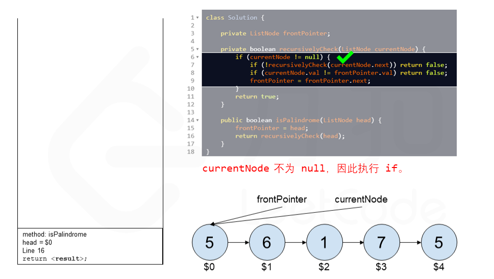
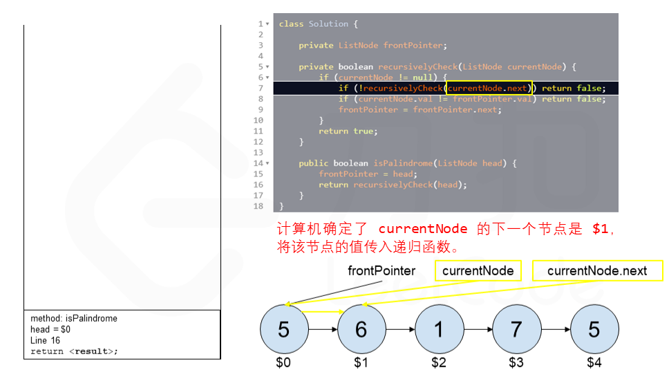
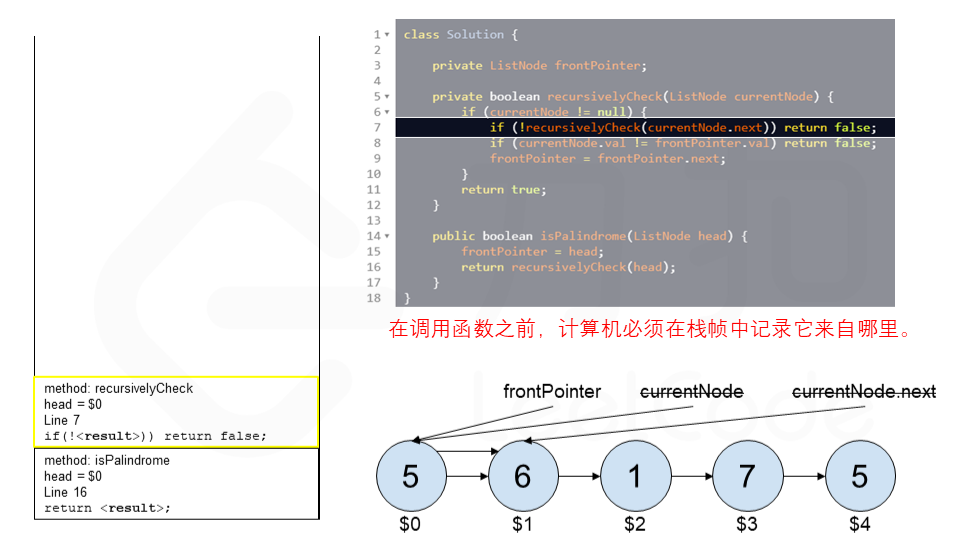
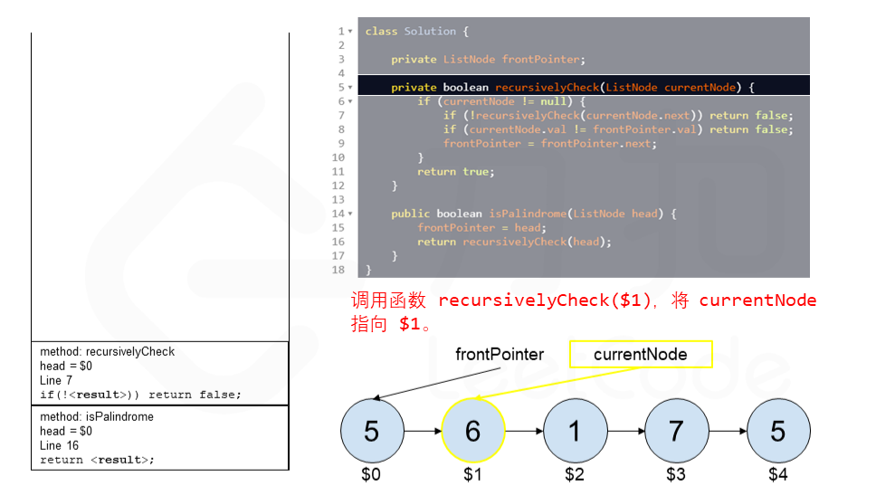

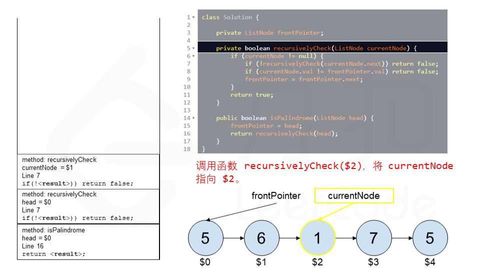
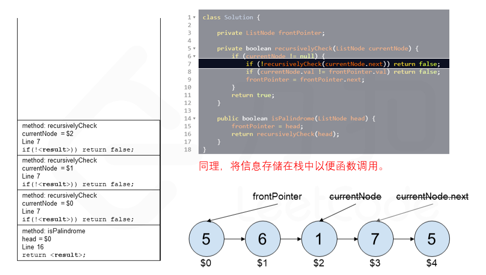

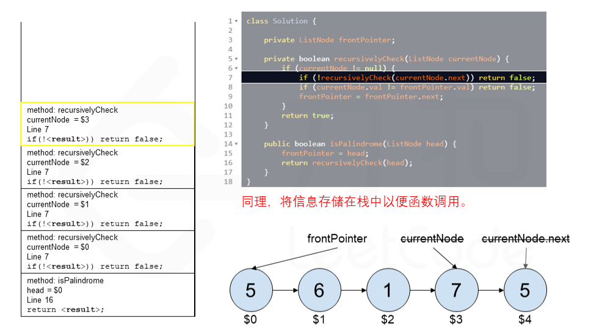


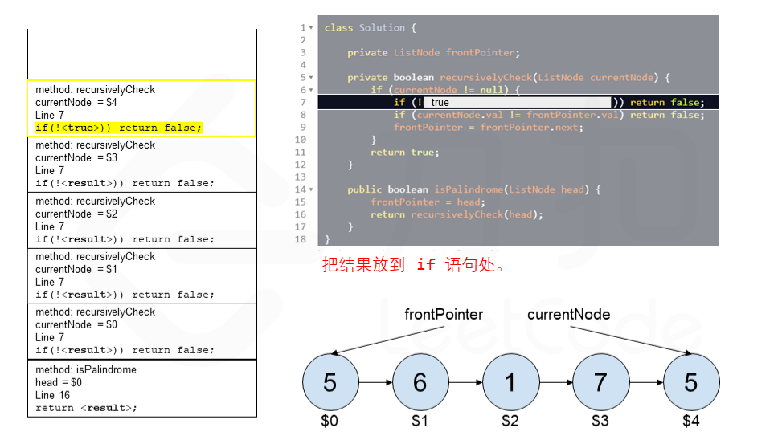


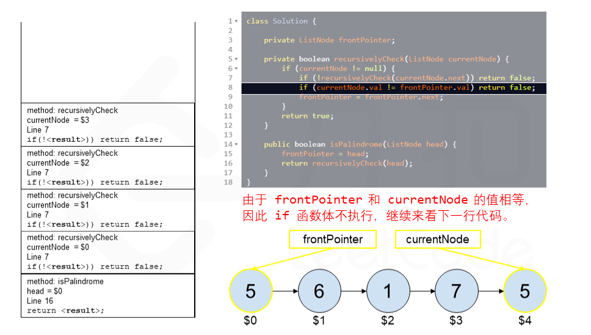


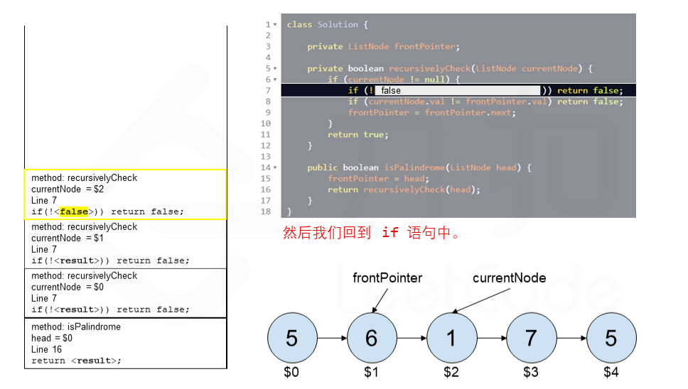


**代码**

```python
class Solution:
    def isPalindrome(self, head: ListNode) -> bool:

        self.front_pointer = head

        def recursively_check(current_node=head):
            if current_node is not None:
                if not recursively_check(current_node.next):
                    return False
                if self.front_pointer.val != current_node.val:
                    return False
                self.front_pointer = self.front_pointer.next
            return True

        return recursively_check()
```

```java
class Solution {
    private ListNode frontPointer;

    private boolean recursivelyCheck(ListNode currentNode) {
        if (currentNode != null) {
            if (!recursivelyCheck(currentNode.next)) {
                return false;
            }
            if (currentNode.val != frontPointer.val) {
                return false;
            }
            frontPointer = frontPointer.next;
        }
        return true;
    }

    public boolean isPalindrome(ListNode head) {
        frontPointer = head;
        return recursivelyCheck(head);
    }
}
```

```cpp
class Solution {
    ListNode* frontPointer;
public:
    bool recursivelyCheck(ListNode* currentNode) {
        if (currentNode != nullptr) {
            if (!recursivelyCheck(currentNode->next)) {
                return false;
            }
            if (currentNode->val != frontPointer->val) {
                return false;
            }
            frontPointer = frontPointer->next;
        }
        return true;
    }

    bool isPalindrome(ListNode* head) {
        frontPointer = head;
        return recursivelyCheck(head);
    }
};
```

```javascript
let frontPointer;

const recursivelyCheck = (currentNode) => {
    if (currentNode !== null) {
        if (!recursivelyCheck(currentNode.next)) {
            return false;
        }
        if (currentNode.val !== frontPointer.val) {
            return false;
        }
        frontPointer = frontPointer.next;
    }
    return true;
}

var isPalindrome = function(head) {
    frontPointer = head;
    return recursivelyCheck(head);
};
```

```go
func isPalindrome(head *ListNode) bool {
    frontPointer := head
    var recursivelyCheck func(*ListNode) bool
    recursivelyCheck = func(curNode *ListNode) bool {
        if curNode != nil {
            if !recursivelyCheck(curNode.Next) {
                return false
            }
            if curNode.Val != frontPointer.Val {
                return false
            }
            frontPointer = frontPointer.Next
        }
        return true
    }
    return recursivelyCheck(head)
}
```

```c
struct ListNode* frontPointer;

bool recursivelyCheck(struct ListNode* currentNode) {
    if (currentNode != NULL) {
        if (!recursivelyCheck(currentNode->next)) {
            return false;
        }
        if (currentNode->val != frontPointer->val) {
            return false;
        }
        frontPointer = frontPointer->next;
    }
    return true;
}

bool isPalindrome(struct ListNode* head) {
    frontPointer = head;
    return recursivelyCheck(head);
}
```

**复杂度分析**

-   时间复杂度：$O(n)$，其中 $n$ 指的是链表的大小。
-   空间复杂度：$O(n)$，其中 $n$ 指的是链表的大小。我们要理解计算机如何运行递归函数，在一个函数中调用一个函数时，计算机需要在进入被调用函数之前跟踪它在当前函数中的位置（以及任何局部变量的值），通过运行时存放在堆栈中来实现（堆栈帧）。在堆栈中存放好了数据后就可以进入被调用的函数。在完成被调用函数之后，他会弹出堆栈顶部元素，以恢复在进行函数调用之前所在的函数。在进行回文检查之前，递归函数将在堆栈中创建 $n$ 个堆栈帧，计算机会逐个弹出进行处理。所以在使用递归时空间复杂度要考虑堆栈的使用情况。

这种方法不仅使用了 $O(n)$ 的空间，且比第一种方法更差，因为在许多语言中，堆栈帧的开销很大（如 Python），并且最大的运行时堆栈深度为 1000（可以增加，但是有可能导致底层解释程序内存出错）。为每个节点创建堆栈帧极大的限制了算法能够处理的最大链表大小。
