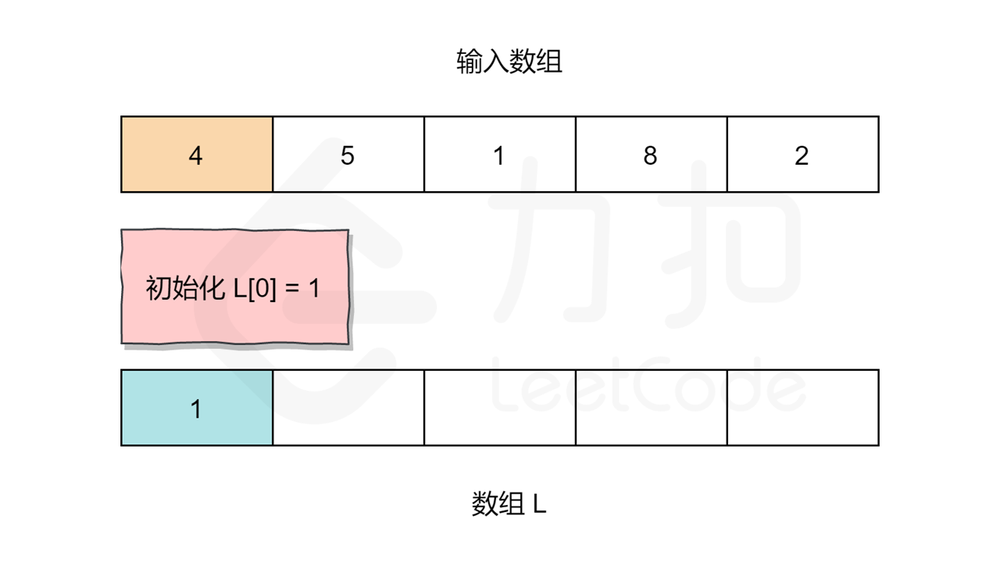
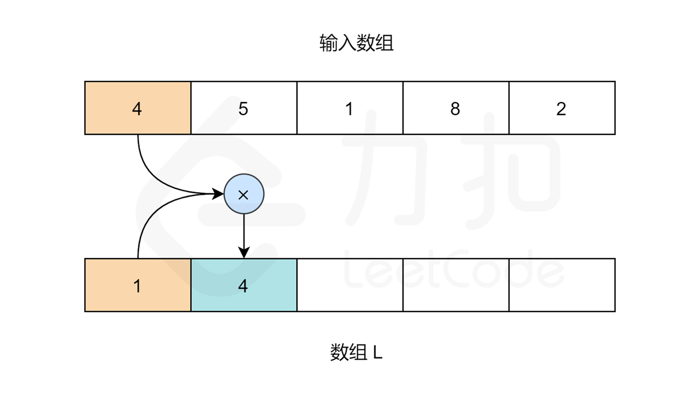
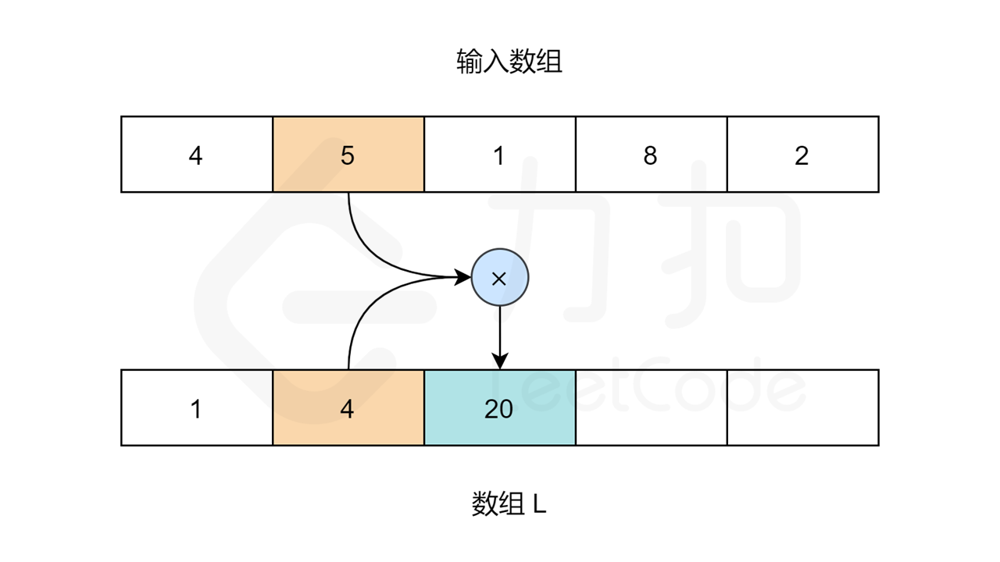
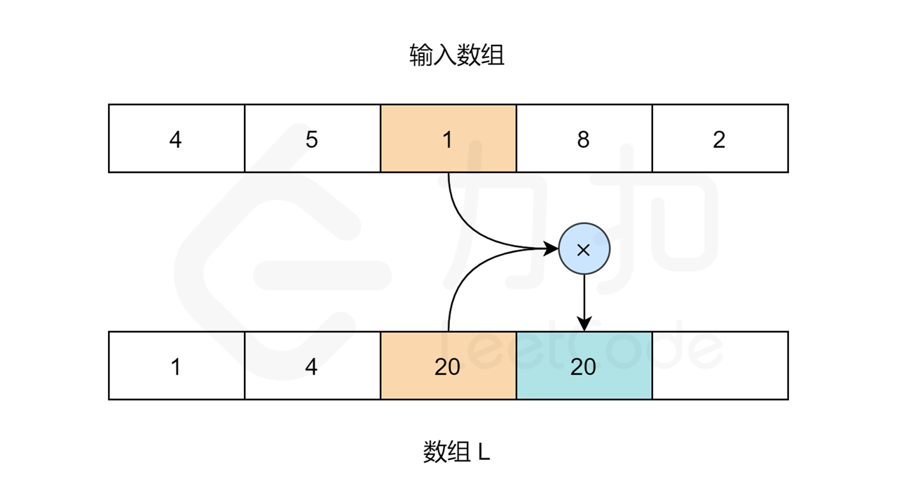
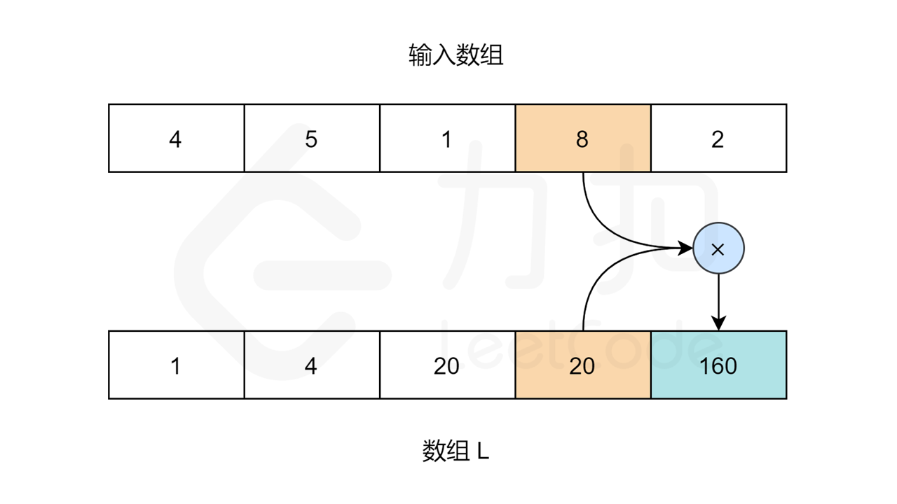
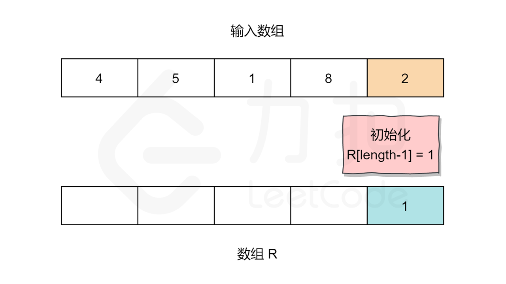
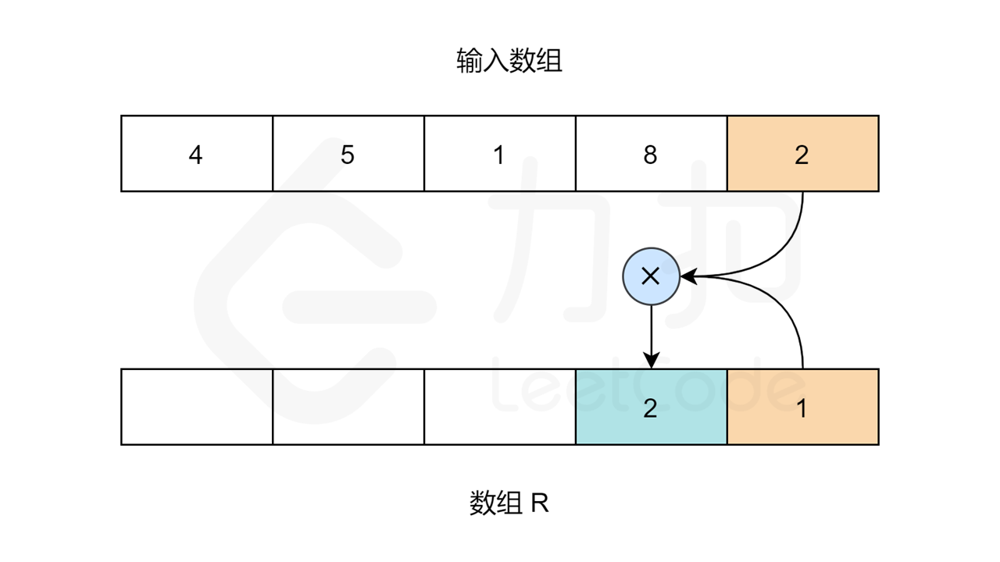
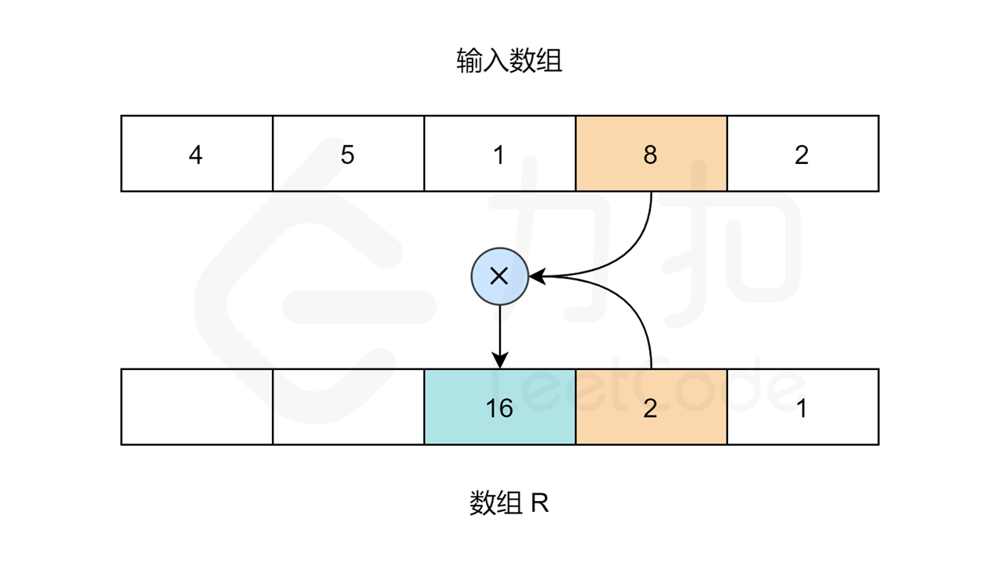
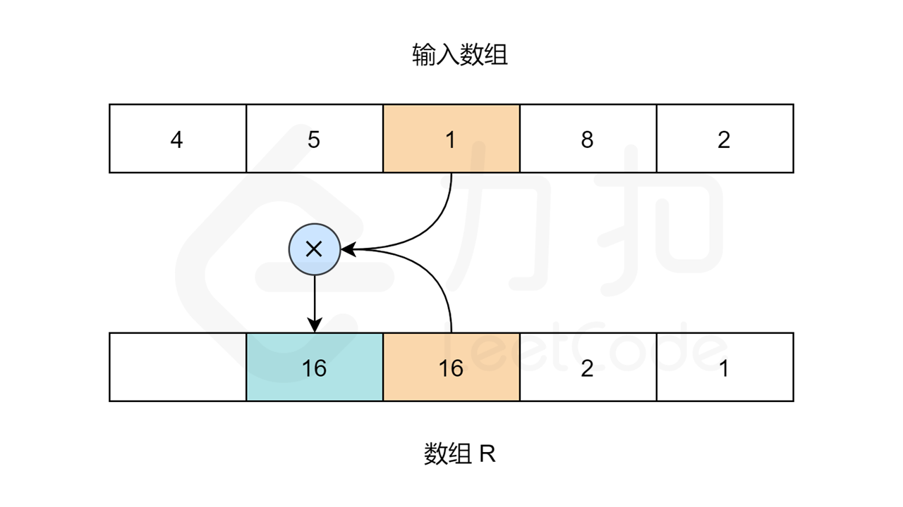
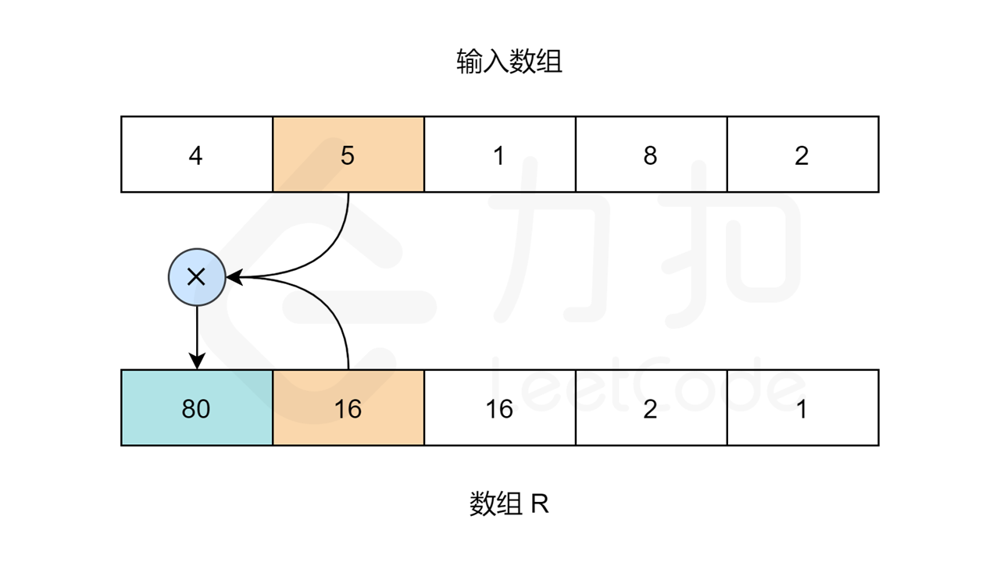

### [除自身以外数组的乘积](https://leetcode.cn/problems/product-of-array-except-self/solutions/272369/chu-zi-shen-yi-wai-shu-zu-de-cheng-ji-by-leetcode-/)

#### 前言

这似乎是一个简单的问题，可以在线性时间和空间内解决。先计算给定数组所有元素的乘积，然后对数组中的每个元素 x，将总的乘积除以 x 来求得除自身值的以外数组的乘积。

然而这样的解决方法有一个问题，就是如果输入数组中出现 0，那么这个方法就失效了。而且在问题中说明了不允许使用除法运算。这增加了这个问题的难度。

#### 方法一：左右乘积列表

**思路**

我们不必将所有数字的乘积除以给定索引处的数字得到相应的答案，而是利用索引左侧所有数字的乘积和右侧所有数字的乘积（即前缀与后缀）相乘得到答案。

对于给定索引 i，我们将使用它左边所有数字的乘积乘以右边所有数字的乘积。下面让我们更加具体的描述这个算法。

**算法**

1. 初始化两个空数组 `L` 和 `R`。对于给定索引 `i`，`L[i]` 代表的是 `i` 左侧所有数字的乘积，`R[i]` 代表的是 `i` 右侧所有数字的乘积。
2. 我们需要用两个循环来填充 `L` 和 `R` 数组的值。对于数组 `L`，`L[0]` 应该是 `1`，因为第一个元素的左边没有元素。对于其他元素：`L[i] = L[i-1] * nums[i-1]`。
3. 同理，对于数组 `R`，`R[length-1]` 应为 `1`。`length` 指的是输入数组的大小。其他元素：`R[i] = R[i+1] * nums[i+1]`。
4. 当 `R` 和 `L` 数组填充完成，我们只需要在输入数组上迭代，且索引 `i` 处的值为：`L[i] * R[i]`。

让我们用以下图片看看算法是如何工作的：












```C++
class Solution {
public:
    vector<int> productExceptSelf(vector<int>& nums) {
        int length = nums.size();

        // L 和 R 分别表示左右两侧的乘积列表
        vector<int> L(length, 0), R(length, 0);

        vector<int> answer(length);

        // L[i] 为索引 i 左侧所有元素的乘积
        // 对于索引为 '0' 的元素，因为左侧没有元素，所以 L[0] = 1
        L[0] = 1;
        for (int i = 1; i < length; i++) {
            L[i] = nums[i - 1] * L[i - 1];
        }

        // R[i] 为索引 i 右侧所有元素的乘积
        // 对于索引为 'length-1' 的元素，因为右侧没有元素，所以 R[length-1] = 1
        R[length - 1] = 1;
        for (int i = length - 2; i >= 0; i--) {
            R[i] = nums[i + 1] * R[i + 1];
        }

        // 对于索引 i，除 nums[i] 之外其余各元素的乘积就是左侧所有元素的乘积乘以右侧所有元素的乘积
        for (int i = 0; i < length; i++) {
            answer[i] = L[i] * R[i];
        }

        return answer;
    }
};
```

```Python
class Solution:
    def productExceptSelf(self, nums: List[int]) -> List[int]:
        length = len(nums)
        
        # L 和 R 分别表示左右两侧的乘积列表
        L, R, answer = [0]*length, [0]*length, [0]*length
        
        # L[i] 为索引 i 左侧所有元素的乘积
        # 对于索引为 '0' 的元素，因为左侧没有元素，所以 L[0] = 1
        L[0] = 1
        for i in range(1, length):
            L[i] = nums[i - 1] * L[i - 1]
        
        # R[i] 为索引 i 右侧所有元素的乘积
        # 对于索引为 'length-1' 的元素，因为右侧没有元素，所以 R[length-1] = 1
        R[length - 1] = 1
        for i in reversed(range(length - 1)):
            R[i] = nums[i + 1] * R[i + 1]

        # 对于索引 i，除 nums[i] 之外其余各元素的乘积就是左侧所有元素的乘积乘以右侧所有元素的乘积
        for i in range(length):
            answer[i] = L[i] * R[i]
        
        return answer
```

```Java
class Solution {
    public int[] productExceptSelf(int[] nums) {
        int length = nums.length;

        // L 和 R 分别表示左右两侧的乘积列表
        int[] L = new int[length];
        int[] R = new int[length];

        int[] answer = new int[length];

        // L[i] 为索引 i 左侧所有元素的乘积
        // 对于索引为 '0' 的元素，因为左侧没有元素，所以 L[0] = 1
        L[0] = 1;
        for (int i = 1; i < length; i++) {
            L[i] = nums[i - 1] * L[i - 1];
        }

        // R[i] 为索引 i 右侧所有元素的乘积
        // 对于索引为 'length-1' 的元素，因为右侧没有元素，所以 R[length-1] = 1
        R[length - 1] = 1;
        for (int i = length - 2; i >= 0; i--) {
            R[i] = nums[i + 1] * R[i + 1];
        }

        // 对于索引 i，除 nums[i] 之外其余各元素的乘积就是左侧所有元素的乘积乘以右侧所有元素的乘积
        for (int i = 0; i < length; i++) {
            answer[i] = L[i] * R[i];
        }

        return answer;
    }
}
```

```Go
func productExceptSelf(nums []int) []int {
    length := len(nums)

    // L 和 R 分别表示左右两侧的乘积列表
    L, R, answer := make([]int, length), make([]int, length), make([]int, length)

    // L[i] 为索引 i 左侧所有元素的乘积
    // 对于索引为 '0' 的元素，因为左侧没有元素，所以 L[0] = 1
    L[0] = 1
    for i := 1; i < length; i++ {
        L[i] = nums[i-1] * L[i-1]
    }

    // R[i] 为索引 i 右侧所有元素的乘积
    // 对于索引为 'length-1' 的元素，因为右侧没有元素，所以 R[length-1] = 1
    R[length-1] = 1
    for i := length - 2; i >= 0; i-- {
        R[i] = nums[i+1] * R[i+1]
    }
    
    // 对于索引 i，除 nums[i] 之外其余各元素的乘积就是左侧所有元素的乘积乘以右侧所有元素的乘积
    for i := 0; i < length; i++ {
        answer[i] = L[i] * R[i]
    }
    return answer
}
```

```TypeScript
var productExceptSelf = function(nums: number[]): number[] {
    const length = nums.length;

    // L 和 R 分别表示左右两侧的乘积列表
    const L = new Array<number>(length);
    const R = new Array<number>(length);

    const answer = new Array<number>(length);

    // L[i] 为索引 i 左侧所有元素的乘积
    // 对于索引为 '0' 的元素，因为左侧没有元素，所以 L[0] = 1
    L[0] = 1;
    for (let i = 1; i < length; i++) {
        L[i] = nums[i - 1] * L[i - 1];
    }

    // R[i] 为索引 i 右侧所有元素的乘积
    // 对于索引为 'length-1' 的元素，因为右侧没有元素，所以 R[length-1] = 1
    R[length - 1] = 1;
    for (let i = length - 2; i >= 0; i--) {
        R[i] = nums[i + 1] * R[i + 1];
    }

    // 对于索引 i，除 nums[i] 之外其余各元素的乘积就是左侧所有元素的乘积乘以右侧所有元素的乘积
    for (let i = 0; i < length; i++) {
        answer[i] = L[i] * R[i];
    }

    return answer;
};
```

**复杂度分析**

- 时间复杂度：$O(N)$，其中 $N$ 指的是数组 `nums` 的大小。预处理 `L` 和 `R` 数组以及最后的遍历计算都是 $O(N)$ 的时间复杂度。
- 空间复杂度：$O(N)$，其中 $N$ 指的是数组 `nums` 的大小。使用了 `L` 和 `R` 数组去构造答案，`L` 和 `R` 数组的长度为数组 `nums` 的大小。

#### 方法二：空间复杂度 $O(1)$ 的方法

**思路**

尽管上面的方法已经能够很好的解决这个问题，但是空间复杂度并不为常数。

由于输出数组不算在空间复杂度内，那么我们可以将 `L` 或 `R` 数组用输出数组来计算。先把输出数组当作 `L` 数组来计算，然后再动态构造 `R` 数组得到结果。让我们来看看基于这个思想的算法。

**算法**

1. 初始化 `answer` 数组，对于给定索引 `i`，`answer[i]` 代表的是 `i` 左侧所有数字的乘积。
2. 构造方式与之前相同，只是我们试图节省空间，先把 `answer` 作为方法一的 `L` 数组。
3. 这种方法的唯一变化就是我们没有构造 `R` 数组。而是用一个遍历来跟踪右边元素的乘积。并更新数组 $answer[i]=answer[i] \times R$。然后 $R$ 更新为 $R=R \times nums[i]$，其中变量 $R$ 表示的就是索引右侧数字的乘积。

```C++
class Solution {
public:
    vector<int> productExceptSelf(vector<int>& nums) {
        int length = nums.size();
        vector<int> answer(length);

        // answer[i] 表示索引 i 左侧所有元素的乘积
        // 因为索引为 '0' 的元素左侧没有元素， 所以 answer[0] = 1
        answer[0] = 1;
        for (int i = 1; i < length; i++) {
            answer[i] = nums[i - 1] * answer[i - 1];
        }

        // R 为右侧所有元素的乘积
        // 刚开始右边没有元素，所以 R = 1
        int R = 1;
        for (int i = length - 1; i >= 0; i--) {
            // 对于索引 i，左边的乘积为 answer[i]，右边的乘积为 R
            answer[i] = answer[i] * R;
            // R 需要包含右边所有的乘积，所以计算下一个结果时需要将当前值乘到 R 上
            R *= nums[i];
        }
        return answer;
    }
};
```

```Python
class Solution:
    def productExceptSelf(self, nums: List[int]) -> List[int]:
        length = len(nums)
        answer = [0]*length
        
        # answer[i] 表示索引 i 左侧所有元素的乘积
        # 因为索引为 '0' 的元素左侧没有元素， 所以 answer[0] = 1
        answer[0] = 1
        for i in range(1, length):
            answer[i] = nums[i - 1] * answer[i - 1]
        
        # R 为右侧所有元素的乘积
        # 刚开始右边没有元素，所以 R = 1
        R = 1;
        for i in reversed(range(length)):
            # 对于索引 i，左边的乘积为 answer[i]，右边的乘积为 R
            answer[i] = answer[i] * R
            # R 需要包含右边所有的乘积，所以计算下一个结果时需要将当前值乘到 R 上
            R *= nums[i]
        
        return answer
```

```Java
class Solution {
    public int[] productExceptSelf(int[] nums) {
        int length = nums.length;
        int[] answer = new int[length];

        // answer[i] 表示索引 i 左侧所有元素的乘积
        // 因为索引为 '0' 的元素左侧没有元素， 所以 answer[0] = 1
        answer[0] = 1;
        for (int i = 1; i < length; i++) {
            answer[i] = nums[i - 1] * answer[i - 1];
        }

        // R 为右侧所有元素的乘积
        // 刚开始右边没有元素，所以 R = 1
        int R = 1;
        for (int i = length - 1; i >= 0; i--) {
            // 对于索引 i，左边的乘积为 answer[i]，右边的乘积为 R
            answer[i] = answer[i] * R;
            // R 需要包含右边所有的乘积，所以计算下一个结果时需要将当前值乘到 R 上
            R *= nums[i];
        }
        return answer;
    }
}
```

```Go
func productExceptSelf(nums []int) []int {
    length := len(nums)
    answer := make([]int, length)

    // answer[i] 表示索引 i 左侧所有元素的乘积
    // 因为索引为 '0' 的元素左侧没有元素， 所以 answer[0] = 1
    answer[0] = 1
    for i := 1; i < length; i++ {
        answer[i] = nums[i-1] * answer[i-1]
    }

    // R 为右侧所有元素的乘积
    // 刚开始右边没有元素，所以 R = 1
    R := 1
    for i := length - 1; i >= 0; i-- {
        // 对于索引 i，左边的乘积为 answer[i]，右边的乘积为 R
        answer[i] = answer[i] * R
        // R 需要包含右边所有的乘积，所以计算下一个结果时需要将当前值乘到 R 上
        R *= nums[i]
    }
    return answer
}
```

```TypeScript
var productExceptSelf = function(nums: number[]): number[] {
    const length = nums.length;
    const answer = new Array<number>(length);

    // answer[i] 表示索引 i 左侧所有元素的乘积
    // 因为索引为 '0' 的元素左侧没有元素， 所以 answer[0] = 1
    answer[0] = 1;
    for (let i = 1; i < length; i++) {
        answer[i] = nums[i - 1] * answer[i - 1];
    }

    // R 为右侧所有元素的乘积
    // 刚开始右边没有元素，所以 R = 1
    let R = 1;
    for (let i = length - 1; i >= 0; i--) {
        // 对于索引 i，左边的乘积为 answer[i]，右边的乘积为 R
        answer[i] = answer[i] * R;
        // R 需要包含右边所有的乘积，所以计算下一个结果时需要将当前值乘到 R 上
        R *= nums[i];
    }
    return answer;
};
```

**复杂度分析**

- 时间复杂度：$O(N)$，其中 N 指的是数组 `nums` 的大小。分析与方法一相同。
- 空间复杂度：$O(1)$，输出数组不算进空间复杂度中，因此我们只需要常数的空间存放变量。
