#### [方法二：广度优先搜索](https://leetcode.cn/problems/binary-tree-paths/solutions/400326/er-cha-shu-de-suo-you-lu-jing-by-leetcode-solution/)

**思路与算法**

我们也可以用广度优先搜索来实现。我们维护一个队列，存储节点以及根到该节点的路径。一开始这个队列里只有根节点。在每一步迭代中，我们取出队列中的首节点，如果它**是叶子节点**，则将它对应的路径加入到答案中。如果它**不是叶子节点**，则将它的所有孩子节点加入到队列的末尾。当队列为空时广度优先搜索结束，我们即能得到答案。

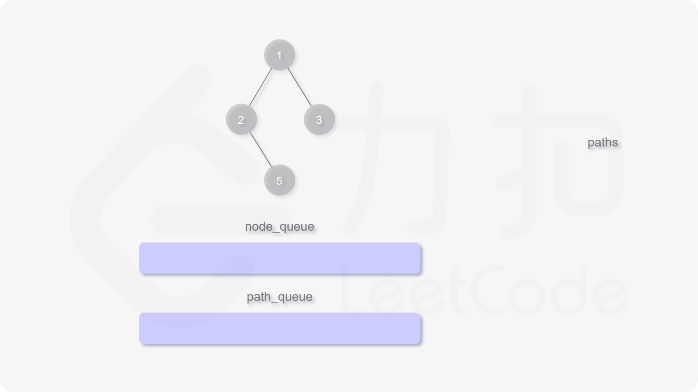
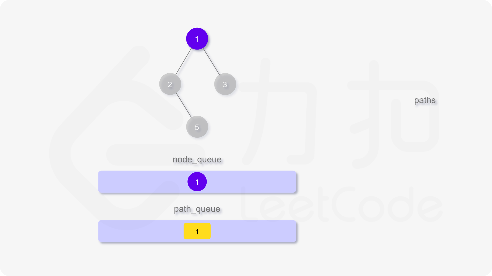
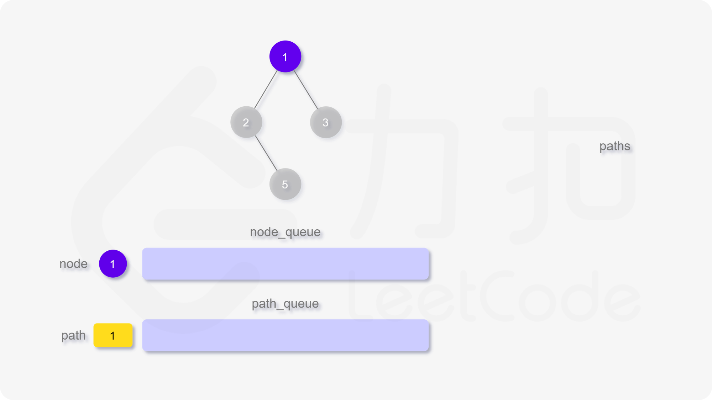
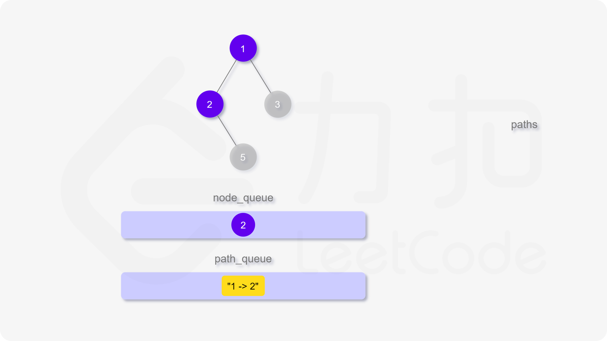
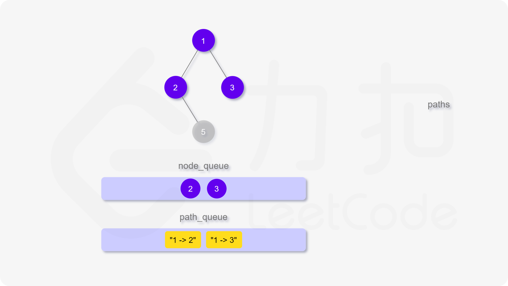
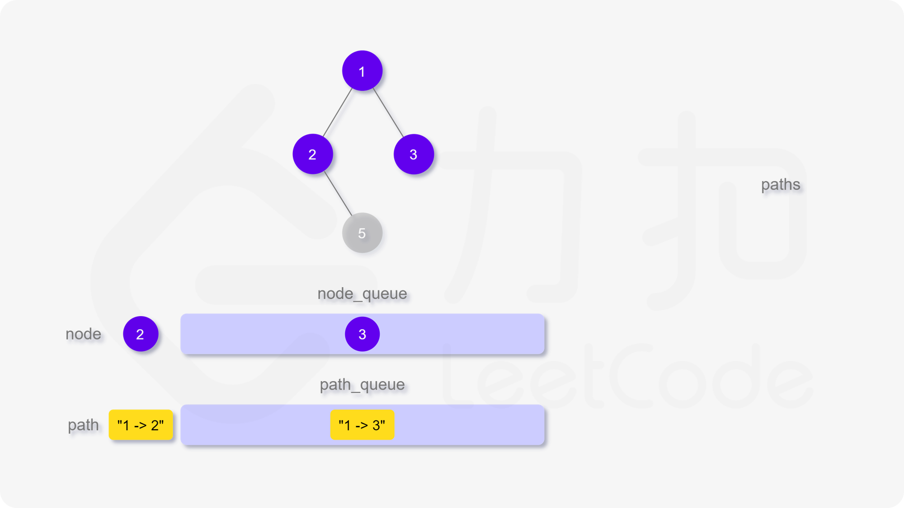
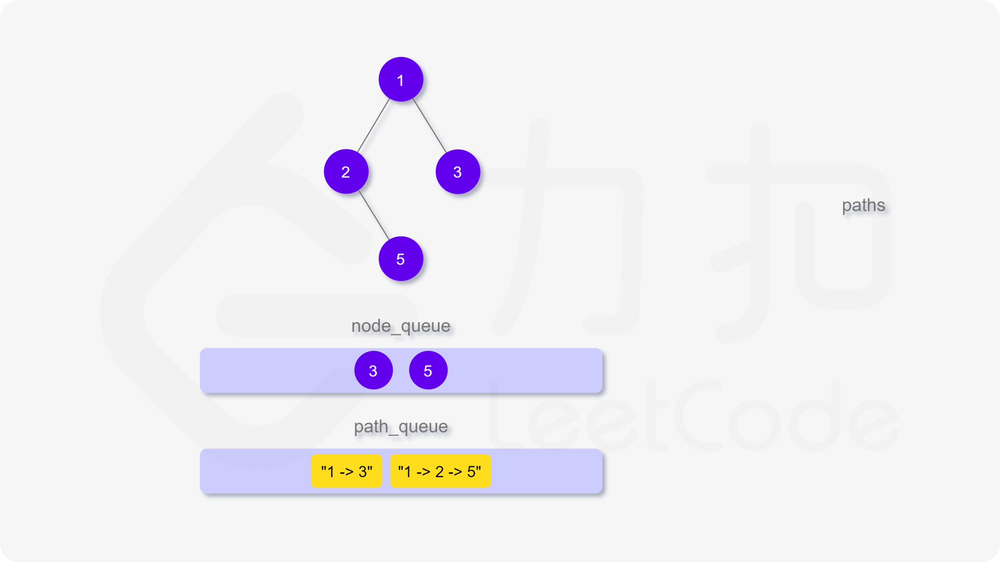
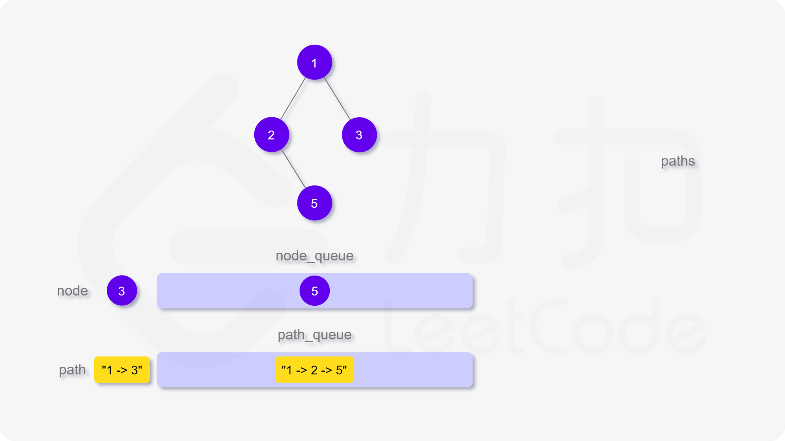
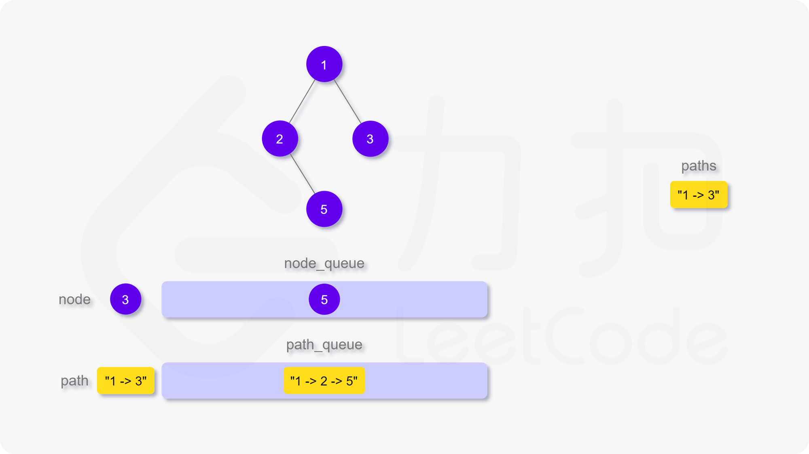
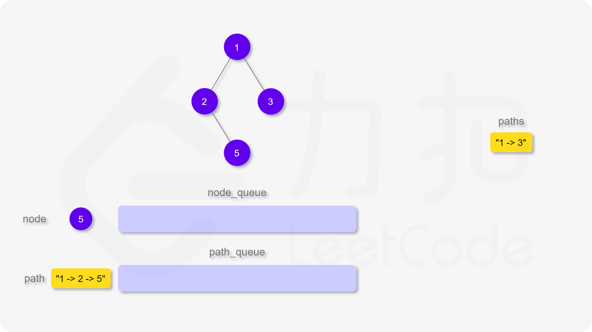
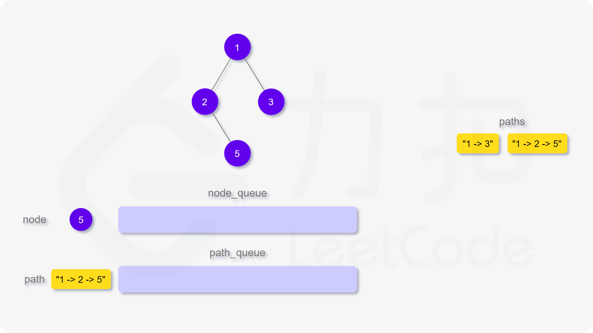


**代码**

```cpp
class Solution {
public:
    vector<string> binaryTreePaths(TreeNode* root) {
        vector<string> paths;
        if (root == nullptr) {
            return paths;
        }
        queue<TreeNode*> node_queue;
        queue<string> path_queue;

        node_queue.push(root);
        path_queue.push(to_string(root->val));

        while (!node_queue.empty()) {
            TreeNode* node = node_queue.front(); 
            string path = path_queue.front();
            node_queue.pop();
            path_queue.pop();

            if (node->left == nullptr && node->right == nullptr) {
                paths.push_back(path);
            } else {
                if (node->left != nullptr) {
                    node_queue.push(node->left);
                    path_queue.push(path + "->" + to_string(node->left->val));
                }

                if (node->right != nullptr) {
                    node_queue.push(node->right);
                    path_queue.push(path + "->" + to_string(node->right->val));
                }
            }
        }
        return paths;
    }
};
```

```javascript
var binaryTreePaths = function(root) {
    const paths = [];
    if (root === null) {
        return paths;
    }
    const node_queue = [root];
    const path_queue = [root.val.toString()];

    while (node_queue.length) {
        const node = node_queue.shift(); 
        const path = path_queue.shift();

        if (node.left === null && node.right === null) {
            paths.push(path);
        } else {
            if (node.left !== null) {
                node_queue.push(node.left);
                path_queue.push(path + "->" + node.left.val.toString());
            }

            if (node.right !== null) {
                node_queue.push(node.right);
                path_queue.push(path + "->" + node.right.val.toString());
            }
        }
    }
    return paths;
};
```

```java
class Solution {
    public List<String> binaryTreePaths(TreeNode root) {
        List<String> paths = new ArrayList<String>();
        if (root == null) {
            return paths;
        }
        Queue<TreeNode> nodeQueue = new LinkedList<TreeNode>();
        Queue<String> pathQueue = new LinkedList<String>();

        nodeQueue.offer(root);
        pathQueue.offer(Integer.toString(root.val));

        while (!nodeQueue.isEmpty()) {
            TreeNode node = nodeQueue.poll(); 
            String path = pathQueue.poll();

            if (node.left == null && node.right == null) {
                paths.add(path);
            } else {
                if (node.left != null) {
                    nodeQueue.offer(node.left);
                    pathQueue.offer(new StringBuffer(path).append("->").append(node.left.val).toString());
                }

                if (node.right != null) {
                    nodeQueue.offer(node.right);
                    pathQueue.offer(new StringBuffer(path).append("->").append(node.right.val).toString());
                }
            }
        }
        return paths;
    }
}
```

```python
class Solution:
    def binaryTreePaths(self, root: TreeNode) -> List[str]:
        paths = list()
        if not root:
            return paths

        node_queue = collections.deque([root])
        path_queue = collections.deque([str(root.val)])

        while node_queue:
            node = node_queue.popleft()
            path = path_queue.popleft()

            if not node.left and not node.right:
                paths.append(path)
            else:
                if node.left:
                    node_queue.append(node.left)
                    path_queue.append(path + '->' + str(node.left.val))
                
                if node.right:
                    node_queue.append(node.right)
                    path_queue.append(path + '->' + str(node.right.val))
        return paths
```

```go
func binaryTreePaths(root *TreeNode) []string {
    paths := []string{}
    if root == nil {
        return paths
    }
    nodeQueue := []*TreeNode{}
    pathQueue := []string{}
    nodeQueue = append(nodeQueue, root)
    pathQueue = append(pathQueue, strconv.Itoa(root.Val))

    for i := 0; i < len(nodeQueue); i++ {
        node, path := nodeQueue[i], pathQueue[i]
        if node.Left == nil && node.Right == nil {
            paths = append(paths, path)
            continue
        }
        if node.Left != nil {
            nodeQueue = append(nodeQueue, node.Left)
            pathQueue = append(pathQueue, path + "->" + strconv.Itoa(node.Left.Val))
        }
        if node.Right != nil {
            nodeQueue = append(nodeQueue, node.Right)
            pathQueue = append(pathQueue, path + "->" + strconv.Itoa(node.Right.Val))
        }
    }
    return paths
}
```

```c
char** binaryTreePaths(struct TreeNode* root, int* returnSize) {
    char** paths = (char**)malloc(sizeof(char*) * 1001);
    *returnSize = 0;
    if (root == NULL) {
        return paths;
    }

    struct TreeNode** node_queue = (struct TreeNode**)malloc(sizeof(struct TreeNode*) * 1001);
    char** path_queue = (char**)malloc(sizeof(char*) * 1001);

    int left = 0, right = 0;

    char* tmp = malloc(sizeof(char) * 1001);
    sprintf(tmp, "%d", root->val);
    node_queue[right] = root;
    path_queue[right++] = tmp;

    while (left < right) {
        struct TreeNode* node = node_queue[left];
        char* path = path_queue[left++];

        if (node->left == NULL && node->right == NULL) {
            paths[(*returnSize)++] = path;
        } else {
            int n = strlen(path);
            if (node->left != NULL) {
                char* tmp = malloc(sizeof(char) * 1001);
                for (int i = 0; i < n; i++) {
                    tmp[i] = path[i];
                }
                sprintf(tmp + n, "->%d", node->left->val);
                node_queue[right] = node->left;
                path_queue[right++] = tmp;
            }

            if (node->right != NULL) {
                char* tmp = malloc(sizeof(char) * 1001);
                for (int i = 0; i < n; i++) {
                    tmp[i] = path[i];
                }
                sprintf(tmp + n, "->%d", node->right->val);
                node_queue[right] = node->right;
                path_queue[right++] = tmp;
            }
        }
    }
    return paths;
}
```

**复杂度分析**

-   时间复杂度：$O(N^2)$，其中 $N$ 表示节点数目。分析同方法一。
-   空间复杂度：$O(N^2)$，其中 $N$ 表示节点数目。在最坏情况下，队列中会存在 $N$ 个节点，保存字符串的队列中每个节点的最大长度为 $N$，故空间复杂度为 $O(N^2)$。
