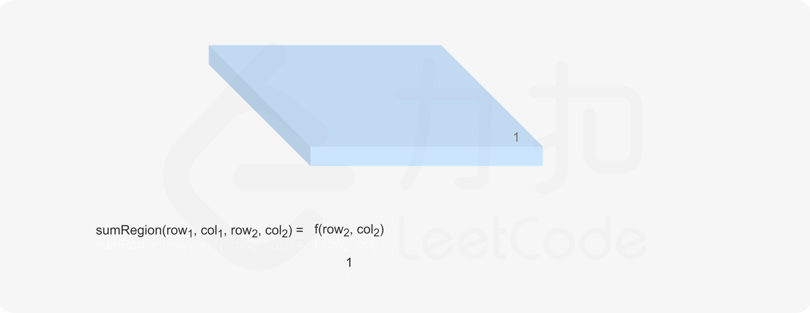
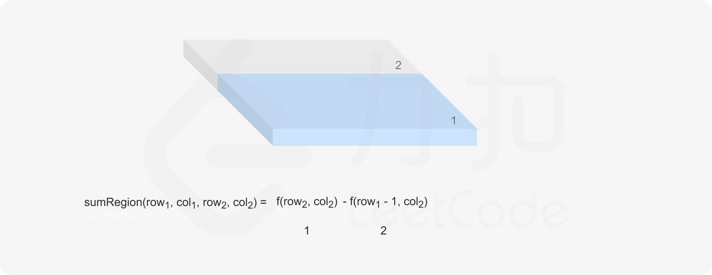
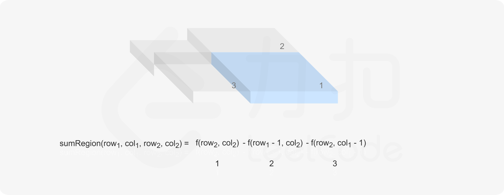
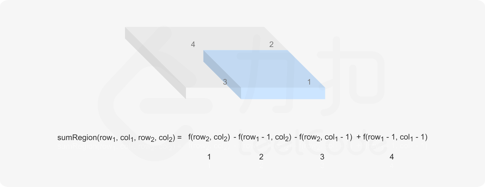

#### [前言](https://leetcode.cn/problems/range-sum-query-2d-immutable/solutions/627420/er-wei-qu-yu-he-jian-suo-ju-zhen-bu-ke-b-2z5n/)

这道题是「[303\. 区域和检索 - 数组不可变](https://leetcode-cn.com/problems/range-sum-query-immutable)」的进阶，第 303 题是在一维数组中做区域和检索，这道题是在二维矩阵中做区域和检索。

这道题有两种解法，分别是对每一行计算一维前缀和，以及对整个矩阵计算二维前缀和。

#### [方法一：一维前缀和](https://leetcode.cn/problems/range-sum-query-2d-immutable/solutions/627420/er-wei-qu-yu-he-jian-suo-ju-zhen-bu-ke-b-2z5n/)

第 303 题中，初始化时对数组计算前缀和，每次检索即可在 $O(1)$ 的时间内得到结果。可以将第 303 题的做法应用于这道题，初始化时对矩阵的每一行计算前缀和，检索时对二维区域中的每一行计算子数组和，然后对每一行的子数组和计算总和。

具体实现方面，创建 $m$ 行 $n+1$ 列的二维数组 $sums$，其中 $m$ 和 $n$ 分别是矩阵 $matrix$ 的行数和列数，$sums[i]$ 为 $matrix[i]$ 的前缀和数组。将 $sums$ 的列数设为 $n+1$ 的目的是为了方便计算每一行的子数组和，不需要对 $col_1=0$ 的情况特殊处理。

```java
class NumMatrix {
    int[][] sums;

    public NumMatrix(int[][] matrix) {
        int m = matrix.length;
        if (m > 0) {
            int n = matrix[0].length;
            sums = new int[m][n + 1];
            for (int i = 0; i < m; i++) {
                for (int j = 0; j < n; j++) {
                    sums[i][j + 1] = sums[i][j] + matrix[i][j];
                }
            }
        }
    }
    
    public int sumRegion(int row1, int col1, int row2, int col2) {
        int sum = 0;
        for (int i = row1; i <= row2; i++) {
            sum += sums[i][col2 + 1] - sums[i][col1];
        }
        return sum;
    }
}
```

```javascript
var NumMatrix = function(matrix) {
    const m = matrix.length;
    if (m > 0) {
        const n = matrix[0].length;
        this.sums = new Array(m).fill(0).map(() => new Array(n + 1).fill(0));
        for (let i = 0; i < m; i++) {
            for (let j = 0; j < n; j++) {
                this.sums[i][j + 1] = this.sums[i][j] + matrix[i][j];
            }
        }
    }
};

NumMatrix.prototype.sumRegion = function(row1, col1, row2, col2) {
    let sum = 0;
    for (let i = row1; i <= row2; i++) {
        sum += this.sums[i][col2 + 1] - this.sums[i][col1];
    }
    return sum;
};
```

```go
type NumMatrix struct {
    sums [][]int
}

func Constructor(matrix [][]int) NumMatrix {
    sums := make([][]int, len(matrix))
    for i, row := range matrix {
        sums[i] = make([]int, len(row)+1)
        for j, v := range row {
            sums[i][j+1] = sums[i][j] + v
        }
    }
    return NumMatrix{sums}
}

func (nm *NumMatrix) SumRegion(row1, col1, row2, col2 int) (sum int) {
    for i := row1; i <= row2; i++ {
        sum += nm.sums[i][col2+1] - nm.sums[i][col1]
    }
    return
}
```

```python
class NumMatrix:

    def __init__(self, matrix: List[List[int]]):
        m, n = len(matrix), (len(matrix[0]) if matrix else 0)
        self.sums = [[0] * (n + 1) for _ in range(m)]
        _sums = self.sums

        for i in range(m):
            for j in range(n):
                _sums[i][j + 1] = _sums[i][j] + matrix[i][j]

    def sumRegion(self, row1: int, col1: int, row2: int, col2: int) -> int:
        _sums = self.sums

        total = sum(_sums[i][col2 + 1] - _sums[i][col1] for i in range(row1, row2 + 1))
        return total
```

```cpp
class NumMatrix {
public:
    vector<vector<int>> sums;

    NumMatrix(vector<vector<int>>& matrix) {
        int m = matrix.size();
        if (m > 0) {
            int n = matrix[0].size();
            sums.resize(m, vector<int>(n + 1));
            for (int i = 0; i < m; i++) {
                for (int j = 0; j < n; j++) {
                    sums[i][j + 1] = sums[i][j] + matrix[i][j];
                }
            }
        }
    }

    int sumRegion(int row1, int col1, int row2, int col2) {
        int sum = 0;
        for (int i = row1; i <= row2; i++) {
            sum += sums[i][col2 + 1] - sums[i][col1];
        }
        return sum;
    }
};
```

```c
typedef struct {
    int** sums;
    int sumsSize;
} NumMatrix;

NumMatrix* numMatrixCreate(int** matrix, int matrixSize, int* matrixColSize) {
    NumMatrix* ret = malloc(sizeof(NumMatrix));
    ret->sums = malloc(sizeof(int*) * matrixSize);
    ret->sumsSize = matrixSize;
    for (int i = 0; i < matrixSize; i++) {
        ret->sums[i] = malloc(sizeof(int) * (matrixColSize[i] + 1));
        ret->sums[i][0] = 0;
        for (int j = 0; j < matrixColSize[i]; j++) {
            ret->sums[i][j + 1] = ret->sums[i][j] + matrix[i][j];
        }
    }
    return ret;
}

int numMatrixSumRegion(NumMatrix* obj, int row1, int col1, int row2, int col2) {
    int sum = 0;
    for (int i = row1; i <= row2; i++) {
        sum += obj->sums[i][col2 + 1] - obj->sums[i][col1];
    }
    return sum;
}

void numMatrixFree(NumMatrix* obj) {
    for (int i = 0; i < obj->sumsSize; i++) {
        free(obj->sums[i]);
    }
    free(obj->sums);
}
```

**复杂度分析**

-   时间复杂度：初始化 $O(mn)$，每次检索 $O(m)$，其中 $m$ 和 $n$ 分别是矩阵 $matrix$ 的行数和列数。 初始化需要遍历矩阵 $matrix$ 计算二维前缀和，时间复杂度是 $O(mn)$。 每次检索需要对二维区域中的每一行计算子数组和，二维区域的行数不超过 $m$，计算每一行的子数组和的时间复杂度是 $O(1)$，因此每次检索的时间复杂度是 $O(m)$。
-   空间复杂度：$O(mn)$，其中 $m$ 和 $n$ 分别是矩阵 $matrix$ 的行数和列数。需要创建一个 $m$ 行 $n+1$ 列的前缀和数组 $sums$。

#### [方法二：二维前缀和](https://leetcode.cn/problems/range-sum-query-2d-immutable/solutions/627420/er-wei-qu-yu-he-jian-suo-ju-zhen-bu-ke-b-2z5n/)

方法一虽然利用了前缀和，但是每次检索的时间复杂度是 $O(m)$，仍然没有降到 $O(1)$。为了将每次检索的时间复杂度降到 $O(1)$，需要使用二维前缀和，在初始化的时候计算二维前缀和数组。

假设 $m$ 和 $n$ 分别是矩阵 $matrix$ 的行数和列数。定义当 $0 \le i<m$ 且 $0 \le j<n$ 时，$f(i,j)$ 为矩阵 $matrix$ 的以 $(i,j)$ 为右下角的子矩阵的元素之和：

$$f(i,j)=\sum\limits_{p=0}^i \sum\limits_{q=0}^j matrix[p][q]$$

当 $i=0$ 或 $j=0$ 时，计算 $f(i,j)$ 只需要对矩阵 $matrix$ 的最上边的行和最左边的列分别计算前缀和即可。当 $i$ 和 $j$ 都大于 $0$ 时，如何计算 $f(i,j)$ 的值？

当 $i$ 和 $j$ 都大于 $0$ 时，假设计算 $f(i,j)$ 时已经知道了 $f(i-1,j)$、$f(i,j-1)$ 和 $f(i-1,j-1)$ 的值。为了计算 $f(i,j)$，自然而然会想到使用 $f(i-1,j)$、$f(i,j-1)$ 和 matrix[i][j]matrix[i][j]matrix[i][j] 的值。

注意到 $f(i-1,j)$ 和 $f(i,j-1)$ 这两项涉及到的矩阵 $matrix$ 的元素有重合，矩阵 $matrix$ 的以 $(i-1,j-1)$ 为右下角的子矩阵都在这两项中出现。因此如果计算 $f(i-1,j)+f(i,j-1)+matrix[i][j]$，则该结果值比 $f(i,j)$ 多了 $f(i-1,j-1)$，因此 $f(i,j)$ 的计算如下：

$$f(i,j)=f(i-1,j)+f(i,j-1)-f(i-1,j-1)+matrix[i][j]$$

具体推导如下：

$$\begin{aligned} &\quad \ f(i,j) \\ &=\sum\limits_{p=0}^{i-1} \sum\limits_{q=0}^{j-1} matrix[p][q]+\sum\limits_{p=0}^{i-1} matrix[p][j]+\sum\limits_{q=0}^{j-1} matrix[i][q]+matrix[i][j] \\ &=\Big(\sum\limits_{p=0}^{i-1} \sum\limits_{q=0}^{j-1} matrix[p][q]+\sum\limits_{p=0}^{i-1} matrix[p][j]\Big) \\ &\quad+\Big(\sum\limits_{p=0}^{i-1} \sum\limits_{q=0}^{j-1} matrix[p][q]+\sum\limits_{q=0}^{j-1} matrix[i][q]\Big) \\ &\quad-\sum\limits_{p=0}^{i-1} \sum\limits_{q=0}^{j-1} matrix[p][q] \\ &\quad+matrix[i][j] \\ &=\sum\limits_{p=0}^{i-1} \sum\limits_{q=0}^j matrix[p][q]+\sum\limits_{p=0}^i \sum\limits_{q=0}^{j-1} matrix[p][q]-\sum\limits_{p=0}^{i-1} \sum\limits_{q=0}^{j-1} matrix[p][q]+matrix[i][j] \\ &=f(i-1,j)+f(i,j-1)-f(i-1,j-1)+matrix[i][j] \end{aligned}$$

因此在初始化的时候，即可对所有 $0 \le i<m$ 和 $0 \le j<n$ 计算得到 $f(i,j)$ 的值。


检索时，应利用预处理得到的 $f$ 的值。当 $row_1=0$ 且 $col_1=0$ 时，$sumRegion(row_1,col_1,row_2,col_2)=f(row_2,col_2)$。

当 $row_1 \le row_2$ 且 $col_1 \le col_2$，$sumRegion(row_1,col_1,row_2,col_2)$ 可以写成如下形式：

$$\begin{aligned} &\quad \ sumRegion(row_1,col_1,row_2,col_2) \\ &=sumRegion(0,0,row_2,col_2) \\ &\quad-sumRegion(0,col_1,row_1-1,col_2) \\ &\quad-sumRegion(row_1,0,row_2,col_1-1) \\ &\quad-sumRegion(0,0,row_1-1,col_1-1) \\ &=sumRegion(0,0,row_2,col_2) \\ &\quad-(sumRegion(0,col_1,row_1-1,col_2)+sumRegion(0,0,row_1-1,col_1-1)) \\ &\quad-(sumRegion(row_1,0,row_2,col_1-1)+sumRegion(0,0,row_1-1,col_1-1)) \\ &\quad-sumRegion(0,0,row_1-1,col_1-1) \\ &\quad+2 \times sumRegion(row_1,0,row_2,col_1-1) \\ &=sumRegion(0,0,row_2,col_2) \\ &\quad-sumRegion(0,0,row_1-1,col_2) \\ &\quad-sumRegion(0,0,row_2,col_1-1) \\ &\quad+sumRegion(0,0,row_1-1,col_1-1) \\ &=f(row_2,col_2)-f(row_1-1,col_2)-f(row_2,col_1-1)+f(row_1-1,col_1-1) \end{aligned}$$






即可在 $O(1)$ 时间内得到 $sumRegion(row_1,col_1,row_2,col_2)$ 的值。

具体实现方面，创建 $m+1$ 行 $n+1$ 列的二维数组 $sums$，其中 $sums[i+1][j+1]$ 的值为上述 $f(i,j)$ 的值。

将 $sums$ 的行数和列数分别设为 $m+1$ 和 $n+1$ 的目的是为了方便计算 $sumRegion(row_1,col_1,row_2,col_2)$ ，不需要对 $row_1=0$ 和 $col_1=0$ 的情况特殊处理。此时有：

$$\begin{aligned} &\quad \ sumRegion(row_1,col_1,row_2,col_2) \\ &=sums[row_2+1][col_2+1]-sums[row_1][col_2+1]-sums[row_2+1][col_1]+sums[row_1][col_1] \end{aligned}$$

```java
class NumMatrix {
    int[][] sums;

    public NumMatrix(int[][] matrix) {
        int m = matrix.length;
        if (m > 0) {
            int n = matrix[0].length;
            sums = new int[m + 1][n + 1];
            for (int i = 0; i < m; i++) {
                for (int j = 0; j < n; j++) {
                    sums[i + 1][j + 1] = sums[i][j + 1] + sums[i + 1][j] - sums[i][j] + matrix[i][j];
                }
            }
        }
    }
    
    public int sumRegion(int row1, int col1, int row2, int col2) {
        return sums[row2 + 1][col2 + 1] - sums[row1][col2 + 1] - sums[row2 + 1][col1] + sums[row1][col1];
    }
}
```

```javascript
var NumMatrix = function(matrix) {
    const m = matrix.length;
    if (m > 0) {
        const n = matrix[0].length;
        this.sums = new Array(m + 1).fill(0).map(() => new Array(n + 1).fill(0));
        for (let i = 0; i < m; i++) {
            for (let j = 0; j < n; j++) {
                this.sums[i + 1][j + 1] = this.sums[i][j + 1] + this.sums[i + 1][j] - this.sums[i][j] + matrix[i][j];
            }
        }
    }
};

NumMatrix.prototype.sumRegion = function(row1, col1, row2, col2) {
    return this.sums[row2 + 1][col2 + 1] - this.sums[row1][col2 + 1] - this.sums[row2 + 1][col1] + this.sums[row1][col1];
};
```

```go
type NumMatrix struct {
    sums [][]int
}

func Constructor(matrix [][]int) NumMatrix {
    m := len(matrix)
    if m == 0 {
        return NumMatrix{}
    }
    n := len(matrix[0])
    sums := make([][]int, m+1)
    sums[0] = make([]int, n+1)
    for i, row := range matrix {
        sums[i+1] = make([]int, n+1)
        for j, v := range row {
            sums[i+1][j+1] = sums[i+1][j] + sums[i][j+1] - sums[i][j] + v
        }
    }
    return NumMatrix{sums}
}

func (nm *NumMatrix) SumRegion(row1, col1, row2, col2 int) int {
    return nm.sums[row2+1][col2+1] - nm.sums[row1][col2+1] - nm.sums[row2+1][col1] + nm.sums[row1][col1]
}
```

```python
class NumMatrix:

    def __init__(self, matrix: List[List[int]]):
        m, n = len(matrix), (len(matrix[0]) if matrix else 0)
        self.sums = [[0] * (n + 1) for _ in range(m + 1)]
        _sums = self.sums

        for i in range(m):
            for j in range(n):
                _sums[i + 1][j + 1] = _sums[i][j + 1] + _sums[i + 1][j] - _sums[i][j] + matrix[i][j]

    def sumRegion(self, row1: int, col1: int, row2: int, col2: int) -> int:
        _sums = self.sums

        return _sums[row2 + 1][col2 + 1] - _sums[row1][col2 + 1] - _sums[row2 + 1][col1] + _sums[row1][col1]
```

```cpp
class NumMatrix {
public:
    vector<vector<int>> sums;

    NumMatrix(vector<vector<int>>& matrix) {
        int m = matrix.size();
        if (m > 0) {
            int n = matrix[0].size();
            sums.resize(m + 1, vector<int>(n + 1));
            for (int i = 0; i < m; i++) {
                for (int j = 0; j < n; j++) {
                    sums[i + 1][j + 1] = sums[i][j + 1] + sums[i + 1][j] - sums[i][j] + matrix[i][j];
                }
            }
        }
    }

    int sumRegion(int row1, int col1, int row2, int col2) {
        return sums[row2 + 1][col2 + 1] - sums[row1][col2 + 1] - sums[row2 + 1][col1] + sums[row1][col1];
    }
};
```

```c
typedef struct {
    int** sums;
    int sumsSize;
} NumMatrix;

NumMatrix* numMatrixCreate(int** matrix, int matrixSize, int* matrixColSize) {
    NumMatrix* ret = malloc(sizeof(NumMatrix));
    ret->sums = malloc(sizeof(int*) * (matrixSize + 1));
    ret->sumsSize = matrixSize + 1;
    int n = matrixSize ? matrixColSize[0] : 0;
    for (int i = 0; i <= matrixSize; i++) {
        ret->sums[i] = malloc(sizeof(int) * (n + 1));
        memset(ret->sums[i], 0, sizeof(int) * (n + 1));
    }
    for (int i = 0; i < matrixSize; i++) {
        for (int j = 0; j < matrixColSize[i]; j++) {
            ret->sums[i + 1][j + 1] = ret->sums[i][j + 1] + ret->sums[i + 1][j] - ret->sums[i][j] + matrix[i][j];
        }
    }
    return ret;
}

int numMatrixSumRegion(NumMatrix* obj, int row1, int col1, int row2, int col2) {
    return obj->sums[row2 + 1][col2 + 1] - obj->sums[row1][col2 + 1] - obj->sums[row2 + 1][col1] + obj->sums[row1][col1];
}

void numMatrixFree(NumMatrix* obj) {
    for (int i = 0; i < obj->sumsSize; i++) {
        free(obj->sums[i]);
    }
    free(obj->sums);
}
```

**复杂度分析**

-   时间复杂度：初始化 $O(mn)$，每次检索 $O(1)$，其中 $m$ 和 $n$ 分别是矩阵 $matrix$ 的行数和列数。 初始化需要遍历矩阵 $matrix$ 计算二维前缀和，时间复杂度是 $O(mn)$。 每次检索的时间复杂度是 $O(1)$。
-   空间复杂度：$O(mn)$，其中 $m$ 和 $n$ 分别是矩阵 $matrix$ 的行数和列数。需要创建一个 $m+1$ 行 $n+1$ 列的二维前缀和数组 $sums$。
