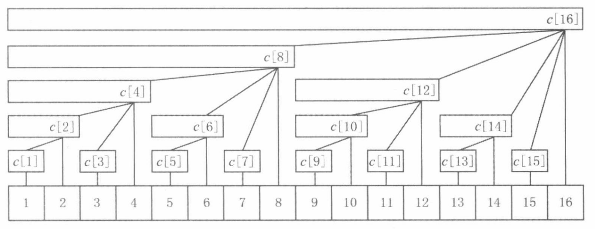

### [带你发明树状数组！附数学证明（Python/Java/C++/Go/JS/Rust）](https://leetcode.cn/problems/range-sum-query-mutable/solutions/2524481/dai-ni-fa-ming-shu-zhuang-shu-zu-fu-shu-lyfll/)



如果你之前学过树状数组，请把它忘了，我将带你重新发明树状数组。

为方便描述，下文中的下标从 $1$ 开始。

#### 一、动机

##### 询问

给你一个数组，如何快速地计算任意一段连续子数组的元素和？

对于一个子数组来说，如果遍历子数组的每个数，把它们加起来，时间复杂度是 $\mathcal{O}(n)$，太慢了。

下标从 $\textit{left}$ 到 $\textit{right}$ 的子数组元素和，可以看成是下标从 $1$ 到 $\textit{right}$ 的子数组元素和，减去下标从 $1$ 到 $\textit{left}-1$ 的子数组元素和。例如数组 $[3,1,4,1,5,9]$，子数组 $[4,1,5]$ 的元素和，等于 $[3,1,4,1,5]$ 的元素和，减去 $[3,1]$ 的元素和。

按照这个方法，算出每个前缀 $[1,i]$（表示下标从 $1$ 到 $i$ 的连续子数组）的元素和，就可以 $\mathcal{O}(1)$ 地计算**任意**连续子数组的元素和了。

##### 更新

但是，如果还可以**修改**数组中的元素呢？

比如我把下标为 $1$ 的元素修改了，由于所有前缀都包含下标 $1$，那么就需要更新所有前缀的元素和，更新操作就需要 $\mathcal{O}(n)$ 的时间，这太慢了。

能不能把前缀 $[1,i]$ 拆分成若干段连续子数组呢？

如果拆分得太细，比如拆分成 $[1,1],[2,2],[3,3],\cdots$，虽然更新是 $\mathcal{O}(1)$ 的，但计算子数组元素和还是得遍历累加，时间复杂度是 $\mathcal{O}(n)$，太慢了。

##### 平衡

上面的做法，要么询问是 $\mathcal{O}(1)$ 更新是 $\mathcal{O}(n)$，要么询问是 $\mathcal{O}(n)$ 更新是 $\mathcal{O}(1)$，时间差距悬殊。

如何「平衡」询问和更新的时间复杂度？

关键在于如何拆分子数组（区间）。

能否把任意前缀拆分成若干个**关键区间**，使得更新操作也只会更新若干个关键区间？

这样回答询问时，只需要遍历并累加若干个关键区间的元素和。更新元素时，也只需要遍历并更新若干个关键区间的元素和。

#### 二、如何拆分？

启示：如果把一个正整数 $i$ 拆分成若干个不同的 $2$ 的幂（从大到小），那么只会拆分出 $\mathcal{O}(\log i)$ 个数。前缀能否也这样拆分呢？

举个例子，$13=8+4+1$，那么前缀 $[1,13]$ 可以拆分成三个长度分别为 $8,4,1$ 的关键区间：$[1,8],[9,12],[13,13]$。

按照这个规则，来看看从 $[1,1]$ 到 $[1,8]$ 是如何拆分的：

$$\begin{aligned} &[1,1]=[1,1] &&(1=1)\\ &[1,2]=[1,2] &&(2=2)\\ &[1,3]=[1,2]+[3,3] &&(3=2+1)\\ &[1,4]=[1,4] &&(4=4)\\ &[1,5]=[1,4]+[5,5] &&(5=4+1)\\ &[1,6]=[1,4]+[5,6] &&(6=4+2)\\ &[1,7]=[1,4]+[5,6]+[7,7] &&(7=4+2+1)\\ &[1,8]=[1,8] &&(8=8) \end{aligned}$$

数一数，按照这种拆分方式，总共有多少个不同的关键区间？（提示：把注意力放在区间的右端点上。）

有 $8$ 个：$[1,1],[1,2],[3,3],[1,4],[5,5],[5,6],[7,7],[1,8]$。

一般地：

- 如果 $i$ 是 $2$ 的幂，那么 $[1,i]$ 无需拆分。
- 如果 $i$ 不是 $2$ 的幂，那么先拆分出一个最小的 $2$ 的幂，记作 $\text{lowbit}(i)$（例如 666 拆分出 $2$），得到长为 $\text{lowbit}(i)$ 的关键区间 $[i-\text{lowbit}(i)+1, i]$，问题转换成剩下的 $[1, i-\text{lowbit}(i)]$ 如何拆分，**这是一个规模更小的子问题**。

总共有 $n$ 个不同的关键区间。

**证明**：按顺序拆分前缀 $[1,1],[1,2],[1,3],\cdots,[1,n]$，每次只会恰好拆出一个**新的**关键区间 $[i-\text{lowbit}(i)+1, i]$（注意 $[1, i-\text{lowbit}(i)]$ 之前拆分过了，不会产生新的关键区间），所以一共有 $n$ 个不同的关键区间。

##### 算法

由于关键区间的右端点互不相同，我们可以把右端点为 $i$ 的关键区间的元素和保存在 $\textit{tree}[i]$ 中。

按照如下方法计算前缀 $[1,i]$ 的元素和：

1. 初始化元素和 $s=0$。
2. 每次循环，把 $\textit{tree}[i]$ 加到 $s$ 中，对应关键区间 $[i-\text{lowbit}(i)+1, i]$ 的元素和。
3. 然后更新 $i$ 为 $i-\text{lowbit}(i)$，表示接下来要拆分 $[1, i-\text{lowbit}(i)]$，获取其中关键区间的元素和。
4. 循环直到 $i=0$ 为止。
5. 返回 $s$。

由于正整数 $i$ 的二进制长度是 $\left\lfloor\log_2{i}\right\rfloor+1$，所以任意前缀至多拆分出 $\mathcal{O}(\log n)$ 个关键区间，所以上述算法的时间复杂度为 $\mathcal{O}(\log n)$。

关于 $\text{lowbit}(i)$ 的计算方法，请看 [从集合论到位运算，常见位运算技巧分类总结！](https://leetcode.cn/circle/discuss/CaOJ45/)

要计算 `sumRange(left, right)`，可以分别计算 $[1,\textit{right}+1]$ 的元素和（改成下标从 $1$ 开始），以及 $[1,\textit{left}]$ 的元素和，两者相减即为答案。

接下来，看看更新一个数组元素时，会影响到哪些关键区间。

#### 三、如何更新？

更新操作证明比较复杂，推荐结合 [视频](https://leetcode.cn/link/?target=https%3A%2F%2Fwww.bilibili.com%2Fvideo%2FBV14r421W7oR%3Ft%3D26m07s) 理解。

假设下标 $x$ 发生了更新，那么所有包含 $x$ 的关键区间都会被更新。

例如下标 $5$ 更新了，那么关键区间 $[5,5],[5,6],[1,8],[1,16]$ 都需要更新，这三个关键区间的右端点依次为 $5,6,8,16$。

如果在 $5\text{-}6,6\text{-}8,8\text{-}16$ 之间连边（其它位置也同理），我们可以得到一个什么样的结构？

如下图，这些关键区间可以形成如下树形结构（区间元素和保存在区间右端点处）。


注意到：

$$\begin{aligned} &5+\text{lowbit}(5)=5+1=6\\ &6+\text{lowbit}(6)=6+2=8\\ &8+\text{lowbit}(8)=8+8=16\\ \end{aligned}$$

**猜想**：如果 $x$ 是一个被更新的关键区间的右端点，那么**下一个**被更新的关键区间的右端点为 $x+\text{lowbit}(x)$。

我们需要证明两点：

1. 右端点为 $x$ 的关键区间，被右端点为 $x+\text{lowbit}(x)$ 的关键区间**包含**。
2. 右端点在 $[x+1, x+\text{lowbit}(x)-1]$ 内的关键区间，与右端点为 $x$ 的关键区间**没有任何交集**。

##### 1 的证明

设 $y = x+\text{lowbit}(x)$，由于 $y>x$，我们只需要证明这两个关键区间的**左端点**满足

$$y-\text{lowbit}(y)+1\le x-\text{lowbit}(x)+1$$

即

$$y-\text{lowbit}(y)\le x-\text{lowbit}(x)$$

就能证明包含关系。

设 $\text{lowbit}(x) = 2^k$，那么 $x= m\cdot 2^{k+1} + 2^k$，这里 $m$ 是一个非负整数。

所以不等式右边为

$$x-\text{lowbit}(x) = m\cdot 2^{k+1}$$

由于 $y=x+\text{lowbit}(x)=(m+1)\cdot 2^{k+1}$，得到 $\text{lowbit}(y)\ge 2^{k+1}$，

所以不等式左边为

$$y-\text{lowbit}(y) \le m\cdot 2^{k+1}$$

综上所述

$$y-\text{lowbit}(y)\le m\cdot 2^{k+1} = x-\text{lowbit}(x)$$

这说明包含关系是成立的。

##### 2 的证明

设 $y = x+b$，其中 $1\le b < 2^k$（$k$ 的定义同上）。

右端点为 $y$ 的关键区间，左端点为 $y-\text{lowbit}(y)+1$。我们只需要证明

$$y-\text{lowbit}(y)+1 > x$$

就能证明右端点为 $y$ 的关键区间，一定在右端点为 $x$ 的关键区间的右侧，它们是没有任何交集的。

由于 $y=x+b = m\cdot 2^{k+1} + 2^k + b$ 且 $b < 2^k$，所以

$$\text{lowbit}(y) = \text{lowbit}(b)$$

又由于

$$b - \text{lowbit}(b) \ge 0$$

所以

$$\begin{aligned} &y-\text{lowbit}(y)+1\\ =\ &(x+b)-\text{lowbit}(b)+1\\ =\ &x+(b-\text{lowbit}(b))+1\\ \ge\ &x+1\\ >\ &x \end{aligned}$$

证毕。

以上两点成立，就可以保证 $x+\text{lowbit}(x)$ 是「下一个」被更新的关键区间的右端点了。

由于任意相邻被更新的关键区间之间，没有其余关键区间包含 $x$，所以我们可以找到**所有**包含 $x$ 的关键区间，具体做法如下。

##### 算法

对于 `update(index, val)`，算法如下：

1. 设 $\textit{delta}=\textit{val}-\textit{nums}[\textit{index}]$，相当于把 $\textit{index}$ 的元素增加了这么多。然后把 $\textit{nums}[\textit{index}]$ 更新成 $\textit{val}$。
2. 初始化 $i=\textit{index} + 1$（注意下标从 $1$ 开始），这是第一个被更新的关键区间的右端点。
3. 不断循环直到 $i > n$，这里 $n$ 是 $\textit{nums}$ 的长度。
4. 每次循环，把 $\textit{tree}[i]$ 增加 $\textit{delta}$。
5. 然后更新 $i$ 为 $i+\text{lowbit}(i)$，即下一个被更新的关键区间的右端点。

##### 复杂度分析

在「1 的证明」中我们得到

$$\text{lowbit}(y)\ge 2^{k+1} > 2^{k} = \text{lowbit}(x)$$

这说明随着 $i$ 的不断更新，lowbit(i)=2k\text{lowbit}(i)=2^klowbit(i)\=2k 是不断增大的，那么 $k$ 也在不断增大。由于至多有 $\mathcal{O}(\log n)$ 个不同的 $k$，所以上述算法的时间复杂度为 $\mathcal{O}(\log n)$。

至此，通过巧妙地拆分前缀，我们做到了询问和更新都是 $\mathcal{O}(\log n)$ 的时间！

#### 四、如何初始化？

##### $O(nlogn)$ 写法

最后剩下的问题是，如何根据 $\textit{nums}$ 初始化，也就是把每个关键区间的元素和 $\textit{tree}[i]$ 算出来。

最简单的做法是，把 $\textit{tree}[i]$ 初始化成 $0$，然后对每个 $\textit{nums}[i]$，调用一次 `update(i, nums[i])`。具体细节见代码。

```Python
class NumArray:
    __slots__ = 'nums', 'tree'

    def __init__(self, nums: List[int]):
        n = len(nums)
        self.nums = [0] * n  # 使 update 中算出的 delta = nums[i]
        self.tree = [0] * (n + 1)
        for i, x in enumerate(nums):
            self.update(i, x)

    def update(self, index: int, val: int) -> None:
        delta = val - self.nums[index]
        self.nums[index] = val
        i = index + 1
        while i < len(self.tree):
            self.tree[i] += delta
            i += i & -i

    def prefixSum(self, i: int) -> int:
        s = 0
        while i:
            s += self.tree[i]
            i &= i - 1  # i -= i & -i 的另一种写法
        return s

    def sumRange(self, left: int, right: int) -> int:
        return self.prefixSum(right + 1) - self.prefixSum(left)
```

```Java
public class NumArray {
    private int[] nums;
    private int[] tree;

    public NumArray(int[] nums) {
        int n = nums.length;
        this.nums = new int[n]; // 使 update 中算出的 delta = nums[i]
        tree = new int[n + 1];
        for (int i = 0; i < n; i++) {
            update(i, nums[i]);
        }
    }

    public void update(int index, int val) {
        int delta = val - nums[index];
        nums[index] = val;
        for (int i = index + 1; i < tree.length; i += i & -i) {
            tree[i] += delta;
        }
    }

    private int prefixSum(int i) {
        int s = 0;
        for (; i > 0; i &= i - 1) { // i -= i & -i 的另一种写法
            s += tree[i];
        }
        return s;
    }

    public int sumRange(int left, int right) {
        return prefixSum(right + 1) - prefixSum(left);
    }
}
```

```C++
class NumArray {
private:
    vector<int> nums;
    vector<int> tree;

    int prefixSum(int i) {
        int s = 0;
        for (; i > 0; i &= i - 1) { // i -= i & -i 的另一种写法
            s += tree[i];
        }
        return s;
    }

public:
    NumArray(vector<int> &nums) : nums(nums.size()), tree(nums.size() + 1) {
        for (int i = 0; i < nums.size(); i++) {
            update(i, nums[i]);
        }
    }

    void update(int index, int val) {
        int delta = val - nums[index];
        nums[index] = val;
        for (int i = index + 1; i < tree.size(); i += i & -i) {
            tree[i] += delta;
        }
    }

    int sumRange(int left, int right) {
        return prefixSum(right + 1) - prefixSum(left);
    }
};
```

```Go
type NumArray struct {
    nums []int
    tree []int
}

func Constructor(nums []int) NumArray {
    a := NumArray{make([]int, len(nums)), make([]int, len(nums)+1)}
    for i, x := range nums {
        a.Update(i, x)
    }
    return a
}

func (a *NumArray) Update(index, val int) {
    delta := val - a.nums[index]
    a.nums[index] = val
    for i := index + 1; i < len(a.tree); i += i & -i {
        a.tree[i] += delta
    }
}

func (a *NumArray) prefixSum(i int) (s int) {
    for ; i > 0; i &= i - 1 { // i -= i & -i 的另一种写法
        s += a.tree[i]
    }
    return
}

func (a *NumArray) SumRange(left, right int) int {
    return a.prefixSum(right+1) - a.prefixSum(left)
}
```

```JavaScript
class NumArray {
    constructor(nums) {
        const n = nums.length;
        this.nums = Array(n).fill(0); // 使 update 中算出的 delta = nums[i]
        this.tree = Array(n + 1).fill(0);
        for (let i = 0; i < n; i++) {
            this.update(i, nums[i]);
        }
    }

    update(index, val) {
        const delta = val - this.nums[index];
        this.nums[index] = val;
        for (let i = index + 1; i < this.tree.length; i += i & -i) {
            this.tree[i] += delta;
        }
    }

    prefixSum(i) {
        let s = 0;
        for (; i > 0; i &= i - 1) { // i -= i & -i 的另一种写法
            s += this.tree[i];
        }
        return s;
    }

    sumRange(left, right) {
        return this.prefixSum(right + 1) - this.prefixSum(left);
    }
}
```

```Rust
struct NumArray {
    nums: Vec<i32>,
    tree: Vec<i32>,
}

impl NumArray {
    fn new(nums: Vec<i32>) -> Self {
        let mut na = Self { nums: vec![0; nums.len()], tree: vec![0; nums.len() + 1] };
        for (i, &x) in nums.iter().enumerate() {
            na.update(i as i32, x);
        }
        na
    }

    fn update(&mut self, index: i32, val: i32) {
        let index = index as usize;
        let delta = val - self.nums[index];
        self.nums[index] = val;
        let mut i = index + 1;
        while i < self.tree.len() {
            self.tree[i] += delta;
            i += (i as i32 & -(i as i32)) as usize;
        }
    }

    fn prefix_sum(&self, i: i32) -> i32 {
        let mut s = 0;
        let mut i = i as usize;
        while i > 0 {
            s += self.tree[i];
            i &= i - 1; // i -= i & -i 的另一种写法
        }
        s
    }

    fn sum_range(&self, left: i32, right: i32) -> i32 {
        self.prefix_sum(right + 1) - self.prefix_sum(left)
    }
}
```

#### O(n) 写法

其实可以把这些 `update` 操作合并到一起。从 $1$ 开始枚举 $i$，把 $\textit{nums}[i-1]$ 加到 $\textit{tree}[i]$ 后，$\textit{tree}[i]$ 就算好了，直接把 $\textit{tree}[i]$ 加到下一个关键区间的元素和中，也就是加到 $\textit{tree}[i+\text{lowbit}(i)]$ 中。下下一个关键区间的元素和由 $\textit{tree}[i+\text{lowbit}(i)]$ 来更新，我们只需要继续往后枚举 $i$ 就行。

> 注：类似动态规划的「刷表法」。

```Python
class NumArray:
    __slots__ = 'nums', 'tree'

    def __init__(self, nums: List[int]):
        n = len(nums)
        tree = [0] * (n + 1)
        for i, x in enumerate(nums, 1):  # i 从 1 开始
            tree[i] += x
            nxt = i + (i & -i)  # 下一个关键区间的右端点
            if nxt <= n:
                tree[nxt] += tree[i]
        self.nums = nums
        self.tree = tree

    def update(self, index: int, val: int) -> None:
        delta = val - self.nums[index]
        self.nums[index] = val
        i = index + 1
        while i < len(self.tree):
            self.tree[i] += delta
            i += i & -i

    def prefixSum(self, i: int) -> int:
        s = 0
        while i:
            s += self.tree[i]
            i &= i - 1  # i -= i & -i 的另一种写法
        return s

    def sumRange(self, left: int, right: int) -> int:
        return self.prefixSum(right + 1) - self.prefixSum(left)
```

```Java
// 多次提交，最好成绩 70ms（击败 100%）
public class NumArray {
    private int[] nums;
    private int[] tree;

    public NumArray(int[] nums) {
        int n = nums.length;
        this.nums = nums;
        tree = new int[n + 1];
        for (int i = 1; i <= n; i++) {
            tree[i] += nums[i - 1];
            int nxt = i + (i & -i); // 下一个关键区间的右端点
            if (nxt <= n) {
                tree[nxt] += tree[i];
            }
        }
    }

    public void update(int index, int val) {
        int delta = val - nums[index];
        nums[index] = val;
        for (int i = index + 1; i < tree.length; i += i & -i) {
            tree[i] += delta;
        }
    }

    private int prefixSum(int i) {
        int s = 0;
        for (; i > 0; i &= i - 1) { // i -= i & -i 的另一种写法
            s += tree[i];
        }
        return s;
    }

    public int sumRange(int left, int right) {
        return prefixSum(right + 1) - prefixSum(left);
    }
}
```

```C++
class NumArray {
private:
    vector<int> nums;
    vector<int> tree;

    int prefixSum(int i) {
        int s = 0;
        for (; i > 0; i &= i - 1) { // i -= i & -i 的另一种写法
            s += tree[i];
        }
        return s;
    }

public:
    NumArray(vector<int> &nums) : nums(nums), tree(nums.size() + 1) {
        for (int i = 1; i <= nums.size(); i++) {
            tree[i] += nums[i - 1];
            int nxt = i + (i & -i); // 下一个关键区间的右端点
            if (nxt <= nums.size()) {
                tree[nxt] += tree[i];
            }
        }
    }

    void update(int index, int val) {
        int delta = val - nums[index];
        nums[index] = val;
        for (int i = index + 1; i < tree.size(); i += i & -i) {
            tree[i] += delta;
        }
    }

    int sumRange(int left, int right) {
        return prefixSum(right + 1) - prefixSum(left);
    }
};
```

```Go
type NumArray struct {
    nums []int
    tree []int
}

func Constructor(nums []int) NumArray {
    tree := make([]int, len(nums)+1)
    for i, x := range nums {
        i++
        tree[i] += x
        if nxt := i + i&-i; nxt < len(tree) {
            tree[nxt] += tree[i]
        }
    }
    return NumArray{nums, tree}
}

func (a *NumArray) Update(index, val int) {
    delta := val - a.nums[index]
    a.nums[index] = val
    for i := index + 1; i < len(a.tree); i += i & -i {
        a.tree[i] += delta
    }
}

func (a *NumArray) prefixSum(i int) (s int) {
    for ; i > 0; i &= i - 1 { // i -= i & -i 的另一种写法
        s += a.tree[i]
    }
    return
}

func (a *NumArray) SumRange(left, right int) int {
    return a.prefixSum(right+1) - a.prefixSum(left)
}
```

```JavaScript
class NumArray {
    constructor(nums) {
        this.nums = nums;
        this.tree = Array(nums.length + 1).fill(0);
        for (let i = 1; i <= nums.length; i++) {
            this.tree[i] += nums[i - 1];
            const nxt = i + (i & -i); // 下一个关键区间的右端点
            if (nxt <= nums.length) {
                this.tree[nxt] += this.tree[i];
            }
        }
    }

    update(index, val) {
        const delta = val - this.nums[index];
        this.nums[index] = val;
        for (let i = index + 1; i < this.tree.length; i += i & -i) {
            this.tree[i] += delta;
        }
    }

    prefixSum(i) {
        let s = 0;
        for (; i > 0; i &= i - 1) { // i -= i & -i 的另一种写法
            s += this.tree[i];
        }
        return s;
    }

    sumRange(left, right) {
        return this.prefixSum(right + 1) - this.prefixSum(left);
    }
}
```

```Rust
struct NumArray {
    nums: Vec<i32>,
    tree: Vec<i32>,
}

impl NumArray {
    fn new(nums: Vec<i32>) -> Self {
        let mut tree = vec![0; nums.len() + 1];
        for (i, &x) in nums.iter().enumerate() {
            let j = i + 1;
            tree[j] += x;
            let nxt = j + (j as i32 & -(j as i32)) as usize; // 下一个关键区间的右端点
            if nxt <= nums.len() {
                tree[nxt] += tree[j];
            }
        }
        Self { nums, tree }
    }

    fn update(&mut self, index: i32, val: i32) {
        let index = index as usize;
        let delta = val - self.nums[index];
        self.nums[index] = val;
        let mut i = index + 1;
        while i < self.tree.len() {
            self.tree[i] += delta;
            i += (i as i32 & -(i as i32)) as usize;
        }
    }

    fn prefix_sum(&self, i: i32) -> i32 {
        let mut s = 0;
        let mut i = i as usize;
        while i > 0 {
            s += self.tree[i];
            i &= i - 1; // i -= i & -i 的另一种写法
        }
        s
    }

    fn sum_range(&self, left: i32, right: i32) -> i32 {
        self.prefix_sum(right + 1) - self.prefix_sum(left)
    }
}
```

##### 复杂度分析

- 时间复杂度：初始化为 $\mathcal{O}(n)$，更新和查询均为 $\mathcal{O}(\log n)$，其中 $n$ 为 $\textit{nums}$ 的长度。具体分析已在上文中解释了。
- 空间复杂度：$\mathcal{O}(n)$。

## 练习

见 [数据结构题单](https://leetcode.cn/circle/discuss/mOr1u6/) 中的「树状数组」。

#### 分类题单

以下题单没有特定的顺序，可以按照个人喜好刷题。

1. [滑动窗口（定长/不定长/多指针）](https://leetcode.cn/circle/discuss/0viNMK/)
2. [二分算法（二分答案/最小化最大值/最大化最小值/第K小）](https://leetcode.cn/circle/discuss/SqopEo/)
3. [单调栈（基础/矩形面积/贡献法/最小字典序）](https://leetcode.cn/circle/discuss/9oZFK9/)
4. [网格图（DFS/BFS/综合应用）](https://leetcode.cn/circle/discuss/YiXPXW/)
5. [位运算（基础/性质/拆位/试填/恒等式/贪心/脑筋急转弯）](https://leetcode.cn/circle/discuss/dHn9Vk/)
6. [图论算法（DFS/BFS/拓扑排序/最短路/最小生成树/二分图/基环树/欧拉路径）](https://leetcode.cn/circle/discuss/01LUak/)
7. [动态规划（入门/背包/状态机/划分/区间/状压/数位/数据结构优化/树形/博弈/概率期望）](https://leetcode.cn/circle/discuss/tXLS3i/)
8. [常用数据结构（前缀和/差分/栈/队列/堆/字典树/并查集/树状数组/线段树）](https://leetcode.cn/circle/discuss/mOr1u6/)
9. [数学算法（数论/组合/概率期望/博弈/计算几何/随机算法）](https://leetcode.cn/circle/discuss/IYT3ss/)
