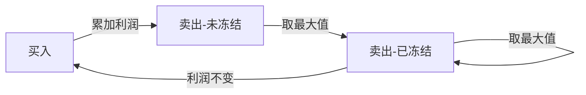

### DP + 状态机

**状态转义方程有错误，以后再好好想想。**

每一天有3种选择：**买入**、**卖出**、**冻结**，也有3种状态：**买入**、**卖出-未冻结**、**卖出-已冻结**。

由贪心思想可知，卖出后的第2天冻结，一定是最优选择，证明略。

所以，**买入**状态可以由**卖出-已冻结**状态转换过来，**卖出-未冻结**状态可由**买入**状态转换过来，**卖出-已冻结**状态可由**卖出-已冻结**和**卖出-未冻结**两种状态转换过来。

每天的状态需要记录两个值：`(已获得的利润, 买入状态的成本)`
初始化：

#### 示例

`prices = [1,2,3,0,2]`

| state | init | 1 | 2 | 3 | 0 | 2 |
| :-: | :-: | :-: | :-: | :-: | :-: | :-: |
| **买入**       | `(0,1)` | `(0,1)` | `(0,2)` | `(0,3)` | `(1,0)` | `()` |
| **卖出-未冻结** | `(0,-)` | `(0,-)` | `(1,-)` | `(1,-)` | `(,-)` | `(,-)` |
| **卖出-已冻结** | `(0,-)` | `(0,-)` | `(0,-)` | `(1,-)` | `(,-)` | `(,-)` |
