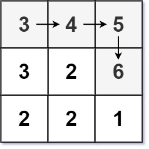

### [329\. 矩阵中的最长递增路径](https://leetcode.cn/problems/longest-increasing-path-in-a-matrix/)

难度：困难

给定一个 <code>m &times; n</code> 整数矩阵 `matrix`，找出其中 **最长递增路径** 的长度。

对于每个单元格，你可以往上，下，左，右四个方向移动。你 **不能** 在 **对角线** 方向上移动或移动到 **边界外**（即不允许环绕）。

**示例 1：**

> 
>
> **输入：** matrix = \[[9,9,4],[6,6,8],[2,1,1]]
> **输出：** 4
> **解释：** 最长递增路径为 `[1, 2, 6, 9]`。

**示例 2：**

> 
>
> **输入：** matrix = \[[3,4,5],[3,2,6],[2,2,1]]
> **输出：** 4
> **解释：** 最长递增路径是 `[3, 4, 5, 6]`。注意不允许在对角线方向上移动。

**示例 3：**

> **输入：** matrix = \[[1]]
> **输出：** 1

**提示：**

- `m == matrix.length`
- `n == matrix[i].length`
- `1 <= m, n <= 200`
- <code>0 <= matrix[i][j] <= 231 - 1</code>
