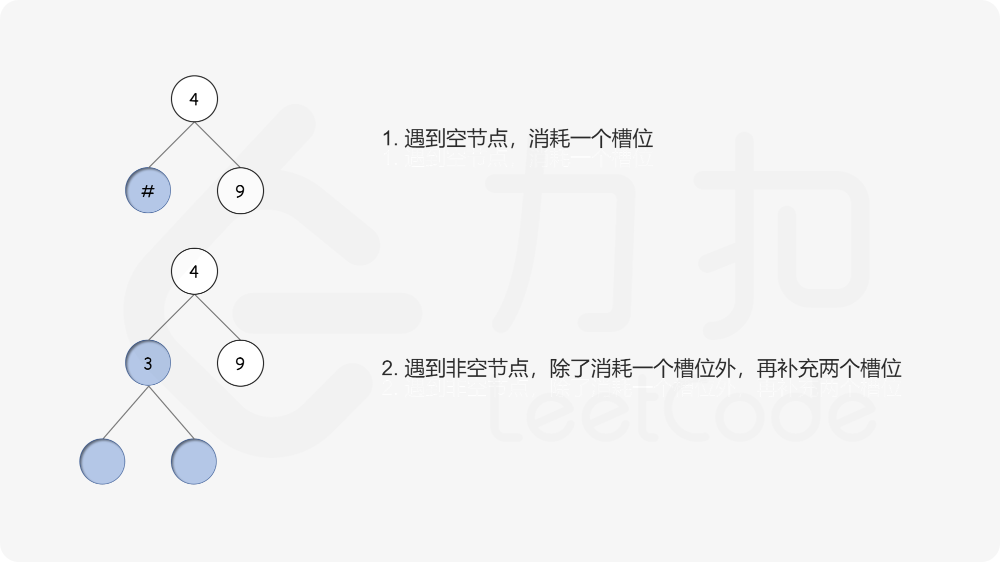

### [验证二叉树的前序序列化](https://leetcode.cn/problems/verify-preorder-serialization-of-a-binary-tree/solutions/650583/yan-zheng-er-cha-shu-de-qian-xu-xu-lie-h-jghn/)

#### 方法一：栈

我们可以定义一个概念，叫做槽位。一个槽位可以被看作「当前二叉树中正在等待被节点填充」的那些位置。

二叉树的建立也伴随着槽位数量的变化。每当遇到一个节点时：

- 如果遇到了空节点，则要消耗一个槽位；
- 如果遇到了非空节点，则除了消耗一个槽位外，还要再补充两个槽位。

此外，还需要将根节点作为特殊情况处理。



我们使用栈来维护槽位的变化。栈中的每个元素，代表了对应节点处**剩余槽位的数量**，而栈顶元素就对应着下一步可用的槽位数量。当遇到空节点时，仅将栈顶元素减 $1$；当遇到非空节点时，将栈顶元素减 $1$ 后，再向栈中压入一个 $2$。无论何时，如果栈顶元素变为 $0$，就立刻将栈顶弹出。

遍历结束后，若栈为空，说明没有待填充的槽位，因此是一个合法序列；否则若栈不为空，则序列不合法。此外，在遍历的过程中，若槽位数量不足，则序列不合法。


##### 代码

```c++
class Solution {
public:
    bool isValidSerialization(string preorder) {
        int n = preorder.length();
        int i = 0;
        stack<int> stk;
        stk.push(1);
        while (i < n) {
            if (stk.empty()) {
                return false;
            }
            if (preorder[i] == ',') {
                i++;
            } else if (preorder[i] == '#'){
                stk.top() -= 1;
                if (stk.top() == 0) {
                    stk.pop();
                }
                i++;
            } else {
                // 读一个数字
                while (i < n && preorder[i] != ',') {
                    i++;
                }
                stk.top() -= 1;
                if (stk.top() == 0) {
                    stk.pop();
                }
                stk.push(2);
            }
        }
        return stk.empty();
    }
};
```

```java
class Solution {
    public boolean isValidSerialization(String preorder) {
        int n = preorder.length();
        int i = 0;
        Deque<Integer> stack = new LinkedList<Integer>();
        stack.push(1);
        while (i < n) {
            if (stack.isEmpty()) {
                return false;
            }
            if (preorder.charAt(i) == ',') {
                i++;
            } else if (preorder.charAt(i) == '#'){
                int top = stack.pop() - 1;
                if (top > 0) {
                    stack.push(top);
                }
                i++;
            } else {
                // 读一个数字
                while (i < n && preorder.charAt(i) != ',') {
                    i++;
                }
                int top = stack.pop() - 1;
                if (top > 0) {
                    stack.push(top);
                }
                stack.push(2);
            }
        }
        return stack.isEmpty();
    }
}
```

```javascript
var isValidSerialization = function(preorder) {
    const n = preorder.length;
    let i = 0;
    const stack = [1];
    while (i < n) {
        if (!stack.length) {
            return false;
        }
        if (preorder[i] === ',') {
            ++i;
        } else if (preorder[i] === '#') {
            stack[stack.length - 1]--;
            if (stack[stack.length - 1] === 0) {
                stack.pop();
            } 
            ++i;
        } else {
            // 读一个数字
            while (i < n && preorder[i] !== ',') {
                ++i;
            }
            stack[stack.length - 1]--;
            if (stack[stack.length - 1] === 0) {
                stack.pop();
            }
            stack.push(2);
        }
    }
    return stack.length === 0;
};
```

```go
func isValidSerialization(preorder string) bool {
    n := len(preorder)
    stk := []int{1}
    for i := 0; i < n; {
        if len(stk) == 0 {
            return false
        }
        if preorder[i] == ',' {
            i++
        } else if preorder[i] == '#' {
            stk[len(stk)-1]--
            if stk[len(stk)-1] == 0 {
                stk = stk[:len(stk)-1]
            }
            i++
        } else {
            // 读一个数字
            for i < n && preorder[i] != ',' {
                i++
            }
            stk[len(stk)-1]--
            if stk[len(stk)-1] == 0 {
                stk = stk[:len(stk)-1]
            }
            stk = append(stk, 2)
        }
    }
    return len(stk) == 0
}
```

```c
bool isValidSerialization(char* preorder) {
    int n = strlen(preorder);
    int stk[n], top = 0;
    int i = 0;
    stk[top++] = 1;
    while (i < n) {
        if (!top) {
            return false;
        }
        if (preorder[i] == ',') {
            i++;
        } else if (preorder[i] == '#') {
            stk[top - 1] -= 1;
            if (stk[top - 1] == 0) {
                top--;
            }
            i++;
        } else {
            // 读一个数字
            while (i < n && preorder[i] != ',') {
                i++;
            }
            stk[top - 1] -= 1;
            if (stk[top - 1] == 0) {
                top--;
            }
            stk[top++] = 2;
        }
    }
    return !top;
}
```

##### 复杂度分析

- 时间复杂度：$O(n)$，其中 $n$ 为字符串的长度。我们每个字符只遍历一次，同时每个字符对应的操作都是常数时间的。
- 空间复杂度：$O(n)$。此为栈所需要使用的空间。

#### 方法二：计数

能否将方法一的空间复杂度优化至 $O(1)$ 呢？

回顾方法一的逻辑，如果把栈中元素看成一个整体，即所有剩余槽位的数量，也能维护槽位的变化。

因此，我们可以只维护一个计数器，代表栈中所有元素之和，其余的操作逻辑均可以保持不变。

##### 代码

```c++
class Solution {
public:
    bool isValidSerialization(string preorder) {
        int n = preorder.length();
        int i = 0;
        int slots = 1;
        while (i < n) {
            if (slots == 0) {
                return false;
            }
            if (preorder[i] == ',') {
                i++;
            } else if (preorder[i] == '#'){
                slots--;
                i++;
            } else {
                // 读一个数字
                while (i < n && preorder[i] != ',') {
                    i++;
                }
                slots++; // slots = slots - 1 + 2
            }
        }
        return slots == 0;
    }
};
```

```java
class Solution {
    public boolean isValidSerialization(String preorder) {
        int n = preorder.length();
        int i = 0;
        int slots = 1;
        while (i < n) {
            if (slots == 0) {
                return false;
            }
            if (preorder.charAt(i) == ',') {
                i++;
            } else if (preorder.charAt(i) == '#'){
                slots--;
                i++;
            } else {
                // 读一个数字
                while (i < n && preorder.charAt(i) != ',') {
                    i++;
                }
                slots++; // slots = slots - 1 + 2
            }
        }
        return slots == 0;
    }
}
```

```javascript
var isValidSerialization = function(preorder) {
    const n = preorder.length;
    let i = 0;
    let slots = 1;
    while (i < n) {
        if (slots === 0) {
            return false;
        }
        if (preorder[i] === ',') {
            ++i;
        } else if (preorder[i] === '#') {
            --slots;
            ++i;
        } else {
            // 读一个数字
            while (i < n && preorder[i] !== ',') {
                ++i;
            }
            ++slots; // slots = slots - 1 + 2
        }
    }
    return slots === 0;
};
```

```go
func isValidSerialization(preorder string) bool {
    n := len(preorder)
    slots := 1
    for i := 0; i < n; {
        if slots == 0 {
            return false
        }
        if preorder[i] == ',' {
            i++
        } else if preorder[i] == '#' {
            slots--
            i++
        } else {
            // 读一个数字
            for i < n && preorder[i] != ',' {
                i++
            }
            slots++ // slots = slots - 1 + 2
        }
    }
    return slots == 0
}
```

```c
bool isValidSerialization(char* preorder) {
    int n = strlen(preorder);
    int i = 0;
    int slots = 1;
    while (i < n) {
        if (!slots) {
            return false;
        }
        if (preorder[i] == ',') {
            i++;
        } else if (preorder[i] == '#') {
            slots--;
            i++;
        } else {
            // 读一个数字
            while (i < n && preorder[i] != ',') {
                i++;
            }
            slots++;  // slots = slots - 1 + 2
        }
    }
    return !slots;
}
```

##### 复杂度分析

- 时间复杂度：$O(n)$，其中 $n$ 为字符串的长度。我们每个字符只遍历一次，同时每个字符对应的操作都是常数时间的。
- 空间复杂度：$O(1)$。
