### [分割等和子集](https://leetcode.cn/problems/partition-equal-subset-sum/solutions/442320/fen-ge-deng-he-zi-ji-by-leetcode-solution/)

#### 前言

**作者在这里希望读者认真阅读前言部分。**

本题是经典的「[NP 完全问题](https://leetcode.cn/link/?target=https%3A%2F%2Fbaike.baidu.com%2Fitem%2FNP%E5%AE%8C%E5%85%A8%E9%97%AE%E9%A2%98)」，也就是说，如果你发现了该问题的一个[多项式算法](https://leetcode.cn/link/?target=https%3A%2F%2Fbaike.baidu.com%2Fitem%2F%E5%A4%9A%E9%A1%B9%E5%BC%8F%E7%AE%97%E6%B3%95)，那么恭喜你证明出了 $P=NP$，可以期待一下图灵奖了。

正因如此，我们不应期望该问题有多项式时间复杂度的解法。我们能想到的，例如基于贪心算法的「将数组降序排序后，依次将每个元素添加至当前元素和较小的子集中」之类的方法都是错误的，可以轻松地举出反例。因此，我们必须尝试非多项式时间复杂度的算法，例如时间复杂度与元素大小相关的**动态规划**。

#### 方法一：动态规划

**思路与算法**

这道题可以换一种表述：给定一个只包含正整数的非空数组 $nums[0]$，判断是否可以从数组中选出一些数字，使得这些数字的和等于整个数组的元素和的一半。因此这个问题可以转换成「0-1 背包问题」。这道题与传统的「0-1 背包问题」的区别在于，传统的「0-1 背包问题」要求选取的物品的重量之和**不能超过**背包的总容量，这道题则要求选取的数字的和**恰好等于**整个数组的元素和的一半。类似于传统的「0-1 背包问题」，可以使用动态规划求解。

在使用动态规划求解之前，首先需要进行以下判断。

- 根据数组的长度 $n$ 判断数组是否可以被划分。如果 $n<2$，则不可能将数组分割成元素和相等的两个子集，因此直接返回 $false$。
- 计算整个数组的元素和 $sum$ 以及最大元素 $maxNum$。如果 $sum$ 是奇数，则不可能将数组分割成元素和相等的两个子集，因此直接返回 $false$。如果 $sum$ 是偶数，则令 $target=\dfrac{sum}{2}$​，需要判断是否可以从数组中选出一些数字，使得这些数字的和等于 $target$。如果 $maxNum>target$，则除了 $maxNum$ 以外的所有元素之和一定小于 $target$，因此不可能将数组分割成元素和相等的两个子集，直接返回 $false$。

创建二维数组 $dp$，包含 $n$ 行 $target+1$ 列，其中 $dp[i][j]$ 表示从数组的 $[0,i]$ 下标范围内选取若干个正整数（可以是 $0$ 个），是否存在一种选取方案使得被选取的正整数的和等于 $j$。初始时，$dp$ 中的全部元素都是 $false$。

在定义状态之后，需要考虑边界情况。以下两种情况都属于边界情况。

- 如果不选取任何正整数，则被选取的正整数之和等于 $0$。因此对于所有 $0 \le i<n$，都有 $dp[i][0]=true$。
- 当 $i==0$ 时，只有一个正整数 $nums[0]$ 可以被选取，因此 $dp[0][nums[0]]=true$。

对于 $i>0$ 且 $j>0$ 的情况，如何确定 $dp[i][j]$ 的值？需要分别考虑以下两种情况。

- 如果 $j \ge nums[i]$，则对于当前的数字 $nums[i]$，可以选取也可以不选取，两种情况只要有一个为 $true$，就有 $dp[i][j]=true$。
    - 如果不选取 $nums[i]$，则 $dp[i][j]=dp[i-1][j]$；
    - 如果选取 $nums[i]$，则 $dp[i][j]=dp[i-1][j-nums[i]]$。
- 如果 $j<nums[i]$，则在选取的数字的和等于 $j$ 的情况下无法选取当前的数字 $nums[i]$，因此有 $dp[i][j]=dp[i-1][j]$。

状态转移方程如下：

$$dp[i][j]=\begin{cases}dp[i-1][j] \vert dp[i-1][j-nums[i]], & j \ge nums[i] \\ dp[i-1][j],​ & j<nums[i]​\end{cases}$$

最终得到 $dp[n-1][target]$ 即为答案。

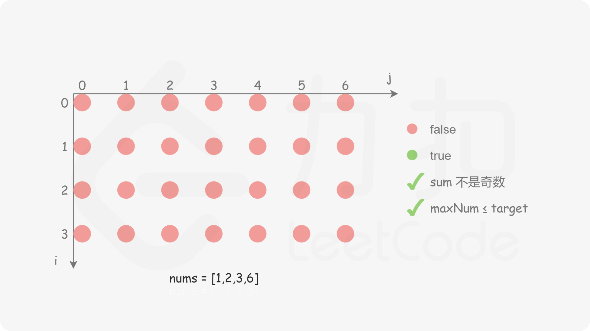
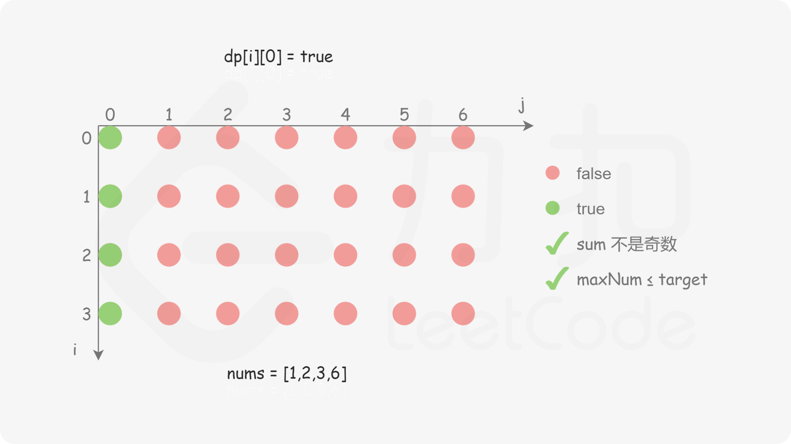
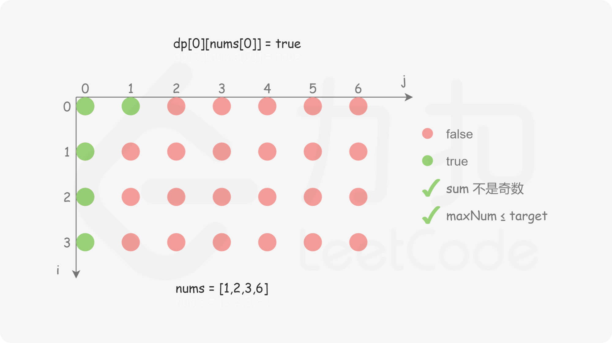
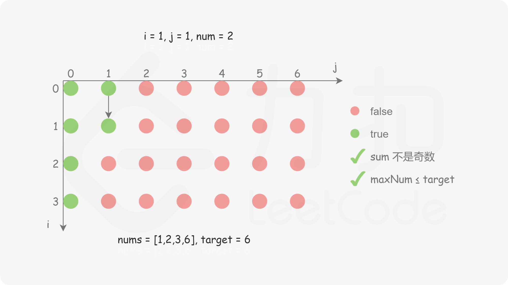
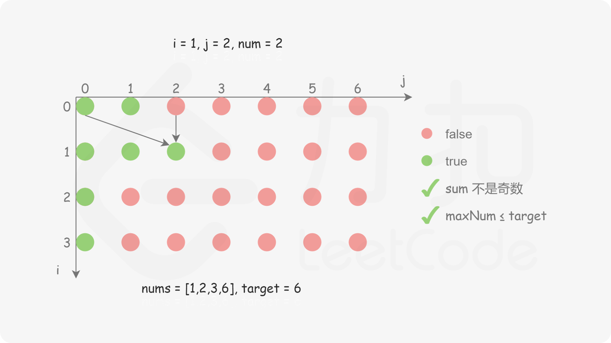
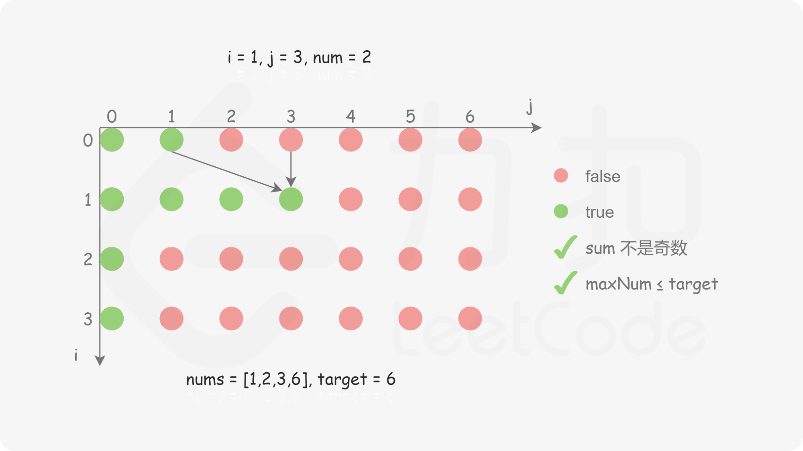
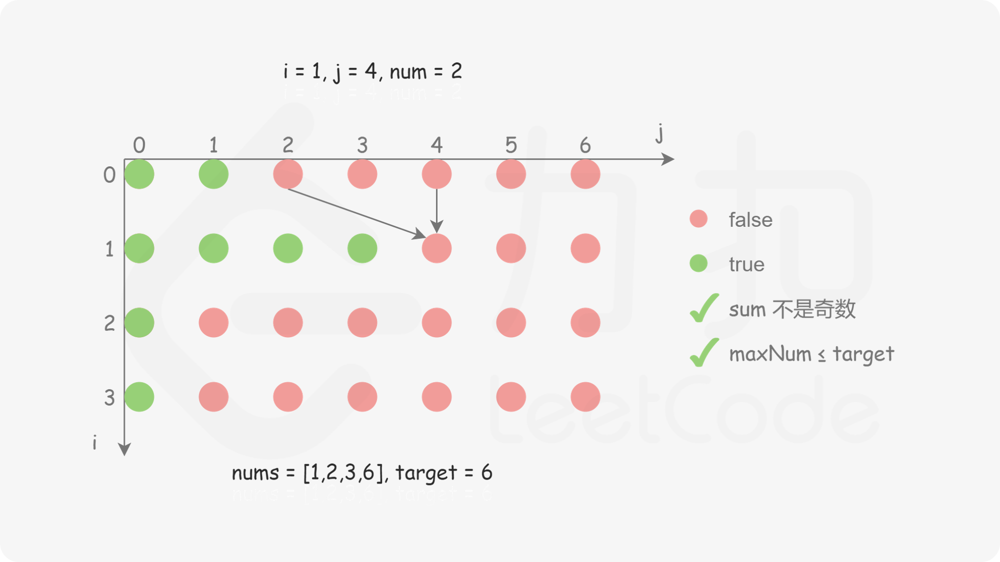
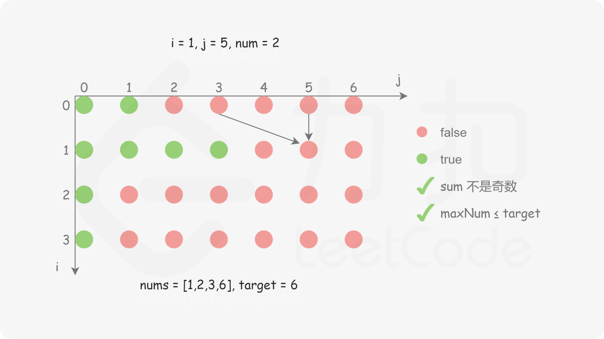
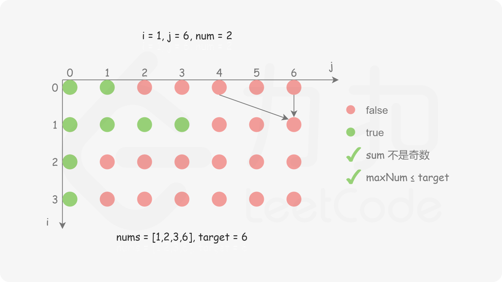
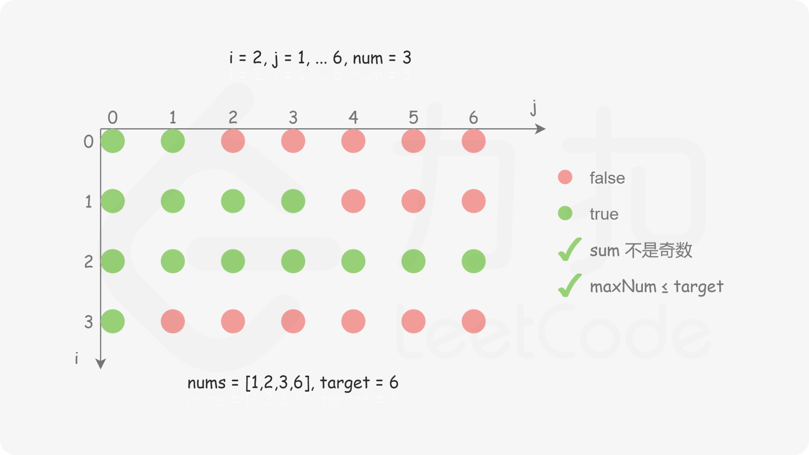
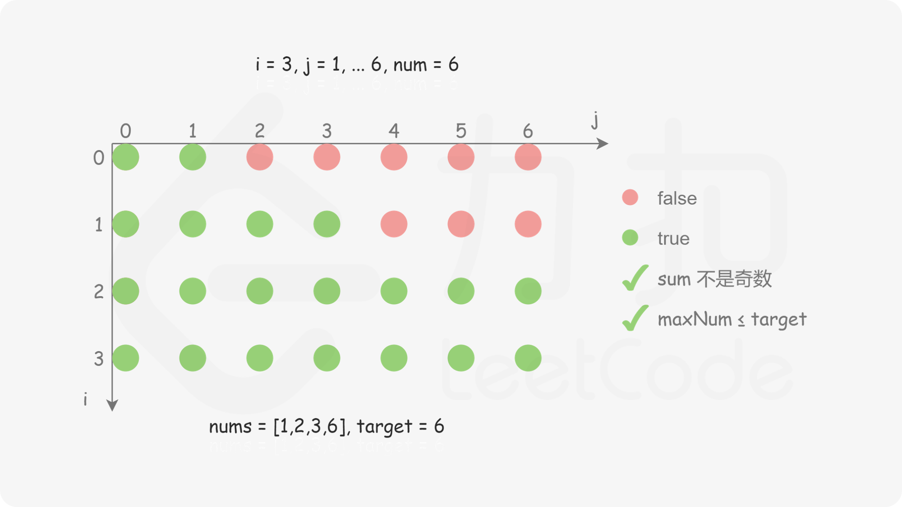
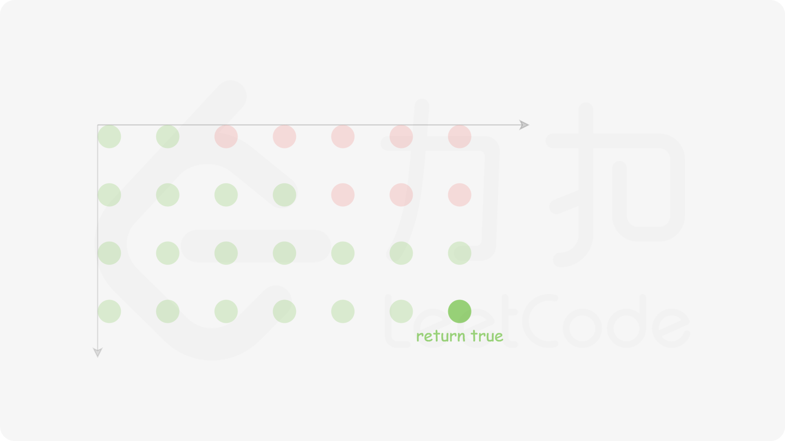

```Java
class Solution {
    public boolean canPartition(int[] nums) {
        int n = nums.length;
        if (n < 2) {
            return false;
        }
        int sum = 0, maxNum = 0;
        for (int num : nums) {
            sum += num;
            maxNum = Math.max(maxNum, num);
        }
        if (sum % 2 != 0) {
            return false;
        }
        int target = sum / 2;
        if (maxNum > target) {
            return false;
        }
        boolean[][] dp = new boolean[n][target + 1];
        for (int i = 0; i < n; i++) {
            dp[i][0] = true;
        }
        dp[0][nums[0]] = true;
        for (int i = 1; i < n; i++) {
            int num = nums[i];
            for (int j = 1; j <= target; j++) {
                if (j >= num) {
                    dp[i][j] = dp[i - 1][j] | dp[i - 1][j - num];
                } else {
                    dp[i][j] = dp[i - 1][j];
                }
            }
        }
        return dp[n - 1][target];
    }
}
```

```C++
class Solution {
public:
    bool canPartition(vector<int>& nums) {
        int n = nums.size();
        if (n < 2) {
            return false;
        }
        int sum = accumulate(nums.begin(), nums.end(), 0);
        int maxNum = *max_element(nums.begin(), nums.end());
        if (sum & 1) {
            return false;
        }
        int target = sum / 2;
        if (maxNum > target) {
            return false;
        }
        vector<vector<int>> dp(n, vector<int>(target + 1, 0));
        for (int i = 0; i < n; i++) {
            dp[i][0] = true;
        }
        dp[0][nums[0]] = true;
        for (int i = 1; i < n; i++) {
            int num = nums[i];
            for (int j = 1; j <= target; j++) {
                if (j >= num) {
                    dp[i][j] = dp[i - 1][j] | dp[i - 1][j - num];
                } else {
                    dp[i][j] = dp[i - 1][j];
                }
            }
        }
        return dp[n - 1][target];
    }
};
```

```JavaScript
var canPartition = function(nums) {
    const n = nums.length;
    if (n < 2) {
        return false;
    }
    let sum = 0, maxNum = 0;
    for (const num of nums) {
        sum += num;
        maxNum = maxNum > num ? maxNum : num;
    }
    if (sum & 1) {
        return false;
    }
    const target = Math.floor(sum / 2);
    if (maxNum > target) {
        return false;
    }
    const dp = new Array(n).fill(0).map(() => new Array(target + 1, false));
    for (let i = 0; i < n; i++) {
        dp[i][0] = true;
    }
    dp[0][nums[0]] = true;
    for (let i = 1; i < n; i++) {
        const num = nums[i];
        for (let j = 1; j <= target; j++) {
            if (j >= num) {
                dp[i][j] = dp[i - 1][j] | dp[i - 1][j - num];
            } else {
                dp[i][j] = dp[i - 1][j];
            }
        }
    }
    return dp[n - 1][target];
};
```

```Go
func canPartition(nums []int) bool {
    n := len(nums)
    if n < 2 {
        return false
    }

    sum, max := 0, 0
    for _, v := range nums {
        sum += v
        if v > max {
            max = v
        }
    }
    if sum%2 != 0 {
        return false
    }

    target := sum / 2
    if max > target {
        return false
    }

    dp := make([][]bool, n)
    for i := range dp {
        dp[i] = make([]bool, target+1)
    }
    for i := 0; i < n; i++ {
        dp[i][0] = true
    }
    dp[0][nums[0]] = true
    for i := 1; i < n; i++ {
        v := nums[i]
        for j := 1; j <= target; j++ {
            if j >= v {
                dp[i][j] = dp[i-1][j] || dp[i-1][j-v]
            } else {
                dp[i][j] = dp[i-1][j]
            }
        }
    }
    return dp[n-1][target]
}
```

```C
bool canPartition(int* nums, int numsSize) {
    if (numsSize < 2) {
        return false;
    }
    int sum = 0, maxNum = 0;
    for (int i = 0; i < numsSize; ++i) {
        sum += nums[i];
        maxNum = fmax(maxNum, nums[i]);
    }
    if (sum & 1) {
        return false;
    }
    int target = sum / 2;
    if (maxNum > target) {
        return false;
    }
    int dp[numsSize][target + 1];
    memset(dp, 0, sizeof(dp));
    for (int i = 0; i < numsSize; i++) {
        dp[i][0] = true;
    }
    dp[0][nums[0]] = true;
    for (int i = 1; i < numsSize; i++) {
        int num = nums[i];
        for (int j = 1; j <= target; j++) {
            if (j >= num) {
                dp[i][j] = dp[i - 1][j] | dp[i - 1][j - num];
            } else {
                dp[i][j] = dp[i - 1][j];
            }
        }
    }
    return dp[numsSize - 1][target];
}
```

```Python
class Solution:
    def canPartition(self, nums: List[int]) -> bool:
        n = len(nums)
        if n < 2:
            return False
        
        total = sum(nums)
        maxNum = max(nums)
        if total & 1:
            return False
        
        target = total // 2
        if maxNum > target:
            return False
        
        dp = [[False] * (target + 1) for _ in range(n)]
        for i in range(n):
            dp[i][0] = True
        
        dp[0][nums[0]] = True
        for i in range(1, n):
            num = nums[i]
            for j in range(1, target + 1):
                if j >= num:
                    dp[i][j] = dp[i - 1][j] | dp[i - 1][j - num]
                else:
                    dp[i][j] = dp[i - 1][j]
        
        return dp[n - 1][target]
```

上述代码的空间复杂度是 $O(n \times target)$。但是可以发现在计算 $dp$ 的过程中，每一行的 $dp$ 值都只与上一行的 $dp$ 值有关，因此只需要一个一维数组即可将空间复杂度降到 $O(target)$。此时的转移方程为：

$$dp[j]=dp[j] \vert dp[j-nums[i]]$$

且需要注意的是第二层的循环我们需要**从大到小计算**，因为如果我们从小到大更新 $dp$ 值，那么在计算 dp[j] 值的时候，dp[j-nums[i]] 已经是被更新过的状态，不再是上一行的 $dp$ 值。

**代码**

```Java
class Solution {
    public boolean canPartition(int[] nums) {
        int n = nums.length;
        if (n < 2) {
            return false;
        }
        int sum = 0, maxNum = 0;
        for (int num : nums) {
            sum += num;
            maxNum = Math.max(maxNum, num);
        }
        if (sum % 2 != 0) {
            return false;
        }
        int target = sum / 2;
        if (maxNum > target) {
            return false;
        }
        boolean[] dp = new boolean[target + 1];
        dp[0] = true;
        for (int i = 0; i < n; i++) {
            int num = nums[i];
            for (int j = target; j >= num; --j) {
                dp[j] |= dp[j - num];
            }
        }
        return dp[target];
    }
}
```

```C++
class Solution {
public:
    bool canPartition(vector<int>& nums) {
        int n = nums.size();
        if (n < 2) {
            return false;
        }
        int sum = 0, maxNum = 0;
        for (auto& num : nums) {
            sum += num;
            maxNum = max(maxNum, num);
        }
        if (sum & 1) {
            return false;
        }
        int target = sum / 2;
        if (maxNum > target) {
            return false;
        }
        vector<int> dp(target + 1, 0);
        dp[0] = true;
        for (int i = 0; i < n; i++) {
            int num = nums[i];
            for (int j = target; j >= num; --j) {
                dp[j] |= dp[j - num];
            }
        }
        return dp[target];
    }
};
```

```JavaScript
var canPartition = function(nums) {
    const n = nums.length;
    if (n < 2) {
        return false;
    }
    let sum = 0, maxNum = 0;
    for (const num of nums) {
        sum += num;
        maxNum = maxNum > num ? maxNum : num;
    }
    if (sum & 1) {
        return false;
    }
    const target = Math.floor(sum / 2);
    if (maxNum > target) {
        return false;
    }
    const dp = new Array(target + 1).fill(false);
    dp[0] = true;
    for (const num of nums) {
        for (let j = target; j >= num; --j) {
            dp[j] |= dp[j - num];
        }
    }
    return dp[target];
};
```

```Go
func canPartition(nums []int) bool {
    n := len(nums)
    if n < 2 {
        return false
    }

    sum, max := 0, 0
    for _, v := range nums {
        sum += v
        if v > max {
            max = v
        }
    }
    if sum%2 != 0 {
        return false
    }

    target := sum / 2
    if max > target {
        return false
    }

    dp := make([]bool, target+1)
    dp[0] = true
    for i := 0; i < n; i++ {
        v := nums[i]
        for j := target; j >= v; j-- {
            dp[j] = dp[j] || dp[j-v]
        }
    }
    return dp[target]
}
```

```C
bool canPartition(int* nums, int numsSize) {
    if (numsSize < 2) {
        return false;
    }
    int sum = 0, maxNum = 0;
    for (int i = 0; i < numsSize; ++i) {
        sum += nums[i];
        maxNum = fmax(maxNum, nums[i]);
    }
    if (sum & 1) {
        return false;
    }
    int target = sum / 2;
    if (maxNum > target) {
        return false;
    }
    int dp[target + 1];
    memset(dp, 0, sizeof(dp));
    dp[0] = true;
    for (int i = 0; i < numsSize; i++) {
        int num = nums[i];
        for (int j = target; j >= num; --j) {
            dp[j] |= dp[j - num];
        }
    }
    return dp[target];
}
```

```Python
class Solution:
    def canPartition(self, nums: List[int]) -> bool:
        n = len(nums)
        if n < 2:
            return False
        
        total = sum(nums)
        if total % 2 != 0:
            return False
        
        target = total // 2
        dp = [True] + [False] * target
        for i, num in enumerate(nums):
            for j in range(target, num - 1, -1):
                dp[j] |= dp[j - num]
        
        return dp[target]
```

**复杂度分析**

- 时间复杂度：$O(n \times target)$，其中 $n$ 是数组的长度，$target$ 是整个数组的元素和的一半。需要计算出所有的状态，每个状态在进行转移时的时间复杂度为 $O(1)$。
- 空间复杂度：$O(target)$，其中 $target$ 是整个数组的元素和的一半。空间复杂度取决于 $dp$ 数组，在不进行空间优化的情况下，空间复杂度是 $O(n \times target)$，在进行空间优化的情况下，空间复杂度可以降到 $O(target)$。
