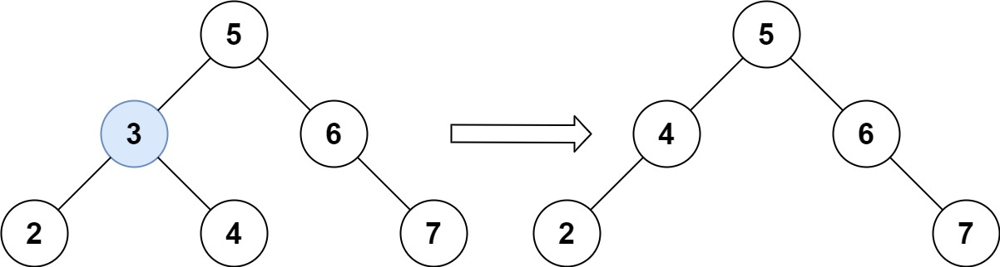
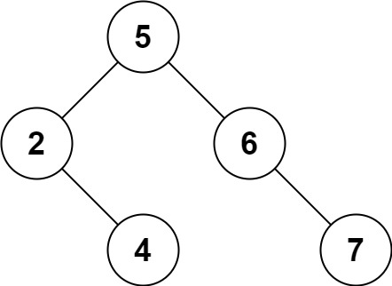

### [450\. 删除二叉搜索树中的节点](https://leetcode.cn/problems/delete-node-in-a-bst/)

难度：中等

给定一个二叉搜索树的根节点 **root** 和一个值 **key**，删除二叉搜索树中的 **key** 对应的节点，并保证二叉搜索树的性质不变。返回二叉搜索树（有可能被更新）的根节点的引用。

一般来说，删除节点可分为两个步骤：

1. 首先找到需要删除的节点；
2. 如果找到了，删除它。

**示例 1:**

> 
>
> **输入：** root = [5,3,6,2,4,null,7], key = 3
> **输出：** [5,4,6,2,null,null,7]
> **解释：** 给定需要删除的节点值是 3，所以我们首先找到 3 这个节点，然后删除它。
> 一个正确的答案是 [5,4,6,2,null,null,7], 如下图所示。
> 另一个正确答案是 [5,2,6,null,4,null,7]。
> 

**示例 2:**

> **输入:** root = [5,3,6,2,4,null,7], key = 0
> **输出:** [5,3,6,2,4,null,7]
> **解释:** 二叉树不包含值为 0 的节点

**示例 3:**

> **输入:** root = [], key = 0
> **输出:** []

**提示:**

- 节点数的范围 <code>[0, 104]</code>.
- <code>-105 <= Node.val <= 105</code>
- 节点值唯一
- `root` 是合法的二叉搜索树
- <code>-105 <= key <= 105</code>

**进阶：** 要求算法时间复杂度为 O(h)，h 为树的高度。
