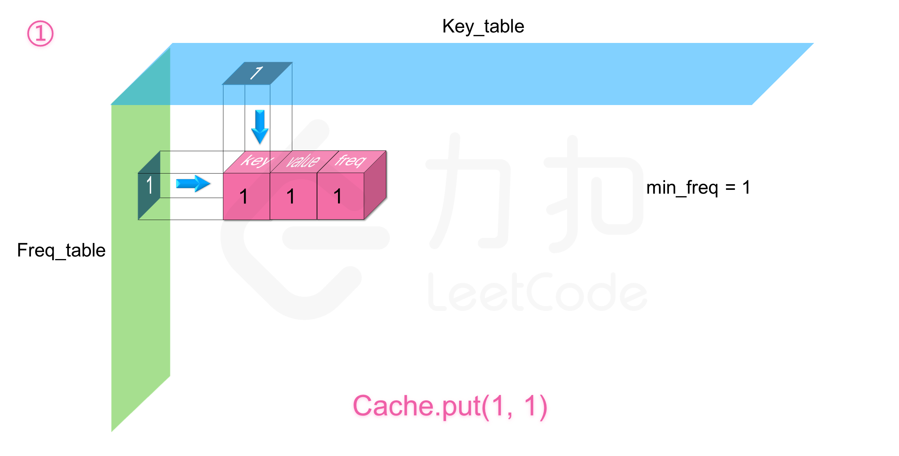
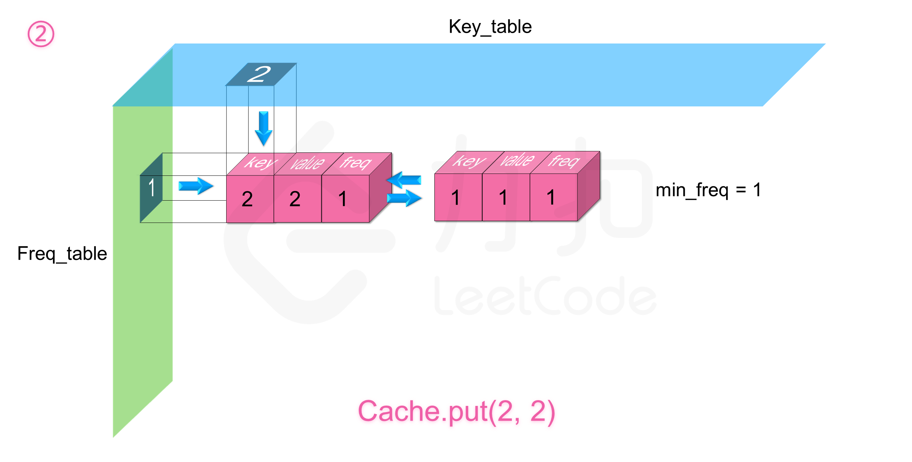
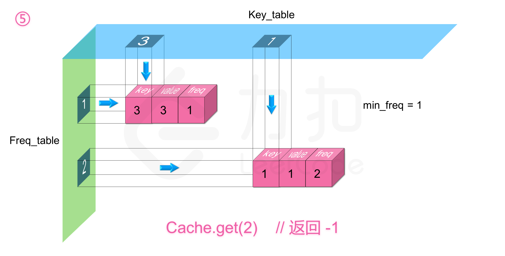
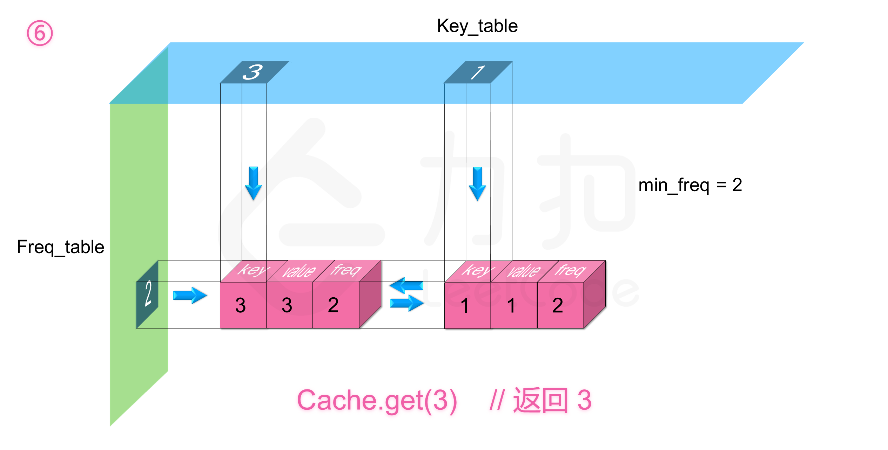
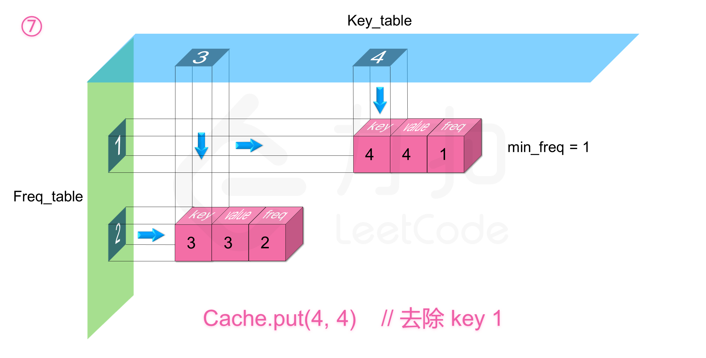

### [LFU缓存](https://leetcode.cn/problems/lfu-cache/solutions/186348/lfuhuan-cun-by-leetcode-solution/)

#### 方法一：哈希表 + 平衡二叉树

**说明**

本方法需要使用到「平衡二叉树」。在 C++ 语言中，我们可以直接使用 `std::set` 类作为平衡二叉树；同样在 Java 语言中，我们可以直接使用 `TreeSet`。但是在 Python 语言中，并没有内置的库可以用来模拟平衡二叉树。

**思路和算法**

首先我们定义缓存的数据结构：

```cpp
struct Node {
    int cnt;
    int time;
    int key, value;
    
    // 我们需要实现一个 Node 类的比较函数
    // 将 cnt（使用频率）作为第一关键字，time（最近一次使用的时间）作为第二关键字
    // 下面是 C++ 语言的一个比较函数的例子
    bool operator< (const Node& rhs) const {
        return cnt == rhs.cnt ? time < rhs.time : cnt < rhs.cnt;
    }
};
```

其中 `cnt` 表示缓存使用的频率，`time` 表示缓存的使用时间，`key` 和 `value` 表示缓存的键值。

比较直观的想法就是我们用哈希表 `key_table` 以键 `key` 为索引存储缓存，建立一个平衡二叉树 `S` 来保持缓存根据 `(cnt，time)` 双关键字由于。在 C++ 中，我们可以使用 STL 提供的 `std::set` 类，`set` 背后的实现是红黑树：

-   对于 `get(key)` 操作，我们只要查看一下哈希表 `key_table` 是否有 `key` 这个键即可，有的话需要同时更新哈希表和集合中该缓存的使用频率以及使用时间，否则返回 `-1`。
-   对于 `put(key, value)` 操作，首先需要查看 `key_table` 中是否已有对应的键值。如果有的话操作基本等同于 `get(key)`，不同的是需要更新缓存的 `value` 值。如果没有的话相当于是新插入一个缓存，这时候需要先查看是否达到缓存容量 `capacity`，如果达到了的话，需要删除最近最少使用的缓存，即平衡二叉树中最左边的结点，同时删除 `key_table` 中对应的索引，最后向 `key_table` 和 `S` 插入新的缓存信息即可。

```cpp
struct Node {
    int cnt, time, key, value;

    Node(int _cnt, int _time, int _key, int _value):cnt(_cnt), time(_time), key(_key), value(_value){}
    
    bool operator < (const Node& rhs) const {
        return cnt == rhs.cnt ? time < rhs.time : cnt < rhs.cnt;
    }
};
class LFUCache {
    // 缓存容量，时间戳
    int capacity, time;
    unordered_map<int, Node> key_table;
    set<Node> S;
public:
    LFUCache(int _capacity) {
        capacity = _capacity;
        time = 0;
        key_table.clear();
        S.clear();
    }
    
    int get(int key) {
        if (capacity == 0) return -1;
        auto it = key_table.find(key);
        // 如果哈希表中没有键 key，返回 -1
        if (it == key_table.end()) return -1;
        // 从哈希表中得到旧的缓存
        Node cache = it -> second;
        // 从平衡二叉树中删除旧的缓存
        S.erase(cache);
        // 将旧缓存更新
        cache.cnt += 1;
        cache.time = ++time;
        // 将新缓存重新放入哈希表和平衡二叉树中
        S.insert(cache);
        it -> second = cache;
        return cache.value;
    }
    
    void put(int key, int value) {
        if (capacity == 0) return;
        auto it = key_table.find(key);
        if (it == key_table.end()) {
            // 如果到达缓存容量上限
            if (key_table.size() == capacity) {
                // 从哈希表和平衡二叉树中删除最近最少使用的缓存
                key_table.erase(S.begin() -> key);
                S.erase(S.begin());
            }
            // 创建新的缓存
            Node cache = Node(1, ++time, key, value);
            // 将新缓存放入哈希表和平衡二叉树中
            key_table.insert(make_pair(key, cache));
            S.insert(cache);
        }
        else {
            // 这里和 get() 函数类似
            Node cache = it -> second;
            S.erase(cache);
            cache.cnt += 1;
            cache.time = ++time;
            cache.value = value;
            S.insert(cache);
            it -> second = cache;
        }
    }
};
```

```java
class LFUCache {
    // 缓存容量，时间戳
    int capacity, time;
    Map<Integer, Node> key_table;
    TreeSet<Node> S;

    public LFUCache(int capacity) {
        this.capacity = capacity;
        this.time = 0;
        key_table = new HashMap<Integer, Node>();
        S = new TreeSet<Node>();
    }
    
    public int get(int key) {
        if (capacity == 0) {
            return -1;
        }
        // 如果哈希表中没有键 key，返回 -1
        if (!key_table.containsKey(key)) {
            return -1;
        }
        // 从哈希表中得到旧的缓存
        Node cache = key_table.get(key);
        // 从平衡二叉树中删除旧的缓存
        S.remove(cache);
        // 将旧缓存更新
        cache.cnt += 1;
        cache.time = ++time;
        // 将新缓存重新放入哈希表和平衡二叉树中
        S.add(cache);
        key_table.put(key, cache);
        return cache.value;
    }
    
    public void put(int key, int value) {
        if (capacity == 0) {
            return;
        }
        if (!key_table.containsKey(key)) {
            // 如果到达缓存容量上限
            if (key_table.size() == capacity) {
                // 从哈希表和平衡二叉树中删除最近最少使用的缓存
                key_table.remove(S.first().key);
                S.remove(S.first());
            }
            // 创建新的缓存
            Node cache = new Node(1, ++time, key, value);
            // 将新缓存放入哈希表和平衡二叉树中
            key_table.put(key, cache);
            S.add(cache);
        } else {
            // 这里和 get() 函数类似
            Node cache = key_table.get(key);
            S.remove(cache);
            cache.cnt += 1;
            cache.time = ++time;
            cache.value = value;
            S.add(cache);
            key_table.put(key, cache);
        }
    }
}

class Node implements Comparable<Node> {
    int cnt, time, key, value;

    Node(int cnt, int time, int key, int value) {
        this.cnt = cnt;
        this.time = time;
        this.key = key;
        this.value = value;
    }

    public boolean equals(Object anObject) {
        if (this == anObject) {
            return true;
        }
        if (anObject instanceof Node) {
            Node rhs = (Node) anObject;
            return this.cnt == rhs.cnt && this.time == rhs.time;
        }
        return false;
    }

    public int compareTo(Node rhs) {
        return cnt == rhs.cnt ? time - rhs.time : cnt - rhs.cnt;
    }

    public int hashCode() {
        return cnt * 1000000007 + time;
    }
}
```

**复杂度分析**

-   时间复杂度：`get` 时间复杂度 $O(\log n)$，`put` 时间复杂度 $O(\log n)$，操作的时间复杂度瓶颈在于平衡二叉树的插入删除均需要 $O(\log n)$ 的时间。
-   空间复杂度：$O(capacity)$，其中 $capacity$ 为 `LFU` 的缓存容量。哈希表和平衡二叉树不会存放超过缓存容量的键值对。

#### 方法二：双哈希表

**思路和算法**

我们定义两个哈希表，第一个 `freq_table` 以频率 `freq` 为索引，每个索引存放一个双向链表，这个链表里存放所有使用频率为 `freq` 的缓存，缓存里存放三个信息，分别为键 `key`，值 `value`，以及使用频率 `freq`。第二个 `key_table` 以键值 `key` 为索引，每个索引存放对应缓存在 `freq_table` 中链表里的内存地址，这样我们就能利用两个哈希表来使得两个操作的时间复杂度均为 $O(1)$。同时需要记录一个当前缓存最少使用的频率 `minFreq`，这是为了删除操作服务的。

对于 `get(key)` 操作，我们能通过索引 `key` 在 `key_table` 中找到缓存在 `freq_table` 中的链表的内存地址，如果不存在直接返回 `-1`，否则我们能获取到对应缓存的相关信息，这样我们就能知道缓存的键值还有使用频率，直接返回 `key` 对应的值即可。

但是我们注意到 `get` 操作后这个缓存的使用频率加一了，所以我们需要更新缓存在哈希表 `freq_table` 中的位置。已知这个缓存的键 `key`，值 `value`，以及使用频率 `freq`，那么该缓存应该存放到 `freq_table` 中 `freq + 1` 索引下的链表中。所以我们在当前链表中 $O(1)$ 删除该缓存对应的节点，根据情况更新 `minFreq` 值，然后将其$O(1)$ 插入到 `freq + 1` 索引下的链表头完成更新。这其中的操作复杂度均为 $O(1)$。你可能会疑惑更新的时候为什么是插入到链表头，这其实是为了保证缓存在当前链表中从链表头到链表尾的**插入时间是有序的**，为下面的删除操作服务。

对于 `put(key, value)` 操作，我们先通过索引 `key`在 `key_table` 中查看是否有对应的缓存，如果有的话，其实操作等价于 `get(key)` 操作，唯一的区别就是我们需要将当前的缓存里的值更新为 `value`。如果没有的话，相当于是新加入的缓存，如果缓存已经到达容量，需要先删除最近最少使用的缓存，再进行插入。

先考虑插入，由于是新插入的，所以缓存的使用频率一定是 `1`，所以我们将缓存的信息插入到 `freq_table` 中 `1` 索引下的列表头即可，同时更新 `key_table[key]` 的信息，以及更新 `minFreq = 1`。

那么剩下的就是删除操作了，由于我们实时维护了 `minFreq`，所以我们能够知道 `freq_table` 里目前最少使用频率的索引，同时因为我们保证了链表中从链表头到链表尾的插入时间是有序的，所以 `freq_table[minFreq]` 的链表中链表尾的节点即为使用频率最小且插入时间最早的节点，我们删除它同时根据情况更新 `minFreq` ，整个时间复杂度均为 $O(1)$。

如下图展示了样例的全部操作过程：










```cpp
// 缓存的节点信息
struct Node {
    int key, val, freq;
    Node(int _key,int _val,int _freq): key(_key), val(_val), freq(_freq){}
};
class LFUCache {
    int minfreq, capacity;
    unordered_map<int, list<Node>::iterator> key_table;
    unordered_map<int, list<Node>> freq_table;
public:
    LFUCache(int _capacity) {
        minfreq = 0;
        capacity = _capacity;
        key_table.clear();
        freq_table.clear();
    }
    
    int get(int key) {
        if (capacity == 0) return -1;
        auto it = key_table.find(key);
        if (it == key_table.end()) return -1;
        list<Node>::iterator node = it -> second;
        int val = node -> val, freq = node -> freq;
        freq_table[freq].erase(node);
        // 如果当前链表为空，我们需要在哈希表中删除，且更新minFreq
        if (freq_table[freq].size() == 0) {
            freq_table.erase(freq);
            if (minfreq == freq) minfreq += 1;
        }
        // 插入到 freq + 1 中
        freq_table[freq + 1].push_front(Node(key, val, freq + 1));
        key_table[key] = freq_table[freq + 1].begin();
        return val;
    }
    
    void put(int key, int value) {
        if (capacity == 0) return;
        auto it = key_table.find(key);
        if (it == key_table.end()) {
            // 缓存已满，需要进行删除操作
            if (key_table.size() == capacity) {
                // 通过 minFreq 拿到 freq_table[minFreq] 链表的末尾节点
                auto it2 = freq_table[minfreq].back();
                key_table.erase(it2.key);
                freq_table[minfreq].pop_back();
                if (freq_table[minfreq].size() == 0) {
                    freq_table.erase(minfreq);
                }
            } 
            freq_table[1].push_front(Node(key, value, 1));
            key_table[key] = freq_table[1].begin();
            minfreq = 1;
        } else {
            // 与 get 操作基本一致，除了需要更新缓存的值
            list<Node>::iterator node = it -> second;
            int freq = node -> freq;
            freq_table[freq].erase(node);
            if (freq_table[freq].size() == 0) {
                freq_table.erase(freq);
                if (minfreq == freq) minfreq += 1;
            }
            freq_table[freq + 1].push_front(Node(key, value, freq + 1));
            key_table[key] = freq_table[freq + 1].begin();
        }
    }
};
```

```java
class LFUCache {
    int minfreq, capacity;
    Map<Integer, Node> keyTable;
    Map<Integer, DoublyLinkedList> freqTable;

    public LFUCache(int capacity) {
        this.minfreq = 0;
        this.capacity = capacity;
        keyTable = new HashMap<Integer, Node>();
        freqTable = new HashMap<Integer, DoublyLinkedList>();
    }
    
    public int get(int key) {
        if (capacity == 0) {
            return -1;
        }
        if (!keyTable.containsKey(key)) {
            return -1;
        }
        Node node = keyTable.get(key);
        int val = node.val, freq = node.freq;
        freqTable.get(freq).remove(node);
        // 如果当前链表为空，我们需要在哈希表中删除，且更新minFreq
        if (freqTable.get(freq).size == 0) {
            freqTable.remove(freq);
            if (minfreq == freq) {
                minfreq += 1;
            }
        }
        // 插入到 freq + 1 中
        DoublyLinkedList list = freqTable.getOrDefault(freq + 1, new DoublyLinkedList());
        list.addFirst(new Node(key, val, freq + 1));
        freqTable.put(freq + 1, list);
        keyTable.put(key, freqTable.get(freq + 1).getHead());
        return val;
    }
    
    public void put(int key, int value) {
        if (capacity == 0) {
            return;
        }
        if (!keyTable.containsKey(key)) {
            // 缓存已满，需要进行删除操作
            if (keyTable.size() == capacity) {
                // 通过 minFreq 拿到 freqTable[minFreq] 链表的末尾节点
                Node node = freqTable.get(minfreq).getTail();
                keyTable.remove(node.key);
                freqTable.get(minfreq).remove(node);
                if (freqTable.get(minfreq).size == 0) {
                    freqTable.remove(minfreq);
                }
            }
            DoublyLinkedList list = freqTable.getOrDefault(1, new DoublyLinkedList());
            list.addFirst(new Node(key, value, 1));
            freqTable.put(1, list);
            keyTable.put(key, freqTable.get(1).getHead());
            minfreq = 1;
        } else {
            // 与 get 操作基本一致，除了需要更新缓存的值
            Node node = keyTable.get(key);
            int freq = node.freq;
            freqTable.get(freq).remove(node);
            if (freqTable.get(freq).size == 0) {
                freqTable.remove(freq);
                if (minfreq == freq) {
                    minfreq += 1;
                }
            }
            DoublyLinkedList list = freqTable.getOrDefault(freq + 1, new DoublyLinkedList());
            list.addFirst(new Node(key, value, freq + 1));
            freqTable.put(freq + 1, list);
            keyTable.put(key, freqTable.get(freq + 1).getHead());
        }
    }
}

class Node {
    int key, val, freq;
    Node prev, next;

    Node() {
        this(-1, -1, 0);
    }

    Node(int key, int val, int freq) {
        this.key = key;
        this.val = val;
        this.freq = freq;
    }
}

class DoublyLinkedList {
    Node dummyHead, dummyTail;
    int size;

    DoublyLinkedList() {
        dummyHead = new Node();
        dummyTail = new Node();
        dummyHead.next = dummyTail;
        dummyTail.prev = dummyHead;
        size = 0;
    }

    public void addFirst(Node node) {
        Node prevHead = dummyHead.next;
        node.prev = dummyHead;
        dummyHead.next = node;
        node.next = prevHead;
        prevHead.prev = node;
        size++;
    }

    public void remove(Node node) {
        Node prev = node.prev, next = node.next;
        prev.next = next;
        next.prev = prev;
        size--;
    }

    public Node getHead() {
        return dummyHead.next;
    }

    public Node getTail() {
        return dummyTail.prev;
    }
}
```

```python
class Node:
    def __init__(self, key, val, pre=None, nex=None, freq=0):
        self.pre = pre
        self.nex = nex
        self.freq = freq
        self.val = val
        self.key = key
        
    def insert(self, nex):
        nex.pre = self
        nex.nex = self.nex
        self.nex.pre = nex
        self.nex = nex
    
def create_linked_list():
    head = Node(0, 0)
    tail = Node(0, 0)
    head.nex = tail
    tail.pre = head
    return (head, tail)

class LFUCache:
    def __init__(self, capacity: int):
        self.capacity = capacity
        self.size = 0
        self.minFreq = 0
        self.freqMap = collections.defaultdict(create_linked_list)
        self.keyMap = {}

    def delete(self, node):
        if node.pre:
            node.pre.nex = node.nex
            node.nex.pre = node.pre
            if node.pre is self.freqMap[node.freq][0] and node.nex is self.freqMap[node.freq][-1]:
                self.freqMap.pop(node.freq)
        return node.key
        
    def increase(self, node):
        node.freq += 1
        self.delete(node)
        self.freqMap[node.freq][-1].pre.insert(node)
        if node.freq == 1:
            self.minFreq = 1
        elif self.minFreq == node.freq - 1:
            head, tail = self.freqMap[node.freq - 1]
            if head.nex is tail:
                self.minFreq = node.freq

    def get(self, key: int) -> int:
        if key in self.keyMap:
            self.increase(self.keyMap[key])
            return self.keyMap[key].val
        return -1

    def put(self, key: int, value: int) -> None:
        if self.capacity != 0:
            if key in self.keyMap:
                node = self.keyMap[key]
                node.val = value
            else:
                node = Node(key, value)
                self.keyMap[key] = node
                self.size += 1
            if self.size > self.capacity:
                self.size -= 1
                deleted = self.delete(self.freqMap[self.minFreq][0].nex)
                self.keyMap.pop(deleted)
            self.increase(node)
```

**复杂度分析**

-   时间复杂度：`get` 时间复杂度 $O(1)$，`put` 时间复杂度 $O(1)$。由于两个操作从头至尾都只利用了哈希表的插入删除还有链表的插入删除，且它们的时间复杂度均为 $O(1)$，所以保证了两个操作的时间复杂度均为 $O(1)$。
-   空间复杂度：$O(capacity)$，其中 $capacity$ 为 `LFU` 的缓存容量。哈希表中不会存放超过缓存容量的键值对。
