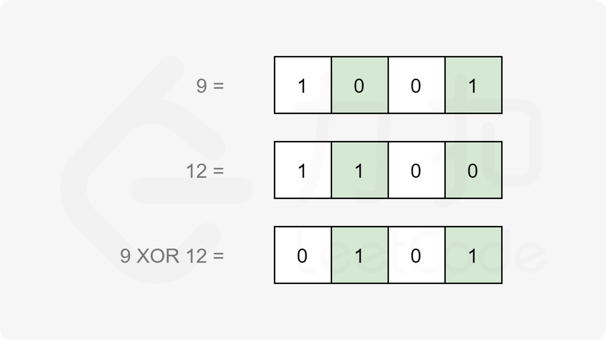

#### [前言](https://leetcode.cn/problems/hamming-distance/solutions/797339/yi-ming-ju-chi-by-leetcode-solution-u1w7/)

汉明距离广泛应用于多个领域。在编码理论中用于错误检测，在信息论中量化字符串之间的差异。

两个整数之间的汉明距离是对应位置上数字不同的位数。

根据以上定义，我们使用异或运算，记为 $\oplus$，当且仅当输入位不同时输出为 $1$。



计算 $x$ 和 $y$ 之间的汉明距离，可以先计算 $x \oplus y$，然后统计结果中等于 $1$ 的位数。

现在，原始问题转换为位计数问题。位计数有多种思路，将在下面的方法中介绍。

#### [方法一：内置位计数功能](https://leetcode.cn/problems/hamming-distance/solutions/797339/yi-ming-ju-chi-by-leetcode-solution-u1w7/)

**思路及算法**

大多数编程语言都内置了计算二进制表达中 $1$ 的数量的函数。在工程中，我们应该直接使用内置函数。

**代码**

```cpp
class Solution {
public:
    int hammingDistance(int x, int y) {
        return __builtin_popcount(x ^ y);
    }
};
```

```java
class Solution {
    public int hammingDistance(int x, int y) {
        return Integer.bitCount(x ^ y);
    }
}
```

```go
func hammingDistance(x, y int) int {
    return bits.OnesCount(uint(x ^ y))
}
```

```c
int hammingDistance(int x, int y) {
    return __builtin_popcount(x ^ y);
}
```

**复杂度分析**

-   时间复杂度：$O(1)$。不同语言的实现方法不一，我们可以近似认为其时间复杂度为 $O(1)$。
-   空间复杂度：$O(1)$。
