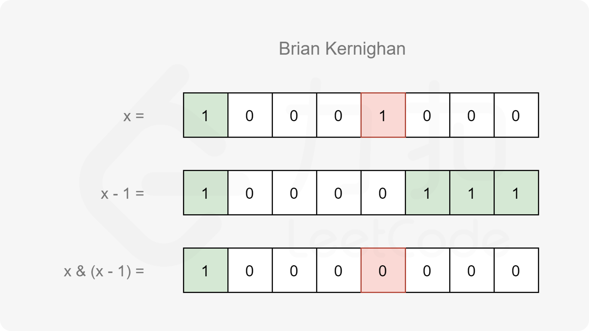

#### [方法三：$Brian Kernighan$ 算法](https://leetcode.cn/problems/hamming-distance/solutions/797339/yi-ming-ju-chi-by-leetcode-solution-u1w7/)

**思路及算法**

在方法二中，对于 $s=(10001100)_2$ 的情况，我们需要循环右移 $8$ 次才能得到答案。而实际上如果我们可以跳过两个 $1$ 之间的 $0$，直接对 $1$ 进行计数，那么就只需要循环 $3$ 次即可。

我们可以使用 $Brian Kernighan$ 算法进行优化，具体地，该算法可以被描述为这样一个结论：记 $f(x)$ 表示 $x$ 和 $x-1$ 进行与运算所得的结果（即 $f(x)=x~\&~(x-1)$），那么 $f(x)$ 恰为 $x$ 删去其二进制表示中最右侧的 $1$ 的结果。



基于该算法，当我们计算出 $s = x \oplus y$，只需要不断让 $s = f(s)$，直到 $s=0$ 即可。这样每循环一次，$s$ 都会删去其二进制表示中最右侧的 $1$，最终循环的次数即为 $s$ 的二进制表示中 $1$ 的数量。

**注意**

$Brian Kernighan$ 算法发布在 $1988$ 年出版的 $The C Programming Language (Second Edition)$ 的练习中（由 $Brian W. Kernighan$ 和 $Dennis M. Ritchie$ 编写），但是 $Donald Knuth$ 在 $2006$ 年 $4$ 月 $19$ 日指出，该方法第一次是由 $Peter Wegner$ 在 $1960$ 年的 $CACM3$ 上出版。可以在上述书籍中找到更多位操作的技巧。

**代码**

```cpp
class Solution {
public:
    int hammingDistance(int x, int y) {
        int s = x ^ y, ret = 0;
        while (s) {
            s &= s - 1;
            ret++;
        }
        return ret;
    }
};
```

```java
class Solution {
    public int hammingDistance(int x, int y) {
        int s = x ^ y, ret = 0;
        while (s != 0) {
            s &= s - 1;
            ret++;
        }
        return ret;
    }
}
```

```csharp
public class Solution {
    public int HammingDistance(int x, int y) {
        int s = x ^ y, ret = 0;
        while (s != 0) {
            s &= s - 1;
            ret++;
        }
        return ret;
    }
}
```

```javascript
var hammingDistance = function(x, y) {
    let s = x ^ y, ret = 0;
    while (s != 0) {
        s &= s - 1;
        ret++;
    }
    return ret;
};
```

```go
func hammingDistance(x, y int) (ans int) {
    for s := x ^ y; s > 0; s &= s - 1 {
        ans++
    }
    return
}
```

```c
int hammingDistance(int x, int y) {
    int s = x ^ y, ret = 0;
    while (s) {
        s &= s - 1;
        ret++;
    }
    return ret;
}
```

**复杂度分析**

-   时间复杂度：$O(\log C)$，其中 $C$ 是元素的数据范围，在本题中 $\log C=\log 2^{31} = 31$。
-   空间复杂度：$O(1)$。
