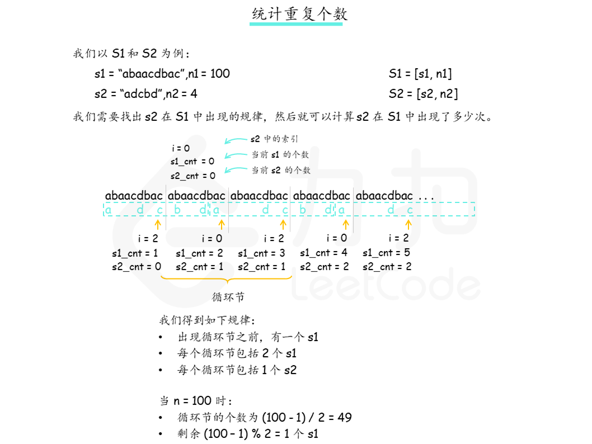

### [统计重复个数](https://leetcode.cn/problems/count-the-repetitions/solutions/208874/tong-ji-zhong-fu-ge-shu-by-leetcode-solution/)

#### 方法一：找出循环节

##### 思路

由于题目中的 `n1` 和 `n2` 都很大，因此我们无法真正把 `S1 = [s1, n1]` 和 `S2 = [s2, n2]` 都显式地表示出来。由于这两个字符串都是不断循环的，因此我们可以考虑找出 `S2` 在 `S1` 中出现的循环节，如果我们找到了循环节，那么我们就可以很快算出 `S2` 在 `S1` 中出现了多少次了。

有些读者可能对循环节这个概念会有些陌生，这个概念我们可以类比无限循环小数，如果从小数部分的某一位起向右进行到某一位止的一节数字「循环」出现，首尾衔接，称这种小数为「无限循环小数」，这一节数字称为「无限循环小数」。比如对于 `3.56789789789...` 这个无限循环小数，它的小数部分就是以 `789` 为一个「循环节」在无限循环，且开头可能会有部分不循环的部分，这个数字中即为 `56`。

那么回到这题，我们可以将不断循环的 `s2` 组成的字符串类比作上面小数部分，去找是否存在一个子串，即「循环节」，满足不断在 `S2` 中循环，且这个循环节能对应固定数量的 `s1` 。如下图所示，在第一次出现后，`S2` 的子串 `bdadc` 构成一个循环节：之后 `bdadc` 的每次出现都需要有相应的两段 `s1`。



当我们找出循环节后，我们即可知道一个循环节内包含 `s1` 的数量，以及在循环节出现前的 `s1` 的数量，这样就可以在 $O(1)$ 的时间内，通过简单的运算求出 `s2` 在 `S1` 中出现的次数了。当然，由于 `S1` 中 `s1` 的数量 `n1` 是有限的，因此可能会存在循环节最后一个部分没有完全匹配，如上图最后会单独剩一个 `s1` 出来无法完全匹配完循环节，这部分我们需要单独拿出来遍历处理统计。

有些读者可能会怀疑循环节是否一定存在，这里我们给出的答案是肯定的，根据[鸽笼原理](https://leetcode.cn/link/?target=https%3A%2F%2Fbaike.baidu.com%2Fitem%2F%E9%B8%BD%E7%AC%BC)，我们最多只要找过 `|s2| + 1` 个 `s1`，就一定会出现循环节。

##### 算法

我们设计一个哈希表 `recall` ：哈希表 `recall` 以 `s2` 字符串的下标 `index` 为索引，存储匹配至第 `s1cnt` 个 `s1` 的末尾，当前匹配到第 `s2cnt` 个 `s2` 中的第 `index` 个字符时， 已经匹配过的 `s1` 的个数 `s1cnt` 和 `s2` 的个数 `s2cnt` 。

我们在每次遍历至 `s1` 的末尾时根据当前匹配到的 `s2` 中的位置 `index` 查看哈希表中的对应位置，如果哈希表中对应的位置 `index` 已经存储元素，则说明我们找到了循环节。循环节的长度可以用当前已经匹配的 `s1` 与 `s2` 的数量减去上次出现时经过的数量（即哈希表中存储的值）来得到。

然后我们就可以通过简单的运算求出所有构成循环节的 `s2` 的数量，对于不参与循环节部分的 `s1`，直接遍历计算即可，具体实现以及一些细节边界的处理请看下文的代码。

```python
class Solution:
    def getMaxRepetitions(self, s1: str, n1: int, s2: str, n2: int) -> int:
        if n1 == 0:
            return 0
        s1cnt, index, s2cnt = 0, 0, 0
        # recall 是我们用来找循环节的变量，它是一个哈希映射
        # 我们如何找循环节？假设我们遍历了 s1cnt 个 s1，此时匹配到了第 s2cnt 个 s2 中的第 index 个字符
        # 如果我们之前遍历了 s1cnt' 个 s1 时，匹配到的是第 s2cnt' 个 s2 中同样的第 index 个字符，那么就有循环节了
        # 我们用 (s1cnt', s2cnt', index) 和 (s1cnt, s2cnt, index) 表示两次包含相同 index 的匹配结果
        # 那么哈希映射中的键就是 index，值就是 (s1cnt', s2cnt') 这个二元组
        # 循环节就是；
        #    - 前 s1cnt' 个 s1 包含了 s2cnt' 个 s2
        #    - 以后的每 (s1cnt - s1cnt') 个 s1 包含了 (s2cnt - s2cnt') 个 s2
        # 那么还会剩下 (n1 - s1cnt') % (s1cnt - s1cnt') 个 s1, 我们对这些与 s2 进行暴力匹配
        # 注意 s2 要从第 index 个字符开始匹配
        recall = dict()
        while True:
            # 我们多遍历一个 s1，看看能不能找到循环节
            s1cnt += 1
            for ch in s1:
                if ch == s2[index]:
                    index += 1
                    if index == len(s2):
                        s2cnt, index = s2cnt + 1, 0
            # 还没有找到循环节，所有的 s1 就用完了
            if s1cnt == n1:
                return s2cnt // n2
            # 出现了之前的 index，表示找到了循环节
            if index in recall:
                s1cnt_prime, s2cnt_prime = recall[index]
                # 前 s1cnt' 个 s1 包含了 s2cnt' 个 s2
                pre_loop = (s1cnt_prime, s2cnt_prime)
                # 以后的每 (s1cnt - s1cnt') 个 s1 包含了 (s2cnt - s2cnt') 个 s2
                in_loop = (s1cnt - s1cnt_prime, s2cnt - s2cnt_prime)
                break
            else:
                recall[index] = (s1cnt, s2cnt)

        # ans 存储的是 S1 包含的 s2 的数量，考虑的之前的 pre_loop 和 in_loop
        ans = pre_loop[1] + (n1 - pre_loop[0]) // in_loop[0] * in_loop[1]
        # S1 的末尾还剩下一些 s1，我们暴力进行匹配
        rest = (n1 - pre_loop[0]) % in_loop[0]
        for i in range(rest):
            for ch in s1:
                if ch == s2[index]:
                    index += 1
                    if index == len(s2):
                        ans, index = ans + 1, 0
        # S1 包含 ans 个 s2，那么就包含 ans / n2 个 S2
        return ans // n2
```

```c++
class Solution {
public:
    int getMaxRepetitions(string s1, int n1, string s2, int n2) {
        if (n1 == 0) {
            return 0;
        }
        int s1cnt = 0, index = 0, s2cnt = 0;
        // recall 是我们用来找循环节的变量，它是一个哈希映射
        // 我们如何找循环节？假设我们遍历了 s1cnt 个 s1，此时匹配到了第 s2cnt 个 s2 中的第 index 个字符
        // 如果我们之前遍历了 s1cnt' 个 s1 时，匹配到的是第 s2cnt' 个 s2 中同样的第 index 个字符，那么就有循环节了
        // 我们用 (s1cnt', s2cnt', index) 和 (s1cnt, s2cnt, index) 表示两次包含相同 index 的匹配结果
        // 那么哈希映射中的键就是 index，值就是 (s1cnt', s2cnt') 这个二元组
        // 循环节就是；
        //    - 前 s1cnt' 个 s1 包含了 s2cnt' 个 s2
        //    - 以后的每 (s1cnt - s1cnt') 个 s1 包含了 (s2cnt - s2cnt') 个 s2
        // 那么还会剩下 (n1 - s1cnt') % (s1cnt - s1cnt') 个 s1, 我们对这些与 s2 进行暴力匹配
        // 注意 s2 要从第 index 个字符开始匹配
        unordered_map<int, pair<int, int>> recall;
        pair<int, int> pre_loop, in_loop;
        while (true) {
            // 我们多遍历一个 s1，看看能不能找到循环节
            ++s1cnt;
            for (char ch: s1) {
                if (ch == s2[index]) {
                    index += 1;
                    if (index == s2.size()) {
                        ++s2cnt;
                        index = 0;
                    }
                }
            }
            // 还没有找到循环节，所有的 s1 就用完了
            if (s1cnt == n1) {
                return s2cnt / n2;
            }
            // 出现了之前的 index，表示找到了循环节
            if (recall.count(index)) {
                auto [s1cnt_prime, s2cnt_prime] = recall[index];
                // 前 s1cnt' 个 s1 包含了 s2cnt' 个 s2
                pre_loop = {s1cnt_prime, s2cnt_prime};
                // 以后的每 (s1cnt - s1cnt') 个 s1 包含了 (s2cnt - s2cnt') 个 s2
                in_loop = {s1cnt - s1cnt_prime, s2cnt - s2cnt_prime};
                break;
            } else {
                recall[index] = {s1cnt, s2cnt};
            }
        }
        // ans 存储的是 S1 包含的 s2 的数量，考虑的之前的 pre_loop 和 in_loop
        int ans = pre_loop.second + (n1 - pre_loop.first) / in_loop.first * in_loop.second;
        // S1 的末尾还剩下一些 s1，我们暴力进行匹配
        int rest = (n1 - pre_loop.first) % in_loop.first;
        for (int i = 0; i < rest; ++i) {
            for (char ch: s1) {
                if (ch == s2[index]) {
                    ++index;
                    if (index == s2.size()) {
                        ++ans;
                        index = 0;
                    }
                }
            }
        }
        // S1 包含 ans 个 s2，那么就包含 ans / n2 个 S2
        return ans / n2;
    }
};
```

```java
class Solution {
    public int getMaxRepetitions(String s1, int n1, String s2, int n2) {
        if (n1 == 0) {
            return 0;
        }
        int s1cnt = 0, index = 0, s2cnt = 0;
        // recall 是我们用来找循环节的变量，它是一个哈希映射
        // 我们如何找循环节？假设我们遍历了 s1cnt 个 s1，此时匹配到了第 s2cnt 个 s2 中的第 index 个字符
        // 如果我们之前遍历了 s1cnt' 个 s1 时，匹配到的是第 s2cnt' 个 s2 中同样的第 index 个字符，那么就有循环节了
        // 我们用 (s1cnt', s2cnt', index) 和 (s1cnt, s2cnt, index) 表示两次包含相同 index 的匹配结果
        // 那么哈希映射中的键就是 index，值就是 (s1cnt', s2cnt') 这个二元组
        // 循环节就是；
        //    - 前 s1cnt' 个 s1 包含了 s2cnt' 个 s2
        //    - 以后的每 (s1cnt - s1cnt') 个 s1 包含了 (s2cnt - s2cnt') 个 s2
        // 那么还会剩下 (n1 - s1cnt') % (s1cnt - s1cnt') 个 s1, 我们对这些与 s2 进行暴力匹配
        // 注意 s2 要从第 index 个字符开始匹配
        Map<Integer, int[]> recall = new HashMap<Integer, int[]>();
        int[] preLoop = new int[2];
        int[] inLoop = new int[2];
        while (true) {
            // 我们多遍历一个 s1，看看能不能找到循环节
            ++s1cnt;
            for (int i = 0; i < s1.length(); ++i) {
                char ch = s1.charAt(i);
                if (ch == s2.charAt(index)) {
                    index += 1;
                    if (index == s2.length()) {
                        ++s2cnt;
                        index = 0;
                    }
                }
            }
            // 还没有找到循环节，所有的 s1 就用完了
            if (s1cnt == n1) {
                return s2cnt / n2;
            }
            // 出现了之前的 index，表示找到了循环节
            if (recall.containsKey(index)) {
                int[] value = recall.get(index);
                int s1cntPrime = value[0];
                int s2cntPrime = value[1];
                // 前 s1cnt' 个 s1 包含了 s2cnt' 个 s2
                preLoop = new int[]{s1cntPrime, s2cntPrime};
                // 以后的每 (s1cnt - s1cnt') 个 s1 包含了 (s2cnt - s2cnt') 个 s2
                inLoop = new int[]{s1cnt - s1cntPrime, s2cnt - s2cntPrime};
                break;
            } else {
                recall.put(index, new int[]{s1cnt, s2cnt});
            }
        }
        // ans 存储的是 S1 包含的 s2 的数量，考虑的之前的 preLoop 和 inLoop
        int ans = preLoop[1] + (n1 - preLoop[0]) / inLoop[0] * inLoop[1];
        // S1 的末尾还剩下一些 s1，我们暴力进行匹配
        int rest = (n1 - preLoop[0]) % inLoop[0];
        for (int i = 0; i < rest; ++i) {
            for (int j = 0; j < s1.length(); ++j) {
                char ch = s1.charAt(j);
                if (ch == s2.charAt(index)) {
                    ++index;
                    if (index == s2.length()) {
                        ++ans;
                        index = 0;
                    }
                }
            }
        }
        // S1 包含 ans 个 s2，那么就包含 ans / n2 个 S2
        return ans / n2;
    }
}
```

#### 复杂度分析

- 时间复杂度：$O(|s1| \times |s2|)$。我们最多找过 $|s2| + 1$ 个 $s1$，就可以找到循环节，最坏情况下需要遍历的字符数量级为 $O(|s1| \times |s2|)$。
- 空间复杂度：$O(|s2|)$。我们建立的哈希表大小等于 $s2$ 的长度。
