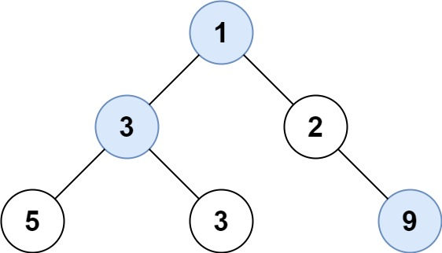

### [515\. 在每个树行中找最大值](https://leetcode.cn/problems/find-largest-value-in-each-tree-row/)

难度：中等

给定一棵二叉树的根节点 `root`，请找出该二叉树中每一层的最大值。

**示例1：**

> 
>
**输入:** root = [1,3,2,5,3,null,9]
**输出:** [1,3,9]

**示例2：**

**输入:** root = [1,2,3]
**输出:** [1,3]

**提示：**

- 二叉树的节点个数的范围是 <code>[0,104]</code>
- <code>-231 <= Node.val <= 231 - 1</code>
