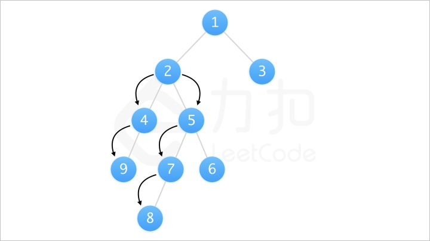

### [二叉树的直径](https://leetcode.cn/problems/diameter-of-binary-tree/solutions/139683/er-cha-shu-de-zhi-jing-by-leetcode-solution/)

#### 方法一：深度优先搜索

首先我们知道一条路径的长度为该路径经过的节点数减一，所以求直径（即求路径长度的最大值）等效于求路径经过节点数的最大值减一。

而任意一条路径均可以被看作由某个节点为起点，从其左儿子和右儿子向下遍历的路径拼接得到。



如图我们可以知道路径 `[9, 4, 2, 5, 7, 8]` 可以被看作以 $2$ 为起点，从其左儿子向下遍历的路径 `[2, 4, 9]` 和从其右儿子向下遍历的路径 `[2, 5, 7, 8]` 拼接得到。

假设我们知道对于该节点的左儿子向下遍历经过最多的节点数 $L$ （即以左儿子为根的子树的深度） 和其右儿子向下遍历经过最多的节点数 $R$ （即以右儿子为根的子树的深度），那么以该节点为起点的路径经过节点数的最大值即为 $L+R+1$ 。

我们记节点 $node$ 为起点的路径经过节点数的最大值为 $d_{node}$ ，那么二叉树的直径就是所有节点 $d_{node}$ 的最大值减一。

最后的算法流程为：我们定义一个递归函数 `depth(node)` 计算 $d_{node}$ ，函数返回该节点为根的子树的深度。先递归调用左儿子和右儿子求得它们为根的子树的深度 $L$ 和 $R$ ，则该节点为根的子树的深度即为

$max(L,R)+1$

该节点的 $d_{node}$ 值为

$L+R+1$

递归搜索每个节点并设一个全局变量 $ans$ 记录 $d_node$ 的最大值，最后返回 `ans-1` 即为树的直径。

```python
class Solution:
    def diameterOfBinaryTree(self, root: TreeNode) -> int:
        self.ans = 1
        def depth(node):
            # 访问到空节点了，返回0
            if not node:
                return 0
            # 左儿子为根的子树的深度
            L = depth(node.left)
            # 右儿子为根的子树的深度
            R = depth(node.right)
            # 计算d_node即L+R+1 并更新ans
            self.ans = max(self.ans, L + R + 1)
            # 返回该节点为根的子树的深度
            return max(L, R) + 1

        depth(root)
        return self.ans - 1
```

```java
class Solution {
    int ans;
    public int diameterOfBinaryTree(TreeNode root) {
        ans = 1;
        depth(root);
        return ans - 1;
    }
    public int depth(TreeNode node) {
        if (node == null) {
            return 0; // 访问到空节点了，返回0
        }
        int L = depth(node.left); // 左儿子为根的子树的深度
        int R = depth(node.right); // 右儿子为根的子树的深度
        ans = Math.max(ans, L+R+1); // 计算d_node即L+R+1 并更新ans
        return Math.max(L, R) + 1; // 返回该节点为根的子树的深度
    }
}
```

```cpp
class Solution {
    int ans;
    int depth(TreeNode* rt){
        if (rt == NULL) {
            return 0; // 访问到空节点了，返回0
        }
        int L = depth(rt->left); // 左儿子为根的子树的深度
        int R = depth(rt->right); // 右儿子为根的子树的深度
        ans = max(ans, L + R + 1); // 计算d_node即L+R+1 并更新ans
        return max(L, R) + 1; // 返回该节点为根的子树的深度
    }
public:
    int diameterOfBinaryTree(TreeNode* root) {
        ans = 1;
        depth(root);
        return ans - 1;
    }
};
```

**复杂度分析**

-   时间复杂度：$O(N)$，其中 $N$ 为二叉树的节点数，即遍历一棵二叉树的时间复杂度，每个结点只被访问一次。
-   空间复杂度：$O(Height)$，其中 $Height$ 为二叉树的高度。由于递归函数在递归过程中需要为每一层递归函数分配栈空间，所以这里需要额外的空间且该空间取决于递归的深度，而递归的深度显然为二叉树的高度，并且每次递归调用的函数里又只用了常数个变量，所以所需空间复杂度为 $O(Height)$ 。
