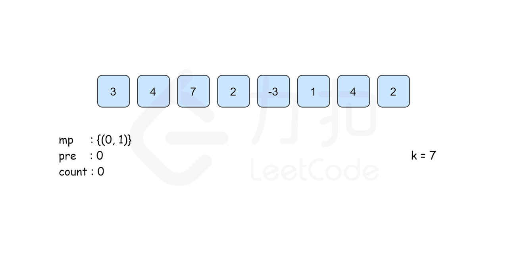
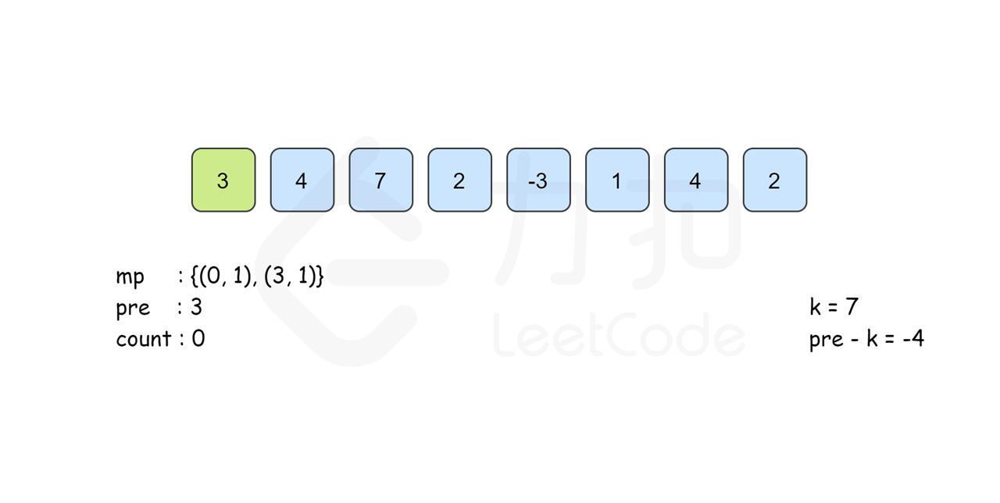
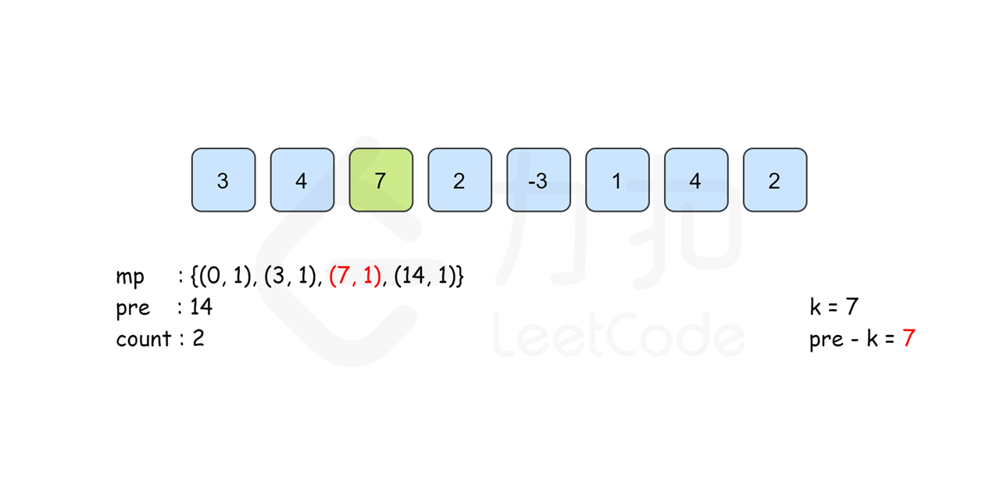
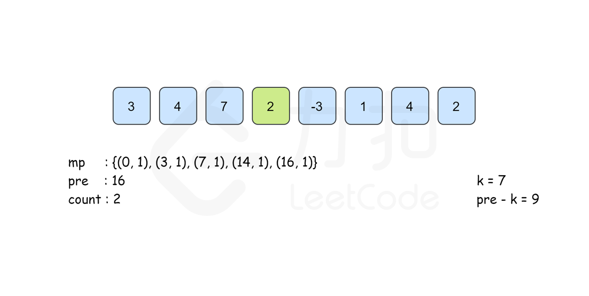
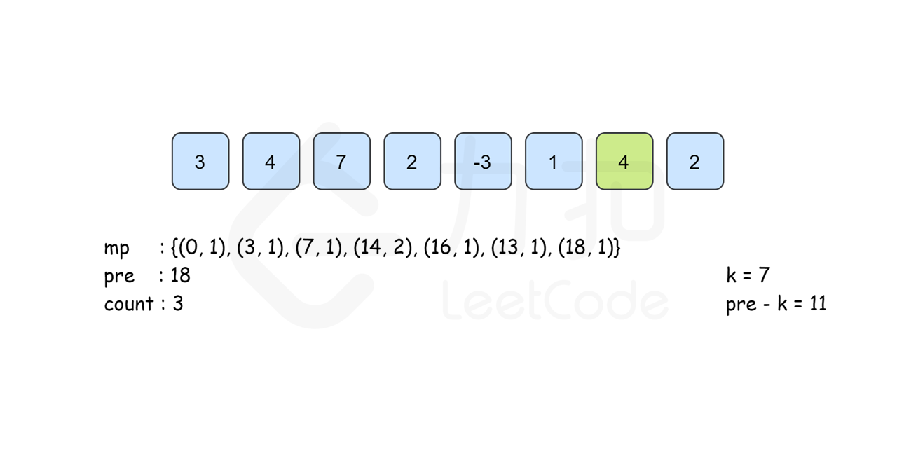
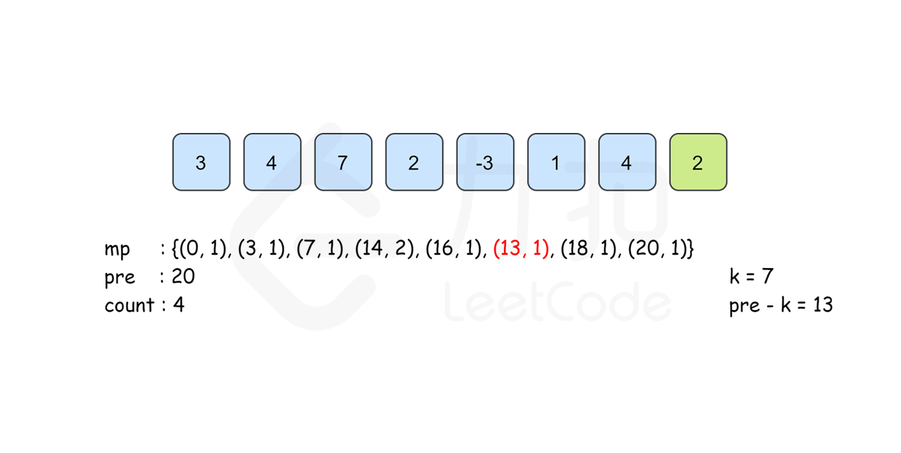

### [和为K的子数组](https://leetcode.cn/problems/subarray-sum-equals-k/solutions/238572/he-wei-kde-zi-shu-zu-by-leetcode-solution/)

#### 方法一：枚举

**思路和算法**

考虑以 $i$ 结尾和为 $k$ 的连续子数组个数，我们需要统计符合条件的下标 $j$ 的个数，其中 $0 \le j \le i$ 且 $[j..i]$ 这个子数组的和恰好为 $k$。

我们可以枚举 $[0..i]$ 里所有的下标 $j$ 来判断是否符合条件，可能有读者会认为假定我们确定了子数组的开头和结尾，还需要 $O(n)$ 的时间复杂度遍历子数组来求和，那样复杂度就将达到 $O(n^3)$ 从而无法通过所有测试用例。但是如果我们知道 $[j,i]$ 子数组的和，就能 $O(1)$ 推出 $[j-1,i]$ 的和，因此这部分的遍历求和是不需要的，我们在枚举下标 $j$ 的时候已经能 $O(1)$ 求出 $[j,i]$ 的子数组之和。

```Java
public class Solution {
    public int subarraySum(int[] nums, int k) {
        int count = 0;
        for (int start = 0; start < nums.length; ++start) {
            int sum = 0;
            for (int end = start; end >= 0; --end) {
                sum += nums[end];
                if (sum == k) {
                    count++;
                }
            }
        }
        return count;
    }
}
```

```C++
class Solution {
public:
    int subarraySum(vector<int>& nums, int k) {
        int count = 0;
        for (int start = 0; start < nums.size(); ++start) {
            int sum = 0;
            for (int end = start; end >= 0; --end) {
                sum += nums[end];
                if (sum == k) {
                    count++;
                }
            }
        }
        return count;
    }
};
```

```JavaScript
var subarraySum = function(nums, k) {
    let count = 0;
    for (let start = 0; start < nums.length; ++start) {
        let sum = 0;
        for (let end = start; end >= 0; --end) {
            sum += nums[end];
            if (sum == k) {
                count++;
            }
        }
    }
    return count;
};
```

```Go
func subarraySum(nums []int, k int) int {
    count := 0
    for start := 0; start < len(nums); start++ {
        sum := 0
        for end := start; end >= 0; end-- {
            sum += nums[end]
            if sum == k {
                count++
            }
        }
    }
    return count
}
```

**复杂度分析**

- 时间复杂度：$O(n^2)$，其中 $n$ 为数组的长度。枚举子数组开头和结尾需要 $O(n^2)$ 的时间，其中求和需要 $O(1)$ 的时间复杂度，因此总时间复杂度为 $O(n^2)$。
- 空间复杂度：$O(1)$。只需要常数空间存放若干变量。

#### 方法二：前缀和 + 哈希表优化

**思路和算法**

我们可以基于方法一利用数据结构进行进一步的优化，我们知道方法一的瓶颈在于对每个 $i$，我们需要枚举所有的 $j$ 来判断是否符合条件，这一步是否可以优化呢？答案是可以的。

我们定义 $pre[i]$ 为 $[0..i]$ 里所有数的和，则 $pre[i]$ 可以由 $pre[i-1]$ 递推而来，即：

$$pre[i]=pre[i-1]+nums[i]$$

那么$\lceil[j..i] 这个子数组和为 k \rfloor$这个条件我们可以转化为

$$pre[i]-pre[j-1]==k$$

简单移项可得符合条件的下标 $j$ 需要满足

$$pre[j-1]==pre[i]-k$$

所以我们考虑以 $i$ 结尾的和为 $k$ 的连续子数组个数时只要统计有多少个前缀和为 $pre[i]-k$ 的 $pre[j]$ 即可。我们建立哈希表 $mp$，以和为键，出现次数为对应的值，记录 $pre[i]$ 出现的次数，从左往右边更新 $mp$ 边计算答案，那么以 $i$ 结尾的答案 $mp[pre[i]-k]$ 即可在 $O(1)$ 时间内得到。最后的答案即为所有下标结尾的和为 $k$ 的子数组个数之和。

需要注意的是，从左往右边更新边计算的时候已经保证了$mp[pre[i]-k]$ 里记录的 $pre[j]$ 的下标范围是 $0 \le j \le i$ 。同时，由于$pre[i]$ 的计算只与前一项的答案有关，因此我们可以不用建立 $pre$ 数组，直接用 $pre$ 变量来记录 $pre[i-1]$ 的答案即可。

下面的动画描述了这一过程：











```Java
public class Solution {
    public int subarraySum(int[] nums, int k) {
        int count = 0, pre = 0;
        HashMap < Integer, Integer > mp = new HashMap < > ();
        mp.put(0, 1);
        for (int i = 0; i < nums.length; i++) {
            pre += nums[i];
            if (mp.containsKey(pre - k)) {
                count += mp.get(pre - k);
            }
            mp.put(pre, mp.getOrDefault(pre, 0) + 1);
        }
        return count;
    }
}
```

```C++
class Solution {
public:
    int subarraySum(vector<int>& nums, int k) {
        unordered_map<int, int> mp;
        mp[0] = 1;
        int count = 0, pre = 0;
        for (auto& x:nums) {
            pre += x;
            if (mp.find(pre - k) != mp.end()) {
                count += mp[pre - k];
            }
            mp[pre]++;
        }
        return count;
    }
};
```

```JavaScript
var subarraySum = function(nums, k) {
    const mp = new Map();
    mp.set(0, 1);
    let count = 0, pre = 0;
    for (const x of nums) {
        pre += x;
        if (mp.has(pre - k)) {
            count += mp.get(pre - k);
        }
        if (mp.has(pre)) {
            mp.set(pre, mp.get(pre) + 1);
        } else {
            mp.set(pre, 1);
        }
    }
    return count;
};
```

```Go
func subarraySum(nums []int, k int) int {
    count, pre := 0, 0
    m := map[int]int{}
    m[0] = 1
    for i := 0; i < len(nums); i++ {
        pre += nums[i]
        if _, ok := m[pre - k]; ok {
            count += m[pre - k]
        }
        m[pre] += 1
    }
    return count
}
```

**复杂度分析**

- 时间复杂度：$O(n)$，其中 $n$ 为数组的长度。我们遍历数组的时间复杂度为 $O(n)$，中间利用哈希表查询删除的复杂度均为 $O(1)$，因此总时间复杂度为 $O(n)$。
- 空间复杂度：$O(n)$，其中 $n$ 为数组的长度。哈希表在最坏情况下可能有 $n$ 个不同的键值，因此需要 $O(n)$ 的空间复杂度。
