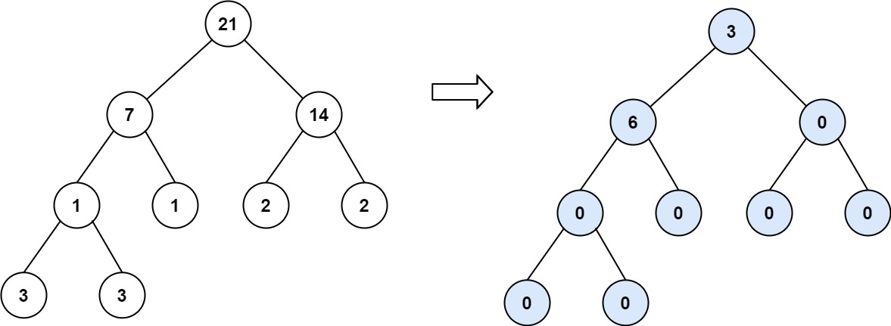

#### [563\. 二叉树的坡度](https://leetcode.cn/problems/binary-tree-tilt/)

难度：简单

给你一个二叉树的根节点 `root` ，计算并返回 **整个树** 的坡度 。

一个树的 **节点的坡度** 定义即为，该节点左子树的节点之和和右子树节点之和的 **差的绝对值** 。如果没有左子树的话，左子树的节点之和为 0 ；没有右子树的话也是一样。空结点的坡度是 0 。

**整个树** 的坡度就是其所有节点的坡度之和。

**示例 1：**


```
输入：root = [1,2,3]
输出：1
解释：
节点 2 的坡度：|0-0| = 0（没有子节点）
节点 3 的坡度：|0-0| = 0（没有子节点）
节点 1 的坡度：|2-3| = 1（左子树就是左子节点，所以和是 2 ；右子树就是右子节点，所以和是 3 ）
坡度总和：0 + 0 + 1 = 1
```

**示例 2：**


```
输入：root = [4,2,9,3,5,null,7]
输出：15
解释：
节点 3 的坡度：|0-0| = 0（没有子节点）
节点 5 的坡度：|0-0| = 0（没有子节点）
节点 7 的坡度：|0-0| = 0（没有子节点）
节点 2 的坡度：|3-5| = 2（左子树就是左子节点，所以和是 3 ；右子树就是右子节点，所以和是 5 ）
节点 9 的坡度：|0-7| = 7（没有左子树，所以和是 0 ；右子树正好是右子节点，所以和是 7 ）
节点 4 的坡度：|(3+5+2)-(9+7)| = |10-16| = 6（左子树值为 3、5 和 2 ，和是 10 ；右子树值为 9 和 7 ，和是 16 ）
坡度总和：0 + 0 + 0 + 2 + 7 + 6 = 15
```

**示例 3：**



```
输入：root = [21,7,14,1,1,2,2,3,3]
输出：9
```

**提示：**

-   树中节点数目的范围在 `[0, 10^4]` 内
-   `-1000 <= Node.val <= 1000`
