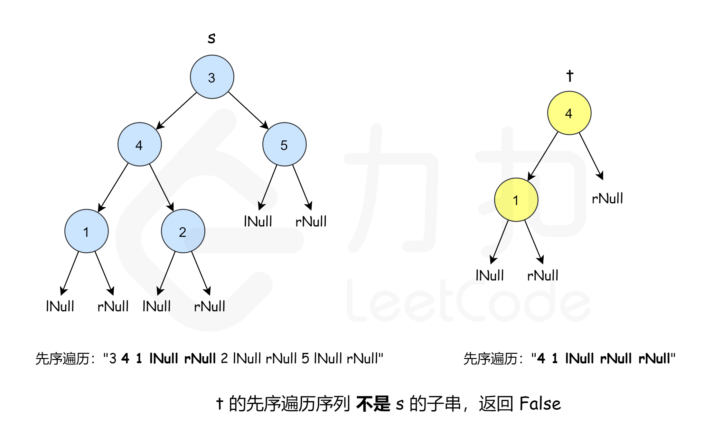

### [另一个树的子树](https://leetcode.cn/problems/subtree-of-another-tree/solutions/233896/ling-yi-ge-shu-de-zi-shu-by-leetcode-solution/)

#### 方法一：深度优先搜索暴力匹配

**思路和算法**

这是一种最朴素的方法——深度优先搜索枚举 $s$ 中的每一个节点，判断这个点的子树是否和 $t$ 相等。如何判断一个节点的子树是否和 $t$ 相等呢，我们又需要做一次深度优先搜索来检查，即让两个指针一开始先指向该节点和 $t$ 的根，然后「同步移动」两根指针来「同步遍历」这两棵树，判断对应位置是否相等。


```cpp
class Solution {
public:
    bool check(TreeNode *o, TreeNode *t) {
        if (!o && !t) {
            return true;
        }
        if ((o && !t) || (!o && t) || (o->val != t->val)) {
            return false;
        }
        return check(o->left, t->left) && check(o->right, t->right);
    }

    bool dfs(TreeNode *o, TreeNode *t) {
        if (!o) {
            return false;
        }
        return check(o, t) || dfs(o->left, t) || dfs(o->right, t);
    }

    bool isSubtree(TreeNode *s, TreeNode *t) {
        return dfs(s, t);
    }
};
```

```java
class Solution {
    public boolean isSubtree(TreeNode s, TreeNode t) {
        return dfs(s, t);
    }

    public boolean dfs(TreeNode s, TreeNode t) {
        if (s == null) {
            return false;
        }
        return check(s, t) || dfs(s.left, t) || dfs(s.right, t);
    }

    public boolean check(TreeNode s, TreeNode t) {
        if (s == null && t == null) {
            return true;
        }
        if (s == null || t == null || s.val != t.val) {
            return false;
        }
        return check(s.left, t.left) && check(s.right, t.right);
    }
}
```

```go
func isSubtree(s *TreeNode, t *TreeNode) bool {
    if s == nil {
        return false
    }
    return check(s, t) || isSubtree(s.Left, t) || isSubtree(s.Right, t)
}

func check(a, b *TreeNode) bool {
    if a == nil && b == nil {
        return true
    }
    if a == nil || b == nil {
        return false
    }
    if a.Val == b.Val {
        return check(a.Left, b.Left) && check(a.Right, b.Right)
    }
    return false
}
```

**复杂度分析**

-   时间复杂度：对于每一个 $s$ 上的点，都需要做一次深度优先搜索来和 $t$ 匹配，匹配一次的时间代价是 $O(|t|)$，那么总的时间代价就是 $O(|s| \times |t|)$。故渐进时间复杂度为 $O(|s| \times |t|)$。
-   空间复杂度：假设 $s$ 深度为 $d_s$，$t$ 的深度为 $d_t$，任意时刻栈空间的最大使用代价是 $O(\max \{ d_s, d_t \})$。故渐进空间复杂度为 $O(\max \{ d_s, d_t \})$。

#### 方法二：深度优先搜索序列上做串匹配

**思路和算法**

这个方法需要我们先了解一个「小套路」：一棵子树上的点在深度优先搜索序列（即先序遍历）中是连续的。了解了这个「小套路」之后，我们可以确定解决这个问题的方向就是：把 $s$ 和 $t$ 先转换成深度优先搜索序列，然后看 $t$ 的深度优先搜索序列是否是 $s$ 的深度优先搜索序列的「子串」。

**这样做正确吗？** 假设 $s$ 由两个点组成，$1$ 是根，$2$ 是 $1$ 的左孩子；$t$ 也由两个点组成，$1$ 是根，$2$ 是 $1$ 的右孩子。这样一来 $s$ 和 $t$ 的深度优先搜索序列相同，可是 $t$ 并不是 $s$ 的某一棵子树。由此可见「$s$ 的深度优先搜索序列包含 $t$ 的深度优先搜索序列」是「$t$ 是 $s$ 子树」的**必要不充分条件**，所以单纯这样做是不正确的。

为了解决这个问题，我们可以引入两个空值 `lNull` 和 `rNull`，当一个节点的左孩子或者右孩子为空的时候，就插入这两个空值，这样深度优先搜索序列就唯一对应一棵树。处理完之后，就可以通过判断「$s$ 的深度优先搜索序列包含 $t$ 的深度优先搜索序列」来判断答案。



在判断「$s$ 的深度优先搜索序列包含 $t$ 的深度优先搜索序列」的时候，可以暴力匹配，也可以使用 $KMP$ 或者 $Rabin-Karp$ 算法，在使用 $Rabin-Karp$ 算法的时候，要注意串中可能有负值。

这里给出用 $KMP$ 判断的代码实现。

```cpp
class Solution {
public:
    vector <int> sOrder, tOrder;
    int maxElement, lNull, rNull;

    void getMaxElement(TreeNode *o) {
        if (!o) {
            return;
        }
        maxElement = max(maxElement, o->val);
        getMaxElement(o->left);
        getMaxElement(o->right);
    }

    void getDfsOrder(TreeNode *o, vector <int> &tar) {
        if (!o) {
            return;
        }
        tar.push_back(o->val);
        if (o->left) {
            getDfsOrder(o->left, tar);
        } else {
            tar.push_back(lNull);
        }
        if (o->right) {
            getDfsOrder(o->right, tar);
        } else {
            tar.push_back(rNull);
        }
    }

    bool kmp() {
        int sLen = sOrder.size(), tLen = tOrder.size();
        vector <int> fail(tOrder.size(), -1);
        for (int i = 1, j = -1; i < tLen; ++i) {
            while (j != -1 && tOrder[i] != tOrder[j + 1]) {
                j = fail[j];
            }
            if (tOrder[i] == tOrder[j + 1]) {
                ++j;
            }
            fail[i] = j;
        }
        for (int i = 0, j = -1; i < sLen; ++i) {
            while (j != -1 && sOrder[i] != tOrder[j + 1]) {
                j = fail[j];
            }
            if (sOrder[i] == tOrder[j + 1]) {
                ++j;
            }
            if (j == tLen - 1) {
                return true;
            }
        }
        return false;
    }

    bool isSubtree(TreeNode* s, TreeNode* t) {
        maxElement = INT_MIN;
        getMaxElement(s);
        getMaxElement(t);
        lNull = maxElement + 1;
        rNull = maxElement + 2;

        getDfsOrder(s, sOrder);
        getDfsOrder(t, tOrder);

        return kmp();
    }
};
```

```java
class Solution {
    List<Integer> sOrder = new ArrayList<Integer>();
    List<Integer> tOrder = new ArrayList<Integer>();
    int maxElement, lNull, rNull;

    public boolean isSubtree(TreeNode s, TreeNode t) {
        maxElement = Integer.MIN_VALUE;
        getMaxElement(s);
        getMaxElement(t);
        lNull = maxElement + 1;
        rNull = maxElement + 2;

        getDfsOrder(s, sOrder);
        getDfsOrder(t, tOrder);

        return kmp();
    }

    public void getMaxElement(TreeNode t) {
        if (t == null) {
            return;
        }
        maxElement = Math.max(maxElement, t.val);
        getMaxElement(t.left);
        getMaxElement(t.right);
    }

    public void getDfsOrder(TreeNode t, List<Integer> tar) {
        if (t == null) {
            return;
        }
        tar.add(t.val);
        if (t.left != null) {
            getDfsOrder(t.left, tar);
        } else {
            tar.add(lNull);
        }
        if (t.right != null) {
            getDfsOrder(t.right, tar);
        } else {
            tar.add(rNull);
        }
    }

    public boolean kmp() {
        int sLen = sOrder.size(), tLen = tOrder.size();
        int[] fail = new int[tOrder.size()];
        Arrays.fill(fail, -1);
        for (int i = 1, j = -1; i < tLen; ++i) {
            while (j != -1 && !(tOrder.get(i).equals(tOrder.get(j + 1)))) {
                j = fail[j];
            }
            if (tOrder.get(i).equals(tOrder.get(j + 1))) {
                ++j;
            }
            fail[i] = j;
        }
        for (int i = 0, j = -1; i < sLen; ++i) {
            while (j != -1 && !(sOrder.get(i).equals(tOrder.get(j + 1)))) {
                j = fail[j];
            }
            if (sOrder.get(i).equals(tOrder.get(j + 1))) {
                ++j;
            }
            if (j == tLen - 1) {
                return true;
            }
        }
        return false;
    }
}
```

```go
func isSubtree(s *TreeNode, t *TreeNode) bool {
    maxEle := math.MinInt32
    getMaxElement(s, &maxEle)
    getMaxElement(t, &maxEle)
    lNull := maxEle + 1;
    rNull := maxEle + 2;

    sl, tl := getDfsOrder(s, []int{}, lNull, rNull), getDfsOrder(t, []int{}, lNull, rNull)
    return kmp(sl, tl)
}

func kmp(s, t []int) bool {
    sLen, tLen := len(s), len(t)
    fail := make([]int, sLen)
    for i := 0; i < sLen; i++ {
        fail[i] = -1
    }
    for i, j := 1, -1; i < tLen; i++ {
        for j != -1 && t[i] != t[j+1] {
            j = fail[j]
        }
        if t[i] == t[j+1] {
            j++
        }
        fail[i] = j
    }

    for i, j := 0, -1; i < sLen; i++ {
        for j != -1 && s[i] != t[j+1] {
            j = fail[j]
        }
        if s[i] == t[j+1] {
            j++
        }
        if j == tLen - 1 {
            return true
        }
    }
    return false
}

func getDfsOrder(t *TreeNode, list []int, lNull, rNull int) []int {
    if t == nil {
        return list
    }
    list = append(list, t.Val)
    if t.Left != nil {
        list = getDfsOrder(t.Left, list, lNull, rNull)
    } else {
        list = append(list, lNull)
    }

    if t.Right != nil {
        list = getDfsOrder(t.Right, list, lNull, rNull)
    } else {
        list = append(list, rNull)
    }
    return list
} 

func getMaxElement(t *TreeNode, maxEle *int) {
    if t == nil {
        return
    }
    if t.Val > *maxEle {
        *maxEle = t.Val
    }
    getMaxElement(t.Left, maxEle)
    getMaxElement(t.Right, maxEle)
}
```

**复杂度分析**

-   时间复杂度：遍历两棵树得到深度优先搜索序列的时间代价是 $O(|s| + |t|)$，在匹配的时候，如果使用暴力匹配，时间代价为 $O(|s| \times |t|)$，使用 $KMP$ 或 $Rabin-Karp$ 进行串匹配的时间代价都是 $O(|s| + |t|)$。由于这里的代码使用 $KMP$ 实现的，所以渐进时间复杂度为 $O(|s| + |t|)$。
-   空间复杂度：这里保存了两个深度优先搜索序列，还计算了 $|t|$ 长度的 `fail` 数组，辅助空间的总代价为 $O(|s| + |t|)$，任意时刻栈空间的最大使用代价是 $O(\max \{ d_s, d_t \})$，由于 $\max \{ d_s, d_t \} = O(|s| + |t|)$，故渐进空间复杂度为 $O(|s| + |t|)$。

#### 方法三：树哈希

**思路和算法**

考虑把每个子树都映射成一个唯一的数，如果 $t$ 对应的数字和 $s$ 中任意一个子树映射的数字相等，则 $t$ 是 $s$ 的某一棵子树。如何映射呢？我们可以定义这样的哈希函数：

$f_o = v_o + 31 \cdot f_l \cdot p(s_l) + 179 \cdot f_r \cdot p(s_r)$

这里 $f_x$ 表示节点 $x$ 的哈希值，$s_x$ 表示节点 $x$ 对应的子树大小，$v_x$ 代表节点 $x$ 的 `val`，$p(n)$ 表示第 $n$ 个素数，$o$ 表示当前节点，$l$ 和 $r$ 分别表示左右孩子。这个式子的意思是：当前节点 $o$ 的哈希值等于这个点的 `val` 加上 $31$ 倍左子树的哈希值乘以第 $s_l$ 个素数，再加上 $179$ 倍右子树的哈希值乘以第 $s_r$ 个素数。这里的 $31$ 和 $179$ 这两个数字只是为了区分左右子树，你可以自己选择你喜欢的权值。

**这样做为什么可行呢？** 回到我们的初衷，我们希望把每个子树都映射成一个唯一的数，这样真的能够确保唯一吗？实际上未必。但是我们在这个哈希函数中考虑到每个点的 `val`、子树哈希值、子树大小以及左右子树的不同权值，所以这些因素共同影响一个点的哈希值，所以出现冲突的几率较小，一般我们可以忽略。当然你也可以设计你自己的哈希函数，只要考虑到这些因素，就可以把冲突的可能性设计得比较小。**可是如果还是出现了冲突怎么办呢？** 我们可以设计两个哈希函数 $f_1$ 和 $f_2$，用这两个哈希函数生成第三个哈希函数，比如 $f = f_1 + f_2$、$f = f_1 \times f_2$ 等等，这样可以进一步缩小冲突，如果 $f_1$ 的冲突概率是 $P_1$，$f_2$ 的冲突概率是 $P_2$，那么 $f$ 的冲突概率就是 $P_1 \times P_2$，理论上已经非常小了，这就是「双哈希」。当然，为了减少冲突，你也可以设计「三哈希」、「四哈希」等，可是这样编程的复杂度就会增加。实际上，一般情况下，只要运气不是太差，一个哈希函数就足够了。

我们可以用「埃氏筛法」或者「欧拉筛法」求出前 $\arg \pi (\max \{ |s|, |t| \})$ 个素数（其中 $\pi (x)$ 表示 $x$ 以内素数个数，$\arg \pi (x)$ 为它的反函数，表示有多少以内包含 $x$ 个素数，这个映射是不唯一的，我们取最小值），然后深度优先搜索计算哈希值，最后比较 $s$ 的所有子树是否有和 $t$ 相同的哈希值即可。

```cpp
class Solution {
public:
    static constexpr int MAX_N = 1000 + 5;
    static constexpr int MOD = int(1E9) + 7;

    bool vis[MAX_N];
    int p[MAX_N], tot;
    void getPrime() {
        vis[0] = vis[1] = 1; tot = 0;
        for (int i = 2; i < MAX_N; ++i) {
            if (!vis[i]) p[++tot] = i;
            for (int j = 1; j <= tot && i * p[j] < MAX_N; ++j) {
                vis[i * p[j]] = 1;
                if (i % p[j] == 0) break;
            }
        }
    }

    struct Status {
        int f, s; // f 为哈希值 | s 为子树大小
        Status(int f_ = 0, int s_ = 0) 
            : f(f_), s(s_) {}
    };

    unordered_map <TreeNode *, Status> hS, hT;

    void dfs(TreeNode *o, unordered_map <TreeNode *, Status> &h) {
        h[o] = Status(o->val, 1);
        if (!o->left && !o->right) return;
        if (o->left) {
            dfs(o->left, h);
            h[o].s += h[o->left].s;
            h[o].f = (h[o].f + (31LL * h[o->left].f * p[h[o->left].s]) % MOD) % MOD;
        }
        if (o->right) {
            dfs(o->right, h);
            h[o].s += h[o->right].s;
            h[o].f = (h[o].f + (179LL * h[o->right].f * p[h[o->right].s]) % MOD) % MOD;
        }
    }

    bool isSubtree(TreeNode* s, TreeNode* t) {
        getPrime();
        dfs(s, hS);
        dfs(t, hT);

        int tHash = hT[t].f;
        for (const auto &[k, v]: hS) {
            if (v.f == tHash) {
                return true;
            }
        } 

        return false;
    }
};
```

```java
class Solution {
    static final int MAX_N = 1005;
    static final int MOD = 1000000007;
    boolean[] vis = new boolean[MAX_N];
    int[] p = new int[MAX_N];
    int tot;
    Map<TreeNode, int[]> hS = new HashMap<TreeNode, int[]>();
    Map<TreeNode, int[]> hT = new HashMap<TreeNode, int[]>();

    public boolean isSubtree(TreeNode s, TreeNode t) {
        getPrime();
        dfs(s, hS);
        dfs(t, hT);

        int tHash = hT.get(t)[0];
        for (Map.Entry<TreeNode, int[]> entry : hS.entrySet()) {
            if (entry.getValue()[0] == tHash) {
                return true;
            }
        }

        return false;
    }

    public void getPrime() {
        vis[0] = vis[1] = true;
        tot = 0;
        for (int i = 2; i < MAX_N; ++i) {
            if (!vis[i]) {
                p[++tot] = i;
            }
            for (int j = 1; j <= tot && i * p[j] < MAX_N; ++j) {
                vis[i * p[j]] = true;
                if (i % p[j] == 0) {
                    break;
                }
            }
        }
    }

    public void dfs(TreeNode o, Map<TreeNode, int[]> h) {
        h.put(o, new int[]{o.val, 1});
        if (o.left == null && o.right == null) {
            return;
        }
        if (o.left != null) {
            dfs(o.left, h);
            int[] val = h.get(o);
            val[1] += h.get(o.left)[1];
            val[0] = (int) ((val[0] + (31L * h.get(o.left)[0] * p[h.get(o.left)[1]]) % MOD) % MOD);
        }
        if (o.right != null) {
            dfs(o.right, h);
            int[] val = h.get(o);
            val[1] += h.get(o.right)[1];
            val[0] = (int) ((val[0] + (179L * h.get(o.right)[0] * p[h.get(o.right)[1]]) % MOD) % MOD);
        }
    }
}
```

**复杂度分析**

-   时间复杂度：筛选素数（此处为欧拉筛）的时间代价是 $O(\arg \pi (\max \{ |s|, |t| \}))$，对于 $10^6$ 以下的 $x$，一般有 $\arg \pi (x) < 15 x$，也就是在 $15 x$ 个自然数里一定能找到 $x$ 个素数，所以这里可以认为它比线性稍微慢一点。深度优先搜索求解和循环比较的时间代价是 $O(|s| + |t|)$。故渐进时间复杂度为 $O(\arg \pi (\max \{ |s|, |t| \}) + |s| + |t|) = O(\arg \pi (\max \{ |s|, |t| \}))$。
-   空间复杂度：这里用了哈希表来记录每个点的哈希值和子树大小，空间代价是 $O(|s| + |t|)$，筛选素数的 `vis` 数组的空间代价为 $O(\arg \pi (\max \{ |s|, |t| \}))$，任意时刻栈空间的最大使用代价是 $O(\max \{ d_s, d_t \})$，故渐进空间复杂度为 $O(\arg \pi (\max \{ |s|, |t| \}))$。
