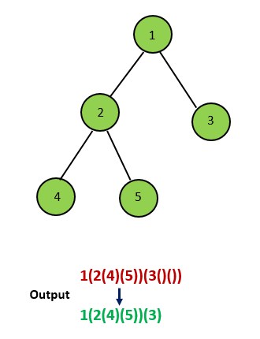
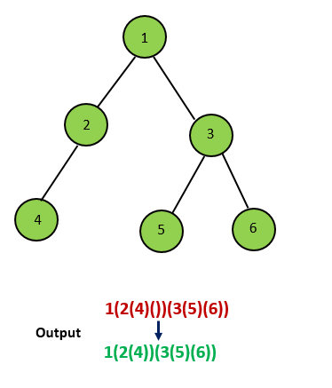
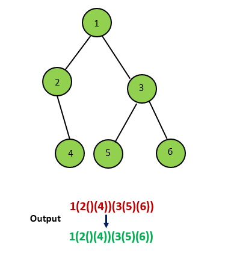

#### [方法二：迭代](https://leetcode.cn/problems/construct-string-from-binary-tree/solutions/1343920/gen-ju-er-cha-shu-chuang-jian-zi-fu-chua-e1af/)

我们也可以使用迭代的方法得到二叉树的前序遍历，并在迭代时加上额外的括号。

用一个栈来存储树中的一些节点，其中栈顶的元素为当前遍历到的节点，从栈底到栈顶的节点为从根到当前节点的唯一路径上的节点。和迭代得到前序遍历的方法略有不同，由于这里需要输出额外的括号，因此我们还需要用一个集合存储所有遍历过的节点，理由见下文。

首先我们把根节点入栈。对于当前栈顶的元素，如果它没有遍历过，那么就把它加入到集合中，并开始对以它为根的子树进行前序遍历。我们先在答案末尾添加一个 `‘(’`，表示一个节点的开始，然后判断该节点的子节点个数。

和方法一相同，这里会出现四种情况：

-   如果当前节点有两个孩子，那么我们先将右孩子入栈，再将左孩子入栈，从而保证前序遍历的顺序；
-   如果当前节点没有孩子，我们什么都不做；
-   如果当前节点只有左孩子，那么我们将左孩子入栈；
-   如果当前节点只有右孩子，那么需要在答案末尾添加一对 `‘()’` 表示空的左孩子，再将右孩子入栈。

注意这四种情况中，我们都不会将当前节点出栈，原因是我们一开始添加了 `‘(’` 表示节点的开始，在以当前节点为根的子树中所有节点遍历完成之后，我们才会在答案末尾添加 `‘)’` 表示节点的结束。因此我们需要用上面提到的集合来存储遍历过的节点，如果当前栈顶的元素遍历过，那么就需要在答案末尾添加 `‘)’` ，并将这个节点出栈。






```python
class Solution:
    def tree2str(self, root: Optional[TreeNode]) -> str:
        ans = ""
        st = [root]
        vis = set()
        while st:
            node = st[-1]
            if node in vis:
                if node != root:
                    ans += ")"
                st.pop()
            else:
                vis.add(node)
                if node != root:
                    ans += "("
                ans += str(node.val)
                if node.left is None and node.right:
                    ans += "()"
                if node.right:
                    st.append(node.right)
                if node.left:
                    st.append(node.left)
        return ans
```

```cpp
class Solution {
public:
    string tree2str(TreeNode *root) {
        string ans = "";
        stack<TreeNode *> st;
        st.push(root);
        unordered_set<TreeNode *> vis;
        while (!st.empty()) {
            auto node = st.top();
            if (vis.count(node)) {
                if (node != root) {
                    ans += ")";
                }
                st.pop();
            } else {
                vis.insert(node);
                if (node != root) {
                    ans += "(";
                }
                ans += to_string(node->val);
                if (node->left == nullptr && node->right != nullptr) {
                    ans += "()";
                }
                if (node->right != nullptr) {
                    st.push(node->right);
                }
                if (node->left != nullptr) {
                    st.push(node->left);
                }
            }
        }
        return ans;
    }
};
```

```java
class Solution {
    public String tree2str(TreeNode root) {
        StringBuffer ans = new StringBuffer();
        Deque<TreeNode> stack = new ArrayDeque<TreeNode>();
        stack.push(root);
        Set<TreeNode> visited = new HashSet<TreeNode>();
        while (!stack.isEmpty()) {
            TreeNode node = stack.peek();
            if (!visited.add(node)) {
                if (node != root) {
                    ans.append(")");
                }
                stack.pop();
            } else {
                if (node != root) {
                    ans.append("(");
                }
                ans.append(node.val);
                if (node.left == null && node.right != null) {
                    ans.append("()");
                }
                if (node.right != null) {
                    stack.push(node.right);
                }
                if (node.left != null) {
                    stack.push(node.left);
                }
            }
        }
        return ans.toString();
    }
}
```

```csharp
public class Solution {
    public string Tree2str(TreeNode root) {
        StringBuilder ans = new StringBuilder();
        Stack<TreeNode> stack = new Stack<TreeNode>();
        stack.Push(root);
        ISet<TreeNode> visited = new HashSet<TreeNode>();
        while (stack.Count > 0) {
            TreeNode node = stack.Peek();
            if (!visited.Add(node)) {
                if (node != root) {
                    ans.Append(")");
                }
                stack.Pop();
            } else {
                if (node != root) {
                    ans.Append("(");
                }
                ans.Append(node.val);
                if (node.left == null && node.right != null) {
                    ans.Append("()");
                }
                if (node.right != null) {
                    stack.Push(node.right);
                }
                if (node.left != null) {
                    stack.Push(node.left);
                }
            }
        }
        return ans.ToString();
    }
}
```

```go
func tree2str(root *TreeNode) string {
    ans := &strings.Builder{}
    st := []*TreeNode{root}
    vis := map[*TreeNode]bool{}
    for len(st) > 0 {
        node := st[len(st)-1]
        if vis[node] {
            if (node != root) {
                ans.WriteByte(')')
            }
            st = st[:len(st)-1]
        } else {
            vis[node] = true
            if (node != root) {
                ans.WriteByte('(')
            }
            ans.WriteString(strconv.Itoa(node.Val))
            if node.Left == nil && node.Right != nil {
                ans.WriteString("()")
            }
            if node.Right != nil {
                st = append(st, node.Right)
            }
            if node.Left != nil {
                st = append(st, node.Left)
            }
        }
    }
    return ans.String()
}
```

```c
#define MAX_STR_LEN 100000
#define MAX_NODE_SIZE 100000

typedef struct {
    struct TreeNode * key;
    UT_hash_handle hh; 
} HashItem;

char * tree2str(struct TreeNode* root){
    char * ans = (char *)malloc(sizeof(char) * MAX_STR_LEN);
    int pos = 0;
    struct TreeNode ** st = (struct TreeNode **)malloc(sizeof(struct TreeNode *) * MAX_NODE_SIZE);
    HashItem * vis = NULL;
    int top = 0;
    st[top++] = root;

    while (top > 0) {
        struct TreeNode * node = st[top - 1];
        HashItem * pEntry = NULL;
        HASH_FIND_PTR(vis, &node, pEntry);
        if (pEntry != NULL) {
            if (node != root) {
                ans[pos++] = ')';
            }
            top--;
        } else {
            pEntry = (HashItem *)malloc(sizeof(HashItem));
            pEntry->key = node;
            HASH_ADD_PTR(vis, key, pEntry);
            if (node != root) {
                ans[pos++] = '(';
            }
            pos += sprintf(ans + pos, "%d", node->val);
            if (node->left == NULL && node->right != NULL) {
                pos += sprintf(ans + pos, "()");
            }
            if (node->right != NULL) {
                st[top++] = node->right;
            }
            if (node->left != NULL) {
                st[top++] = node->left;
            }
        }        
    }
    ans[pos] = '\0';
    free(st);
    HashItem * curr, * next;
    HASH_ITER(hh, vis, curr, next) {
        HASH_DEL(vis, curr);  
        free(curr);            
    }
    return ans;
}
```

```javascript
var tree2str = function(root) {
    let ans = '';
    const st = [root];
    const vis = new Set();
    while (st.length) {
        const node = st[st.length - 1];
        if (vis.has(node)) {
            if (node !== root) {
                ans += ')';
            }
            st.pop();
        } else {
            vis.add(node);
            if (node !== root) {
                ans += '(';
            }
            ans += '' + node.val;
            if (!node.left && node.right) {
                ans += '()';
            }
            if (node.right) {
                st.push(node.right);
            }
            if (node.left) {
                st.push(node.left);
            }
        }
    }
    return ans;
};
```

**复杂度分析**

-   时间复杂度：$O(n)$，其中 $n$ 是二叉树中的节点数目。
-   空间复杂度：$O(n)$。哈希表和栈需要 $O(n)$ 的空间。
