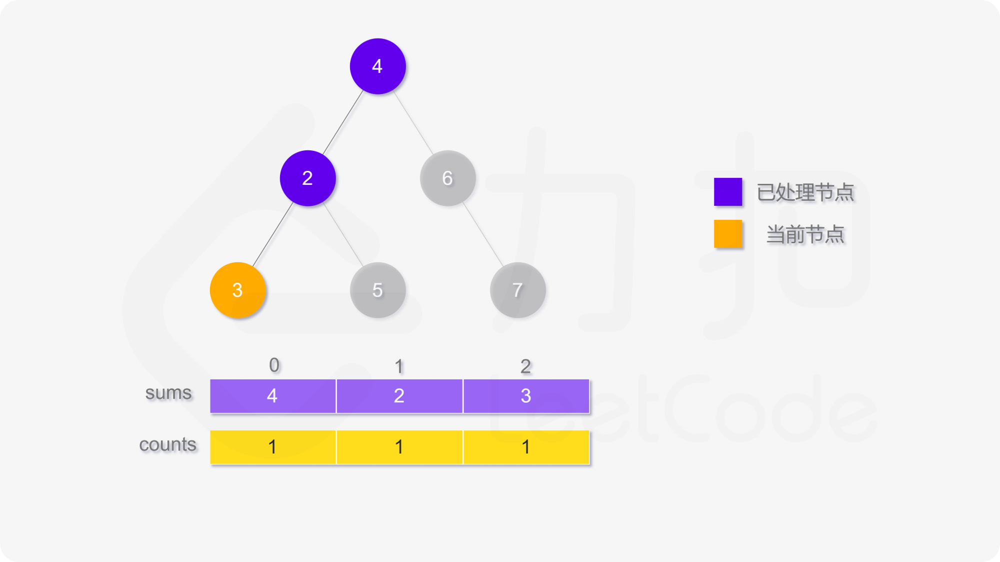

#### [方法一：深度优先搜索](https://leetcode.cn/problems/average-of-levels-in-binary-tree/solutions/410522/er-cha-shu-de-ceng-ping-jun-zhi-by-leetcode-soluti/)

使用深度优先搜索计算二叉树的层平均值，需要维护两个数组，counts 用于存储二叉树的每一层的节点数，sums 用于存储二叉树的每一层的节点值之和。搜索过程中需要记录当前节点所在层，如果访问到的节点在第 i 层，则将 counts[i] 的值加 1，并将该节点的值加到 sums[i]。

遍历结束之后，第 i 层的平均值即为 sums[i]/counts[i]。





```java
class Solution {
    public List<Double> averageOfLevels(TreeNode root) {
        List<Integer> counts = new ArrayList<Integer>();
        List<Double> sums = new ArrayList<Double>();
        dfs(root, 0, counts, sums);
        List<Double> averages = new ArrayList<Double>();
        int size = sums.size();
        for (int i = 0; i < size; i++) {
            averages.add(sums.get(i) / counts.get(i));
        }
        return averages;
    }

    public void dfs(TreeNode root, int level, List<Integer> counts, List<Double> sums) {
        if (root == null) {
            return;
        }
        if (level < sums.size()) {
            sums.set(level, sums.get(level) + root.val);
            counts.set(level, counts.get(level) + 1);
        } else {
            sums.add(1.0 * root.val);
            counts.add(1);
        }
        dfs(root.left, level + 1, counts, sums);
        dfs(root.right, level + 1, counts, sums);
    }
}
```

```go
type data struct{ sum, count int }

func averageOfLevels(root *TreeNode) []float64 {
    levelData := []data{}
    var dfs func(node *TreeNode, level int)
    dfs = func(node *TreeNode, level int) {
        if node == nil {
            return
        }
        if level < len(levelData) {
            levelData[level].sum += node.Val
            levelData[level].count++
        } else {
            levelData = append(levelData, data{node.Val, 1})
        }
        dfs(node.Left, level+1)
        dfs(node.Right, level+1)
    }
    dfs(root, 0)

    averages := make([]float64, len(levelData))
    for i, d := range levelData {
        averages[i] = float64(d.sum) / float64(d.count)
    }
    return averages
}
```

```cpp
class Solution {
public:
    vector<double> averageOfLevels(TreeNode* root) {
        auto counts = vector<int>();
        auto sums = vector<double>();
        dfs(root, 0, counts, sums);
        auto averages = vector<double>();
        int size = sums.size();
        for (int i = 0; i < size; i++) {
            averages.push_back(sums[i] / counts[i]);
        }
        return averages;
    }

    void dfs(TreeNode* root, int level, vector<int> &counts, vector<double> &sums) {
        if (root == nullptr) {
            return;
        }
        if (level < sums.size()) {
            sums[level] += root->val;
            counts[level] += 1;
        } else {
            sums.push_back(1.0 * root->val);
            counts.push_back(1);
        }
        dfs(root->left, level + 1, counts, sums);
        dfs(root->right, level + 1, counts, sums);
    }
};
```

```python
class Solution:
    def averageOfLevels(self, root: TreeNode) -> List[float]:
        def dfs(root: TreeNode, level: int):
            if not root:
                return
            if level < len(totals):
                totals[level] += root.val
                counts[level] += 1
            else:
                totals.append(root.val)
                counts.append(1)
            dfs(root.left, level + 1)
            dfs(root.right, level + 1)

        counts = list()
        totals = list()
        dfs(root, 0)
        return [total / count for total, count in zip(totals, counts)]
```

```c
int countsSize;
int sumsSize;

void dfs(struct TreeNode* root, int level, int* counts, double* sums) {
    if (root == NULL) {
        return;
    }
    if (level < sumsSize) {
        sums[level] += root->val;
        counts[level] += 1;
    } else {
        sums[sumsSize++] = (double)root->val;
        counts[countsSize++] = 1;
    }
    dfs(root->left, level + 1, counts, sums);
    dfs(root->right, level + 1, counts, sums);
}

double* averageOfLevels(struct TreeNode* root, int* returnSize) {
    countsSize = sumsSize = 0;
    int* counts = malloc(sizeof(int) * 1001);
    double* sums = malloc(sizeof(double) * 1001);
    dfs(root, 0, counts, sums);
    double* averages = malloc(sizeof(double) * 1001);
    *returnSize = sumsSize;
    for (int i = 0; i < sumsSize; i++) {
        averages[i] = sums[i] / counts[i];
    }
    return averages;
}
```

**复杂度分析**

-   时间复杂度：$O(n)$，其中 $n$ 是二叉树中的节点个数。 深度优先搜索需要对每个节点访问一次，对于每个节点，维护两个数组的时间复杂度都是 $O(1)$，因此深度优先搜索的时间复杂度是 $O(n)$。 遍历结束之后计算每层的平均值的时间复杂度是 $O(h)$，其中 $h$ 是二叉树的高度，任何情况下都满足 $h \le n$。 因此总时间复杂度是 $O(n)$。
-   空间复杂度：$O(n)$，其中 n 是二叉树中的节点个数。空间复杂度取决于两个数组的大小和递归调用的层数，两个数组的大小都等于二叉树的高度，递归调用的层数不会超过二叉树的高度，最坏情况下，二叉树的高度等于节点个数。
