#### [方法二：广度优先搜索](https://leetcode.cn/problems/average-of-levels-in-binary-tree/solutions/410522/er-cha-shu-de-ceng-ping-jun-zhi-by-leetcode-soluti/)

也可以使用广度优先搜索计算二叉树的层平均值。从根节点开始搜索，每一轮遍历同一层的全部节点，计算该层的节点数以及该层的节点值之和，然后计算该层的平均值。

如何确保每一轮遍历的是同一层的全部节点呢？我们可以借鉴层次遍历的做法，广度优先搜索使用队列存储待访问节点，只要确保在每一轮遍历时，队列中的节点是同一层的全部节点即可。具体做法如下：
-   初始时，将根节点加入队列；
-   每一轮遍历时，将队列中的节点全部取出，计算这些节点的数量以及它们的节点值之和，并计算这些节点的平均值，然后将这些节点的全部非空子节点加入队列，重复上述操作直到队列为空，遍历结束。

由于初始时队列中只有根节点，满足队列中的节点是同一层的全部节点，每一轮遍历时都会将队列中的当前层节点全部取出，并将下一层的全部节点加入队列，因此可以确保每一轮遍历的是同一层的全部节点。

具体实现方面，可以在每一轮遍历之前获得队列中的节点数量 size，遍历时只遍历 size 个节点，即可满足每一轮遍历的是同一层的全部节点。

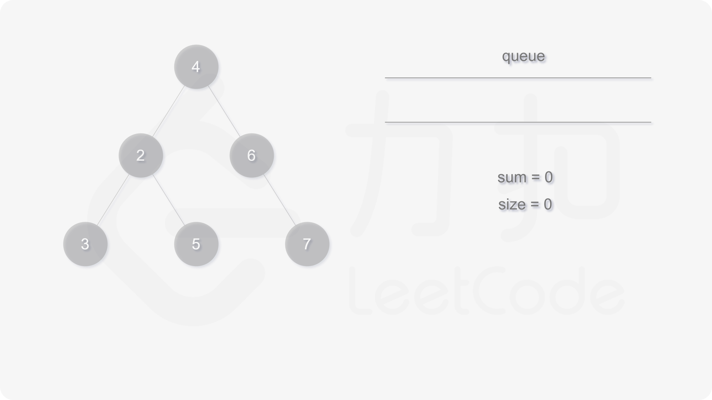
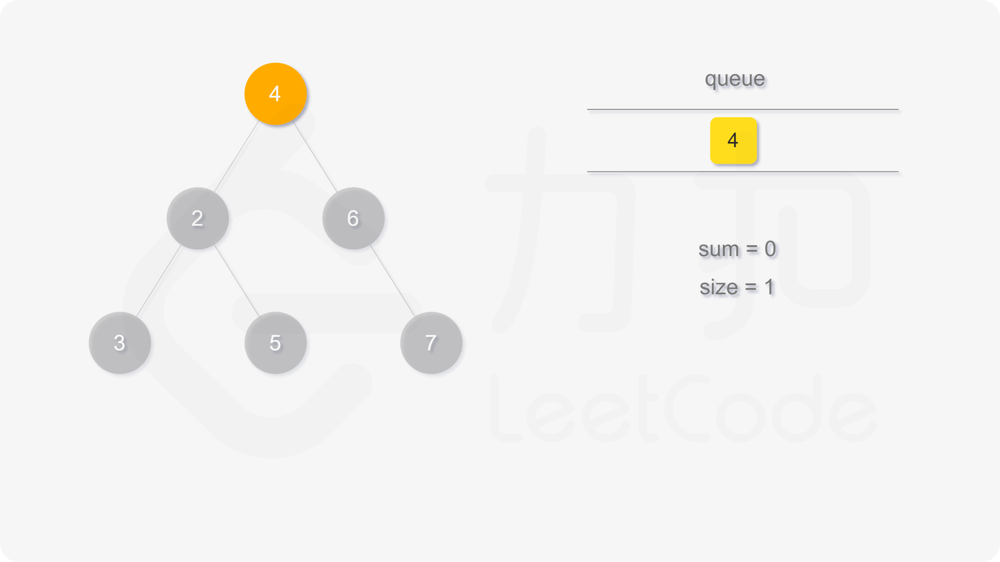
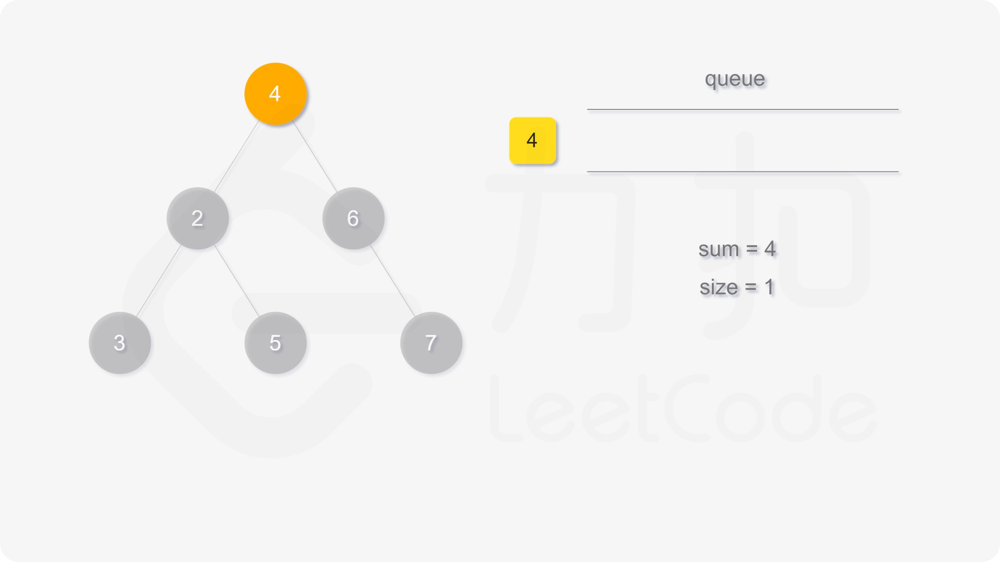
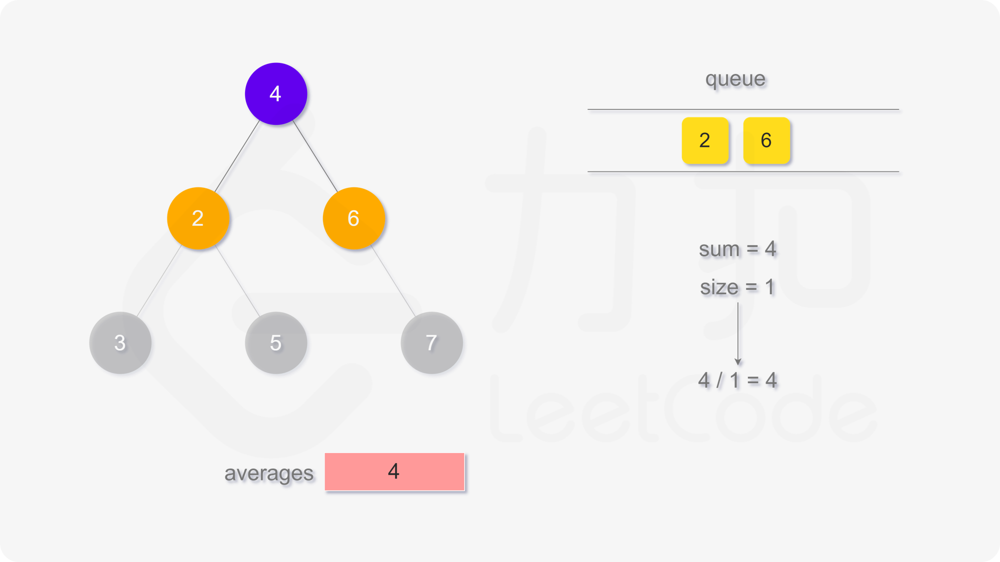
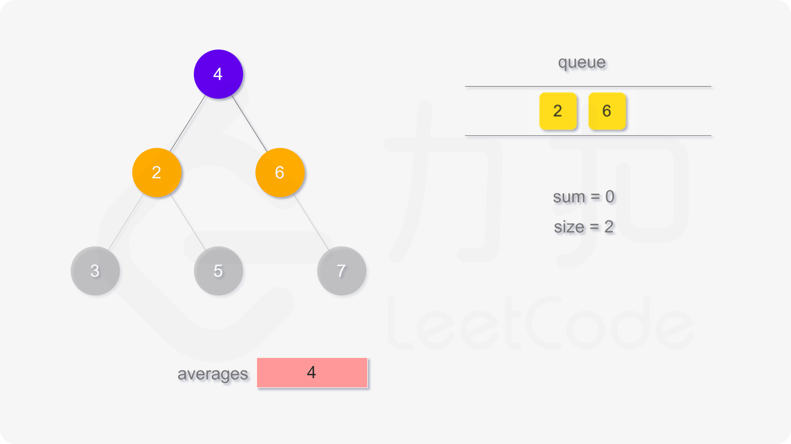
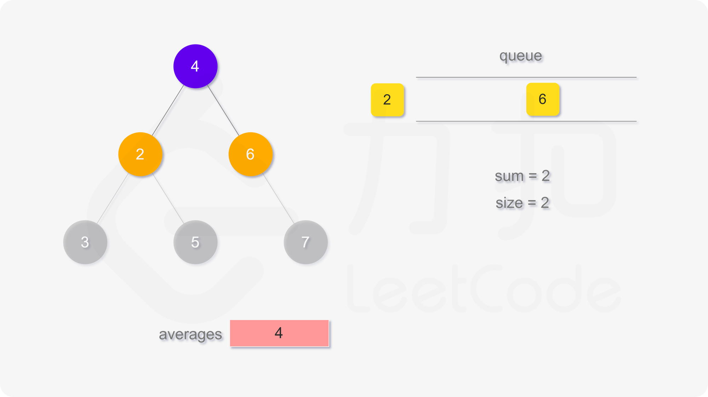
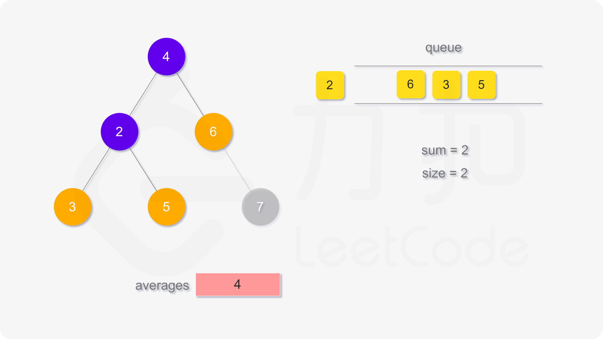
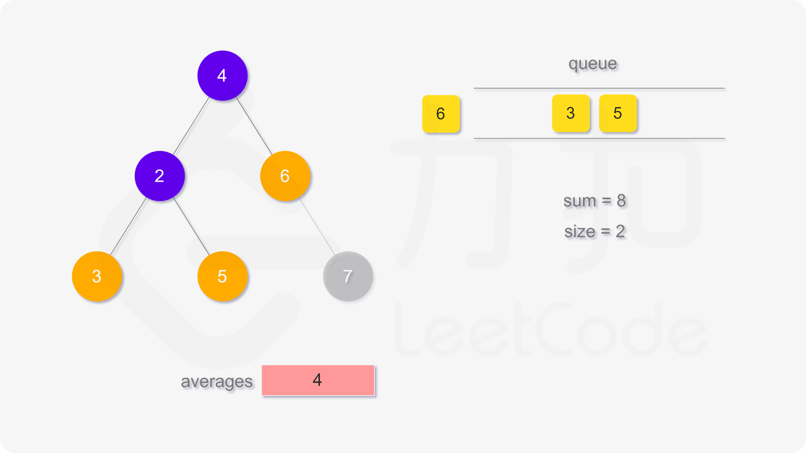
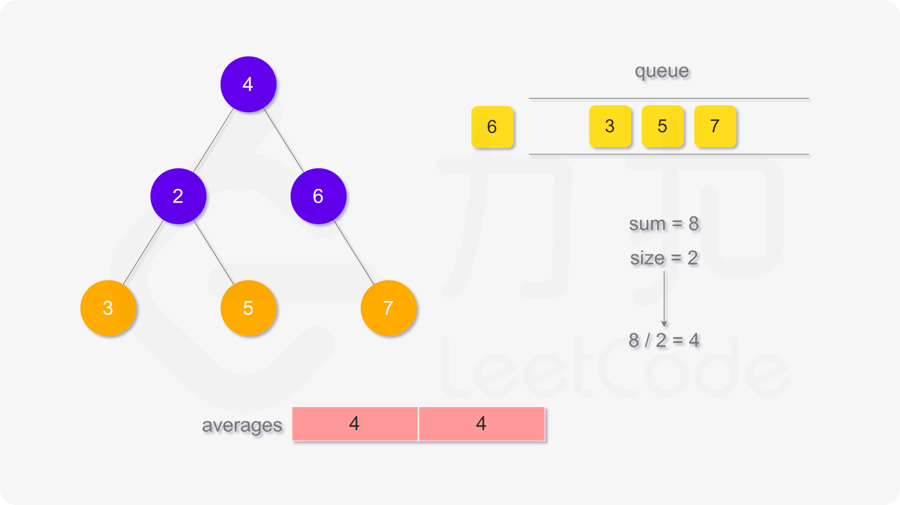
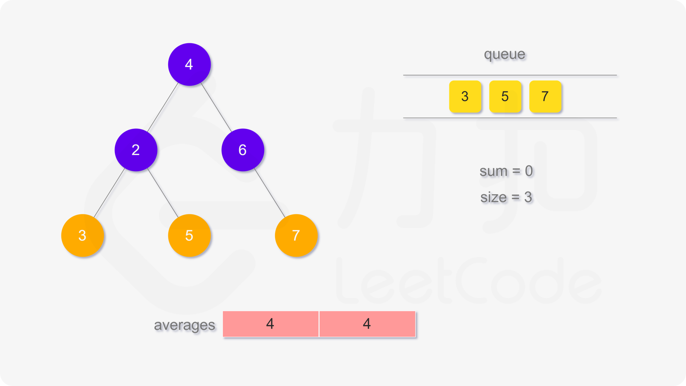

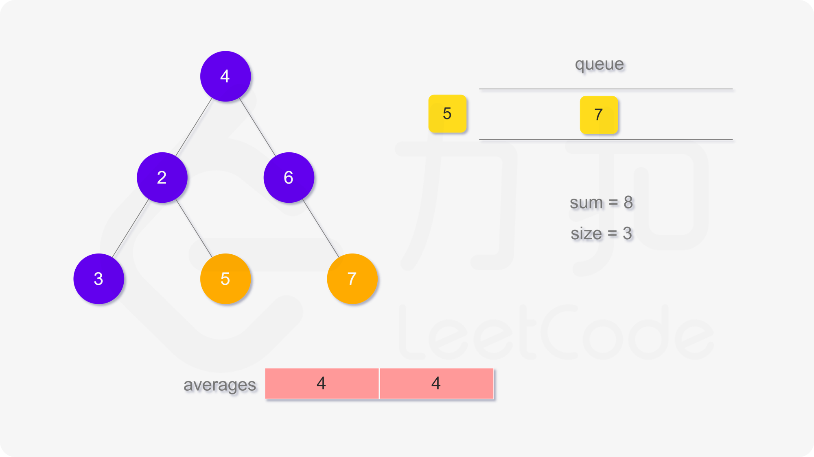
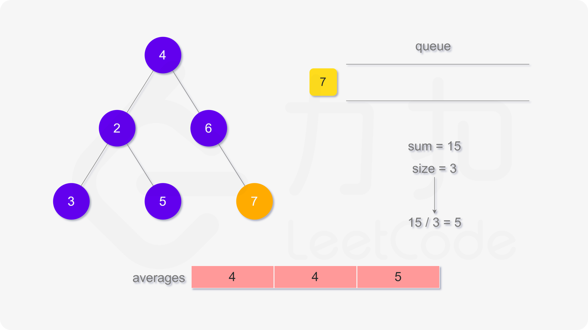
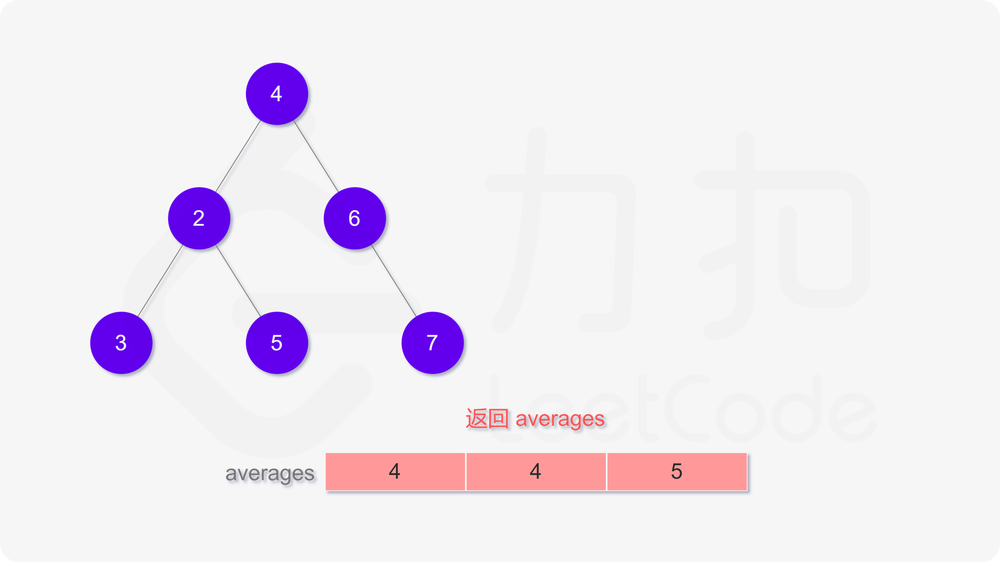

```java
class Solution {
    public List<Double> averageOfLevels(TreeNode root) {
        List<Double> averages = new ArrayList<Double>();
        Queue<TreeNode> queue = new LinkedList<TreeNode>();
        queue.offer(root);
        while (!queue.isEmpty()) {
            double sum = 0;
            int size = queue.size();
            for (int i = 0; i < size; i++) {
                TreeNode node = queue.poll();
                sum += node.val;
                TreeNode left = node.left, right = node.right;
                if (left != null) {
                    queue.offer(left);
                }
                if (right != null) {
                    queue.offer(right);
                }
            }
            averages.add(sum / size);
        }
        return averages;
    }
}
```

```go
func averageOfLevels(root *TreeNode) (averages []float64) {
    nextLevel := []*TreeNode{root}
    for len(nextLevel) > 0 {
        sum := 0
        curLevel := nextLevel
        nextLevel = nil
        for _, node := range curLevel {
            sum += node.Val
            if node.Left != nil {
                nextLevel = append(nextLevel, node.Left)
            }
            if node.Right != nil {
                nextLevel = append(nextLevel, node.Right)
            }
        }
        averages = append(averages, float64(sum)/float64(len(curLevel)))
    }
    return
}
```

```cpp
class Solution {
public:
    vector<double> averageOfLevels(TreeNode* root) {
        auto averages = vector<double>();
        auto q = queue<TreeNode*>();
        q.push(root);
        while (!q.empty()) {
            double sum = 0;
            int size = q.size();
            for (int i = 0; i < size; i++) {
                auto node = q.front();
                q.pop();
                sum += node->val;
                auto left = node->left, right = node->right;
                if (left != nullptr) {
                    q.push(left);
                }
                if (right != nullptr) {
                    q.push(right);
                }
            }
            averages.push_back(sum / size);
        }
        return averages;
    }
};
```

```python
class Solution:
    def averageOfLevels(self, root: TreeNode) -> List[float]:
        averages = list()
        queue = collections.deque([root])
        while queue:
            total = 0
            size = len(queue)
            for _ in range(size):
                node = queue.popleft()
                total += node.val
                left, right = node.left, node.right
                if left:
                    queue.append(left)
                if right:
                    queue.append(right)
            averages.append(total / size)
        return averages
```

```c
double* averageOfLevels(struct TreeNode* root, int* returnSize) {
    double* averages = malloc(sizeof(double) * 1001);
    struct TreeNode** q = malloc(sizeof(struct TreeNode*) * 10001);
    *returnSize = 0;

    int qleft = 0, qright = 0;
    q[qright++] = root;
    while (qleft < qright) {
        double sum = 0;
        int size = qright - qleft;
        for (int i = 0; i < size; i++) {
            struct TreeNode* node = q[qleft++];
            sum += node->val;
            struct TreeNode *left = node->left, *right = node->right;
            if (left != NULL) {
                q[qright++] = left;
            }
            if (right != NULL) {
                q[qright++] = right;
            }
        }
        averages[(*returnSize)++] = sum / size;
    }
    return averages;
}
```

**复杂度分析**

-   时间复杂度：$O(n)$，其中 $n$ 是二叉树中的节点个数。 广度优先搜索需要对每个节点访问一次，时间复杂度是 $O(n)$。 需要对二叉树的每一层计算平均值，时间复杂度是 $O(h)$，其中 $h$ 是二叉树的高度，任何情况下都满足 $h \le n$。 因此总时间复杂度是 $O(n)$。
-   空间复杂度：$O(n)$，其中 $n$ 是二叉树中的节点个数。空间复杂度取决于队列开销，队列中的节点个数不会超过 $n$。
