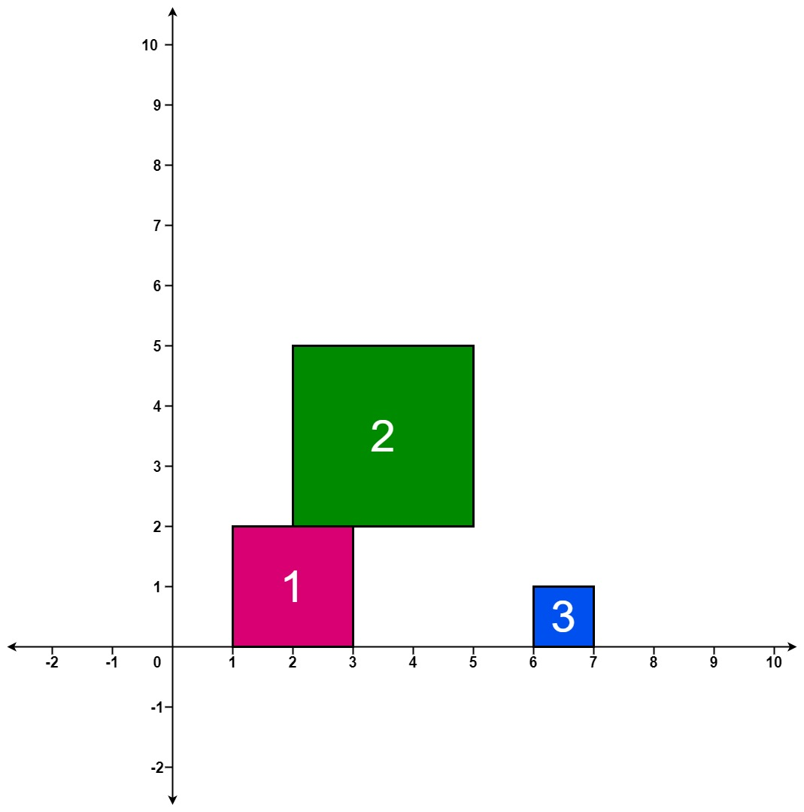

### [699\. 掉落的方块](https://leetcode.cn/problems/falling-squares/)

难度：困难

在二维平面上的 x 轴上，放置着一些方块。

给你一个二维整数数组 `positions` ，其中 `positions[i] = [left_i, sideLength_i]` 表示：第 `i` 个方块边长为 `sideLength_i` ，其左侧边与 x 轴上坐标点 `left_i` 对齐。

每个方块都从一个比目前所有的落地方块更高的高度掉落而下。方块沿 y 轴负方向下落，直到着陆到 **另一个正方形的顶边** 或者是 **x 轴上** 。一个方块仅仅是擦过另一个方块的左侧边或右侧边不算着陆。一旦着陆，它就会固定在原地，无法移动。

在每个方块掉落后，你必须记录目前所有已经落稳的 **方块堆叠的最高高度** 。

返回一个整数数组 `ans` ，其中 `ans[i]` 表示在第 `i` 块方块掉落后堆叠的最高高度。

**示例 1：**

> **输入：** positions = \[[1,2],[2,3],[6,1]]
> **输出：** [2,5,5]
> **解释：**
> 第 1 个方块掉落后，最高的堆叠由方块 1 组成，堆叠的最高高度为 2 。
> 第 2 个方块掉落后，最高的堆叠由方块 1 和 2 组成，堆叠的最高高度为 5 。
> 第 3 个方块掉落后，最高的堆叠仍然由方块 1 和 2 组成，堆叠的最高高度为 5 。
> 因此，返回 [2, 5, 5] 作为答案。

**示例 2：**

> **输入：** positions = \[[100,100],[200,100]]
> **输出：** [100,100]
> **解释：**
> 第 1 个方块掉落后，最高的堆叠由方块 1 组成，堆叠的最高高度为 100 。
> 第 2 个方块掉落后，最高的堆叠可以由方块 1 组成也可以由方块 2 组成，堆叠的最高高度为 100 。
> 因此，返回 [100, 100] 作为答案。
> 注意，方块 2 擦过方块 1 的右侧边，但不会算作在方块 1 上着陆。

**提示：**

- `1 <= positions.length <= 1000`
- <code>1 <= left_i <= 108</code>
- <code>1 <= sideLength_i <= 106</code>
