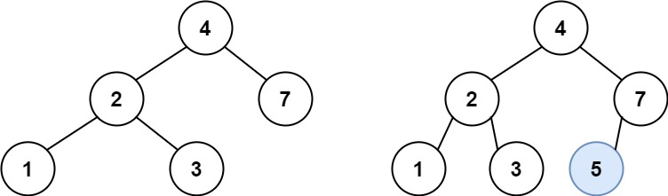
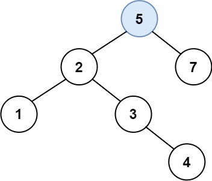

### [701\. 二叉搜索树中的插入操作](https://leetcode.cn/problems/insert-into-a-binary-search-tree/)

难度：中等

给定二叉搜索树（BST）的根节点 `root` 和要插入树中的值 `value`，将值插入二叉搜索树。返回插入后二叉搜索树的根节点。输入数据 **保证**，新值和原始二叉搜索树中的任意节点值都不同。

**注意**，可能存在多种有效的插入方式，只要树在插入后仍保持为二叉搜索树即可。你可以返回 **任意有效的结果**。

**示例 1：**

> 
> **输入：** root = [4,2,7,1,3], val = 5
> **输出：** [4,2,7,1,3,5]
> **解释：** 另一个满足题目要求可以通过的树是：
> 

**示例 2：**

> **输入：** root = [40,20,60,10,30,50,70], val = 25
> **输出：** [40,20,60,10,30,50,70,null,null,25]

**示例 3：**

> **输入：** root = [4,2,7,1,3,null,null,null,null,null,null], val = 5
> **输出：** [4,2,7,1,3,5]

**提示：**

- 树中的节点数将在 <code>[0, 104]</code>的范围内。
- <code>-108 <= Node.val <= 108</code>
- 所有值 `Node.val` 是 **独一无二** 的。
- <code>-108 <= val <= 108</code>
- **保证** `val` 在原始BST中不存在。
