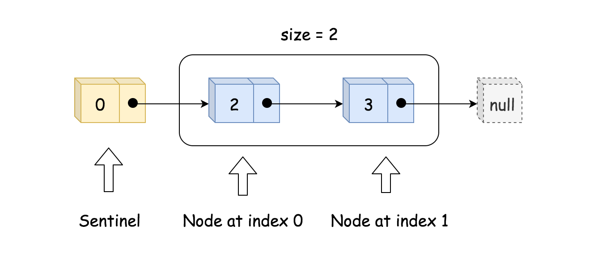
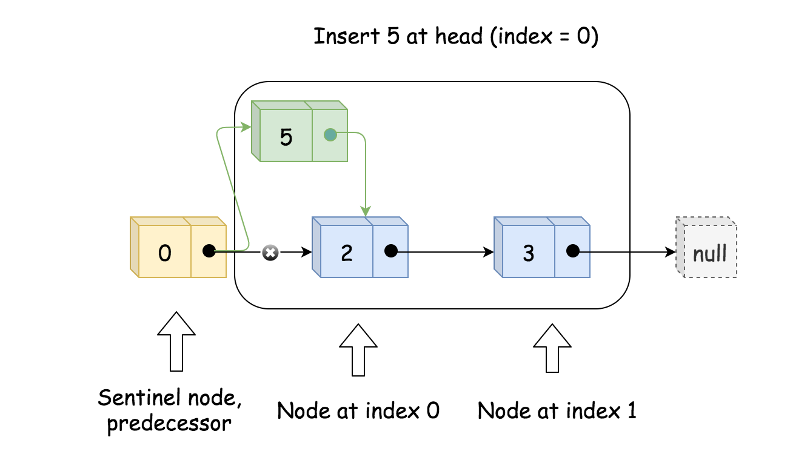

#### [方法一：单向链表](https://leetcode.cn/problems/design-linked-list/solutions/1840997/she-ji-lian-biao-by-leetcode-solution-abix/)

**思路**

实现单向链表，即每个节点仅存储本身的值和后继节点。除此之外，我们还需要一个哨兵（sentinel）节点作为头节点，和一个 $size$ 参数保存有效节点数。如下图所示。 

初始化时，只需创建头节点 $head$ 和 $size$ 即可。

实现 $get(index)$ 时，先判断有效性，再通过循环来找到对应的节点的值。如下图所示。 

实现 $addAtIndex(index, val)$ 时，如果 $index$ 是有效值，则需要找到原来下标为 $index$ 的节点的前驱节点 $pred$，并创建新节点 $to_add$，将 $to_add$ 的后继节点设为 $pred$ 的后继节点，将 $pred$ 的后继节点更新为 $to_add$，这样就将 $to_add$ 插入到了链表中。最后需要更新 $size$。这样的操作对于 $index = 0$ 也成立，如以下两张图所示。  

实现 $addAtHead(val)$ 和 $addAtTail(val)$ 时，可以借助 $addAtIndex(index, val)$ 来实现。

实现 $deleteAtIndex(index)$，先判断参数有效性。然后找到下标为 $index$ 的节点的前驱节点 $pred$，通过将 $pred$ 的后继节点更新为 $pred$ 的后继节点的后继节点，来达到删除节点的效果。同时也要更新 $size$。如下图所示。 

**代码**

```python
class ListNode:

    def __init__(self, val):
        self.val = val
        self.next = None


class MyLinkedList:

    def __init__(self):
        self.size = 0
        self.head = ListNode(0)


    def get(self, index: int) -> int:
        if index < 0 or index >= self.size:
            return -1
        cur = self.head
        for _ in range(index + 1):
            cur = cur.next
        return cur.val


    def addAtHead(self, val: int) -> None:
        self.addAtIndex(0, val)


    def addAtTail(self, val: int) -> None:
        self.addAtIndex(self.size, val)


    def addAtIndex(self, index: int, val: int) -> None:
        if index > self.size:
            return
        index = max(0, index)
        self.size += 1
        pred = self.head
        for _ in range(index):
            pred = pred.next
        to_add = ListNode(val)
        to_add.next = pred.next
        pred.next = to_add

    def deleteAtIndex(self, index: int) -> None:
        if index < 0 or index >= self.size:
            return
        self.size -= 1
        pred = self.head
        for _ in range(index):
            pred = pred.next
        pred.next = pred.next.next
```

```java
class MyLinkedList {
    int size;
    ListNode head;

    public MyLinkedList() {
        size = 0;
        head = new ListNode(0);
    }

    public int get(int index) {
        if (index < 0 || index >= size) {
            return -1;
        }
        ListNode cur = head;
        for (int i = 0; i <= index; i++) {
            cur = cur.next;
        }
        return cur.val;
    }

    public void addAtHead(int val) {
        addAtIndex(0, val);
    }

    public void addAtTail(int val) {
        addAtIndex(size, val);
    }

    public void addAtIndex(int index, int val) {
        if (index > size) {
            return;
        }
        index = Math.max(0, index);
        size++;
        ListNode pred = head;
        for (int i = 0; i < index; i++) {
            pred = pred.next;
        }
        ListNode toAdd = new ListNode(val);
        toAdd.next = pred.next;
        pred.next = toAdd;
    }

    public void deleteAtIndex(int index) {
        if (index < 0 || index >= size) {
            return;
        }
        size--;
        ListNode pred = head;
        for (int i = 0; i < index; i++) {
            pred = pred.next;
        }
        pred.next = pred.next.next;
    }
}

class ListNode {
    int val;
    ListNode next;

    public ListNode(int val) {
        this.val = val;
    }
}
```

```csharp
public class MyLinkedList {
    int size;
    ListNode head;

    public MyLinkedList() {
        size = 0;
        head = new ListNode(0);
    }

    public int Get(int index) {
         if (index < 0 || index >= size) {
            return -1;
        }
        ListNode cur = head;
        for (int i = 0; i <= index; i++) {
            cur = cur.next;
        }
        return cur.val;
    }

    public void AddAtHead(int val) {
        AddAtIndex(0, val);
    }

    public void AddAtTail(int val) {
        AddAtIndex(size, val);
    }

    public void AddAtIndex(int index, int val) {
        if (index > size) {
            return;
        }
        index = Math.Max(0, index);
        size++;
        ListNode pred = head;
        for (int i = 0; i < index; i++) {
            pred = pred.next;
        }
        ListNode toAdd = new ListNode(val);
        toAdd.next = pred.next;
        pred.next = toAdd;
    }

    public void DeleteAtIndex(int index) {
        if (index < 0 || index >= size) {
            return;
        }
        size--;
        ListNode pred = head;
        for (int i = 0; i < index; i++) {
            pred = pred.next;
        }
        pred.next = pred.next.next;
    }
}

class ListNode {
    public int val;
    public ListNode next;

    public ListNode(int val) {
        this.val = val;
    }
}
```

```cpp
class MyLinkedList {
public:
    MyLinkedList() {
        this->size = 0;
        this->head = new ListNode(0);
    }
    
    int get(int index) {
        if (index < 0 || index >= size) {
            return -1;
        }
        ListNode *cur = head;
        for (int i = 0; i <= index; i++) {
            cur = cur->next;
        }
        return cur->val;
    }
    
    void addAtHead(int val) {
        addAtIndex(0, val);
    }
    
    void addAtTail(int val) {
        addAtIndex(size, val);
    }
    
    void addAtIndex(int index, int val) {
        if (index > size) {
            return;
        }
        index = max(0, index);
        size++;
        ListNode *pred = head;
        for (int i = 0; i < index; i++) {
            pred = pred->next;
        }
        ListNode *toAdd = new ListNode(val);
        toAdd->next = pred->next;
        pred->next = toAdd;
    }
    
    void deleteAtIndex(int index) {
        if (index < 0 || index >= size) {
            return;
        }
        size--;
        ListNode *pred = head;
        for (int i = 0; i < index; i++) {
            pred = pred->next;
        }
        ListNode *p = pred->next;
        pred->next = pred->next->next;
        delete p;
    }
private:
    int size;
    ListNode *head;
};
```

```c
#define MAX(a, b) ((a) > (b) ? (a) : (b))

typedef struct {
    struct ListNode *head;
    int size;
} MyLinkedList;

struct ListNode *ListNodeCreat(int val) {
    struct ListNode * node = (struct ListNode *)malloc(sizeof(struct ListNode));
    node->val = val;
    node->next = NULL;
    return node;
}

MyLinkedList* myLinkedListCreate() {
    MyLinkedList * obj = (MyLinkedList *)malloc(sizeof(MyLinkedList));
    obj->head = ListNodeCreat(0);
    obj->size = 0;
    return obj;
}

int myLinkedListGet(MyLinkedList* obj, int index) {
    if (index < 0 || index >= obj->size) {
        return -1;
    }
    struct ListNode *cur = obj->head;
    for (int i = 0; i <= index; i++) {
        cur = cur->next;
    }
    return cur->val;
}

void myLinkedListAddAtIndex(MyLinkedList* obj, int index, int val) {
    if (index > obj->size) {
        return;
    }
    index = MAX(0, index);
    obj->size++;
    struct ListNode *pred = obj->head;
    for (int i = 0; i < index; i++) {
        pred = pred->next;
    }
    struct ListNode *toAdd = ListNodeCreat(val);
    toAdd->next = pred->next;
    pred->next = toAdd;
}

void myLinkedListAddAtHead(MyLinkedList* obj, int val) {
    myLinkedListAddAtIndex(obj, 0, val);
}

void myLinkedListAddAtTail(MyLinkedList* obj, int val) {
    myLinkedListAddAtIndex(obj, obj->size, val);
}

void myLinkedListDeleteAtIndex(MyLinkedList* obj, int index) {
    if (index < 0 || index >= obj->size) {
        return;
    }
    obj->size--;
    struct ListNode *pred = obj->head;
    for (int i = 0; i < index; i++) {
        pred = pred->next;
    }
    struct ListNode *p = pred->next;
    pred->next = pred->next->next;
    free(p);
}

void myLinkedListFree(MyLinkedList* obj) {
    struct ListNode *cur = NULL, *tmp = NULL;
    for (cur = obj->head; cur;) {
        tmp = cur;
        cur = cur->next;
        free(tmp);
    }
    free(obj);
}
```

```javascript
var MyLinkedList = function() {
    this.size = 0;
    this.head = new ListNode(0);
};

MyLinkedList.prototype.get = function(index) {
    if (index < 0 || index >= this.size) {
        return -1;
    }
    let cur = this.head;
    for (let i = 0; i <= index; i++) {
        cur = cur.next;
    }
    return cur.val;
};

MyLinkedList.prototype.addAtHead = function(val) {
    this.addAtIndex(0, val);
};

MyLinkedList.prototype.addAtTail = function(val) {
    this.addAtIndex(this.size, val);
};

MyLinkedList.prototype.addAtIndex = function(index, val) {
    if (index > this.size) {
        return;
    }
    index = Math.max(0, index);
    this.size++;
    let pred = this.head;
    for (let i = 0; i < index; i++) {
        pred = pred.next;
    }
    let toAdd = new ListNode(val);
    toAdd.next = pred.next;
    pred.next = toAdd;
};

MyLinkedList.prototype.deleteAtIndex = function(index) {
    if (index < 0 || index >= this.size) {
        return;
    }
    this.size--;
    let pred = this.head;
    for (let i = 0; i < index; i++) {
        pred = pred.next;
    }
    pred.next = pred.next.next;
};

function ListNode(val, next) {
    this.val = (val===undefined ? 0 : val)
    this.next = (next===undefined ? null : next)
}
```

```go
type MyLinkedList struct {
    head *ListNode
    size int
}

func Constructor() MyLinkedList {
    return MyLinkedList{&ListNode{}, 0}
}

func (l *MyLinkedList) Get(index int) int {
    if index < 0 || index >= l.size {
        return -1
    }
    cur := l.head
    for i := 0; i <= index; i++ {
        cur = cur.Next
    }
    return cur.Val
}

func (l *MyLinkedList) AddAtHead(val int) {
    l.AddAtIndex(0, val)
}

func (l *MyLinkedList) AddAtTail(val int) {
    l.AddAtIndex(l.size, val)
}

func (l *MyLinkedList) AddAtIndex(index, val int) {
    if index > l.size {
        return
    }
    index = max(index, 0)
    l.size++
    pred := l.head
    for i := 0; i < index; i++ {
        pred = pred.Next
    }
    toAdd := &ListNode{val, pred.Next}
    pred.Next = toAdd
}

func (l *MyLinkedList) DeleteAtIndex(index int) {
    if index < 0 || index >= l.size {
        return
    }
    l.size--
    pred := l.head
    for i := 0; i < index; i++ {
        pred = pred.Next
    }
    pred.Next = pred.Next.Next
}

func max(a, b int) int {
    if b > a {
        return b
    }
    return a
}
```

**复杂度分析**

-   时间复杂度：初始化消耗 $O(1)$，$get$ 消耗 $O(index)$，$addAtHead$ 消耗 $O(1)$，$addAtTail$ 消耗 $O(n)$，其中 $n$ 为链表当前长度，即 $addAtHead$，$addAtTail$ 和 $addAtIndex$ 已调用次数之和，$addAtIndex$ 消耗 $O(index)$。
-   空间复杂度：所有函数的单次调用空间复杂度均为 $O(1)$，总体空间复杂度为 $O(n)$，其中 $n$ 为 $addAtHead$，$addAtTail$ 和 $addAtIndex$ 调用次数之和。
