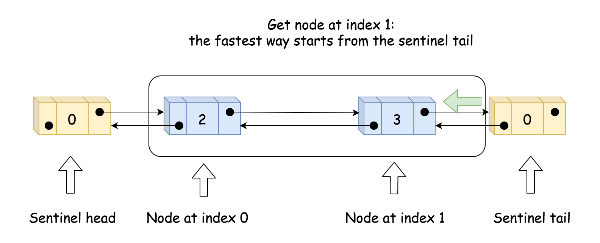
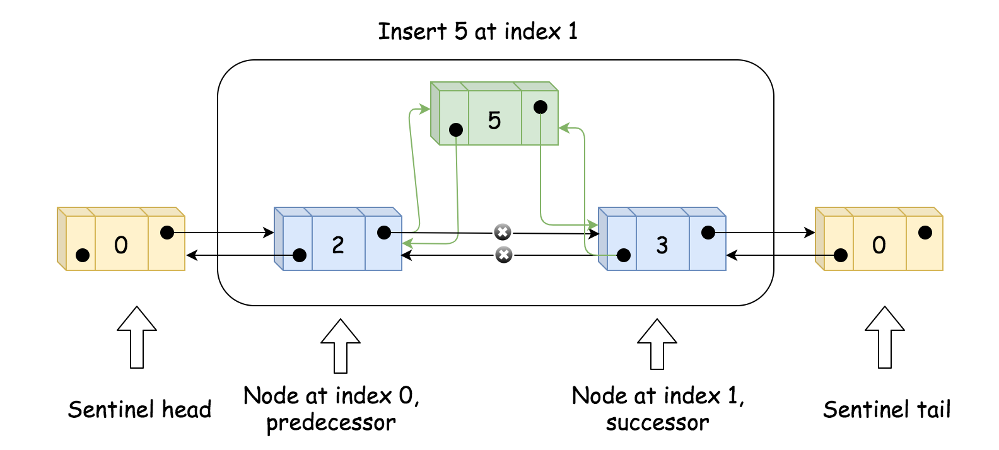

#### [方法二：双向链表](https://leetcode.cn/problems/design-linked-list/solutions/1840997/she-ji-lian-biao-by-leetcode-solution-abix/)

**思路**

实现双向链表，即每个节点要存储本身的值，后继节点和前驱节点。除此之外，需要一个哨兵节点作为头节点 $head$ 和一个哨兵节点作为尾节点 $tail$。仍需要一个 $size$ 参数保存有效节点数。如下图所示。 

初始化时，只需创建头节点 $head$ 和 $size$ 即可。

实现 $get(index)$ 时，先判断有效性，然后再比较从 $head$ 还是 $tail$ 来遍历会比较快找到目标，然后进行遍历。如下图所示。 

实现 $addAtIndex(index, val)$ 时，如果 $index$ 是有效值，则需要找到原来下标为 $index$ 的节点 $succ$ 和前驱节点 $pred$，并创建新节点 $to_add$，再通过各自 $prev$ 和 $next$ 变量的更新来增加 $to_add$。最后需要更新 $size$。如以下两张图所示。 

实现 $addAtHead(val)$ 和 $addAtTail(val)$ 时，可以借助 $addAtIndex(index, val)$ 来实现。

实现 $deleteAtIndex(index)$，先判断参数有效性。然后找到下标为 $index$ 的节点的前驱节点 $pred$ 和后继节点 $succ$，再通过各自 $prev$ 和 $next$ 变量的更新来删除节点，来达到删除节点的效果。同时也要更新 $size$。如下图所示。 

**代码**

```python
class ListNode:

    def __init__(self, x):
        self.val = x
        self.next = None
        self.prev = None


class MyLinkedList:

    def __init__(self):
        self.size = 0
        self.head, self.tail = ListNode(0), ListNode(0) 
        self.head.next = self.tail
        self.tail.prev = self.head


    def get(self, index: int) -> int:
        if index < 0 or index >= self.size:
            return -1
        if index + 1 < self.size - index:
            curr = self.head
            for _ in range(index + 1):
                curr = curr.next
        else:
            curr = self.tail
            for _ in range(self.size - index):
                curr = curr.prev
        return curr.val


    def addAtHead(self, val: int) -> None:
        self.addAtIndex(0, val)


    def addAtTail(self, val: int) -> None:
        self.addAtIndex(self.size, val)


    def addAtIndex(self, index: int, val: int) -> None:
        if index > self.size:
            return
        index = max(0, index)
        if index < self.size - index:
            pred = self.head
            for _ in range(index):
                pred = pred.next
            succ = pred.next
        else:
            succ = self.tail
            for _ in range(self.size - index):
                succ = succ.prev
            pred = succ.prev
        self.size += 1
        to_add = ListNode(val)
        to_add.prev = pred
        to_add.next = succ
        pred.next = to_add
        succ.prev = to_add


    def deleteAtIndex(self, index: int) -> None:
        if index < 0 or index >= self.size:
            return
        if index < self.size - index:
            pred = self.head
            for _ in range(index):
                pred = pred.next
            succ = pred.next.next
        else:
            succ = self.tail
            for _ in range(self.size - index - 1):
                succ = succ.prev
            pred = succ.prev.prev
        self.size -= 1
        pred.next = succ
        succ.prev = pred
```

```java
class MyLinkedList {
    int size;
    ListNode head;
    ListNode tail;

    public MyLinkedList() {
        size = 0;
        head = new ListNode(0);
        tail = new ListNode(0);
        head.next = tail;
        tail.prev = head;
    }

    public int get(int index) {
        if (index < 0 || index >= size) {
            return -1;
        }
        ListNode curr;
        if (index + 1 < size - index) {
            curr = head;
            for (int i = 0; i <= index; i++) {
                curr = curr.next;
            }
        } else {
            curr = tail;
            for (int i = 0; i < size - index; i++) {
                curr = curr.prev;
            }
        }
        return curr.val;
    }

    public void addAtHead(int val) {
        addAtIndex(0, val);
    }

    public void addAtTail(int val) {
        addAtIndex(size, val);
    }

    public void addAtIndex(int index, int val) {
        if (index > size) {
            return;
        }
        index = Math.max(0, index);
        ListNode pred, succ;
        if (index < size - index) {
            pred = head;
            for (int i = 0; i < index; i++) {
                pred = pred.next;
            }
            succ = pred.next;
        } else {
            succ = tail;
            for (int i = 0; i < size - index; i++) {
                succ = succ.prev;
            }
            pred = succ.prev;
        }
        size++;
        ListNode toAdd = new ListNode(val);
        toAdd.prev = pred;
        toAdd.next = succ;
        pred.next = toAdd;
        succ.prev = toAdd;
    }

    public void deleteAtIndex(int index) {
        if (index < 0 || index >= size) {
            return;
        }
        ListNode pred, succ;
        if (index < size - index) {
            pred = head;
            for (int i = 0; i < index; i++) {
                pred = pred.next;
            }
            succ = pred.next.next;
        } else {
            succ = tail;
            for (int i = 0; i < size - index - 1; i++) {
                succ = succ.prev;
            }
            pred = succ.prev.prev;
        }
        size--;
        pred.next = succ;
        succ.prev = pred;
    }
}

class ListNode {
    int val;
    ListNode next;
    ListNode prev;

    public ListNode(int val) {
        this.val = val;
    }
}
```

```csharp
public class MyLinkedList {
    int size;
    ListNode head;
    ListNode tail;

    public MyLinkedList() {
        size = 0;
        head = new ListNode(0);
        tail = new ListNode(0);
        head.next = tail;
        tail.prev = head;
    }

    public int Get(int index) {
        if (index < 0 || index >= size) {
            return -1;
        }
        ListNode curr;
        if (index + 1 < size - index) {
            curr = head;
            for (int i = 0; i <= index; i++) {
                curr = curr.next;
            }
        } else {
            curr = tail;
            for (int i = 0; i < size - index; i++) {
                curr = curr.prev;
            }
        }
        return curr.val;
    }

    public void AddAtHead(int val) {
        AddAtIndex(0, val);
    }

    public void AddAtTail(int val) {
        AddAtIndex(size, val);
    }

    public void AddAtIndex(int index, int val) {
        if (index > size) {
            return;
        }
        index = Math.Max(0, index);
        ListNode pred, succ;
        if (index < size - index) {
            pred = head;
            for (int i = 0; i < index; i++) {
                pred = pred.next;
            }
            succ = pred.next;
        } else {
            succ = tail;
            for (int i = 0; i < size - index; i++) {
                succ = succ.prev;
            }
            pred = succ.prev;
        }
        size++;
        ListNode toAdd = new ListNode(val);
        toAdd.prev = pred;
        toAdd.next = succ;
        pred.next = toAdd;
        succ.prev = toAdd;
    }

    public void DeleteAtIndex(int index) {
        if (index < 0 || index >= size) {
            return;
        }
        ListNode pred, succ;
        if (index < size - index) {
            pred = head;
            for (int i = 0; i < index; i++) {
                pred = pred.next;
            }
            succ = pred.next.next;
        } else {
            succ = tail;
            for (int i = 0; i < size - index - 1; i++) {
                succ = succ.prev;
            }
            pred = succ.prev.prev;
        }
        size--;
        pred.next = succ;
        succ.prev = pred;
    }
}

class ListNode {
    public int val;
    public ListNode next;
    public ListNode prev;

    public ListNode(int val) {
        this.val = val;
    }
}
```

```cpp
struct DLinkListNode {
    int val;
    DLinkListNode *prev, *next;
    DLinkListNode(int _val) : val(_val), prev(nullptr), next(nullptr) {}
};

class MyLinkedList {
public:
    MyLinkedList() {
        this->size = 0;
        this->head = new DLinkListNode(0);
        this->tail = new DLinkListNode(0);
        head->next = tail;
        tail->prev = head;
    }

    int get(int index) {
        if (index < 0 || index >= size) {
            return -1;
        }
        DLinkListNode *curr;
        if (index + 1 < size - index) {
            curr = head;
            for (int i = 0; i <= index; i++) {
                curr = curr->next;
            }
        } else {
            curr = tail;
            for (int i = 0; i < size - index; i++) {
                curr = curr->prev;
            }
        }
        return curr->val;
    }

    void addAtHead(int val) {
        addAtIndex(0, val);
    }

    void addAtTail(int val) {
        addAtIndex(size, val);
    }

    void addAtIndex(int index, int val) {
        if (index > size) {
            return;
        }
        index = max(0, index);
        DLinkListNode *pred, *succ;
        if (index < size - index) {
            pred = head;
            for (int i = 0; i < index; i++) {
                pred = pred->next;
            }
            succ = pred->next;
        } else {
            succ = tail;
            for (int i = 0; i < size - index; i++) {
                succ = succ->prev;
            }
            pred = succ->prev;
        }
        size++;
        DLinkListNode *toAdd = new DLinkListNode(val);
        toAdd->prev = pred;
        toAdd->next = succ;
        pred->next = toAdd;
        succ->prev = toAdd;
    }
    
    void deleteAtIndex(int index) {
        if (index < 0 || index >= size) {
            return;
        }
        DLinkListNode *pred, *succ;
        if (index < size - index) {
            pred = head;
            for (int i = 0; i < index; i++) {
                pred = pred->next;
            }
            succ = pred->next->next;
        } else {
            succ = tail;
            for (int i = 0; i < size - index - 1; i++) {
                succ = succ->prev;
            }
            pred = succ->prev->prev;
        }
        size--;
        DLinkListNode *p = pred->next;
        pred->next = succ;
        succ->prev = pred;
        delete p;
    }
private:
    int size;
    DLinkListNode *head;
    DLinkListNode *tail;
};
```

```c
#define MAX(a, b) ((a) > (b) ? (a) : (b))

typedef struct DLinkListNode {
    int val;
    struct DLinkListNode *prev, *next;
} DLinkListNode;

typedef struct {
    struct DLinkListNode *head, *tail;
    int size;
} MyLinkedList;

DLinkListNode *dLinkListNodeCreat(int val) {
    DLinkListNode * node = (DLinkListNode *)malloc(sizeof(struct DLinkListNode));
    node->val = val;
    node->prev = NULL;
    node->next = NULL;
    return node;
}

MyLinkedList* myLinkedListCreate() {
    MyLinkedList * obj = (MyLinkedList *)malloc(sizeof(MyLinkedList));
    obj->size = 0;
    obj->head = dLinkListNodeCreat(0);
    obj->tail = dLinkListNodeCreat(0);
    obj->head->next = obj->tail;
    obj->tail->prev = obj->head; 
    return obj;
}

int myLinkedListGet(MyLinkedList* obj, int index) {
    if (index < 0 || index >= obj->size) {
        return -1;
    }
    DLinkListNode *curr;
    if (index + 1 < obj->size - index) {
        curr = obj->head;
        for (int i = 0; i <= index; i++) {
            curr = curr->next;
        }
    } else {
        curr = obj->tail;
        for (int i = 0; i < obj->size - index; i++) {
            curr = curr->prev;
        }
    }
    return curr->val;
}

void myLinkedListAddAtIndex(MyLinkedList* obj, int index, int val) {
    if (index > obj->size) {
        return;
    }
    index = MAX(0, index);
    DLinkListNode *pred, *succ;
    if (index < obj->size - index) {
        pred = obj->head;
        for (int i = 0; i < index; i++) {
            pred = pred->next;
        }
        succ = pred->next;
    } else {
        succ = obj->tail;
        for (int i = 0; i < obj->size - index; i++) {
            succ = succ->prev;
        }
        pred = succ->prev;
    }
    obj->size++;
    DLinkListNode *toAdd = dLinkListNodeCreat(val);
    toAdd->prev = pred;
    toAdd->next = succ;
    pred->next = toAdd;
    succ->prev = toAdd;
}

void myLinkedListAddAtHead(MyLinkedList* obj, int val) {
    myLinkedListAddAtIndex(obj, 0, val);
}

void myLinkedListAddAtTail(MyLinkedList* obj, int val) {
    myLinkedListAddAtIndex(obj, obj->size, val);
}

void myLinkedListDeleteAtIndex(MyLinkedList* obj, int index) {
    if (index < 0 || index >= obj->size) {
        return;
    }
    DLinkListNode *pred, *succ;
    if (index < obj->size - index) {
        pred = obj->head;
        for (int i = 0; i < index; i++) {
            pred = pred->next;
        }
        succ = pred->next->next;
    } else {
        succ = obj->tail;
        for (int i = 0; i < obj->size - index - 1; i++) {
            succ = succ->prev;
        }
        pred = succ->prev->prev;
    }
    obj->size--;
    DLinkListNode *p = pred->next;
    pred->next = succ;
    succ->prev = pred;
    free(p);
}

void myLinkedListFree(MyLinkedList* obj) {
    struct DLinkListNode *cur = NULL, *tmp = NULL;
    for (cur = obj->head; cur;) {
        tmp = cur;
        cur = cur->next;
        free(tmp);
    }
    free(obj);
}
```

```javascript
var MyLinkedList = function() {
    this.size = 0;
    this.head = new ListNode(0);
    this.tail = new ListNode(0);
    this.head.next = this.tail;
    this.tail.prev = this.head;
};

MyLinkedList.prototype.get = function(index) {
    if (index < 0 || index >= this.size) {
        return -1;
    }
    let curr;
    if (index + 1 < this.size - index) {
        curr = this.head;
        for (let i = 0; i <= index; i++) {
            curr = curr.next;
        }
    } else {
        curr = this.tail;
        for (let i = 0; i < this.size - index; i++) {
            curr = curr.prev;
        }
    }
    return curr.val;
};

MyLinkedList.prototype.addAtHead = function(val) {
    this.addAtIndex(0, val);
};

MyLinkedList.prototype.addAtTail = function(val) {
    this.addAtIndex(this.size, val);
};

MyLinkedList.prototype.addAtIndex = function(index, val) {
    if (index > this.size) {
        return;
    }
    index = Math.max(0, index);
    let pred, succ;
    if (index < this.size - index) {
        pred = this.head;
        for (let i = 0; i < index; i++) {
            pred = pred.next;
        }
        succ = pred.next;
    } else {
        succ = this.tail;
        for (let i = 0; i < this.size - index; i++) {
            succ = succ.prev;
        }
        pred = succ.prev;
    }
    this.size++;
    const toAdd = new ListNode(val);
    toAdd.prev = pred;
    toAdd.next = succ;
    pred.next = toAdd;
    succ.prev = toAdd;
};

MyLinkedList.prototype.deleteAtIndex = function(index) {
    if (index < 0 || index >= this.size) {
        return;
    }
    let pred, succ;
    if (index < this.size - index) {
        pred = this.head;
        for (let i = 0; i < index; i++) {
            pred = pred.next;
        }
        succ = pred.next.next;
    } else {
        succ = this.tail;
        for (let i = 0; i < this.size - index - 1; i++) {
            succ = succ.prev;
        }
        pred = succ.prev.prev;
    }
    this.size--;
    pred.next = succ;
    succ.prev = pred;
};

function ListNode(val, next, prev) {
    this.val = (val===undefined ? 0 : val)
    this.next = (next===undefined ? null : next)
    this.prev = (prev===undefined ? null : next)
}
```

```go
type node struct {
    val        int
    next, prev *node
}

type MyLinkedList struct {
    head, tail *node
    size       int
}

func Constructor() MyLinkedList {
    head := &node{}
    tail := &node{}
    head.next = tail
    tail.prev = head
    return MyLinkedList{head, tail, 0}
}

func (l *MyLinkedList) Get(index int) int {
    if index < 0 || index >= l.size {
        return -1
    }
    var curr *node
    if index+1 < l.size-index {
        curr = l.head
        for i := 0; i <= index; i++ {
            curr = curr.next
        }
    } else {
        curr = l.tail
        for i := 0; i < l.size-index; i++ {
            curr = curr.prev
        }
    }
    return curr.val
}

func (l *MyLinkedList) AddAtHead(val int) {
    l.AddAtIndex(0, val)
}

func (l *MyLinkedList) AddAtTail(val int) {
    l.AddAtIndex(l.size, val)
}

func (l *MyLinkedList) AddAtIndex(index, val int) {
    if index > l.size {
        return
    }
    index = max(0, index)
    var pred, succ *node
    if index < l.size-index {
        pred = l.head
        for i := 0; i < index; i++ {
            pred = pred.next
        }
        succ = pred.next
    } else {
        succ = l.tail
        for i := 0; i < l.size-index; i++ {
            succ = succ.prev
        }
        pred = succ.prev
    }
    l.size++
    toAdd := &node{val, succ, pred}
    pred.next = toAdd
    succ.prev = toAdd
}

func (l *MyLinkedList) DeleteAtIndex(index int) {
    if index < 0 || index >= l.size {
        return
    }
    var pred, succ *node
    if index < l.size-index {
        pred = l.head
        for i := 0; i < index; i++ {
            pred = pred.next
        }
        succ = pred.next.next
    } else {
        succ = l.tail
        for i := 0; i < l.size-index-1; i++ {
            succ = succ.prev
        }
        pred = succ.prev.prev
    }
    l.size--
    pred.next = succ
    succ.prev = pred
}

func max(a, b int) int {
    if b > a {
        return b
    }
    return a
}
```

**复杂度分析**

-   时间复杂度：初始化消耗 $O(1)$，$get$ 消耗 $O(index)$，$addAtHead$ 消耗 $O(1)$，$addAtTail$ 消耗 $O(1)$，$addAtIndex$ 消耗 $O(index)$。
-   空间复杂度：所有函数单次调用的空间复杂度均为 $O(1)$，总体空间复杂度为 $O(n)$，其中 $n$ 为 $addAtHead$，$addAtTail$ 和 $addAtIndex$ 调用次数之和。
