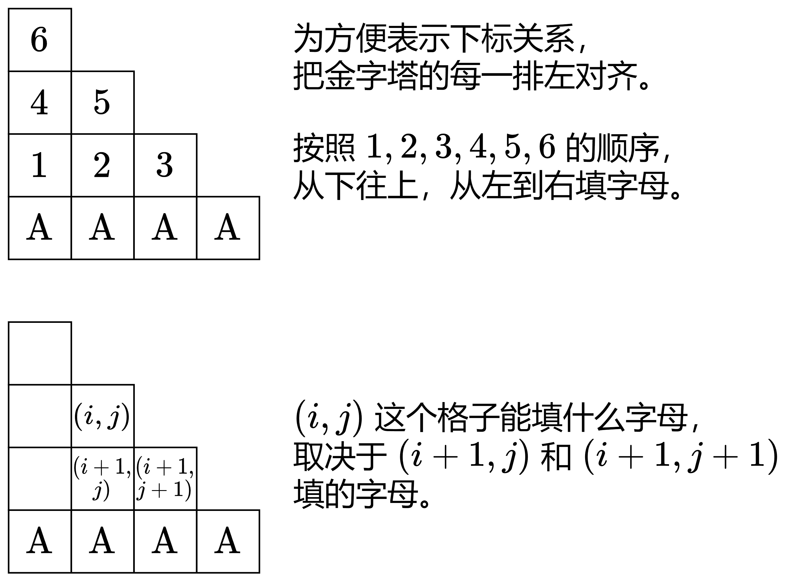
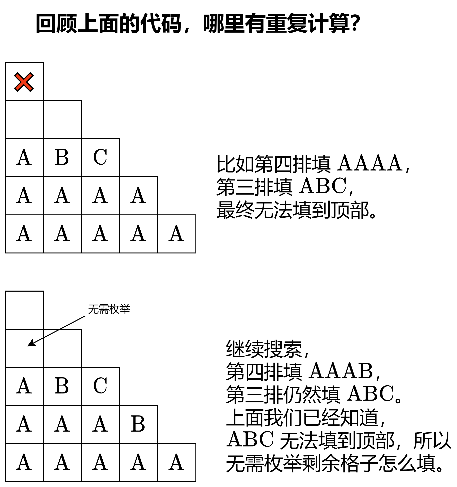
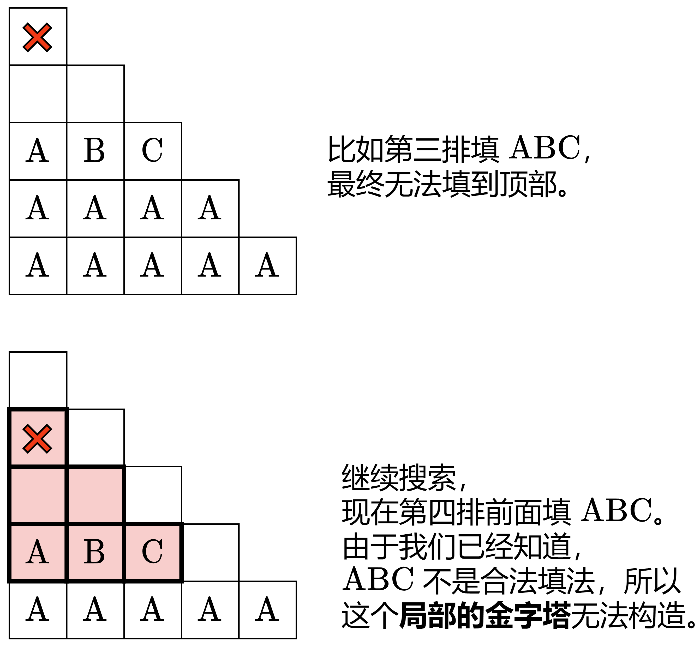

### [【图解】回溯 + vis 优化 + 位运算优化（Python/Java/C++/Go）](https://leetcode.cn/problems/pyramid-transition-matrix/solutions/3866474/tu-jie-hui-su-vis-you-hua-pythonjavacgo-9kcb9/)

考虑枚举金字塔的每个格子填什么字母。

写一个类似 [17\. 电话号码的字母组合](https://leetcode.cn/problems/letter-combinations-of-a-phone-number/) 的回溯（搜索）。按照从下往上，从左到右的顺序填字母。



比如 $allowed$ 中有 $AAB$ 和 $AAC$，那么当 $(i+1,j)$ 和 $(i+1,j+1)$ 都填 $A$ 的时候，$(i,j)$ 可以填 $B$，也可以填 $C$。**枚举填哪个**。

为了快速知道 $AA\rightarrow [B,C]$ 的对应关系，可以把 $allowed$ 用哈希表（或者二维数组）分组，把 $allowed[i]$ 前两个字母对应的第三个字母，记录在一个列表中。

#### 优化前

```Python
class Solution:
    def pyramidTransition(self, bottom: str, allowed: List[str]) -> bool:
        groups = defaultdict(list)  # 三角形底部两个字母 -> [三角形顶部字母]
        for s in allowed:
            groups[s[:2]].append(s[2])

        n = len(bottom)
        pyramid = [[''] * (i + 1) for i in range(n)]
        pyramid[-1] = bottom

        # 现在准备填 (i, j) 这个格子
        # 返回继续填能否填完所有格子（从下往上填，每行从左到右填）
        def dfs(i: int, j: int) -> bool:
            if i < 0:  # 所有格子都已填完
                return True

            if j == i + 1:  # i 行已填完
                return dfs(i - 1, 0)  # 开始填 i-1 行

            # 枚举 (i, j) 填什么字母
            # 这取决于 (i+1, j) 和 (i+1, j+1) 填的字母
            for top in groups[pyramid[i + 1][j] + pyramid[i + 1][j + 1]]:
                pyramid[i][j] = top
                if dfs(i, j + 1):
                    return True
            return False

        # 从倒数第二行开始填
        return dfs(n - 2, 0)
```

```Java
class Solution {
    public boolean pyramidTransition(String bottom, List<String> allowed) {
        // 三角形底部两个字母 -> [三角形顶部字母]
        List<Character>[][] groups = new ArrayList[6][6];
        for (List<Character>[] row : groups) {
            Arrays.setAll(row, _ -> new ArrayList<>());
        }
        for (String S : allowed) {
            char[] s = S.toCharArray();
            groups[s[0] - 'A'][s[1] - 'A'].add(s[2]);
        }

        int n = bottom.length();
        char[][] pyramid = new char[n][];
        for (int i = 0; i < n - 1; i++) {
            pyramid[i] = new char[i + 1];
        }
        pyramid[n - 1] = bottom.toCharArray();

        // 从倒数第二行开始填
        return dfs(n - 2, 0, pyramid, groups);
    }

    // 现在准备填 (i, j) 这个格子
    // 返回继续填能否填完所有格子（从下往上填，每行从左到右填）
    private boolean dfs(int i, int j, char[][] pyramid, List<Character>[][] groups) {
        if (i < 0) { // 所有格子都已填完
            return true;
        }

        if (j == i + 1) { // i 行已填完
            return dfs(i - 1, 0, pyramid, groups); // 开始填 i-1 行
        }

        // 枚举 (i, j) 填什么字母
        // 这取决于 (i+1, j) 和 (i+1, j+1) 填的字母
        for (char top : groups[pyramid[i + 1][j] - 'A'][pyramid[i + 1][j + 1] - 'A']) {
            pyramid[i][j] = top;
            if (dfs(i, j + 1, pyramid, groups)) {
                return true;
            }
        }
        return false;
    }
}
```

```C++
class Solution {
public:
    bool pyramidTransition(string bottom, vector<string>& allowed) {
        string groups[6][6]{}; // 三角形底部两个字母 -> [三角形顶部字母]
        for (auto& s : allowed) {
            groups[s[0] - 'A'][s[1] - 'A'] += s[2];
        }

        int n = bottom.size();
        vector<string> pyramid(n);
        for (int i = 0; i < n - 1; i++) {
            pyramid[i].resize(i + 1);
        }
        pyramid[n - 1] = move(bottom);

        // 现在准备填 (i, j) 这个格子
        // 返回继续填能否填完所有格子（从下往上填，每行从左到右填）
        auto dfs = [&](this auto&& dfs, int i, int j) -> bool {
            if (i < 0) { // 所有格子都已填完
                return true;
            }

            if (j == i + 1) { // i 行已填完
                return dfs(i - 1, 0); // 开始填 i-1 行
            }

            // 枚举 (i, j) 填什么字母
            // 这取决于 (i+1, j) 和 (i+1, j+1) 填的字母
            for (char top : groups[pyramid[i + 1][j] - 'A'][pyramid[i + 1][j + 1] - 'A']) {
                pyramid[i][j] = top;
                if (dfs(i, j + 1)) {
                    return true;
                }
            }
            return false;
        };

        // 从倒数第二行开始填
        return dfs(n - 2, 0);
    }
};
```

```Go
func pyramidTransition(bottom string, allowed []string) bool {
    groups := [6][6][]byte{} // 三角形底部两个字母 -> [三角形顶部字母]
    for _, s := range allowed {
        a, b := s[0]-'A', s[1]-'A'
        groups[a][b] = append(groups[a][b], s[2])
    }

    n := len(bottom)
    pyramid := make([][]byte, n)
    for i := range n - 1 {
        pyramid[i] = make([]byte, i+1)
    }
    pyramid[n-1] = []byte(bottom)

    // 现在准备填 (i, j) 这个格子
    // 返回继续填能否填完所有格子（从下往上填，每行从左到右填）
    var dfs func(int, int) bool
    dfs = func(i, j int) bool {
        if i < 0 { // 所有格子都已填完
            return true
        }

        if j == i+1 { // i 行已填完
            return dfs(i-1, 0) // 开始填 i-1 行
        }

        // 枚举 (i, j) 填什么字母
        // 这取决于 (i+1, j) 和 (i+1, j+1) 填的字母
        for _, top := range groups[pyramid[i+1][j]-'A'][pyramid[i+1][j+1]-'A'] {
            pyramid[i][j] = top
            if dfs(i, j+1) {
                return true
            }
        }
        return false
    }

    // 从倒数第二行开始填
    return dfs(n-2, 0)
}
```

#### 复杂度分析

- 时间复杂度：$O(\vert \sum \vert^h)$，其中 $n$ 是 $bottom$ 的长度，$h=1+2+\dots +(n-1)=2n(n-1)$，$\vert \sum \vert =6$ 是字符集合的大小。搜索树的高度为 $h$，每个节点至多有 $\vert \sum \vert $ 个儿子，所以搜索树有 $O(\vert \sum \vert^h)$ 个节点，遍历这棵搜索树需要 $O(\vert \sum \vert^h)$ 的时间。
- 空间复杂度：$O(m+n^2)$，其中 $m$ 是 $allowed$ 的长度。

#### 优化一：减少重复搜索



```Python
class Solution:
    def pyramidTransition(self, bottom: str, allowed: List[str]) -> bool:
        groups = defaultdict(list)
        for s in allowed:
            groups[s[:2]].append(s[2])

        n = len(bottom)
        pyramid = [[''] * (i + 1) for i in range(n)]
        pyramid[-1] = bottom

        vis = set()  # 访问标记

        def dfs(i: int, j: int) -> bool:
            if i < 0:
                return True

            if j == i + 1:
                row = ''.join(pyramid[i])
                if row in vis:  # 这一行之前填过一模一样的，继续填，没能填到塔顶
                    return False  # 直接返回
                vis.add(row)
                return dfs(i - 1, 0)

            for top in groups[pyramid[i + 1][j] + pyramid[i + 1][j + 1]]:
                pyramid[i][j] = top
                if dfs(i, j + 1):
                    return True
            return False

        return dfs(n - 2, 0)
```

```Java
class Solution {
    public boolean pyramidTransition(String bottom, List<String> allowed) {
        List<Character>[][] groups = new ArrayList[6][6];
        for (List<Character>[] row : groups) {
            Arrays.setAll(row, _ -> new ArrayList<>());
        }
        for (String S : allowed) {
            char[] s = S.toCharArray();
            groups[s[0] - 'A'][s[1] - 'A'].add(s[2]);
        }

        int n = bottom.length();
        char[][] pyramid = new char[n][];
        for (int i = 0; i < n - 1; i++) {
            pyramid[i] = new char[i + 1];
        }
        pyramid[n - 1] = bottom.toCharArray();

        Set<String> vis = new HashSet<>(); // 访问标记

        return dfs(n - 2, 0, pyramid, vis, groups);
    }

    private boolean dfs(int i, int j, char[][] pyramid, Set<String> vis, List<Character>[][] groups) {
        if (i < 0) {
            return true;
        }

        if (j == i + 1) {
            String row = new String(pyramid[i]);
            if (!vis.add(row)) { // 这一行之前填过一模一样的，继续填，没能填到塔顶
                return false; // 直接返回
            }
            return dfs(i - 1, 0, pyramid, vis, groups);
        }

        for (char top : groups[pyramid[i + 1][j] - 'A'][pyramid[i + 1][j + 1] - 'A']) {
            pyramid[i][j] = top;
            if (dfs(i, j + 1, pyramid, vis, groups)) {
                return true;
            }
        }
        return false;
    }
}
```

```C++
class Solution {
public:
    bool pyramidTransition(string bottom, vector<string>& allowed) {
        string groups[6][6];
        for (auto& s : allowed) {
            groups[s[0] - 'A'][s[1] - 'A'] += s[2];
        }

        int n = bottom.size();
        vector<string> pyramid(n);
        for (int i = 0; i < n - 1; i++) {
            pyramid[i].resize(i + 1);
        }
        pyramid[n - 1] = move(bottom);

        unordered_set<string> vis; // 访问标记

        auto dfs = [&](this auto&& dfs, int i, int j) -> bool {
            if (i < 0) {
                return true;
            }

            if (j == i + 1) {
                if (!vis.insert(pyramid[i]).second) { // 这一行之前填过一模一样的，继续填，没能填到塔顶
                    return false; // 直接返回
                }
                return dfs(i - 1, 0);
            }

            for (char top : groups[pyramid[i + 1][j] - 'A'][pyramid[i + 1][j + 1] - 'A']) {
                pyramid[i][j] = top;
                if (dfs(i, j + 1)) {
                    return true;
                }
            }
            return false;
        };

        return dfs(n - 2, 0);
    }
};
```

```Go
func pyramidTransition(bottom string, allowed []string) bool {
    groups := [6][6][]byte{}
    for _, s := range allowed {
        a, b := s[0]-'A', s[1]-'A'
        groups[a][b] = append(groups[a][b], s[2])
    }

    n := len(bottom)
    pyramid := make([][]byte, n)
    for i := range n - 1 {
        pyramid[i] = make([]byte, i+1)
    }
    pyramid[n-1] = []byte(bottom)

    vis := map[string]struct{}{} // 访问标记

    var dfs func(int, int) bool
    dfs = func(i, j int) bool {
        if i < 0 {
            return true
        }

        if j == i+1 {
            row := string(pyramid[i])
            if _, ok := vis[row]; ok { // 这一行之前填过一模一样的，继续填，没能填到塔顶
                return false // 直接返回
            }
            vis[row] = struct{}{}
            return dfs(i-1, 0)
        }

        for _, top := range groups[pyramid[i+1][j]-'A'][pyramid[i+1][j+1]-'A'] {
            pyramid[i][j] = top
            if dfs(i, j+1) {
                return true
            }
        }
        return false
    }

    return dfs(n-2, 0)
}
```

#### 优化二：减少更多重复搜索



```Python
class Solution:
    def pyramidTransition(self, bottom: str, allowed: List[str]) -> bool:
        groups = defaultdict(list)
        for s in allowed:
            groups[s[:2]].append(s[2])

        n = len(bottom)
        pyramid = [[] for _ in range(n)]
        pyramid[-1] = bottom

        vis = set()

        def dfs(i: int, j: int) -> bool:
            if i < 0:
                return True

            row = ''.join(pyramid[i])
            if row in vis:  # 之前填过一模一样的，这个局部的金字塔无法填完
                return False  # 继续递归也无法填完，直接返回

            if j == i + 1:
                vis.add(row)
                return dfs(i - 1, 0)

            for top in groups[pyramid[i + 1][j] + pyramid[i + 1][j + 1]]:
                pyramid[i].append(top)
                if dfs(i, j + 1):
                    return True
                pyramid[i].pop()
            return False

        return dfs(n - 2, 0)
```

```Java
class Solution {
    public boolean pyramidTransition(String bottom, List<String> allowed) {
        List<Character>[][] groups = new ArrayList[6][6];
        for (List<Character>[] row : groups) {
            Arrays.setAll(row, _ -> new ArrayList<>());
        }
        for (String S : allowed) {
            char[] s = S.toCharArray();
            groups[s[0] - 'A'][s[1] - 'A'].add(s[2]);
        }

        int n = bottom.length();
        char[][] pyramid = new char[n][];
        for (int i = 0; i < n - 1; i++) {
            pyramid[i] = new char[i + 1];
        }
        pyramid[n - 1] = bottom.toCharArray();

        Set<String> vis = new HashSet<>();

        return dfs(n - 2, 0, pyramid, vis, groups);
    }

    private boolean dfs(int i, int j, char[][] pyramid, Set<String> vis, List<Character>[][] groups) {
        if (i < 0) {
            return true;
        }

        String row = new String(pyramid[i], 0, j);
        if (vis.contains(row)) { // 之前填过一模一样的，这个局部的金字塔无法填完
            return false; // 继续递归也无法填完，直接返回
        }

        if (j == i + 1) {
            vis.add(row);
            return dfs(i - 1, 0, pyramid, vis, groups);
        }

        for (char top : groups[pyramid[i + 1][j] - 'A'][pyramid[i + 1][j + 1] - 'A']) {
            pyramid[i][j] = top;
            if (dfs(i, j + 1, pyramid, vis, groups)) {
                return true;
            }
        }
        return false;
    }
}
```

```C++
class Solution {
public:
    bool pyramidTransition(string bottom, vector<string>& allowed) {
        string groups[6][6];
        for (auto& s : allowed) {
            groups[s[0] - 'A'][s[1] - 'A'] += s[2];
        }

        int n = bottom.size();
        vector<string> pyramid(n);
        pyramid[n - 1] = move(bottom);

        unordered_set<string> vis;

        auto dfs = [&](this auto&& dfs, int i, int j) -> bool {
            if (i < 0) {
                return true;
            }

            if (vis.contains(pyramid[i])) { // 之前填过一模一样的，这个局部的金字塔无法填完
                return false; // 继续递归也无法填完，直接返回
            }

            if (j == i + 1) {
                vis.insert(pyramid[i]);
                return dfs(i - 1, 0);
            }

            for (char top : groups[pyramid[i + 1][j] - 'A'][pyramid[i + 1][j + 1] - 'A']) {
                pyramid[i] += top;
                if (dfs(i, j + 1)) {
                    return true;
                }
                pyramid[i].pop_back();
            }
            return false;
        };

        return dfs(n - 2, 0);
    }
};
```

```Go
func pyramidTransition(bottom string, allowed []string) bool {
    groups := [6][6][]byte{}
    for _, s := range allowed {
        a, b := s[0]-'A', s[1]-'A'
        groups[a][b] = append(groups[a][b], s[2])
    }

    n := len(bottom)
    pyramid := make([][]byte, n)
    for i := range n - 1 {
        pyramid[i] = make([]byte, i+1)
    }
    pyramid[n-1] = []byte(bottom)

    vis := map[string]struct{}{}

    var dfs func(int, int) bool
    dfs = func(i, j int) bool {
        if i < 0 {
            return true
        }

        row := string(pyramid[i][:j])
        if _, ok := vis[row]; ok { // 之前填过一模一样的，这个局部的金字塔无法填完
            return false // 继续递归也无法填完，直接返回
        }

        if j == i+1 {
            vis[row] = struct{}{}
            return dfs(i-1, 0)
        }

        for _, top := range groups[pyramid[i+1][j]-'A'][pyramid[i+1][j+1]-'A'] {
            pyramid[i][j] = top
            if dfs(i, j+1) {
                return true
            }
        }
        return false
    }

    return dfs(n-2, 0)
}
```

#### 复杂度分析

- 时间复杂度：$O(n\vert \sum \vert^n)$，其中 $n$ 是 $bottom$ 的长度，$\vert \sum \vert =6$ 是字符集合的大小。把字符串按照长度分类，长为 $k$ 的字符串至多有 $\vert \sum \vert^k$ 个。等比数列求和 $\vert \sum \vert +\vert \sum \vert^2+\dots +\vert \sum \vert^{n-1}=O(\vert \sum \vert^n)$。一共有 $O(\vert \sum \vert^n)$ 个字符串，每个字符串花费 $O(n)$ 的时间与 $vis$ 交互（查询，插入）。
- 空间复杂度：$O(n\vert \sum \vert^n)$。vis 保存了 $O(\vert \sum \vert^n)$ 个字符串，每个字符串需要 $O(n)$ 的空间。

#### 优化三：位运算

把 $A$ 到 $F$ 映射为 $1$ 到 $6$。由于每个字母只占用 $3$ 个比特位，可以用二进制数表示字符串。

> 由于倒数第二排最多 $5$ 个字母，所以记录到 $vis$ 中的二进制数的长度最多为 $15$。

**问**：为什么不映射为 $0$ 到 5？

**答**：比如，我们无法区分 $AA$ 和 $AAA$，二者都是 $0$。

```Python
class Solution:
    def pyramidTransition(self, bottom: str, allowed: List[str]) -> bool:
        groups = [[[] for _ in range(7)] for _ in range(7)]
        for a, b, c in allowed:
            # A~F -> 1~6
            groups[ord(a) & 31][ord(b) & 31].append(ord(c) & 31)

        n = len(bottom)
        pyramid = [0] * n
        for i, ch in enumerate(bottom):
            pyramid[-1] |= (ord(ch) & 31) << (i * 3)  # 等价于 pyramid[-1][i] = ord(ch)&31

        vis = set()

        def dfs(i: int, j: int) -> bool:
            if i < 0:
                return True

            if pyramid[i] in vis:
                return False

            if j == i + 1:
                vis.add(pyramid[i])
                return dfs(i - 1, 0)

            for top in groups[pyramid[i + 1] >> (j * 3) & 7][pyramid[i + 1] >> ((j + 1) * 3) & 7]:
                pyramid[i] &= ~(7 << (j * 3))  # 清除之前填的字母，等价于 pyramid[i][j] = 0
                pyramid[i] |= top << (j * 3)  # 等价于 pyramid[i][j] = top
                if dfs(i, j + 1):
                    return True
            return False

        return dfs(n - 2, 0)
```

```Java
class Solution {
    public boolean pyramidTransition(String bottom, List<String> allowed) {
        List<Integer>[][] groups = new ArrayList[7][7];
        for (List<Integer>[] row : groups) {
            Arrays.setAll(row, _ -> new ArrayList<>());
        }
        for (String S : allowed) {
            char[] s = S.toCharArray();
            // A~F -> 1~6
            groups[s[0] & 31][s[1] & 31].add(s[2] & 31);
        }

        char[] s = bottom.toCharArray();
        int n = s.length;
        int[] pyramid = new int[n];
        for (int i = 0; i < n; i++) {
            pyramid[n - 1] |= (s[i] & 31) << (i * 3); // 等价于 pyramid[n-1][i] = s[i]&31
        }

        boolean[] vis = new boolean[1 << ((n - 1) * 3)];

        return dfs(n - 2, 0, pyramid, vis, groups);
    }

    private boolean dfs(int i, int j, int[] pyramid, boolean[] vis, List<Integer>[][] groups) {
        if (i < 0) {
            return true;
        }

        if (vis[pyramid[i]]) {
            return false;
        }

        if (j == i + 1) {
            vis[pyramid[i]] = true;
            return dfs(i - 1, 0, pyramid, vis, groups);
        }

        for (int top : groups[pyramid[i + 1] >> (j * 3) & 7][pyramid[i + 1] >> ((j + 1) * 3) & 7]) {
            pyramid[i] &= ~(7 << (j * 3)); // 清除之前填的字母，等价于 pyramid[i][j] = 0
            pyramid[i] |= top << (j * 3); // 等价于 pyramid[i][j] = top
            if (dfs(i, j + 1, pyramid, vis, groups)) {
                return true;
            }
        }
        return false;
    }
}
```

```C++
class Solution {
public:
    bool pyramidTransition(string bottom, vector<string>& allowed) {
        vector<int> groups[7][7];
        for (auto& s : allowed) {
            // A~F -> 1~6
            groups[s[0] & 31][s[1] & 31].push_back(s[2] & 31);
        }

        int n = bottom.size();
        vector<int> pyramid(n);
        for (int i = 0; i < n; i++) {
            pyramid[n - 1] |= (bottom[i] & 31) << (i * 3); // 等价于 pyramid[n-1][i] = bottom[i]&31
        }

        vector<uint8_t> vis(1 << ((n - 1) * 3));

        auto dfs = [&](this auto&& dfs, int i, int j) -> bool {
            if (i < 0) {
                return true;
            }

            if (vis[pyramid[i]]) {
                return false;
            }

            if (j == i + 1) {
                vis[pyramid[i]] = true;
                return dfs(i - 1, 0);
            }

            for (int top : groups[pyramid[i + 1] >> (j * 3) & 7][pyramid[i + 1] >> ((j + 1) * 3) & 7]) {
                pyramid[i] &= ~(7 << (j * 3)); // 清除之前填的字母，等价于 pyramid[i][j] = 0
                pyramid[i] |= top << (j * 3); // 等价于 pyramid[i][j] = top
                if (dfs(i, j + 1)) {
                    return true;
                }
            }
            return false;
        };

        return dfs(n - 2, 0);
    }
};
```

```Go
func pyramidTransition(bottom string, allowed []string) bool {
    groups := [7][7][]byte{}
    for _, s := range allowed {
        a, b := s[0]&31, s[1]&31 // A~F -> 1~6
        groups[a][b] = append(groups[a][b], s[2]&31)
    }

    n := len(bottom)
    pyramid := make([]int, n)
    for i, ch := range bottom {
        pyramid[n-1] |= int(ch&31) << (i * 3) // 等价于 pyramid[n-1][i] = ch&31
    }

    vis := make([]bool, 1<<((n-1)*3))

    var dfs func(int, int) bool
    dfs = func(i, j int) bool {
        if i < 0 {
            return true
        }

        if vis[pyramid[i]] {
            return false
        }

        if j == i+1 {
            vis[pyramid[i]] = true
            return dfs(i-1, 0)
        }

        for _, top := range groups[pyramid[i+1]>>(j*3)&7][pyramid[i+1]>>((j+1)*3)&7] {
            pyramid[i] &^= 7 << (j * 3) // 清除之前填的字母，等价于 pyramid[i][j] = 0
            pyramid[i] |= int(top) << (j * 3) // 等价于 pyramid[i][j] = top
            if dfs(i, j+1) {
                return true
            }
        }
        return false
    }

    return dfs(n-2, 0)
}
```

#### 复杂度分析

- 时间复杂度：$O(\vert \sum \vert^n)$，其中 $n$ 是 $bottom$ 的长度，$\vert \sum \vert =6$ 是字符集合的大小。
- 空间复杂度：$O(\vert \sum \vert^n)$。

#### 专题训练

见下面回溯题单的「**§4.7 搜索**」。

#### 分类题单

[如何科学刷题？](https://leetcode.cn/circle/discuss/RvFUtj/)

1. [滑动窗口与双指针（定长/不定长/单序列/双序列/三指针/分组循环）](https://leetcode.cn/circle/discuss/0viNMK/)
2. [二分算法（二分答案/最小化最大值/最大化最小值/第K小）](https://leetcode.cn/circle/discuss/SqopEo/)
3. [单调栈（基础/矩形面积/贡献法/最小字典序）](https://leetcode.cn/circle/discuss/9oZFK9/)
4. [网格图（DFS/BFS/综合应用）](https://leetcode.cn/circle/discuss/YiXPXW/)
5. [位运算（基础/性质/拆位/试填/恒等式/思维）](https://leetcode.cn/circle/discuss/dHn9Vk/)
6. [图论算法（DFS/BFS/拓扑排序/基环树/最短路/最小生成树/网络流）](https://leetcode.cn/circle/discuss/01LUak/)
7. [动态规划（入门/背包/划分/状态机/区间/状压/数位/数据结构优化/树形/博弈/概率期望）](https://leetcode.cn/circle/discuss/tXLS3i/)
8. [常用数据结构（前缀和/差分/栈/队列/堆/字典树/并查集/树状数组/线段树）](https://leetcode.cn/circle/discuss/mOr1u6/)
9. [数学算法（数论/组合/概率期望/博弈/计算几何/随机算法）](https://leetcode.cn/circle/discuss/IYT3ss/)
10. [贪心与思维（基本贪心策略/反悔/区间/字典序/数学/思维/脑筋急转弯/构造）](https://leetcode.cn/circle/discuss/g6KTKL/)
11. [链表、树与回溯（前后指针/快慢指针/DFS/BFS/直径/LCA）](https://leetcode.cn/circle/discuss/K0n2gO/)
12. [字符串（KMP/Z函数/Manacher/字符串哈希/AC自动机/后缀数组/子序列自动机）](https://leetcode.cn/circle/discuss/SJFwQI/)
