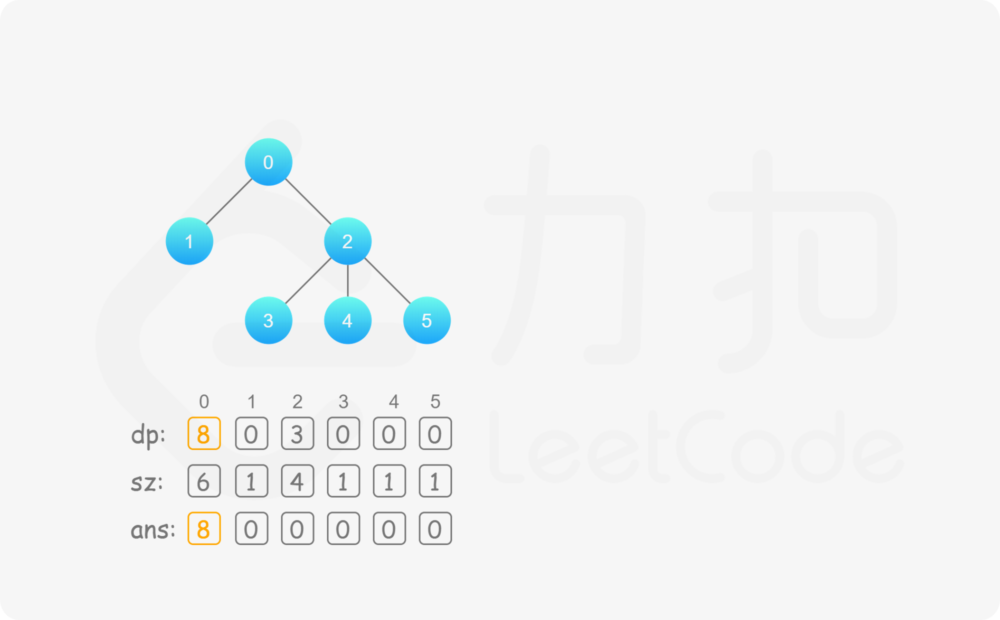
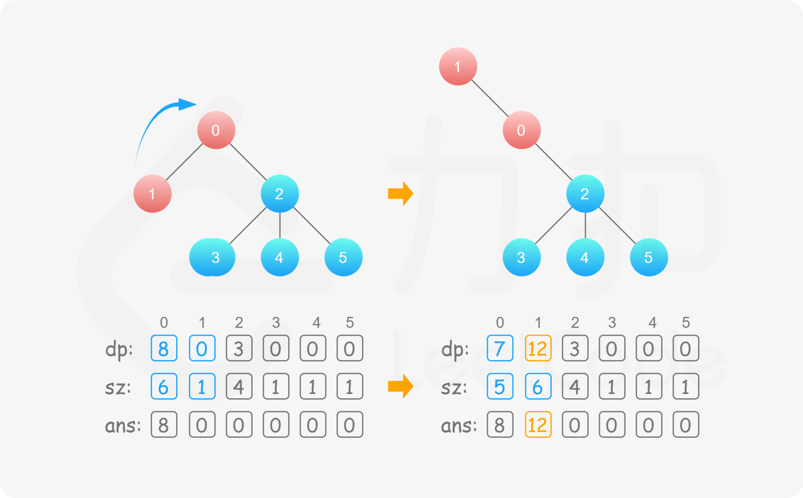
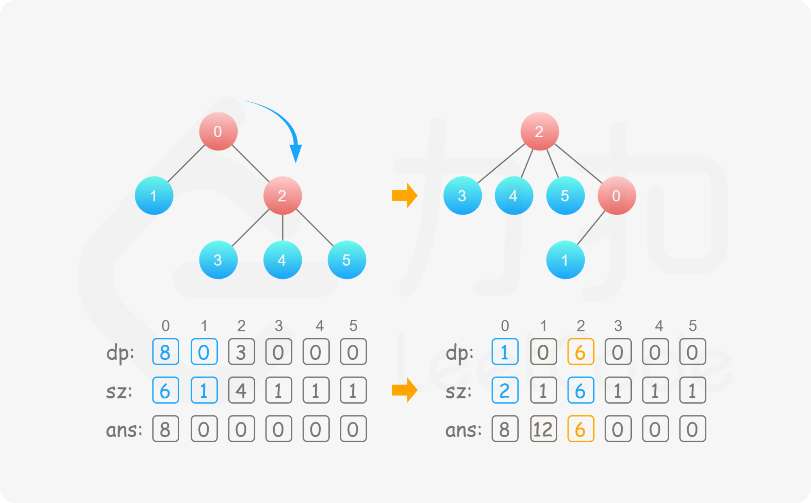
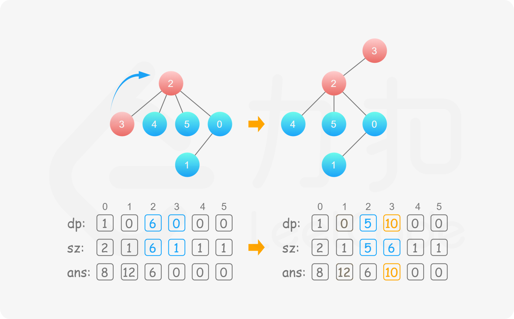
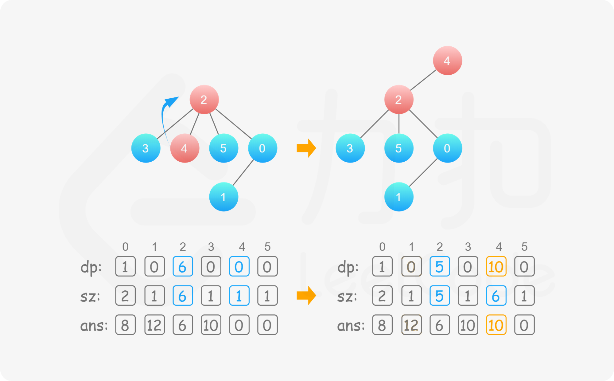
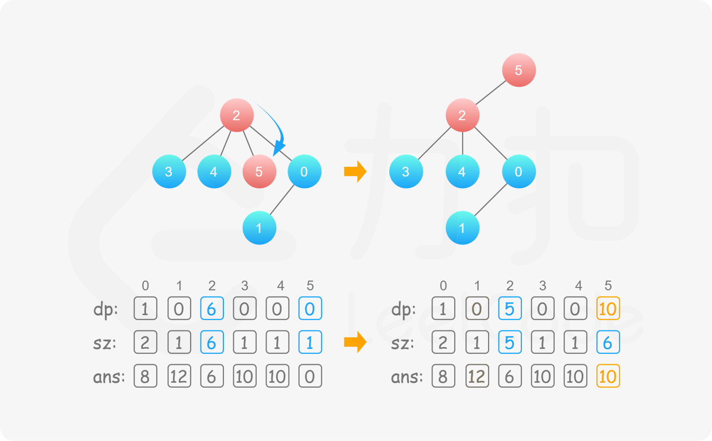
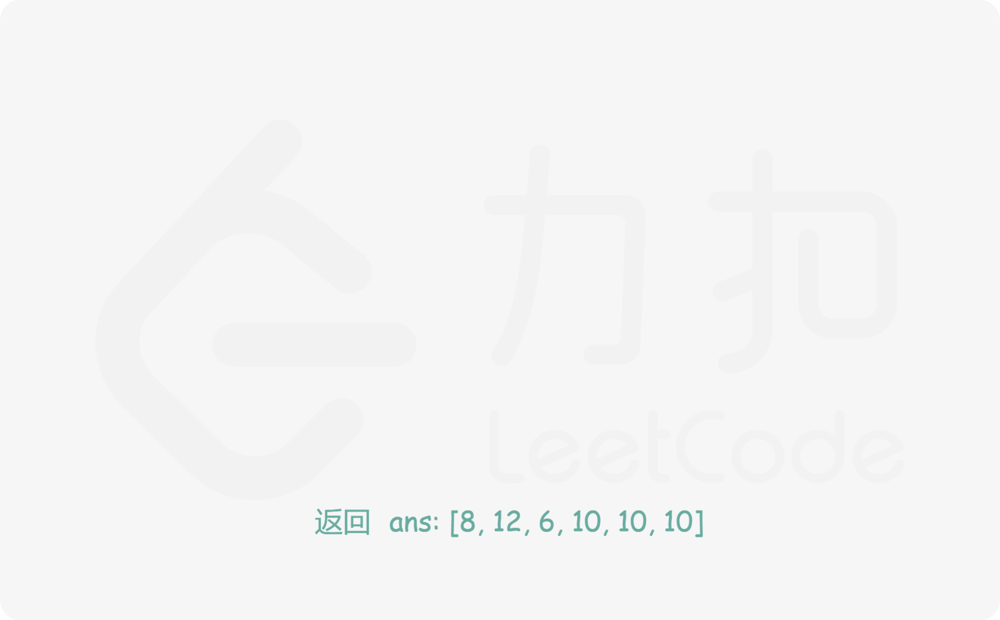

#### [方法一：树形动态规划](https://leetcode.cn/problems/sum-of-distances-in-tree/solutions/437205/shu-zhong-ju-chi-zhi-he-by-leetcode-solution/)

**思路与算法**

首先我们来考虑一个节点的情况，即每次题目指定一棵树，以 $root$ 为根，询问节点 $root$ 与其他所有节点的距离之和。

很容易想到一个树形动态规划：定义 $dp[u]$ 表示以 $u$ 为根的子树，它的所有子节点到它的距离之和，同时定义 $sz[u]$ 表示以 $u$ 为根的子树的节点数量，不难得出如下的转移方程：

$$dp[u]=\sum_{v\in son[u]}dp[v] + sz[v]$$

其中 $son[u]$ 表示 $u$ 的所有后代节点集合。转移方程表示的含义就是考虑每个后代节点 $v$，已知 $v$ 的所有子节点到它的距离之和为 $dp[v]$，那么这些节点到 $u$ 的距离之和还要考虑 $u \rightarrow v$ 这条边的贡献。考虑这条边长度为 $1$，一共有 $sz[v]$ 个节点到节点 $u$ 的距离会包含这条边，因此贡献即为 $1\times sz[v]=sz[v]$。我们遍历整棵树，从叶子节点开始自底向上递推到根节点 $root$ 即能得出最后的答案为 $dp[root]$。

回到本题中，题目要求的其实是上题的扩展，即要求我们求出每个节点为根节点的时候，它与其他所有节点的距离之和。暴力的角度我们可以考虑对每个节点都做一次如上的树形动态规划，这样时间复杂度即为 $O(n^2)$，那么有没有更优雅的方法呢？

经过一次树形动态规划后其实我们获得了在 $u$ 为根的树中，每个节点为根的子树的答案 $dp$，我们可以利用这些已有信息来优化时间复杂度。

假设 $u$ 的某个后代节点为 $v$，如果要算 $v$ 的答案，本来我们要以 $v$ 为根来进行一次树形动态规划。但是利用已有的信息，我们可以考虑树的形态做一次改变，**让 $v$ 换到根的位置，$u$ 变为其孩子节点，同时维护原有的 $dp$ 信息**。在这一次的转变中，我们观察到除了 $u$ 和 $v$ 的 $dp$ 值，其他节点的 $dp$ 值都不会改变，因此只要更新 $dp[u]$ 和 $dp[v]$ 的值即可。

那么我们来看 $v$ 换到根的位置的时候怎么利用已有信息求出 $dp[u]$ 和 $dp[v]$ 的值。重新回顾第一次树形动态规划的转移方程，我们可以知道当 $u$ 变为 $v$ 的孩子的时候 $v$ 不在 $u$ 的后代集合 $son[u]$ 中了，因此此时 $dp[u]$ 需要减去 $v$ 的贡献，即

$$dp[u]=dp[u]-(dp[v]+sz[v])$$

同时 $sz[u]$ 也要相应减去 $sz[v]$。

而 $v$ 的后代节点集合中多出了 $u$，因此 $dp[v]$ 的值要由 $u$ 更新上来，即

$$dp[v]=dp[v]+(dp[u]+sz[u])$$

同时 $sz[v]$ 也要相应加上 $sz[u]$。

至此我们完成了一次「换根」操作，在 $O(1)$ 的时间内维护了 $dp$ 的信息，且此时的树结构以 $v$ 为根。那么接下来我们不断地进行换根的操作，即能在 $O(n)$ 的时间内求出每个节点为根的答案，实现了时间复杂度的优化。









**代码**

```cpp
class Solution {
public:
    vector<int> ans, sz, dp;
    vector<vector<int>> graph;

    void dfs(int u, int f) {
        sz[u] = 1;
        dp[u] = 0;
        for (auto& v: graph[u]) {
            if (v == f) {
                continue;
            }
            dfs(v, u);
            dp[u] += dp[v] + sz[v];
            sz[u] += sz[v];
        }
    }

    void dfs2(int u, int f) {
        ans[u] = dp[u];
        for (auto& v: graph[u]) {
            if (v == f) {
                continue;
            }
            int pu = dp[u], pv = dp[v];
            int su = sz[u], sv = sz[v];

            dp[u] -= dp[v] + sz[v];
            sz[u] -= sz[v];
            dp[v] += dp[u] + sz[u];
            sz[v] += sz[u];

            dfs2(v, u);

            dp[u] = pu, dp[v] = pv;
            sz[u] = su, sz[v] = sv;
        }
    }

    vector<int> sumOfDistancesInTree(int n, vector<vector<int>>& edges) {
        ans.resize(n, 0);
        sz.resize(n, 0);
        dp.resize(n, 0);
        graph.resize(n, {});
        for (auto& edge: edges) {
            int u = edge[0], v = edge[1];
            graph[u].emplace_back(v);
            graph[v].emplace_back(u);
        }
        dfs(0, -1);
        dfs2(0, -1);
        return ans;
    }
};
```

```java
class Solution {
    int[] ans;
    int[] sz;
    int[] dp;
    List<List<Integer>> graph;

    public int[] sumOfDistancesInTree(int n, int[][] edges) {
        ans = new int[n];
        sz = new int[n];
        dp = new int[n];
        graph = new ArrayList<List<Integer>>();
        for (int i = 0; i < n; ++i) {
            graph.add(new ArrayList<Integer>());
        }
        for (int[] edge: edges) {
            int u = edge[0], v = edge[1];
            graph.get(u).add(v);
            graph.get(v).add(u);
        }
        dfs(0, -1);
        dfs2(0, -1);
        return ans;
    }

    public void dfs(int u, int f) {
        sz[u] = 1;
        dp[u] = 0;
        for (int v: graph.get(u)) {
            if (v == f) {
                continue;
            }
            dfs(v, u);
            dp[u] += dp[v] + sz[v];
            sz[u] += sz[v];
        }
    }

    public void dfs2(int u, int f) {
        ans[u] = dp[u];
        for (int v: graph.get(u)) {
            if (v == f) {
                continue;
            }
            int pu = dp[u], pv = dp[v];
            int su = sz[u], sv = sz[v];

            dp[u] -= dp[v] + sz[v];
            sz[u] -= sz[v];
            dp[v] += dp[u] + sz[u];
            sz[v] += sz[u];

            dfs2(v, u);

            dp[u] = pu;
            dp[v] = pv;
            sz[u] = su;
            sz[v] = sv;
        }
    }
}
```

```javascript
let ans, sz, dp, graph;
const dfs = (u, f) => {
    sz[u] = 1;
    dp[u] = 0;
    for (const v of graph[u]) {
        if (v === f) {
            continue;
        }
        dfs(v, u);
        dp[u] += dp[v] + sz[v];
        sz[u] += sz[v];
    }
}
const dfs2 = (u, f) => {
    ans[u] = dp[u];
    for (const v of graph[u]) {
        if (v === f) {
            continue;
        }
        const pu = dp[u], pv = dp[v];
        const su = sz[u], sv = sz[v];

        dp[u] -= dp[v] + sz[v];
        sz[u] -= sz[v];
        dp[v] += dp[u] + sz[u];
        sz[v] += sz[u];

        dfs2(v, u);

        dp[u] = pu, dp[v] = pv;
        sz[u] = su, sz[v] = sv;
    }
}
var sumOfDistancesInTree = function(n, edges) {
    ans = new Array(n).fill(0);
    sz = new Array(n).fill(0);
    dp = new Array(n).fill(0);
    graph = new Array(n).fill(0).map(v => []);
    for (const [u, v] of edges) {
        graph[u].push(v);
        graph[v].push(u);
    }
    dfs(0, -1);
    dfs2(0, -1);
    return ans;
};
```

```go
func sumOfDistancesInTree(n int, edges [][]int) []int {
    graph := make([][]int, n)
    for _, e := range edges {
        u, v := e[0], e[1]
        graph[u] = append(graph[u], v)
        graph[v] = append(graph[v], u)
    }

    sz := make([]int, n)
    dp := make([]int, n)
    var dfs func(u, f int)
    dfs = func(u, f int) {
        sz[u] = 1
        for _, v := range graph[u] {
            if v == f {
                continue
            }
            dfs(v, u)
            dp[u] += dp[v] + sz[v]
            sz[u] += sz[v]
        }
    }
    dfs(0, -1)

    ans := make([]int, n)
    var dfs2 func(u, f int)
    dfs2 = func(u, f int) {
        ans[u] = dp[u]
        for _, v := range graph[u] {
            if v == f {
                continue
            }
            pu, pv := dp[u], dp[v]
            su, sv := sz[u], sz[v]

            dp[u] -= dp[v] + sz[v]
            sz[u] -= sz[v]
            dp[v] += dp[u] + sz[u]
            sz[v] += sz[u]

            dfs2(v, u)

            dp[u], dp[v] = pu, pv
            sz[u], sz[v] = su, sv
        }
    }
    dfs2(0, -1)
    return ans
}
```

```c
int *ans, *sz, *dp;
int *hd, *nx, *e;

void dfs(int u, int f) {
    sz[u] = 1;
    dp[u] = 0;
    for (int i = hd[u]; i; i = nx[i]) {
        int v = e[i];
        if (v == f) {
            continue;
        }
        dfs(v, u);
        dp[u] += dp[v] + sz[v];
        sz[u] += sz[v];
    }
}

void dfs2(int u, int f) {
    ans[u] = dp[u];
    for (int i = hd[u]; i; i = nx[i]) {
        int v = e[i];
        if (v == f) {
            continue;
        }
        int pu = dp[u], pv = dp[v];
        int su = sz[u], sv = sz[v];

        dp[u] -= dp[v] + sz[v];
        sz[u] -= sz[v];
        dp[v] += dp[u] + sz[u];
        sz[v] += sz[u];

        dfs2(v, u);

        dp[u] = pu, dp[v] = pv;
        sz[u] = su, sz[v] = sv;
    }
}

int* sumOfDistancesInTree(int n, int** edges, int edgesSize, int* edgesColSize, int* returnSize) {
    ans = malloc(sizeof(int) * n);
    sz = malloc(sizeof(int) * n);
    dp = malloc(sizeof(int) * n);
    hd = malloc(sizeof(int) * n);
    nx = malloc(sizeof(int) * (edgesSize * 2 + 1));
    e = malloc(sizeof(int) * (edgesSize * 2 + 1));
    for (int i = 0; i < n; i++) {
        ans[i] = sz[i] = dp[i] = hd[i] = 0;
    }
    for (int i = 0, num = 0; i < edgesSize; i++) {
        int u = edges[i][0], v = edges[i][1];
        nx[++num] = hd[u], hd[u] = num, e[num] = v;
        nx[++num] = hd[v], hd[v] = num, e[num] = u;
    }
    dfs(0, -1);
    dfs2(0, -1);
    *returnSize = n;
    return ans;
}
```

**复杂度分析**

-   时间复杂度：$O(n)$，其中 $n$ 是树中的节点个数。我们只需要遍历整棵树两次即可得到答案，其中每个节点被访问两次，因此时间复杂度为 $O(2n)=O(n)$。
-   空间复杂度：$O(n)$。我们需要线性的空间存图，$n$ 个节点的树包含 $n-1$ 条边，数组 $dp$ 和 $sz$ 的长度均为 $n$。
