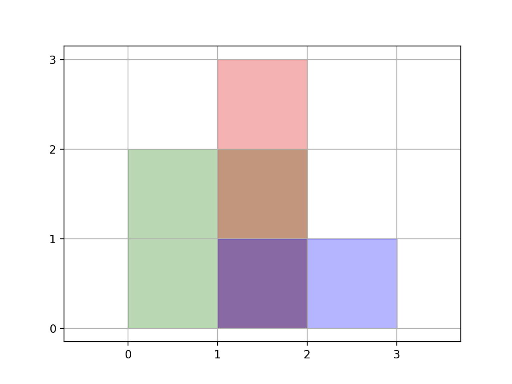

### [850\. 矩形面积 II](https://leetcode.cn/problems/rectangle-area-ii/)

难度：困难

给你一个轴对齐的二维数组 `rectangles`。 对于 `rectangle[i] = [x1, y1, x2, y2]`，其中 <code>(xi1, yi1)</code> 是该矩形 *&times;左下角&times;&times; 的坐标， <code>(xi2, yi2)</code> 是该矩形 **右上角** 的坐标。

计算平面中所有 `rectangles` 所覆盖的 **总面积**。任何被两个或多个矩形覆盖的区域应只计算 **一次**。

返回 _**总面积**_。因为答案可能太大，返回 <code>109 + 7</code> 的 **模**。

**示例 1：**

> 
>
> **输入：** rectangles = \[[0,0,2,2],[1,0,2,3],[1,0,3,1]]
> **输出：** 6
> **解释：** 如图所示，三个矩形覆盖了总面积为 6 的区域。
> 从(1,1)到(2,2)，绿色矩形和红色矩形重叠。
> 从(1,0)到(2,3)，三个矩形都重叠。

**示例 2：**

> **输入：** rectangles = \[[0,0,1000000000,1000000000]]
> **输出：** 49
> **解释：** 答案是 1018 对 (109 + 7) 取模的结果， 即 49。

**提示：**

- `1 <= rectangles.length <= 200`
- `rectanges[i].length = 4`
- <code>0 <= xi1, yi1, xi2, yi2 <= 109</code>
- <code>xi1&nbsp; <= xi2</code>
- <code>yi1&nbsp; <= yi2</code>
- 所有矩阵面积不为 0。
