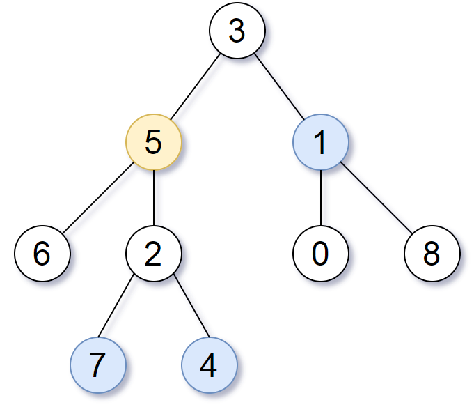

### [863\. 二叉树中所有距离为 K 的结点](https://leetcode.cn/problems/all-nodes-distance-k-in-binary-tree/)

难度：中等

给定一个二叉树（具有根结点 `root`），一个目标结点 `target`，和一个整数值 `k`，返回到目标结点 `target` 距离为 `k` 的所有结点的值的数组。

答案可以以 **任何顺序** 返回。

**示例 1：**

> 
>
> **输入：** root = [3,5,1,6,2,0,8,null,null,7,4], target = 5, k = 2
> **输出：** [7,4,1]
> **解释：** 所求结点为与目标结点（值为 5）距离为 2 的结点，值分别为 7，4，以及 1

**示例 2:**

> **输入:** root = [1], target = 1, k = 3
> **输出:** []

**提示:**

- 节点数在 `[1, 500]` 范围内
- `0 <= Node.val <= 500`
- `Node.val` 中所有值 **不同**
- 目标结点 `target` 是树上的结点。
- `0 <= k <= 1000`
