### [石子游戏](https://leetcode.cn/problems/stone-game/solutions/396080/shi-zi-you-xi-by-leetcode-solution/?envType=problem-list-v2&envId=ySsxoJfz)

#### 前言

这道题是「[486\. 预测赢家](https://leetcode.cn/problems/predict-the-winner)」的特例。和第 $486$ 题相比，这道题增加了两个限制条件：

- 数组的长度是偶数；
- 数组的元素之和是奇数，所以没有平局。

这道题可以使用第 $486$ 题的解法进行求解。如果充分利用上述两个限制条件，还可以使用数学方法进行求解。

#### 方法一：动态规划

由于每次只能从行的开始或结束处取走整堆石子，因此可以保证剩下的石子堆一定是连续的。

如果只剩下一堆石子，则当前玩家只能取走这堆石子。如果剩下多堆石子，则当前玩家可以选择从行的开始或结束处取走整堆石子，然后轮到另一个玩家在剩下的石子堆中取走石子。这是一个递归的过程，因此可以使用递归进行求解，递归过程中维护一个总数，表示 $Alice$ 和 $Bob$ 的石子数量之差，当游戏结束时，如果总数大于 $0$，则 $Alice$ 赢得比赛，否则 $Bob$ 赢得比赛。

如果有 $n$ 堆石子，则递归的时间复杂度为 $O(2^n)$，无法通过所有的测试用例。递归的时间复杂度高的原因是存在大量重复计算。由于存在重复子问题，因此可以使用动态规划降低时间复杂度。

定义二维数组 $dp$，其行数和列数都等于石子的堆数，$dp[i][j]$ 表示当剩下的石子堆为下标 $i$ 到下标 $j$ 时，即在下标范围 $[i,j]$ 中，当前玩家与另一个玩家的石子数量之差的最大值，注意当前玩家不一定是先手 $Alice$。

只有当 $i\le j$ 时，剩下的石子堆才有意义，因此当 $i>j$ 时，$dp[i][j]=0$。

当 $i=j$ 时，只剩下一堆石子，当前玩家只能取走这堆石子，因此对于所有 $0\le i<nums.length$，都有 $dp[i][i]=piles[i]$。

当 $i<j$ 时，当前玩家可以选择取走 $piles[i]$ 或 $piles[j]$，然后轮到另一个玩家在剩下的石子堆中取走石子。在两种方案中，当前玩家会选择最优的方案，使得自己的石子数量最大化。因此可以得到如下状态转移方程：

$$dp[i][j]=max(piles[i]-dp[i+1][j],piles[j]-dp[i][j-1])$$

最后判断 $dp[0][piles.length-1]$ 的值，如果大于 $0$，则 $Alice$ 的石子数量大于 $Bob$ 的石子数量，因此 $Alice$ 赢得比赛，否则 $Bob$ 赢得比赛。

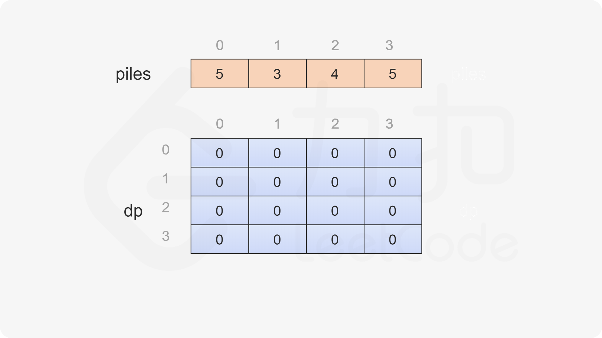
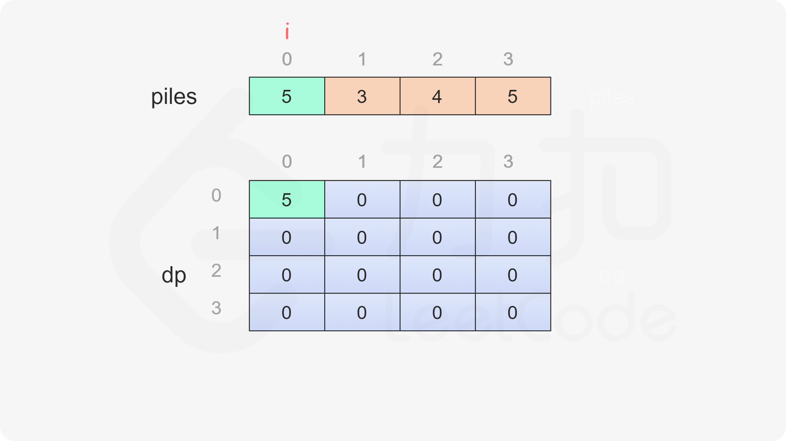

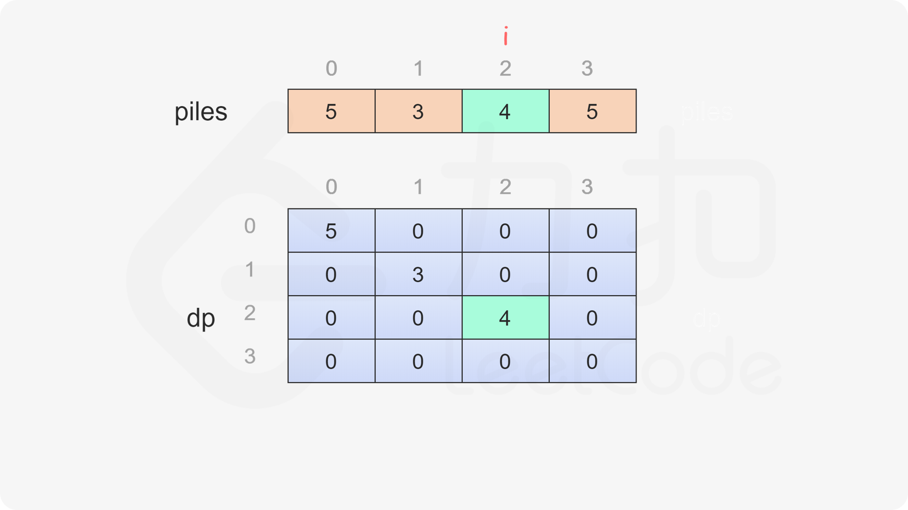
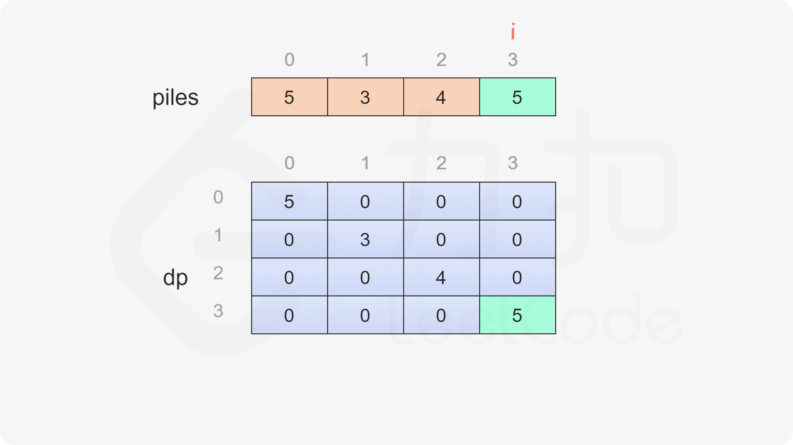
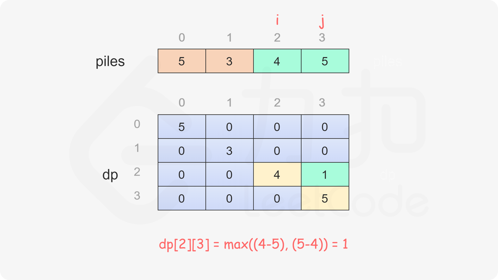
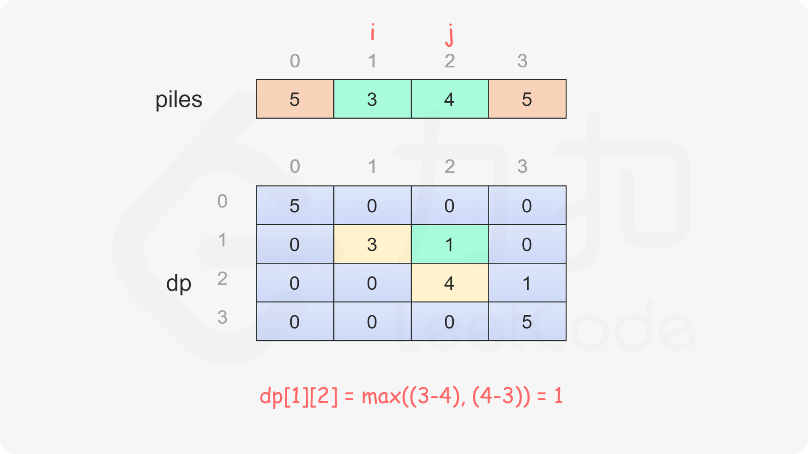
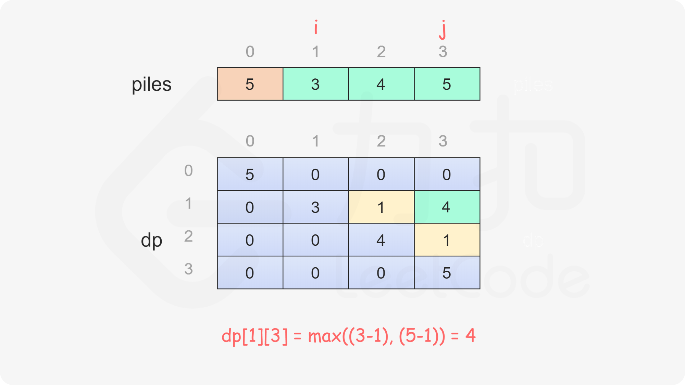
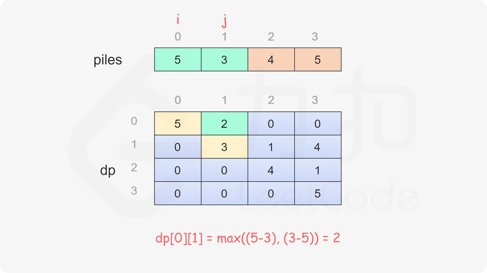
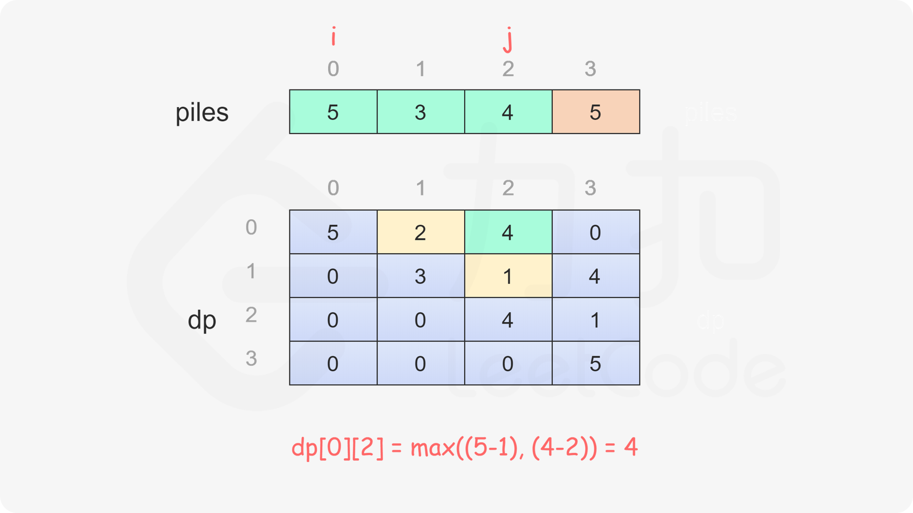
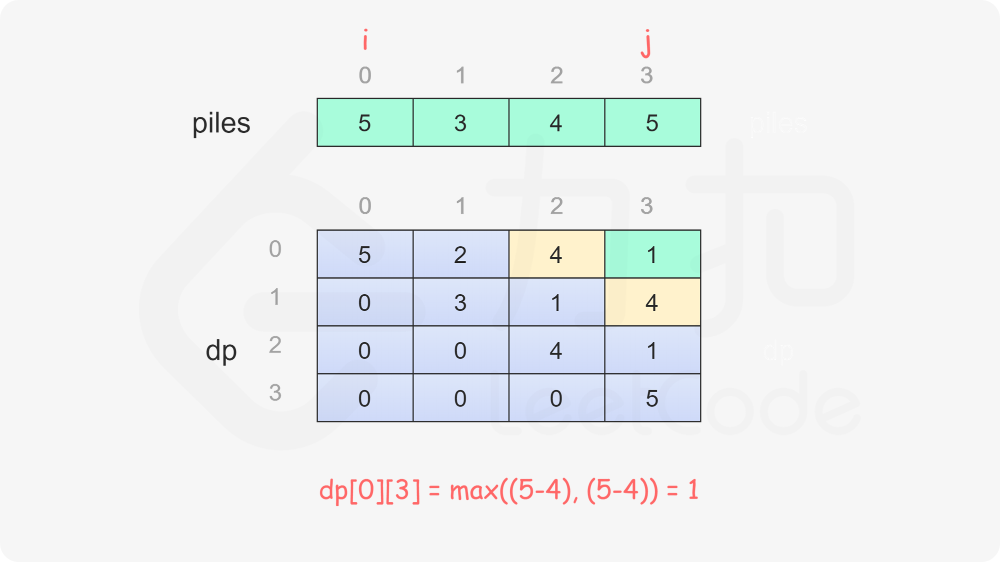
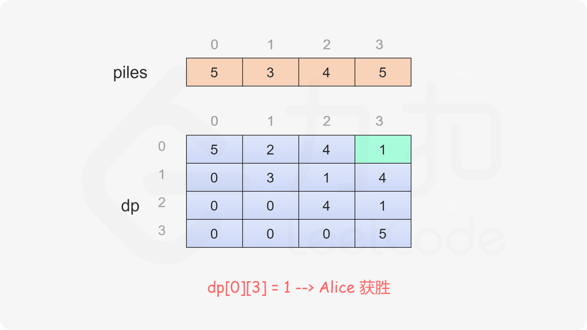

```Java
class Solution {
    public boolean stoneGame(int[] piles) {
        int length = piles.length;
        int[][] dp = new int[length][length];
        for (int i = 0; i < length; i++) {
            dp[i][i] = piles[i];
        }
        for (int i = length - 2; i >= 0; i--) {
            for (int j = i + 1; j < length; j++) {
                dp[i][j] = Math.max(piles[i] - dp[i + 1][j], piles[j] - dp[i][j - 1]);
            }
        }
        return dp[0][length - 1] > 0;
    }
}
```

```CSharp
public class Solution {
    public bool StoneGame(int[] piles) {
        int length = piles.Length;
        int[,] dp = new int[length, length];
        for (int i = 0; i < length; i++) {
            dp[i, i] = piles[i];
        }
        for (int i = length - 2; i >= 0; i--) {
            for (int j = i + 1; j < length; j++) {
                dp[i, j] = Math.Max(piles[i] - dp[i + 1, j], piles[j] - dp[i, j - 1]);
            }
        }
        return dp[0, length - 1] > 0;
    }
}
```

```C
bool stoneGame(int* piles, int pilesSize) {
    int dp[pilesSize][pilesSize];
    for (int i = 0; i < pilesSize; i++) {
        dp[i][i] = piles[i];
    }
    for (int i = pilesSize - 2; i >= 0; i--) {
        for (int j = i + 1; j < pilesSize; j++) {
            dp[i][j] = fmax(piles[i] - dp[i + 1][j], piles[j] - dp[i][j - 1]);
        }
    }
    return dp[0][pilesSize - 1] > 0;
}
```

```C++
class Solution {
public:
    bool stoneGame(vector<int>& piles) {
        int length = piles.size();
        auto dp = vector<vector<int>>(length, vector<int>(length));
        for (int i = 0; i < length; i++) {
            dp[i][i] = piles[i];
        }
        for (int i = length - 2; i >= 0; i--) {
            for (int j = i + 1; j < length; j++) {
                dp[i][j] = max(piles[i] - dp[i + 1][j], piles[j] - dp[i][j - 1]);
            }
        }
        return dp[0][length - 1] > 0;
    }
};
```

```Go
func stoneGame(piles []int) bool {
    length := len(piles)
    dp := make([][]int, length)
    for i := 0; i < length; i++ {
        dp[i] = make([]int, length)
        dp[i][i] = piles[i]
    }
    for i := length - 2; i >= 0; i-- {
        for j := i + 1; j < length; j++ {
            dp[i][j] = max(piles[i] - dp[i+1][j], piles[j] - dp[i][j-1])
        }
    }
    return dp[0][length-1] > 0
}

func max(x, y int) int {
    if x > y {
        return x
    }
    return y
}
```

```Python
class Solution:
    def stoneGame(self, piles: List[int]) -> bool:
        length = len(piles)
        dp = [[0] * length for _ in range(length)]
        for i, pile in enumerate(piles):
            dp[i][i] = pile
        for i in range(length - 2, -1, -1):
            for j in range(i + 1, length):
                dp[i][j] = max(piles[i] - dp[i + 1][j], piles[j] - dp[i][j - 1])
        return dp[0][length - 1] > 0
```

```JavaScript
var stoneGame = function(piles) {
    const length = piles.length;
    const dp = new Array(length).fill(0).map(() => new Array(length).fill(0));
    for (let i = 0; i < length; i++) {
        dp[i][i] = piles[i];
    }
    for (let i = length - 2; i >= 0; i--) {
        for (let j = i + 1; j < length; j++) {
            dp[i][j] = Math.max(piles[i] - dp[i + 1][j], piles[j] - dp[i][j - 1]);
        }
    }
    return dp[0][length - 1] > 0;
};
```

上述代码中使用了二维数组 $dp$。分析状态转移方程可以看到，$dp[i][j]$ 的值只和 $dp[i+1][j]$ 与 $dp[i][j-1]$ 有关，即在计算 $dp$ 的第 $i$ 行的值时，只需要使用到 $dp$ 的第 $i$ 行和第 $i+1$ 行的值，因此可以使用一维数组代替二维数组，对空间进行优化。

```Java
class Solution {
    public boolean stoneGame(int[] piles) {
        int length = piles.length;
        int[] dp = new int[length];
        for (int i = 0; i < length; i++) {
            dp[i] = piles[i];
        }
        for (int i = length - 2; i >= 0; i--) {
            for (int j = i + 1; j < length; j++) {
                dp[j] = Math.max(piles[i] - dp[j], piles[j] - dp[j - 1]);
            }
        }
        return dp[length - 1] > 0;
    }
}
```

```CSharp
public class Solution {
    public bool StoneGame(int[] piles) {
        int length = piles.Length;
        int[] dp = new int[length];
        for (int i = 0; i < length; i++) {
            dp[i] = piles[i];
        }
        for (int i = length - 2; i >= 0; i--) {
            for (int j = i + 1; j < length; j++) {
                dp[j] = Math.Max(piles[i] - dp[j], piles[j] - dp[j - 1]);
            }
        }
        return dp[length - 1] > 0;
    }
}
```

```C
bool stoneGame(int* piles, int pilesSize) {
    int dp[pilesSize];
    for (int i = 0; i < pilesSize; i++) {
        dp[i] = piles[i];
    }
    for (int i = pilesSize - 2; i >= 0; i--) {
        for (int j = i + 1; j < pilesSize; j++) {
            dp[j] = fmax(piles[i] - dp[j], piles[j] - dp[j - 1]);
        }
    }
    return dp[pilesSize - 1] > 0;
}
```

```C++
class Solution {
public:
    bool stoneGame(vector<int>& piles) {
        int length = piles.size();
        auto dp = vector<int>(length);
        for (int i = 0; i < length; i++) {
            dp[i] = piles[i];
        }
        for (int i = length - 2; i >= 0; i--) {
            for (int j = i + 1; j < length; j++) {
                dp[j] = max(piles[i] - dp[j], piles[j] - dp[j - 1]);
            }
        }
        return dp[length - 1] > 0;
    }
};
```

```Go
func stoneGame(piles []int) bool {
    length := len(piles)
    dp := make([]int, length)
    for i := 0; i < length; i++ {
        dp[i] = piles[i]
    }
    for i := length - 2; i >= 0; i-- {
        for j := i + 1; j < length; j++ {
            dp[j] = max(piles[i] - dp[j], piles[j] - dp[j - 1])
        }
    }
    return dp[length - 1] > 0
}

func max(x, y int) int {
    if x > y {
        return x
    }
    return y
}
```

```Python
class Solution:
    def stoneGame(self, piles: List[int]) -> bool:
        length = len(piles)
        dp = [0] * length
        for i, pile in enumerate(piles):
            dp[i] = pile
        for i in range(length - 2, -1, -1):
            for j in range(i + 1, length):
                dp[j] = max(piles[i] - dp[j], piles[j] - dp[j - 1])
        return dp[length - 1] > 0
```

```JavaScript
var stoneGame = function(piles) {
    const length = piles.length;
    const dp = new Array(length).fill(0);
    for (let i = 0; i < length; i++) {
        dp[i] = piles[i];
    }
    for (let i = length - 2; i >= 0; i--) {
        for (let j = i + 1; j < length; j++) {
            dp[j] = Math.max(piles[i] - dp[j], piles[j] - dp[j - 1]);
        }
    }
    return dp[length - 1] > 0;
};
```

**复杂度分析**

- 时间复杂度：$O(n^2)$，其中 $n$ 是数组的长度。需要计算每个子数组对应的 $dp$ 的值，共有 $\dfrac{n(n+1)}{2}$ 个子数组。
- 空间复杂度：$O(n)$，其中 $n$ 是数组的长度。空间复杂度取决于额外创建的数组 $dp$，如果不优化空间，则空间复杂度是 $O(n^2)$，使用一维数组优化之后空间复杂度可以降至 $O(n)$。

#### 方法二：数学

假设有 $n$ 堆石子，$n$ 是偶数，则每堆石子的下标从 $0$ 到 $n-1$。根据下标将 $n$ 堆石子分成两组，每组有 $\dfrac{n}{2}$ 堆石子，下标为偶数的石子堆属于第一组，下标为奇数的石子堆属于第二组。

初始时，行的开始处的石子堆位于下标 $0$，属于第一组，行的结束处的石子堆位于下标 $n-1$，属于第二组，因此作为先手的 $Alice$ 可以自由选择取走第一组的一堆石子或者第二组的一堆石子。如果 $Alice$ 取走第一组的一堆石子，则剩下的部分在行的开始处和结束处的石子堆都属于第二组，因此 $Bob$ 只能取走第二组的一堆石子。如果 $Alice$ 取走第二组的一堆石子，则剩下的部分在行的开始处和结束处的石子堆都属于第一组，因此 $Bob$ 只能取走第一组的一堆石子。无论 $Bob$ 取走的是开始处还是结束处的一堆石子，剩下的部分在行的开始处和结束处的石子堆一定是属于不同组的，因此轮到 $Alice$ 取走石子时，$Alice$ 又可以在两组石子之间进行自由选择。

根据上述分析可知，作为先手的 $Alice$ 可以在第一次取走石子时就决定取走哪一组的石子，并全程取走同一组的石子。既然如此，$Alice$ 是否有必胜策略？

答案是肯定的。将石子分成两组之后，可以计算出每一组的石子数量，同时知道哪一组的石子数量更多。$Alice$ 只要选择取走数量更多的一组石子即可。因此，$Alice$ 总是可以赢得比赛。

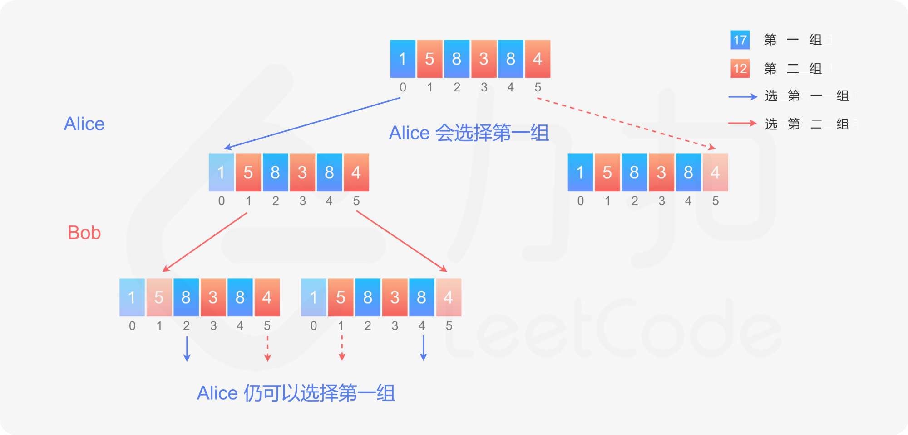

```Java
class Solution {
    public boolean stoneGame(int[] piles) {
        return true;
    }
}
```

```CSharp
public class Solution {
    public bool StoneGame(int[] piles) {
        return true;
    }
}
```

```C
bool stoneGame(int* piles, int pilesSize) {
    return true;
}
```

```C++
class Solution {
public:
    bool stoneGame(vector<int>& piles) {
        return true;
    }
};
```

```Go
func stoneGame(piles []int) bool {
    return true
}
```

```Python
class Solution:
    def stoneGame(self, piles: List[int]) -> bool:
        return True
```

```JavaScript
var stoneGame = function(piles) {
    return true;
};
```

**复杂度分析**

- 时间复杂度：$O(1)$。
- 空间复杂度：$O(1)$。
