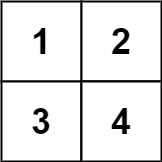
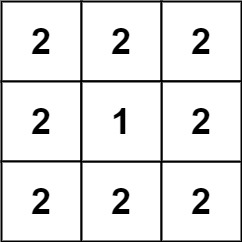

### [892\. 三维形体的表面积](https://leetcode.cn/problems/surface-area-of-3d-shapes/)

难度：简单

给你一个 `n * n` 的网格 `grid` ，上面放置着一些 `1 x 1 x 1` 的正方体。每个值 `v = grid[i][j]` 表示 `v` 个正方体叠放在对应单元格 `(i, j)` 上。

放置好正方体后，任何直接相邻的正方体都会互相粘在一起，形成一些不规则的三维形体。

请你返回最终这些形体的总表面积。

**注意：** 每个形体的底面也需要计入表面积中。

**示例 1：**

> **输入：** grid = \[[1,2],[3,4]]
> **输出：** 34

**示例 2：**

> **输入：** grid = \[[1,1,1],[1,0,1],[1,1,1]]
> **输出：** 32

**示例 3：**

> **输入：** grid = \[[2,2,2],[2,1,2],[2,2,2]]
> **输出：** 46

**提示：**

- `n == grid.length`
- `n == grid[i].length`
- `1 <= n <= 50`
- `0 <= grid[i][j] <= 50`
