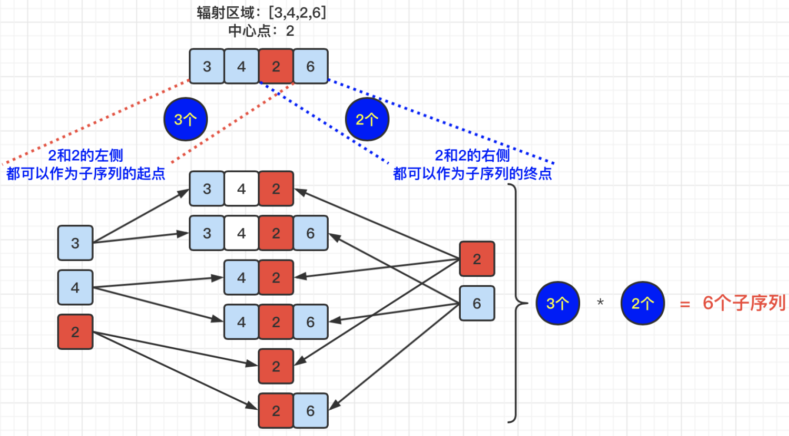
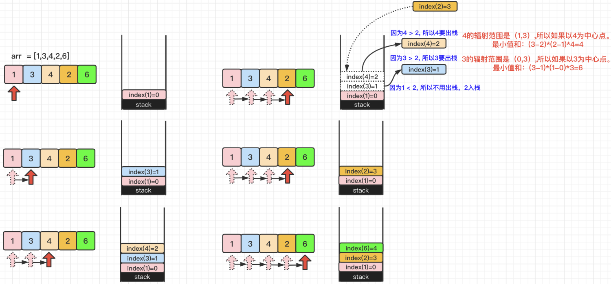
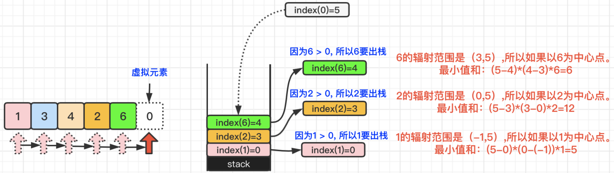

### [【爪哇缪斯】图解LeetCode](https://leetcode.cn/problems/sum-of-subarray-minimums/solutions/1931139/-by-muse-77-367z/)

#### 解题思想

#### 1> 概述

首先根据题意，我们需要做到如下3个步骤：

> 【**步骤1**】 找到数组arr的`所有子序列`。  
> 【**步骤2**】对比每个子序列内部的整数，并`找到每个子序列的最小值`。  
> 【**步骤3**】将这些`最小值相加`。

但是，如果我们真的按照上面3个步骤去编码的话，**会造成程序计算超时**。那么就需要我们再去找出更“巧”的方法对这道题进行解答。如果我们仔细分析，其实可以将解题步骤简化为2个步骤：

> 【**步骤1**】分别以数组arr中的每个整数作为一个**中心点**，然后分别去找基于这个中心点的“**辐射区域**”，要满足在辐射区域内，这个**中心点整数值是最小的**。例如：在数组`[1,3,4,2,6,1]`中，如果以整数`2`为一个中心点，那么它的辐射区域为`[3,4,2,6]`。**问题1：如何快速确定某个中心点的辐射区？**  
> 【**步骤2**】因为**在辐射区内，中心点最小**，所以计算在辐射区域内，能组成多少个包含中心点的子序列。例如：`[3,4,2,6]`可以有如下**包含中心点2的子序列**：`[3,4,2]`、`[3,4,2,6]`、`[4,2]`、`[4,2,6]`、`[2]`、`[2,6]`这6个子序列。那么这个最小值2的总和就是 **2 \* 6 = 12**。**问题2：如何计算出包含中心点的子序列个数？**

#### 2> 问题2：如何计算出包含中心点的子序列个数？

通过上面的简化步骤，我们又引出了2个问题需要处理，那么我们先处理简单一点的问题2，即：**如何计算出包含中心点的子序列个数？** 可以得出如下公式，即：`(index(中心点) - index(辐射区第1个整数) + 1) * (index(辐射区最后1个整数) - index(中心点) + 1)` 。具体详情请见下图：



#### 3> 问题1：如何快速确定某个中心点的辐射区？

针对问题1，我们可以采用**单调栈**的方式，因为计算辐射区内的子序列时，是需要通过下标计算的，所以堆栈中存储的是**数组arr中元素的下标**。然后，遍历整个数组arr，如果`堆栈为空`，那么直接入栈；如果`堆栈不为空`，则进行如下操作：

> **如果栈顶元素 > arr[i]** ：则弹出栈顶元素n，那么针对于这个n来说，它的辐射区域就是`(新的栈顶元素, i)`[注]左开右开区间。  
> **如果栈顶元素 <= arr[i]** ：则arr[i]直接入栈。

具体详情请见下图：



> 【解释】堆栈stack中存储的是arr中元素对应的**下标**，在上图中，例如：元素“3”，下标用index(3)=1表示。

针对上面图例所示，我们已经遍历完所有arr数组中的元素了，并且由于**4和3都大于2**，所以执行了出栈操作，并分别计算了以4和3为中心点的最小值和分别是：`4` 和 `6`。但是堆栈中依然还有元素1,2和6，如果不让他们出栈的话，最终结果肯定是错误的。那怎么让他们出栈呢？根据题目中【提示】部分描述，`1 <= arr[i] <= 3 * 10^4`,所以，arr数组中所有元素都是大于0的，那么我们就虚拟一个元素将其放入堆栈中，因为堆栈中所有元素都小于0，所以也就都会被执行出栈操作了。具体详情请见下图：



最终我们可以得出如下结果：

> 以“`1`”为中心点：最小值和等于**5**。  
> 以“`3`”为中心点：最小值和等于**6**。  
> 以“`4`”为中心点：最小值和等于**4**。  
> 以“`2`”为中心点：最小值和等于**12**。  
> 以“`6`”为中心点：最小值和等于**6**。  
> **【最终结果】5+6+4+12+6 = 33。**

# 代码实现

```java
class Solution {
    public int sumSubarrayMins(int[] arr) {
        long result = 0;
        int[] stack = new int[arr.length]; // 使用数组结构模拟堆栈，里面存储arr数组的下标，为了便于计算“管辖区域”的跨度
        int head = 0, tail = head, mod = (int) (1e9 + 7); // 配合模拟堆栈的head指针和tail指针
        for (int i = 0; i <= arr.length; i++) {
            int num = (i == arr.length) ? 0 : arr[i]; // 如果arr数组遍历到最后一个元素，则还需要模拟结尾元素0，为了让stack中元素都出栈
            while (head != tail && arr[stack[tail - 1]] > num) {
                int n = stack[--tail]; // 待计算数字arr[n]的【数组下标】
                int h = (head != tail) ? stack[tail - 1] : -1; // arr[n]的“辐射区域”head头的【数组下标】（开区间）
                int t = i; // arr[n]的“辐射区域”tail尾的【数组下标】（开区间）
                result = (result + (long) (n - h) * (t - n) * arr[n]) % mod;
            }
            stack[tail++] = i;
        }
        return (int) result;
    }
}
```
