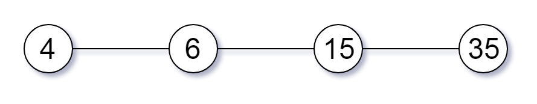
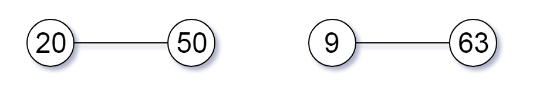
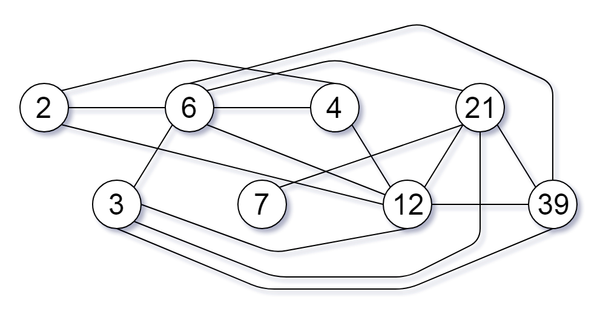

### [952\. 按公因数计算最大组件大小](https://leetcode.cn/problems/largest-component-size-by-common-factor/)

难度：困难

给定一个由不同正整数的组成的非空数组 `nums`，考虑下面的图：

- 有 `nums.length` 个节点，按从 `nums[0]` 到 `nums[nums.length - 1]` 标记；
- 只有当 `nums[i]` 和 `nums[j]` 共用一个大于 1 的公因数时，`nums[i]` 和 `nums[j]`之间才有一条边。

返回 _图中最大连通组件的大小_。

**示例 1：**

> 
>
> **输入：** nums = [4,6,15,35]
> **输出：** 4

**示例 2：**

> 
>
> **输入：** nums = [20,50,9,63]
> **输出：** 2

**示例 3：**

> 
>
> **输入：** nums = [2,3,6,7,4,12,21,39]
> **输出：** 8

**提示：**

- <code>1 <= nums.length <= 2 &times; 104</code>
- <code>1 <= nums[i] <= 105</code>
- `nums` 中所有值都 **不同**
