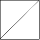
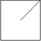
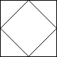

### [959\. 由斜杠划分区域](https://leetcode.cn/problems/regions-cut-by-slashes/)

难度：中等

在由 <code>1 &times; 1</code> 方格组成的 <code>n &times; n</code> 网格 `grid` 中，每个 <code>1 &times; 1</code> 方块由 `'/'`、`'\'` 或空格构成。这些字符会将方块划分为一些共边的区域。

给定网格 `grid` 表示为一个字符串数组，返回 _区域的数量_。

请注意，反斜杠字符是转义的，因此 `'\'` 用 `'\\'` 表示。

**示例 1：**

> 
>
> **输入：** grid = [" /","/ "]
> **输出：** 2

**示例 2：**

> 
>
> **输入：** grid = [" /","  "]
> **输出：** 1

**示例 3：**

> 
>
> **输入：** grid = ["/\\\\","\\\\/"]
> **输出：** 5
> **解释：** 回想一下，因为 \\ 字符是转义的，所以 "/\\\\" 表示 /\\，而 "\\\\/" 表示 \\/。

**提示：**

- `n == grid.length == grid[i].length`
- `1 <= n <= 30`
- `grid[i][j]` 是 `'/'`、`'\'`、或 `' '`
