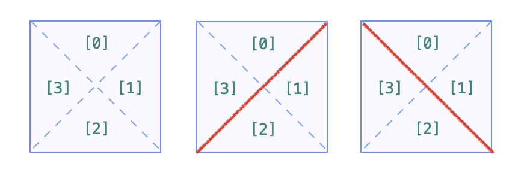
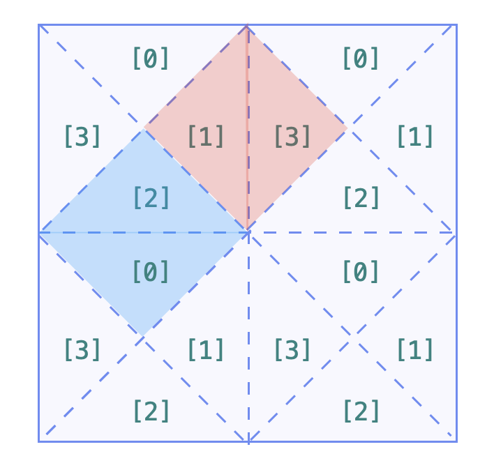

### [由斜杠划分区域](https://leetcode.cn/problems/regions-cut-by-slashes/solutions/571382/you-xie-gang-hua-fen-qu-yu-by-leetcode-67xb/?envType=problem-list-v2&envId=h15Gc5qm)

这是一个关于连通性的问题，让我们求解连通分量的个数，解决这个问题没有特别的技巧，根据题意 **画图分析**、稍微细心一点就可以通过系统测评。

可以用深度优先遍历（$Depth First Search$）、广度优先遍历（$Breadth First Search$）和并查集（$Disjoint Sets$），由于只要求计算结果，不要求给出具体的连通信息，可以使用并查集。

#### 方法：并查集

「斜杠」、「反斜杠」把单元格拆分成的 $2$ 个三角形的形态，在做合并的时候需要分类讨论。**根据「斜杠」、「反斜杠」分割的特点**，我们把一个单元格分割成逻辑上的 $4$ 个部分。如下图所示：



我们须要遍历一次输入的二维网格 `grid`，在 **单元格内** 和 **单元格间** 进行合并。

**单元格内**：

- 如果是空格：合并 0、1、2、3；
- 如果是斜杠：合并 0、3，合并 1、2；
- 如果是反斜杠：合并 0、1，合并 2、3。

**单元格间**：

**把每一个单元格拆分成 $4$ 个小三角形以后，相邻的单元格须要合并，无须分类讨论**。我们选择在遍历 `grid` 的每一个单元格的时候，分别「向右、向下」尝试合并。



- 向右：合并 $1 $（当前单元格）和 $3$（当前单元格右边 $1$ 列的单元格），上图中红色部分；
- 向下：合并 $2 $（当前单元格）和 $0$（当前单元格下边 $1$ 列的单元格），上图中蓝色部分。

事实上，大家选择在遍历 `grid` 的每一个单元格的时候，分别「向左、向上」、「向左、向下」、「向右、向上」、「向右、向下」中的任何一种都可以。

合并完成以后，并查集里连通分量的个数就是题目要求的区域的个数。

**参考代码**：

```Java
public class Solution {

    public int regionsBySlashes(String[] grid) {
        int N = grid.length;
        int size = 4 * N * N;

        UnionFind unionFind = new UnionFind(size);
        for (int i = 0; i < N; i++) {
            char[] row = grid[i].toCharArray();
            for (int j = 0; j < N; j++) {
                // 二维网格转换为一维表格，index 表示将单元格拆分成 4 个小三角形以后，编号为 0 的小三角形的在并查集中的下标
                int index = 4 * (i * N + j);
                char c = row[j];
                // 单元格内合并
                if (c == '/') {
                    // 合并 0、3，合并 1、2
                    unionFind.union(index, index + 3);
                    unionFind.union(index + 1, index + 2);
                } else if (c == '\\') {
                    // 合并 0、1，合并 2、3
                    unionFind.union(index, index + 1);
                    unionFind.union(index + 2, index + 3);
                } else {
                    unionFind.union(index, index + 1);
                    unionFind.union(index + 1, index + 2);
                    unionFind.union(index + 2, index + 3);
                }

                // 单元格间合并
                // 向右合并：1（当前）、3（右一列）
                if (j + 1 < N) {
                    unionFind.union(index + 1, 4 * (i * N + j + 1) + 3);
                }
                // 向下合并：2（当前）、0（下一行）
                if (i + 1 < N) {
                    unionFind.union(index + 2, 4 * ((i + 1) * N + j));
                }
            }
        }
        return unionFind.getCount();
    }

    private class UnionFind {

        private int[] parent;

        private int count;

        public int getCount() {
            return count;
        }

        public UnionFind(int n) {
            this.count = n;
            this.parent = new int[n];
            for (int i = 0; i < n; i++) {
                parent[i] = i;
            }
        }

        public int find(int x) {
            while (x != parent[x]) {
                parent[x] = parent[parent[x]];
                x = parent[x];
            }
            return x;
        }

        public void union(int x, int y) {
            int rootX = find(x);
            int rootY = find(y);
            if (rootX == rootY) {
                return;
            }

            parent[rootX] = rootY;
            count--;
        }
    }
}
```

**复杂度分析**

- 时间复杂度：$O(N^2\log N)$，其中 $N$ 是网格的长度，$O(N^2\log N^2)=O(2N^2\log N)$；
- 空间复杂度：$O(N^2)$。
