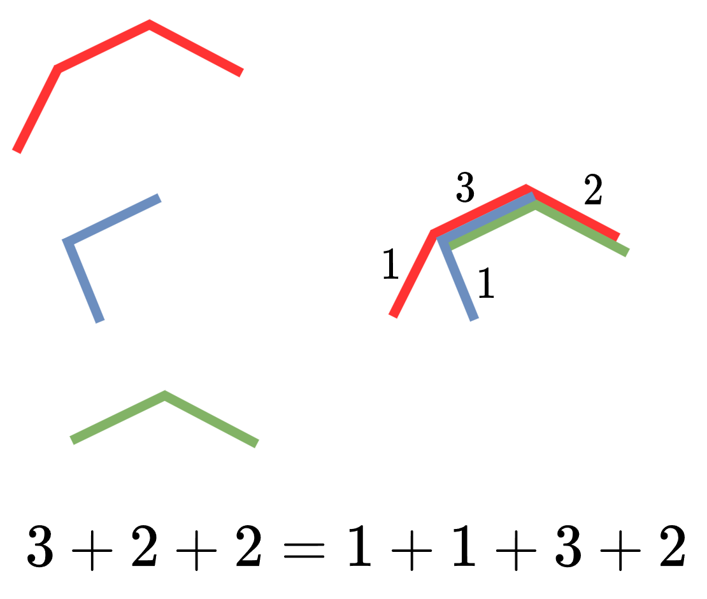

#### [【图解】没有思路？进来秒懂！（Python/Java/C++/Go/JS）](https://leetcode.cn/problems/distribute-coins-in-binary-tree/solutions/2343262/tu-jie-mei-you-si-lu-jin-lai-miao-dong-p-vrni/)


## 答疑

**问**：如何理解计算 $coins$ 和 $nodes$ 的公式？

**答**：请学习「递归」「子问题」等概念，具体请看[【基础算法精讲 09】](https://leetcode.cn/link/?target=https%3A%2F%2Fwww.bilibili.com%2Fvideo%2FBV1UD4y1Y769%2F)。

**问**：算法二的公式是怎么得到的？

**答**：（注意 $d$ 没有取绝对值，只在加到答案时取了绝对值）

$$\begin{aligned} d=&\ coins-nodes\\ =&\ (coins_{left} + coins_{right} + node.val) - (nodes_{left} + nodes_{right} + 1)\\ =&\ (coins_{left} -nodes_{left}) +(coins_{right} -nodes_{right}) + node.val - 1\\ =&\ d_{left} +d_{right} + node.val - 1 \end{aligned}$$

**问**：根节点没有父节点，代码中为什么没有特判根节点呢？

**答**：根节点处统计的是整棵树，其中 $coins=n,nodes=n$。因为 $|coins-nodes|=0$，对答案无影响，所以无需特判根节点。

**问**：这种思路的**本质**是什么？

**答**：横看成岭侧成峰，每枚硬币移动的路径长度并不好计算，但是把这些路径**叠起来**，转换成每条边经过了多少枚硬币，就容易计算了（如下图）。



路径是由边组成的，所有路径长度之和，等同于把「每条边出现在多少条路径中」相加。这种技巧叫做**贡献法**。更多相关题目，见文末的题单。

#### 算法一

```python
class Solution:
    def distributeCoins(self, root: Optional[TreeNode]) -> int:
        ans = 0
        def dfs(node: Optional[TreeNode]) -> (int, int):
            if node is None:
                return 0, 0
            coins_l, nodes_l = dfs(node.left)
            coins_r, nodes_r = dfs(node.right)
            coins = coins_l + coins_r + node.val  # 子树硬币个数
            nodes = nodes_l + nodes_r + 1  # 子树节点数
            nonlocal ans
            ans += abs(coins - nodes)
            return coins, nodes
        dfs(root)
        return ans
```

```java
class Solution {
    private int ans;

    public int distributeCoins(TreeNode root) {
        dfs(root);
        return ans;
    }

    private int[] dfs(TreeNode node) {
        if (node == null)
            return new int[]{0, 0};
        var left = dfs(node.left);
        var right = dfs(node.right);
        int coins = left[0] + right[0] + node.val; // 子树硬币个数
        int nodes = left[1] + right[1] + 1; // 子树节点数
        ans += Math.abs(coins - nodes);
        return new int[]{coins, nodes};
    }
}
```

```cpp
class Solution {
    int ans = 0;

    pair<int, int> dfs(TreeNode *node) {
        if (node == nullptr)
            return {0, 0};
        auto [coins_l, nodes_l] = dfs(node->left);
        auto [coins_r, nodes_r] = dfs(node->right);
        int coins = coins_l + coins_r + node->val; // 子树硬币个数
        int nodes = nodes_l + nodes_r + 1; // 子树节点数
        ans += abs(coins - nodes);
        return {coins, nodes};
    }

public:
    int distributeCoins(TreeNode *root) {
        dfs(root);
        return ans;
    }
};
```

```go
func distributeCoins(root *TreeNode) (ans int) {
    var dfs func(*TreeNode) (int, int)
    dfs = func(node *TreeNode) (int, int) {
        if node == nil {
            return 0, 0
        }
        coinsL, nodesL := dfs(node.Left)
        coinsR, nodesR := dfs(node.Right)
        coins := coinsL + coinsR + node.Val // 子树硬币个数
        nodes := nodesL + nodesR + 1        // 子树节点数
        ans += abs(coins - nodes)
        return coins, nodes
    }
    dfs(root)
    return
}

func abs(x int) int { if x < 0 { return -x }; return x }
```

```javascript
var distributeCoins = function (root) {
    let ans = 0;
    function dfs(node) {
        if (node === null)
            return [0, 0];
        const [coinsL, nodesL] = dfs(node.left);
        const [coinsR, nodesR] = dfs(node.right);
        const coins = coinsL + coinsR + node.val; // 子树硬币个数
        const nodes = nodesL + nodesR + 1; // 子树节点数
        ans += Math.abs(coins - nodes);
        return [coins, nodes];
    }
    dfs(root);
    return ans;
};
```

#### 算法二（优化）

```python
class Solution:
    def distributeCoins(self, root: Optional[TreeNode]) -> int:
        ans = 0
        def dfs(node: Optional[TreeNode]) -> int:
            if node is None:
                return 0
            d = dfs(node.left) + dfs(node.right) + node.val - 1
            nonlocal ans
            ans += abs(d)
            return d
        dfs(root)
        return ans
```

```java
class Solution {
    private int ans;

    public int distributeCoins(TreeNode root) {
        dfs(root);
        return ans;
    }

    private int dfs(TreeNode node) {
        if (node == null)
            return 0;
        int d = dfs(node.left) + dfs(node.right) + node.val - 1;
        ans += Math.abs(d);
        return d;
    }
}
```

```cpp
class Solution {
    int ans = 0;

    int dfs(TreeNode *node) {
        if (node == nullptr)
            return 0;
        int d = dfs(node->left) + dfs(node->right) + node->val - 1;
        ans += abs(d);
        return d;
    }

public:
    int distributeCoins(TreeNode *root) {
        dfs(root);
        return ans;
    }
};
```

```go
func distributeCoins(root *TreeNode) (ans int) {
    var dfs func(*TreeNode) int
    dfs = func(node *TreeNode) int {
        if node == nil {
            return 0
        }
        d := dfs(node.Left) + dfs(node.Right) + node.Val - 1
        ans += abs(d)
        return d
    }
    dfs(root)
    return
}

func abs(x int) int { if x < 0 { return -x }; return x }
```

```javascript
var distributeCoins = function (root) {
    let ans = 0;
    function dfs(node) {
        if (node === null)
            return 0;
        const d = dfs(node.left) + dfs(node.right) + node.val - 1;
        ans += Math.abs(d);
        return d;
    }
    dfs(root);
    return ans;
};
```

#### 复杂度分析

-   时间复杂度：$\mathcal{O}(n)$，其中 $n$ 为二叉树的节点个数。每个节点都会递归恰好一次。
-   空间复杂度：$\mathcal{O}(n)$。最坏情况下，二叉树是一条链，递归需要 $\mathcal{O}(n)$ 的栈空间。

#### 思考题

1.  如果硬币总个数 $\le n$ 个，要求最终每个节点**至多**有一枚硬币，最少要移动多少次呢？
2.  如果硬币总个数 $\ge n$ 个，要求最终每个节点**至少**有一枚硬币，最少要移动多少次呢？
3.  假设每个节点 $node$ 都多了一个属性值 $target$，要求最终**至少**有 $node.target$ 枚硬币，最少要移动多少次呢？（保证总硬币个数不低于所有节点的 $target$ 之和。）

欢迎在评论区发表你的思路。

#### 题单：贡献法

-   [891\. 子序列宽度之和](https://leetcode.cn/problems/sum-of-subsequence-widths/)，[题解](https://leetcode.cn/problems/sum-of-subsequence-widths/solution/by-endlesscheng-upd1/)
-   [907\. 子数组的最小值之和](https://leetcode.cn/problems/sum-of-subarray-minimums/)，[题解](https://leetcode.cn/problems/sum-of-subarray-minimums/solution/gong-xian-fa-dan-diao-zhan-san-chong-shi-gxa5/)
-   [1856\. 子数组最小乘积的最大值](https://leetcode.cn/problems/maximum-subarray-min-product/)
-   [2104\. 子数组范围和](https://leetcode.cn/problems/sum-of-subarray-ranges/)
-   [2681\. 英雄的力量](https://leetcode.cn/problems/power-of-heroes/)
-   [2281\. 巫师的总力量和](https://leetcode.cn/problems/sum-of-total-strength-of-wizards/)
