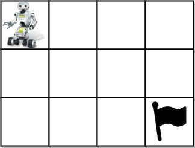

#### [980\. 不同路径 III](https://leetcode.cn/problems/unique-paths-iii/)

难度：困难

在二维网格 `grid` 上，有 4 种类型的方格：

-   `1` 表示起始方格。且只有一个起始方格。
-   `2` 表示结束方格，且只有一个结束方格。
-   `0` 表示我们可以走过的空方格。
-   `-1` 表示我们无法跨越的障碍。

返回在四个方向（上、下、左、右）上行走时，从起始方格到结束方格的不同路径的数目。

**每一个无障碍方格都要通过一次，但是一条路径中不能重复通过同一个方格**。

**示例 1：**


```
输入：[[1,0,0,0],[0,0,0,0],[0,0,2,-1]]
输出：2
解释：我们有以下两条路径：
1. (0,0),(0,1),(0,2),(0,3),(1,3),(1,2),(1,1),(1,0),(2,0),(2,1),(2,2)
2. (0,0),(1,0),(2,0),(2,1),(1,1),(0,1),(0,2),(0,3),(1,3),(1,2),(2,2)
```

**示例 2：**



```
输入：[[1,0,0,0],[0,0,0,0],[0,0,0,2]]
输出：4
解释：我们有以下四条路径： 
1. (0,0),(0,1),(0,2),(0,3),(1,3),(1,2),(1,1),(1,0),(2,0),(2,1),(2,2),(2,3)
2. (0,0),(0,1),(1,1),(1,0),(2,0),(2,1),(2,2),(1,2),(0,2),(0,3),(1,3),(2,3)
3. (0,0),(1,0),(2,0),(2,1),(2,2),(1,2),(1,1),(0,1),(0,2),(0,3),(1,3),(2,3)
4. (0,0),(1,0),(2,0),(2,1),(1,1),(0,1),(0,2),(0,3),(1,3),(1,2),(2,2),(2,3)
```

**示例 3：**


```
输入：[[0,1],[2,0]]
输出：0
解释：
没有一条路能完全穿过每一个空的方格一次。
请注意，起始和结束方格可以位于网格中的任意位置。
```

**提示：**

-   `1 <= grid.length * grid[0].length <= 20`
