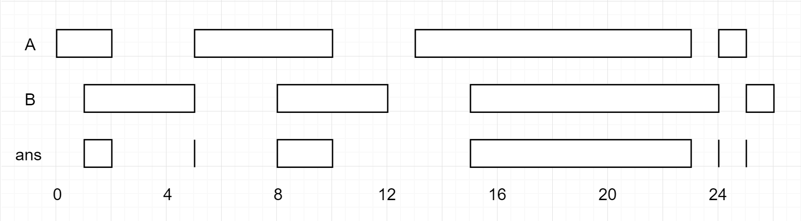

### [986\. 区间列表的交集](https://leetcode.cn/problems/interval-list-intersections/)

难度：中等

给定两个由一些 **闭区间** 组成的列表，`firstList` 和 `secondList`，其中 <code>firstList[i] = [starti, endi]</code> 而 <code>secondList[j] = [startj, endj]</code>。每个区间列表都是成对 **不相交** 的，并且 **已经排序**。

返回这 **两个区间列表的交集**。

形式上，**闭区间** `[a, b]`（其中 `a <= b`）表示实数 `x` 的集合，而 `a <= x <= b`。

两个闭区间的 **交集** 是一组实数，要么为空集，要么为闭区间。例如，`[1, 3]` 和 `[2, 4]` 的交集为 `[2, 3]`。

**示例 1：**

> 
>
> **输入：** firstList = \[[0,2],[5,10],[13,23],[24,25]], secondList = \[[1,5],[8,12],[15,24],[25,26]]
> **输出：** \[[1,2],[5,5],[8,10],[15,23],[24,24],[25,25]]

**示例 2：**

> **输入：** firstList = \[[1,3],[5,9]], secondList = []
> **输出：** []

**示例 3：**

> **输入：** firstList = [], secondList = \[[4,8],[10,12]]
> **输出：** []

**示例 4：**

> **输入：** firstList = \[[1,7]], secondList = \[[3,10]]
> **输出：** \[[3,7]]

**提示：**

- `0 <= firstList.length, secondList.length <= 1000`
- `firstList.length + secondList.length >= 1`
- <code>0 <= starti < endi <= 109</code>
- <code>endi < starti+1</code>
- <code>0 <= startj < endj <= 109</code>
- <code>endj < startj+1</code>
