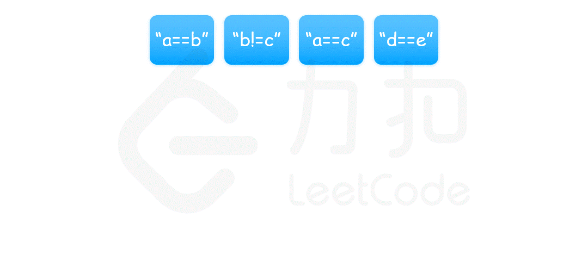

### [等式方程的可满足性](https://leetcode.cn/problems/satisfiability-of-equality-equations/solutions/279091/deng-shi-fang-cheng-de-ke-man-zu-xing-by-leetcode-/?envType=problem-list-v2&envId=ySsxoJfz)

#### 方法一：并查集

我们可以将每一个变量看作图中的一个节点，把相等的关系 `==` 看作是连接两个节点的边，那么由于表示相等关系的等式方程具有传递性，即如果 `a==b` 和 `b==c` 成立，则 `a==c` 也成立。也就是说，所有相等的变量属于同一个连通分量。因此，我们可以使用并查集来维护这种连通分量的关系。

首先遍历所有的等式，构造并查集。同一个等式中的两个变量属于同一个连通分量，因此将两个变量进行合并。

然后遍历所有的不等式。同一个不等式中的两个变量不能属于同一个连通分量，因此对两个变量分别查找其所在的连通分量，如果两个变量在同一个连通分量中，则产生矛盾，返回 `false`。

如果遍历完所有的不等式没有发现矛盾，则返回 `true`。



具体实现方面，使用一个数组 `parent` 存储每个变量的连通分量信息，其中的每个元素表示当前变量所在的连通分量的父节点信息，如果父节点是自身，说明该变量为所在的连通分量的根节点。一开始所有变量的父节点都是它们自身。对于合并操作，我们将第一个变量的根节点的父节点指向第二个变量的根节点；对于查找操作，我们沿着当前变量的父节点一路向上查找，直到找到根节点。

```Java
class Solution {
    public boolean equationsPossible(String[] equations) {
        int[] parent = new int[26];
        for (int i = 0; i < 26; i++) {
            parent[i] = i;
        }
        for (String str : equations) {
            if (str.charAt(1) == '=') {
                int index1 = str.charAt(0) - 'a';
                int index2 = str.charAt(3) - 'a';
                union(parent, index1, index2);
            }
        }
        for (String str : equations) {
            if (str.charAt(1) == '!') {
                int index1 = str.charAt(0) - 'a';
                int index2 = str.charAt(3) - 'a';
                if (find(parent, index1) == find(parent, index2)) {
                    return false;
                }
            }
        }
        return true;
    }

    public void union(int[] parent, int index1, int index2) {
        parent[find(parent, index1)] = find(parent, index2);
    }

    public int find(int[] parent, int index) {
        while (parent[index] != index) {
            parent[index] = parent[parent[index]];
            index = parent[index];
        }
        return index;
    }
}
```

```C++
class UnionFind {
private:
    vector<int> parent;

public:
    UnionFind() {
        parent.resize(26);
        iota(parent.begin(), parent.end(), 0);
    }

    int find(int index) {
        if (index == parent[index]) {
            return index;
        }
        parent[index] = find(parent[index]);
        return parent[index];
    }

    void unite(int index1, int index2) {
        parent[find(index1)] = find(index2);
    }
};

class Solution {
public:
    bool equationsPossible(vector<string>& equations) {
        UnionFind uf;
        for (const string& str: equations) {
            if (str[1] == '=') {
                int index1 = str[0] - 'a';
                int index2 = str[3] - 'a';
                uf.unite(index1, index2);
            }
        }
        for (const string& str: equations) {
            if (str[1] == '!') {
                int index1 = str[0] - 'a';
                int index2 = str[3] - 'a';
                if (uf.find(index1) == uf.find(index2)) {
                    return false;
                }
            }
        }
        return true;
    }
};
```

```Python
class Solution:

    class UnionFind:
        def __init__(self):
            self.parent = list(range(26))

        def find(self, index):
            if index == self.parent[index]:
                return index
            self.parent[index] = self.find(self.parent[index])
            return self.parent[index]

        def union(self, index1, index2):
            self.parent[self.find(index1)] = self.find(index2)


    def equationsPossible(self, equations: List[str]) -> bool:
        uf = Solution.UnionFind()
        for st in equations:
            if st[1] == "=":
                index1 = ord(st[0]) - ord("a")
                index2 = ord(st[3]) - ord("a")
                uf.union(index1, index2)
        for st in equations:
            if st[1] == "!":
                index1 = ord(st[0]) - ord("a")
                index2 = ord(st[3]) - ord("a")
                if uf.find(index1) == uf.find(index2):
                    return False
        return True
```

```Go
func equationsPossible(equations []string) bool {
    parent := make([]int, 26)
    for i := 0; i < 26; i++ {
        parent[i] = i
    }
    for _, str := range equations {
        if str[1] == '=' {
            index1 := int(str[0] - 'a')
            index2 := int(str[3] - 'a')
            union(parent, index1, index2)
        }
    }

    for _, str := range equations {
        if str[1] == '!' {
            index1 := int(str[0] - 'a')
            index2 := int(str[3] - 'a')
            if find(parent, index1) == find(parent, index2) {
                return false
            }
        }
    }
    return true
}

func union(parent []int, index1, index2 int) {
    parent[find(parent, index1)] = find(parent, index2)
}

func find(parent []int, index int) int {
    for parent[index] != index {
        parent[index] = parent[parent[index]]
        index = parent[index]
    }
    return index
}
```

**复杂度分析**

- 时间复杂度：$O(n+C\log C)$，其中 $n$ 是 `equations` 中的方程数量，$C$ 是变量的总数，在本题中变量都是小写字母，即 $C\le 26$。上面的并查集代码中使用了路径压缩优化，对于每个方程的合并和查找的均摊时间复杂度都是 $O(\log C)$。由于需要遍历每个方程，因此总时间复杂度是 $O(n+C\log C)$。
- 空间复杂度：$O(C)$。创建一个数组 `parent` 存储每个变量的连通分量信息，由于变量都是小写字母，因此 `parent` 是长度为 $C$。
