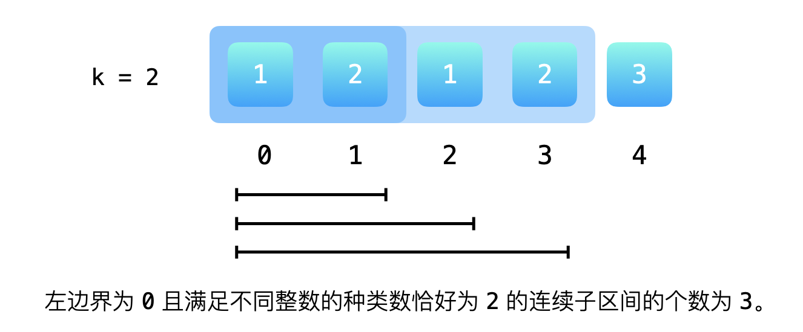
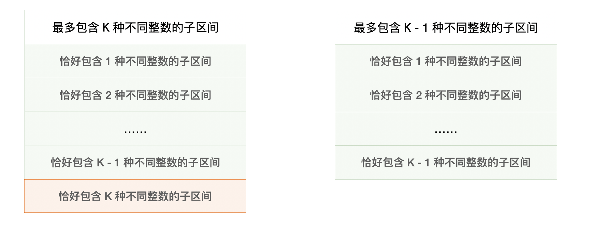

### [K 个不同整数的子数组](https://leetcode.cn/problems/subarrays-with-k-different-integers/solutions/597667/k-ge-bu-tong-zheng-shu-de-zi-shu-zu-by-l-ud34/?envType=problem-list-v2&envId=ySsxoJfz)

#### 最初直觉使用双指针算法遇到的问题

对于一个固定的左边界来说，满足「恰好存在 `K` 个不同整数的子区间」的右边界 **不唯一**，且形成区间。

示例 $1$：左边界固定的时候，恰好存在 $2$ 个不同整数的子区间为 $[1,2],[1,2,1],[1,2,1,2]$，总数为 $3$。其值为下标 $3-1+1$，即区间 $[1..3]$ 的长度。



须要找到左边界固定的情况下，满足「恰好存在 `K` 个不同整数的子区间」最小右边界和最大右边界。对比以前我们做过的，使用双指针解决的问题的问法基本都会出现「最小」、「最大」这样的字眼。

- [76\. 最小覆盖子串](https://leetcode.cn/problems/minimum-window-substring/)；
- [209\. 长度最小的子数组](https://leetcode.cn/problems/minimum-size-subarray-sum/)；
- [159\. 至多包含两个不同字符的最长子串](https://leetcode.cn/problems/longest-substring-with-at-most-two-distinct-characters/)；
- [424\. 替换后的最长重复字符](https://leetcode.cn/problems/longest-repeating-character-replacement/)。

#### 把原问题转换成为容易求解的问题

> 友情提示：这里把 「恰好」 转换成为 「最多」须要一点求解「双指针（滑动窗口）」问题的经验。建立在熟练掌握这一类问题求解思路的基础上。

把「**恰好**」改成「**最多**」就可以使用双指针一前一后交替向右的方法完成，这是因为 **对于每一个确定的左边界，最多包含 $K$ 种不同整数的右边界是唯一确定的**，并且在左边界向右移动的过程中，右边界或者在原来的地方，或者在原来地方的右边。

而「最多存在 $K$ 个不同整数的子区间的个数」与「恰好存在 `K` 个不同整数的子区间的个数」的差恰好等于「最多存在 $K-1$ 个不同整数的子区间的个数」。



因为原问题就转换成为求解「最多存在 $K$ 个不同整数的子区间的个数」与 「最多存在 $K-1$ 个不同整数的子区间的个数」，它们其实是一个问题。

#### 方法：双指针（滑动窗口）

实现函数 `atMostWithKDistinct(A, K)`，表示「最多存在 $K$ 个不同整数的子区间的个数」。于是 `atMostWithKDistinct(A, K) - atMostWithKDistinct(A, K - 1)` 即为所求。

**参考代码**：

```Java
public class Solution {

    public int subarraysWithKDistinct(int[] A, int K) {
        return atMostKDistinct(A, K) - atMostKDistinct(A, K - 1);
    }

    /**
     * @param A
     * @param K
     * @return 最多包含 K 个不同整数的子区间的个数
     */
    private int atMostKDistinct(int[] A, int K) {
        int len = A.length;
        int[] freq = new int[len + 1];

        int left = 0;
        int right = 0;
        // [left, right) 里不同整数的个数
        int count = 0;
        int res = 0;
        // [left, right) 包含不同整数的个数小于等于 K
        while (right < len) {
            if (freq[A[right]] == 0) {
                count++;
            }
            freq[A[right]]++;
            right++;

            while (count > K) {
                freq[A[left]]--;
                if (freq[A[left]] == 0) {
                    count--;
                }
                left++;
            }
            // [left, right) 区间的长度就是对结果的贡献
            res += right - left;
        }
        return res;
    }
}
```

**说明**：`res += right - left;` 这行代码的意思：

用具体的例子理解：最多包含 $3$ 种不同整数的子区间 $`[1, 3, 2, 3]` $（双指针算法是在左边界固定的前提下，让右边界走到最右边），当前可以确定 `1` 开始的满足最多包含 $3$ 种不同整数的子区间有 `[1]`、`[1, 3]`、`[1, $3,$ 2]`、`[1, $3, 2, 3]`$。

**所有的** 左边界固定前提下，根据右边界最右的下标，计算出来的子区间的个数就是整个函数要返回的值。用右边界固定的前提下，左边界最左边的下标去计算也是完全可以的。

**复杂度分析**：

- 时间复杂度：$O(N)$，这里 $N$ 是输入数组的长度；
- 空间复杂度：$O(N)$，使用了常数个变量、频数数组的长度为 $N+1$。

---

#### 总结

使用双指针（滑动窗口、两个变量一前一后交替向后移动）解决的问题通常都和这个问题要问的结果有关。以我们在题解中给出的 $5$ 道经典问题为例：

- [3\. 无重复字符的最长子串](https://leetcode.cn/problems/longest-substring-without-repeating-characters/)：没有重复的子串，一定只会问「最长」，因为最短的没有重复字符的子串是只有一个字符的子串；
- [76\. 最小覆盖子串](https://leetcode.cn/problems/minimum-window-substring/)：求一个字符串的子串覆盖另一个字符串的长度一定是问「最小」，而不会问「最大」，因为最大一定是整个字符串；
- [209\. 长度最小的子数组](https://leetcode.cn/problems/minimum-size-subarray-sum/)：所有元素都是正整数，且子区间里所有元素的和大于等于定值 `s` 的子区间一定是问长度「最小」，而不会问「最多」，因为最多也一定是整个数组的长度；
- [159\. 至多包含两个不同字符的最长子串](https://leetcode.cn/problems/longest-substring-with-at-most-two-distinct-characters/)：最多包含两个不同字符一定是问「最长」才有意义，因为长度更长的子串可能会包含更多的字符；
- [424\. 替换后的最长重复字符](https://leetcode.cn/problems/longest-repeating-character-replacement/)：替换的次数 `k` 是定值，替换以后字符全部相等的子串也一定只会问「最长」。

---

#### 练习

**提示**：在做这些问题的时候，**一定要思考清楚为什么可以采用双指针（滑动窗口）算法解决如上的问题**，为什么 **左、右指针向右移动的时候可以不回头**。如果不太熟悉这一类问题思路的朋友，一定要想清楚算法为什么有效，比知道这些问题可以用双指针（滑动窗口）算法解决重要得多。

思路一般是这样：固定左边界的前提下，如果较短的区间性质是什么样的，较长的区间的性质其实我们也可以推测出来。在右边界固定的前提下，我们须要将左边界右移，如此反复。这样的算法只遍历了数组两次，不用枚举所有可能的区间，把 $O(N^2)$ 的时间复杂度降到了 $O(N)$。

- [713\. 乘积小于 $K$ 的子数组](https://leetcode.cn/problems/subarray-product-less-than-k/)；
- [904\. 水果成篮](https://leetcode.cn/problems/fruit-into-baskets/)；
- [795\. 区间子数组个数](https://leetcode.cn/problems/number-of-subarrays-with-bounded-maximum/)；
- [1358\. 包含所有三种字符的子字符串数目](https://leetcode.cn/problems/number-of-substrings-containing-all-three-characters/)；
- [467\. 环绕字符串中唯一的子字符串](https://leetcode.cn/problems/unique-substrings-in-wraparound-string/)；
- [340\. 至多包含 $K$ 个不同字符的最长子串](https://leetcode.cn/problems/longest-substring-with-at-most-k-distinct-characters/)。
