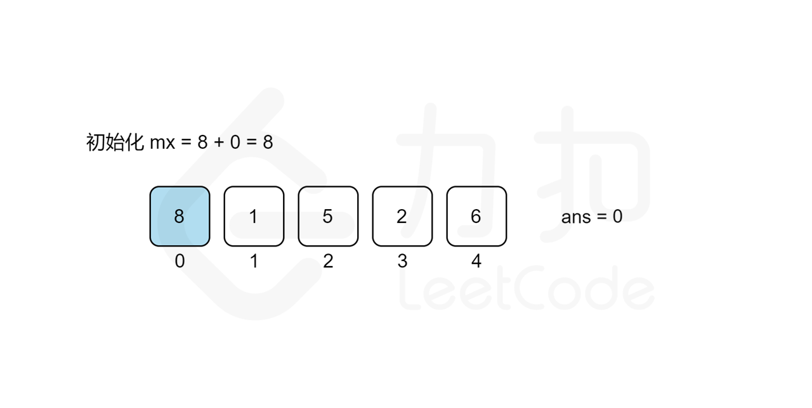
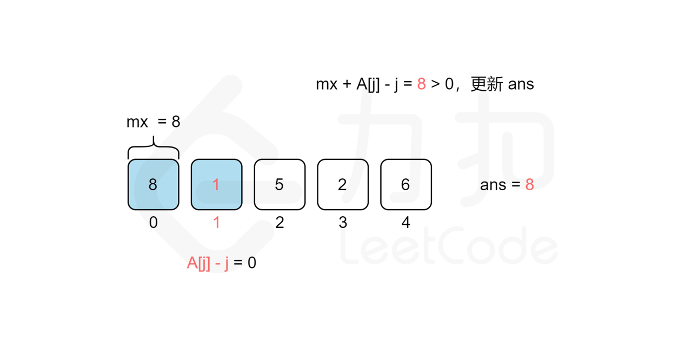
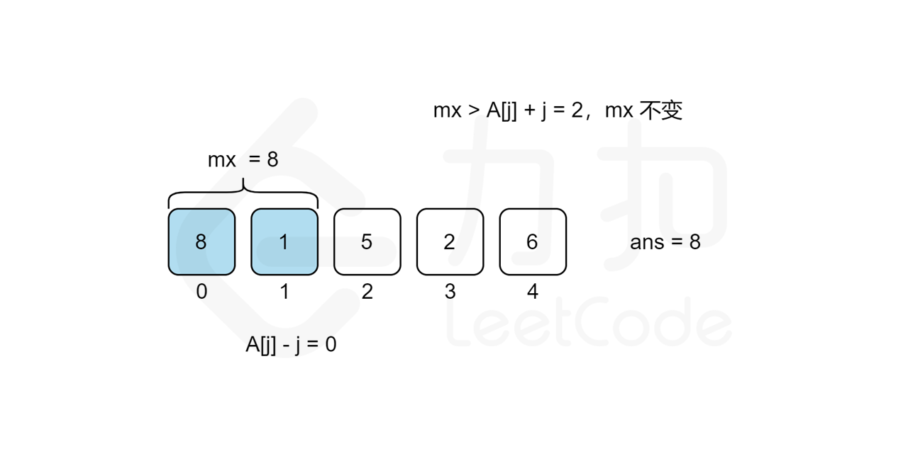
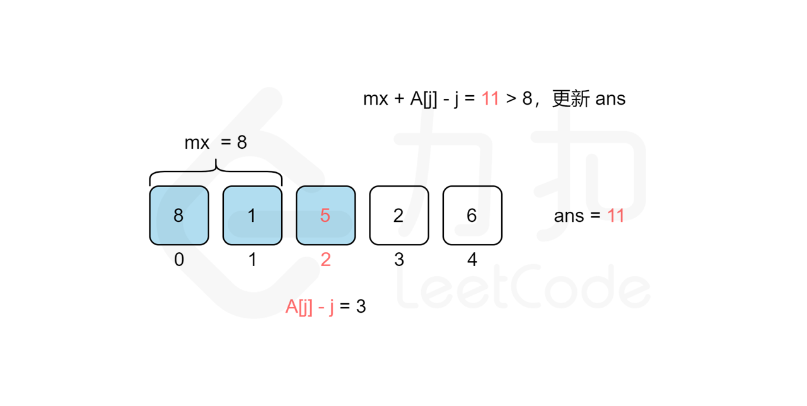
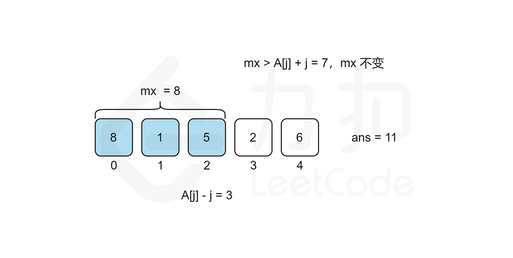
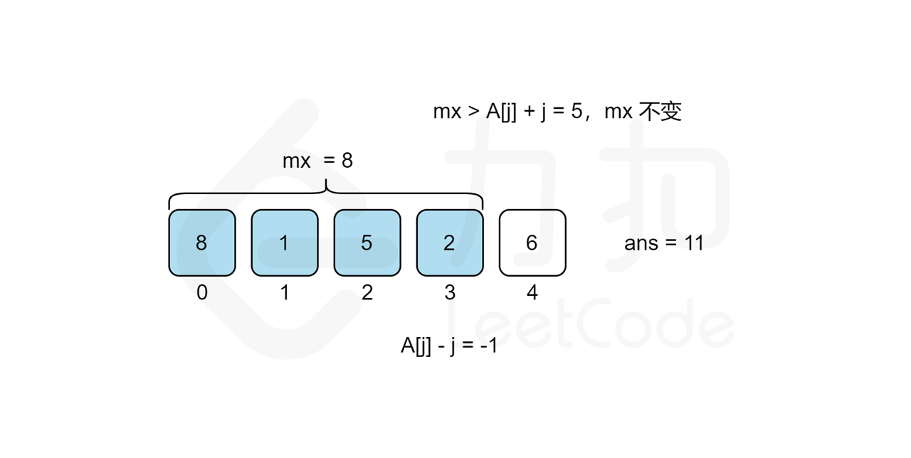
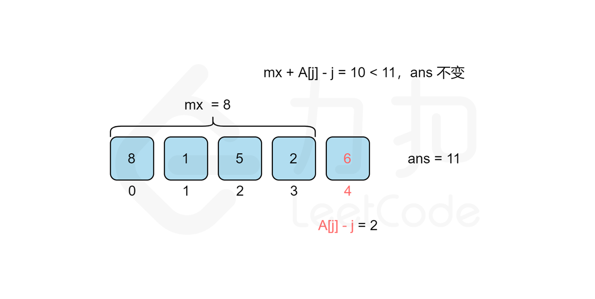
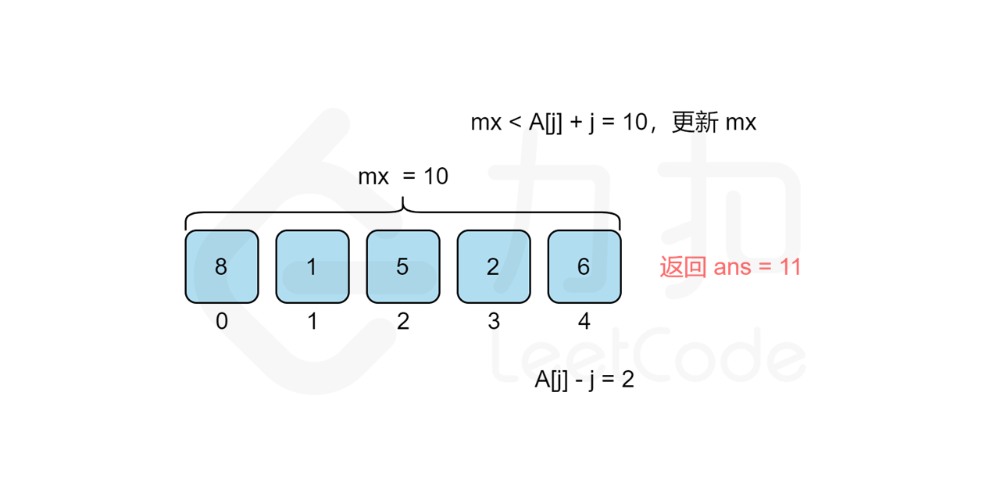

### [最佳观光组合](https://leetcode.cn/problems/best-sightseeing-pair/solutions/291380/zui-jia-guan-guang-zu-he-by-leetcode-solution/)

#### 方法一：遍历

**思路和算法**

我们考虑从前往后遍历 $j$ 来统计答案，对于每个观光景点 $j$ 而言，我们需要遍历 $[0,j-1]$ 的观光景点 $i$ 来计算组成观光组合 $(i,j)$ 得分的最大值 $cnt_j$​ 来作为第 $j$ 个观光景点的值，那么最后的答案无疑就是所有观光景点值的最大值，即 $max_{j=0..n-1}​{cnt_j​}$。但是遍历 $j$ 需要 $O(n)$ 的时间复杂度，遍历 $[0,j-1]$ 的观光景点 $i$ 也需要 $O(n)$ 的时间复杂度，因此该方法总复杂度为 $O(n^2)$，不能通过所有测试用例，我们需要进一步优化时间复杂度。

我们回过头来看得分公式，我们可以将其拆分成 $values[i]+i$ 和 $values[j]-j$ 两部分，这样对于统计景点 $j$ 答案的时候，由于 $values[j]-j$ 是固定不变的，因此最大化 $values[i]+i+values[j]-j$ 的值其实就等价于求 $[0,j-1]$ 中 $values[i]+i$ 的最大值 $mx$，景点 $j$ 的答案即为 $mx+values[j]-j$。而 $mx$ 的值我们只要从前往后遍历 $j$ 的时候同时维护即可，这样每次遍历到景点 $j$ 的时候，寻找使得得分最大的 $i$ 就能从 $O(n)$ 降至 $O(1)$ 的时间复杂度，总时间复杂度就能从 $O(n^2)$ 降至 $O(n)$。











```C++
class Solution {
public:
    int maxScoreSightseeingPair(vector<int>& values) {
        int ans = 0, mx = values[0] + 0;
        for (int j = 1; j < values.size(); ++j) {
            ans = max(ans, mx + values[j] - j);
            // 边遍历边维护
            mx = max(mx, values[j] + j);
        }
        return ans;
    }
};
```

```Java
class Solution {
    public int maxScoreSightseeingPair(int[] values) {
        int ans = 0, mx = values[0] + 0;
        for (int j = 1; j < values.length; ++j) {
            ans = Math.max(ans, mx + values[j] - j);
            // 边遍历边维护
            mx = Math.max(mx, values[j] + j);
        }
        return ans;
    }
}
```

```Python
class Solution:
    def maxScoreSightseeingPair(self, values: List[int]) -> int:
        ans = 0
        mx = values[0] + 0
        for j in range(1, len(values)):
            ans = max(ans, mx + values[j] - j)
            # 边遍历边维护
            mx = max(mx, values[j] + j)
        return ans
```

```JavaScript
var maxScoreSightseeingPair = function(values) {
    let ans = 0;
    let mx = values[0] + 0;
    for (let j = 1; j < values.length; ++j) {
        ans = Math.max(ans, mx + values[j] - j);
        // 边遍历边维护
        mx = Math.max(mx, values[j] + j);
    }
    return ans;
};
```

```TypeScript
function maxScoreSightseeingPair(values: number[]): number {
    let ans = 0;
    let mx = values[0] + 0;
    for (let j = 1; j < values.length; ++j) {
        ans = Math.max(ans, mx + values[j] - j);
        // 边遍历边维护
        mx = Math.max(mx, values[j] + j);
    }
    return ans;
};
```

```Go
func maxScoreSightseeingPair(values []int) int {
    ans, mx := 0, values[0] + 0
    for j := 1; j < len(values); j++ {
        ans = max(ans, mx + values[j] - j)
        // 边遍历边维护
        mx = max(mx, values[j] + j)
    }
    return ans
}

func max(x, y int) int {
    if x > y {
        return x
    }
    return y
}
```

```CSharp
public class Solution {
    public int MaxScoreSightseeingPair(int[] values) {
        int ans = 0, mx = values[0] + 0;
        for (int j = 1; j < values.Length; ++j) {
            ans = Math.Max(ans, mx + values[j] - j);
            // 边遍历边维护
            mx = Math.Max(mx, values[j] + j);
        }
        return ans;
    }
}
```

```C
int maxScoreSightseeingPair(int* values, int valuesSize) {
    int ans = 0, mx = values[0];
    for (int j = 1; j < valuesSize; ++j) {
        ans = (ans > mx + values[j] - j) ? ans : mx + values[j] - j;
        // 边遍历边维护
        mx = (mx > values[j] + j) ? mx : values[j] + j;
    }
    return ans;
}

```

```Rust
impl Solution {
    pub fn max_score_sightseeing_pair(values: Vec<i32>) -> i32 {
        let mut ans = 0;
        let mut mx = values[0];
        for j in 1..values.len() {
            ans = ans.max(mx + values[j] - j as i32);
            // 边遍历边维护
            mx = mx.max(values[j] + j as i32);
        }
        ans
    }
}
```

**复杂度分析**

- 时间复杂度：$O(n)$，其中 $n$ 为数组 $values$ 的大小。我们只需要遍历一遍数组即可。
- 空间复杂度：$O(1)$。我们只需要常数空间来存放若干变量。
