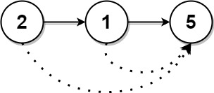

#### [1019\. 链表中的下一个更大节点](https://leetcode.cn/problems/next-greater-node-in-linked-list/)

难度：中等

给定一个长度为 `n` 的链表 `head`

对于列表中的每个节点，查找下一个 **更大节点** 的值。也就是说，对于每个节点，找到它旁边的第一个节点的值，这个节点的值 **严格大于** 它的值。

返回一个整数数组 `answer` ，其中 `answer[i]` 是第 `i` 个节点( **从1开始** )的下一个更大的节点的值。如果第 `i` 个节点没有下一个更大的节点，设置 `answer[i] = 0` 。

**示例 1：**



```
输入：head = [2,1,5]
输出：[5,5,0]
```

**示例 2：**


```
输入：head = [2,7,4,3,5]
输出：[7,0,5,5,0]
```

**提示：**

-   链表中节点数为 `n`
-   `1 <= n <= 10^4`
-   `1 <= Node.val <= 10^9`
