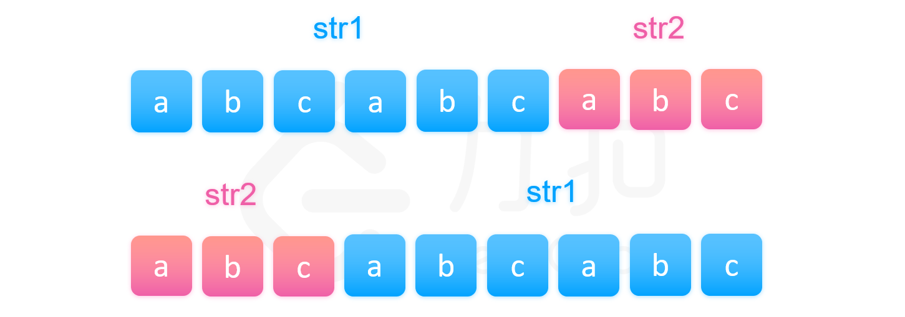
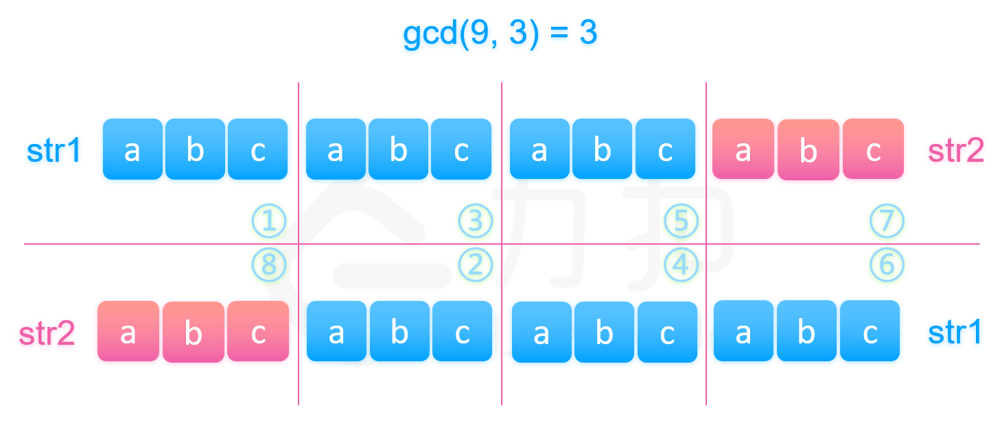

#### [方法三：数学](https://leetcode.cn/problems/greatest-common-divisor-of-strings/solutions/143956/zi-fu-chuan-de-zui-da-gong-yin-zi-by-leetcode-solu/)

**思路**

需要知道一个性质：**如果 `str1` 和 `str2` 拼接后等于 `str2`和 `str1` 拼接起来的字符串（注意拼接顺序不同），那么一定存在符合条件的字符串 `X`**。

先证必要性，即如果存在符合条件的字符串 `X` ，则 `str1` 和 `str2` 拼接后等于 `str2`和 `str1` 拼接起来的字符串。

如果字符串 `X` 符合条件，那么 `str1=X+X+...+X+X=n*X` ，`str2=X+X+..+X+X=m*X`，`n*X` 表示 `n` 个字符串 `X` 拼接，`m*X` 同理，则 `str1` 与 `str2` 拼接后的字符串即为 `(n+m)*X`，而 `str2` 与 `str1` 拼接后的字符串即为 `(m+n)*X`，等于 `(n+m)*X`，所以必要性得证。

再看充分性，简单来说，我们可以如下图一样先将两个拼接后的字符串放在一起。不失一般性，我们假定 `str1` 的长度大于 `str2`，



我们等间隔取 $gcd(len_1,len_2)$ 长度的字符串。

如果该长度等于 `str2` 的长度，即 `str1` 的长度可以整除 `str2` 的长度。我们可以知道，已知图中第一部分等于图中的第二部分（都是字符串 `str1` 的开头），而图中的第二部分又等于第三部分（两个字符串相等），所以我们知道第三部分也是等于第一部分。同理我们可以推得图中划分的 `1,3,5,7` 四个部分都相等，所以拼接起来的字符串可以由第一部分的前缀串经过若干次拼接得到。



那么如果不等于 `str2` 的长度，我们由上文一样的方法可以推得下图中被染颜色相同的字符串片段是相等的，其中每个颜色片段都是长为 $gcd(len_1,len_2)$ 的字符串。那么不同颜色代表的字符串是否也相等呢？如果相等就可以推得我们的结论是正确的。


其实由上图我们可以知道，因为第一个字符串和第二个字符串相等，所以两个字符串开头的部分必然相等。我们将前 $\dfrac{len_2}{gcd(len_1,len_2)}$ 个被染颜色的部分放在一起比较即可推得不同颜色的部分都是两两相等的，但是这是基于它们开头被染的颜色顺序是不同的，这一定成立吗？

其实图中可以看出第一个字符串被染的颜色是以 `str2` 的长度在循环的，由于第二种情况下 `str1` 的长度不整除 `str2` 的长度，导致第一个字符串的 `str1` 部分被染完颜色的时候，`str2` 被染的颜色的顺序必然不等于开头 `str1` 被染的颜色顺序，而第二个字符串的开头又是 `str2`，它被染色的顺序是等于第一个字符串中 `str2` 被染色的顺序的，所以两个字符串的开头被染的颜色顺序一定不同。最后我们就推出如果 `str1` 和 `str2` 拼接后等于 `str2` 和 `str1` 拼接起来的字符串，那么一定存在符合条件的字符串 `X`。


**算法**

有了该性质以及方法二的性质，我们就可以先判断 `str1` 和 `str2` 拼接后是否等于 `str2` 和 `str1` 拼接起来的字符串，如果等于直接输出长度为 $gcd(len_1,len_2)$ 的前缀串即可，否则返回空串。

```cpp
class Solution {
public:
    string gcdOfStrings(string str1, string str2) {
        if (str1 + str2 != str2 + str1) return "";
        return str1.substr(0, __gcd((int)str1.length(), (int)str2.length())); // __gcd() 为c++自带的求最大公约数的函数
    }
};
```

```java
class Solution {
    public String gcdOfStrings(String str1, String str2) {
        if (!str1.concat(str2).equals(str2.concat(str1))) {
            return "";
        }
        return str1.substring(0, gcd(str1.length(), str2.length()));
    }

    public int gcd(int a, int b) {
        int remainder = a % b;
        while (remainder != 0) {
            a = b;
            b = remainder;
            remainder = a % b;
        }
        return b;
    }
}
```

```python
class Solution:
    def gcdOfStrings(self, str1: str, str2: str) -> str:
        candidate_len = math.gcd(len(str1), len(str2))
        candidate = str1[: candidate_len]
        if str1 + str2 == str2 + str1:
            return candidate
        return ''
```

**复杂度分析**

-   时间复杂度：$O(n)$ ，字符串拼接比较是否相等需要 $O(n)$ 的时间复杂度，求两个字符串长度的最大公约数需要 $O(\log n)$ 的时间复杂度，所以总时间复杂度为 $O(n+\log n)=O(n)$ 。
-   空间复杂度：$O(n)$ ，程序运行时建立了中间变量用来存储 `str1` 与 `str2` 的相加结果。
