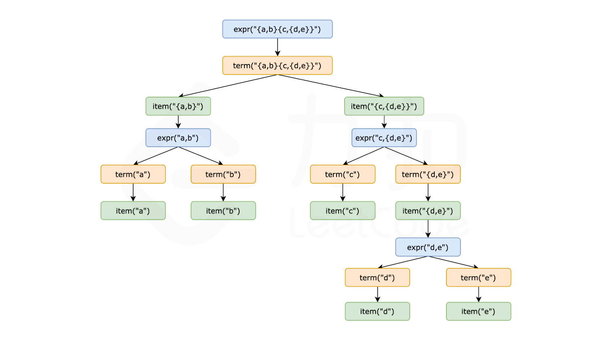
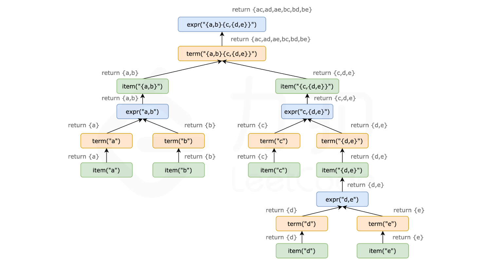

#### [方法一：递归解析](https://leetcode.cn/problems/brace-expansion-ii/solutions/2150290/hua-gua-hao-zhan-kai-ii-by-leetcode-solu-1s1y/)

**思路与算法**

表达式可以拆分为多个子表达式，以逗号分隔或者直接相接。我们应当先按照逗号分割成多个子表达式进行求解，然后再对所有结果求并集。这样做的原因是求积的优先级高于求并集的优先级。

我们用 $expr$ 表示一个任意一种表达式，用 $term$ 表示一个最外层没有逗号分割的表达式，那么 $expr$ 可以按照如下规则分解：

$$expr \rightarrow term~|~term, expr$$

其中的 $∣$ 表示或者，即 $expr$ 可以分解为前者，也可以分解为后者。

再来看 $term$, $term$ 可以由小写英文字母或者花括号包括的表达式直接相接组成，我们用 $item$ 来表示每一个相接单元，那么 $term$ 可以按照如下规则分解：

$$term \rightarrow item~|~item~term$$

$item$ 可以进一步分解为小写英文字母 $letter$ 或者花括号包括的表达式，它的分解如下：

$$item \rightarrow letter~|~\{expr\}$$

在代码中，我们编写三个函数，分别负责以上三种规则的分解：

1.  $expr$ 函数，不断的调用 $term$，并与其结果进行合并。如果匹配到表达式末尾或者当前字符不是逗号时，则返回。
2.  $term$ 函数，不断的调用 $item$，并与其结果求积。如果匹配到表达式末尾或者当前字符不是小写字母，并且也不是左括号时，则返回。
3.  $item$ 函数，根据当前字符是不是左括号来求解。如果是左括号，则调用 $expr$，返回结果；否则构造一个只包含当前字符的字符串集合，返回结果。

以下示意图以 $\{a,b\}\{c,\{d,e\}\}$ 为例，展示了表达式递归拆解以及回溯的全过程。




在代码实现过程中有以下细节：

1.  维护一个外部指针来遍历整个表达式，或者将表达式和当前遍历下标以引用的方式传递给被调函数。
2.  因为最终答案需要去重，所以可以先用集合来求解中间结果，最后再转换成已排序的列表作为最终答案。

**代码**

```cpp
class Solution {
    string expression;
    int idx;

    // item -> letter | { expr }
    set<string> item() {
        set<string> ret;
        if (expression[idx] == '{') {
            idx++;
            ret = expr();
        } else {
            ret = {string(1, expression[idx])};
        }
        idx++;
        return move(ret);
    }

    // term -> item | item term
    set<string> term() {
        // 初始化空集合，与之后的求解结果求笛卡尔积
        set<string> ret = {""};
        // item 的开头是 { 或小写字母，只有符合时才继续匹配
        while (idx < expression.size() && (expression[idx] == '{' || isalpha(expression[idx]))) {
            auto sub = item();
            set<string> tmp;
            for (auto &left : ret) {
                for (auto &right : sub) {
                    tmp.insert(left + right);
                }
            }
            ret = move(tmp);
        }
        return move(ret);
    }

    // expr -> term | term, expr
    set<string> expr() {
        set<string> ret;
        while (true) {
            // 与 term() 求解结果求并集
            ret.merge(term());
            // 如果匹配到逗号则继续，否则结束匹配
            if (idx < expression.size() && expression[idx] == ',') {
                idx++;
                continue;
            } else {
                break;
            }
        }
        return move(ret);
    }

public:
    vector<string> braceExpansionII(string expression) {
        this->expression = expression;
        this->idx = 0;
        auto ret = expr();
        return {ret.begin(), ret.end()};
    }
};
```

```java
class Solution {
    String expression;
    int idx;

    public List<String> braceExpansionII(String expression) {
        this.expression = expression;
        this.idx = 0;
        Set<String> ret = expr();
        return new ArrayList<String>(ret);
    }

    // item . letter | { expr }
    private Set<String> item() {
        Set<String> ret = new TreeSet<String>();
        if (expression.charAt(idx) == '{') {
            idx++;
            ret = expr();
        } else {
            StringBuilder sb = new StringBuilder();
            sb.append(expression.charAt(idx));
            ret.add(sb.toString());
        }
        idx++;
        return ret;
    }

    // term . item | item term
    private Set<String> term() {
        // 初始化空集合，与之后的求解结果求笛卡尔积
        Set<String> ret = new TreeSet<String>() {{
            add("");
        }};
        // item 的开头是 { 或小写字母，只有符合时才继续匹配
        while (idx < expression.length() && (expression.charAt(idx) == '{' || Character.isLetter(expression.charAt(idx)))) {
            Set<String> sub = item();
            Set<String> tmp = new TreeSet<String>();
            for (String left : ret) {
                for (String right : sub) {
                    tmp.add(left + right);
                }
            }
            ret = tmp;
        }
        return ret;
    }

    // expr . term | term, expr
    private Set<String> expr() {
        Set<String> ret = new TreeSet<String>();
        while (true) {
            // 与 term() 求解结果求并集
            ret.addAll(term());
            // 如果匹配到逗号则继续，否则结束匹配
            if (idx < expression.length() && expression.charAt(idx) == ',') {
                idx++;
                continue;
            } else {
                break;
            }
        }
        return ret;
    }
}
```

**复杂度分析**

-   时间复杂度：$O(n\log n)$，其中 $n$ 是 $expression$ 的长度。整个 $expression$ 只会遍历一次，时间复杂度为 $O(n)$，集合合并以及求积运算的时间复杂度为 $O(n\log n)$，因此总的时间复杂度为 $O(n \log n)$。
-   空间复杂度：$O(n)$。递归过程所需的栈空间为 $O(n)$，以及存放中间答案的空间复杂度为 $O(n)$，因此总的空间复杂度为 $O(n)$。
